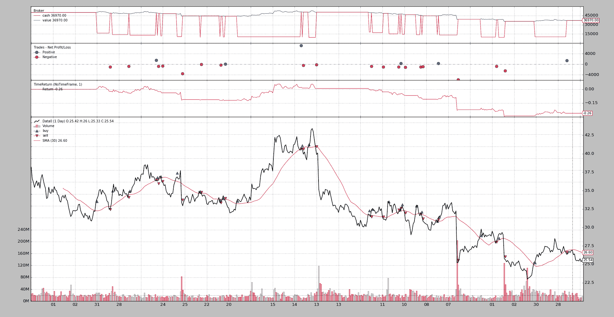
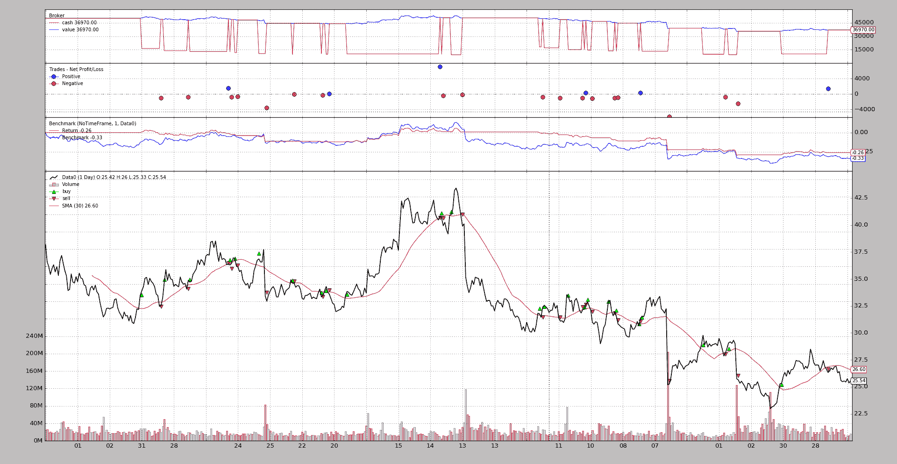
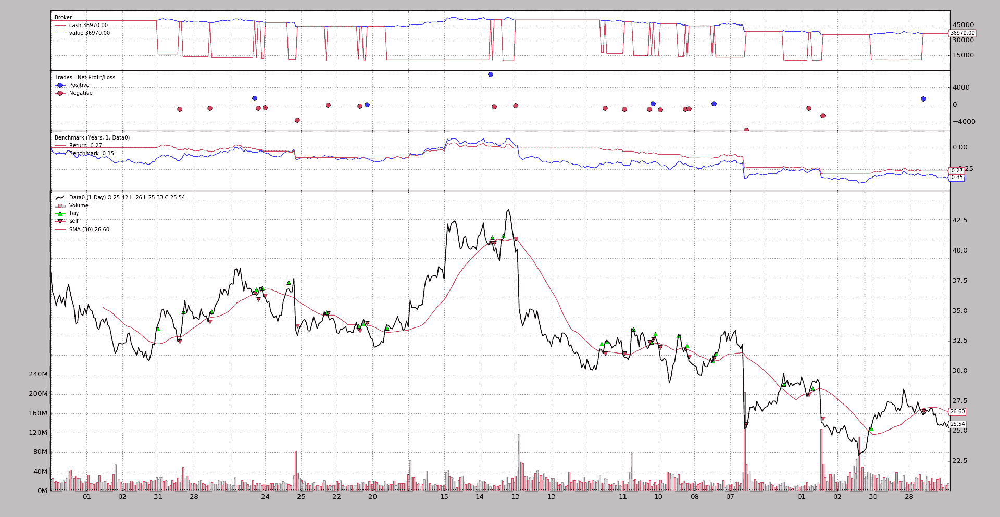
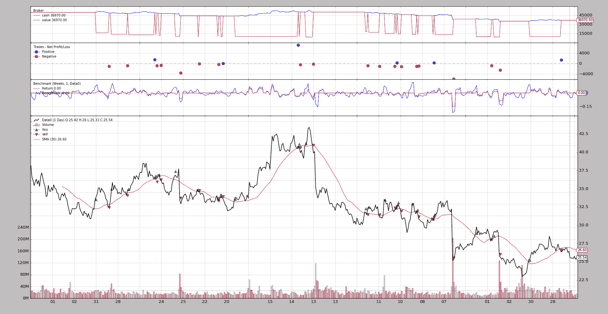
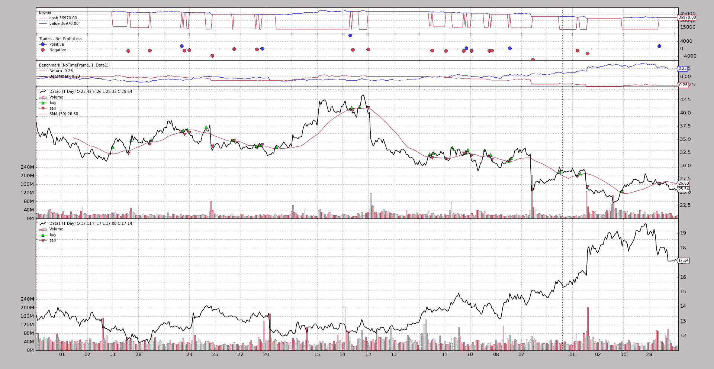

# 基准测试

> 原文：[`www.backtrader.com/blog/posts/2016-07-22-benchmarking/benchmarking/`](https://www.backtrader.com/blog/posts/2016-07-22-benchmarking/benchmarking/)

*backtrader*包括两种不同类型的对象，可以帮助跟踪：

+   *观察者*

+   *分析器*

[问题 #89](https://github.com/mementum/backtrader/issues/89)是关于添加针对资产的基准测试。这是合理的，因为一个人可能实际上有一种策略，即使是正的，也低于简单跟踪资产所能提供的回报。

在*分析器*领域中，已经有一个`TimeReturn`对象，用于跟踪整个投资组合价值的回报演变（即：包括现金）

这显然也可以是一个*观察者*，因此在添加一些*基准测试*的同时，还进行了一些工作，以便能够将*观察者*和*分析器*组合在一起，这两者都旨在跟踪相同的内容。

注意

*观察者*和*分析器*之间的主要区别是*观察者*的*线*性质，记录每��值并使其适合绘图和实时查询。当然，这会消耗内存。

另一方面，*分析器*通过`get_analysis`返回一组结果，实现可能直到*运行*结束才提供任何结果。

## 分析器 - 基准测试

标准`TimeReturn`分析器已扩展以支持跟踪*数据源*。涉及的两个主要参数：

+   `timeframe`（默认：`None`）如果为`None`，则将报告整个回测期间的完整回报

    传递`TimeFrame.NoTimeFrame`以考虑整个数据集而没有时间限制

+   `data`（默认：`None`）

    用于跟踪而不是投资组合价值的参考资产。

    注意

    这些数据必须已经通过`addata`、`resampledata`或`replaydata`添加到`cerebro`实例中

（有关更多详细信息和参数，请参阅文档中的参考资料）

因此，可以像这样跟踪投资组合的年度回报：

```py
import backtrader as bt

cerebro = bt.Cerebro()
cerebro.addanalyzer(bt.analyzers.TimeReturn, timeframe=bt.TimeFrame.Years)

...  # add datas, strategies ...

results = cerebro.run()
strat0 = results[0]

# If no name has been specified, the name is the class name lowercased
tret_analyzer = strat0.analyzers.getbyname('timereturn')
print(tret_analyzer.get_analysis())
```

如果我们想要跟踪*数据*的回报：

```py
import backtrader as bt

cerebro = bt.Cerebro()

data = bt.feeds.OneOfTheFeeds(dataname='abcde', ...)
cerebro.adddata(data)

cerebro.addanalyzer(bt.analyzers.TimeReturn, timeframe=bt.TimeFrame.Years,
                    data=data)

...  # add strategies ...

results = cerebro.run()
strat0 = results[0]

# If no name has been specified, the name is the class name lowercased
tret_analyzer = strat0.analyzers.getbyname('timereturn')
print(tret_analyzer.get_analysis())
```

如果两者都要被跟踪，最好给*分析器*分配名称：

```py
import backtrader as bt

cerebro = bt.Cerebro()

data = bt.feeds.OneOfTheFeeds(dataname='abcde', ...)
cerebro.adddata(data)

cerebro.addanalyzer(bt.analyzers.TimeReturn, timeframe=bt.TimeFrame.Years,
                    data=data, _name='datareturns')

cerebro.addanalyzer(bt.analyzers.TimeReturn, timeframe=bt.TimeFrame.Years)
                    _name='timereturns')

...  # add strategies ...

results = cerebro.run()
strat0 = results[0]

# If no name has been specified, the name is the class name lowercased
tret_analyzer = strat0.analyzers.getbyname('timereturns')
print(tret_analyzer.get_analysis())
tdata_analyzer = strat0.analyzers.getbyname('datareturns')
print(tdata_analyzer.get_analysis())
```

## 观察者 - 基准测试

由于背景机制允许在*观察者*内部使用*分析器*，因此添加了 2 个新的观察者：

+   `TimeReturn`

+   `基准`

两者都使用`bt.analyzers.TimeReturn`分析器来收集结果。

而不是像上面那样有代码片段，一个完整的示例带有一些运行来展示它们的功能。

### 观察 TimeReturn

执行：

```py
$ ./observer-benchmark.py --plot --timereturn --timeframe notimeframe
```

输出。



注意执行选项：

+   `--timereturn`：我们告诉示例就是这样做的

+   `--timeframe notimeframe`：告诉分析器考虑整个数据集，而不考虑时间范围边界。

最后绘制的数值为`-0.26`。

+   起始现金（从图表中明显）为`50,000`货币单位，策略最终以`36,970`货币单位结束，因此价值下降了`-26%`。

### 观察基准测试

因为*基准*也会显示*时间回报率*的结果，让我们运行相同的内容，但激活*基准*：

```py
$ ./observer-benchmark.py --plot --timeframe notimeframe
```

输出。



嘿，嘿，嘿！！！

+   策略比资产更好：`-0.26` 对 `-0.33`

    这不应该是一个值得庆祝的事情，但至少很明显策略甚至没有资产那么糟糕。

转而以*年度*为基础追踪事物：

```py
$ ./observer-benchmark.py --plot --timeframe years
```

输出



注意！

+   策略的最后一个值从`-0.26`变化到`-0.27`

+   另一方面，资产显示的最后一个值是`-0.35`（与上述的`-0.33`相比）

两者值如此接近的原因是，从 2005 年到 2006 年，无论是策略还是基准资产，几乎都处于 2005 年的起始水平。

转换到较低的时间范围，比如*周*，整个情况都会改变：

```py
$ ./observer-benchmark.py --plot --timeframe weeks
```

输出



现在：

+   *基准* 观察者显示出更加紧张的状态。事物上下移动，因为现在每周都在跟踪组合和数据的回报率

+   因为在年底的最后一周没有交易活动，资产几乎没有变动，所以最后显示的值为 0.00（最后一周之前的最后收盘价为`25.54`，样本数据收盘价为`25.55`，差异首先在第 4 位小数点上感受到）

### 观察基准 - 另一数据

该样本允许针对不同的数据进行基准测试。默认情况下，使用`--benchdata1`时，基准测试的对象是*Oracle*。考虑整个数据集，使用`--timeframe notimeframe`：

```py
$ ./observer-benchmark.py --plot --timeframe notimeframe --benchdata1
```

输出：



现在清楚为什么上面没有值得庆祝的原因了：

+   策略的结果对于`notimeframe`没有改变，仍然为`-26%`（`-0.26`）

+   但是当与另一数据进行基准比较时，这个数据在同一时期有`+23%`（`0.23`）的增长

要么策略需要改变，要么另一种资产最好交易。

## 结论

现在有两种方法，使用相同的底层代码/计算，来跟踪*时间回报率*和*基准*

+   *观察者*（`TimeReturn`和`Benchmark`）

而

+   *分析器*（带有`data`参数的`TimeReturn`和`TimeReturn`）

当然，*基准* 不保证盈利，只是*比较*。

使用样本的方法：

```py
$ ./observer-benchmark.py --help
usage: observer-benchmark.py [-h] [--data0 DATA0] [--data1 DATA1]
                             [--benchdata1] [--fromdate FROMDATE]
                             [--todate TODATE] [--printout] [--cash CASH]
                             [--period PERIOD] [--stake STAKE] [--timereturn]
                             [--timeframe {months,days,notimeframe,years,None,weeks}]
                             [--plot [kwargs]]

Benchmark/TimeReturn Observers Sample

optional arguments:
  -h, --help            show this help message and exit
  --data0 DATA0         Data0 to be read in (default:
                        ../../datas/yhoo-1996-2015.txt)
  --data1 DATA1         Data1 to be read in (default:
                        ../../datas/orcl-1995-2014.txt)
  --benchdata1          Benchmark against data1 (default: False)
  --fromdate FROMDATE   Starting date in YYYY-MM-DD format (default:
                        2005-01-01)
  --todate TODATE       Ending date in YYYY-MM-DD format (default: 2006-12-31)
  --printout            Print data lines (default: False)
  --cash CASH           Cash to start with (default: 50000)
  --period PERIOD       Period for the crossover moving average (default: 30)
  --stake STAKE         Stake to apply for the buy operations (default: 1000)
  --timereturn          Use TimeReturn observer instead of Benchmark (default:
                        None)
  --timeframe {months,days,notimeframe,years,None,weeks}
                        TimeFrame to apply to the Observer (default: None)
  --plot [kwargs], -p [kwargs]
                        Plot the read data applying any kwargs passed For
                        example: --plot style="candle" (to plot candles)
                        (default: None)
```

### 代码

```py
from __future__ import (absolute_import, division, print_function,
                        unicode_literals)

import argparse
import datetime
import random

import backtrader as bt

class St(bt.Strategy):
    params = (
        ('period', 10),
        ('printout', False),
        ('stake', 1000),
    )

    def __init__(self):
        sma = bt.indicators.SMA(self.data, period=self.p.period)
        self.crossover = bt.indicators.CrossOver(self.data, sma)

    def start(self):
        if self.p.printout:
            txtfields = list()
            txtfields.append('Len')
            txtfields.append('Datetime')
            txtfields.append('Open')
            txtfields.append('High')
            txtfields.append('Low')
            txtfields.append('Close')
            txtfields.append('Volume')
            txtfields.append('OpenInterest')
            print(','.join(txtfields))

    def next(self):
        if self.p.printout:
            # Print only 1st data ... is just a check that things are running
            txtfields = list()
            txtfields.append('%04d' % len(self))
            txtfields.append(self.data.datetime.datetime(0).isoformat())
            txtfields.append('%.2f' % self.data0.open[0])
            txtfields.append('%.2f' % self.data0.high[0])
            txtfields.append('%.2f' % self.data0.low[0])
            txtfields.append('%.2f' % self.data0.close[0])
            txtfields.append('%.2f' % self.data0.volume[0])
            txtfields.append('%.2f' % self.data0.openinterest[0])
            print(','.join(txtfields))

        if self.position:
            if self.crossover < 0.0:
                if self.p.printout:
                    print('CLOSE {} @%{}'.format(size,
                                                 self.data.close[0]))
                self.close()

        else:
            if self.crossover > 0.0:
                self.buy(size=self.p.stake)
                if self.p.printout:
                    print('BUY   {} @%{}'.format(self.p.stake,
                                                self.data.close[0]))

TIMEFRAMES = {
    None: None,
    'days': bt.TimeFrame.Days,
    'weeks': bt.TimeFrame.Weeks,
    'months': bt.TimeFrame.Months,
    'years': bt.TimeFrame.Years,
    'notimeframe': bt.TimeFrame.NoTimeFrame,
}

def runstrat(args=None):
    args = parse_args(args)

    cerebro = bt.Cerebro()
    cerebro.broker.set_cash(args.cash)

    dkwargs = dict()
    if args.fromdate:
        fromdate = datetime.datetime.strptime(args.fromdate, '%Y-%m-%d')
        dkwargs['fromdate'] = fromdate

    if args.todate:
        todate = datetime.datetime.strptime(args.todate, '%Y-%m-%d')
        dkwargs['todate'] = todate

    data0 = bt.feeds.YahooFinanceCSVData(dataname=args.data0, **dkwargs)
    cerebro.adddata(data0, name='Data0')

    cerebro.addstrategy(St,
                        period=args.period,
                        stake=args.stake,
                        printout=args.printout)

    if args.timereturn:
        cerebro.addobserver(bt.observers.TimeReturn,
                            timeframe=TIMEFRAMES[args.timeframe])
    else:
        benchdata = data0
        if args.benchdata1:
            data1 = bt.feeds.YahooFinanceCSVData(dataname=args.data1, **dkwargs)
            cerebro.adddata(data1, name='Data1')
            benchdata = data1

        cerebro.addobserver(bt.observers.Benchmark,
                            data=benchdata,
                            timeframe=TIMEFRAMES[args.timeframe])

    cerebro.run()

    if args.plot:
        pkwargs = dict()
        if args.plot is not True:  # evals to True but is not True
            pkwargs = eval('dict(' + args.plot + ')')  # args were passed

        cerebro.plot(**pkwargs)

def parse_args(pargs=None):

    parser = argparse.ArgumentParser(
        formatter_class=argparse.ArgumentDefaultsHelpFormatter,
        description='Benchmark/TimeReturn Observers Sample')

    parser.add_argument('--data0', required=False,
                        default='../../datas/yhoo-1996-2015.txt',
                        help='Data0 to be read in')

    parser.add_argument('--data1', required=False,
                        default='../../datas/orcl-1995-2014.txt',
                        help='Data1 to be read in')

    parser.add_argument('--benchdata1', required=False, action='store_true',
                        help=('Benchmark against data1'))

    parser.add_argument('--fromdate', required=False,
                        default='2005-01-01',
                        help='Starting date in YYYY-MM-DD format')

    parser.add_argument('--todate', required=False,
                        default='2006-12-31',
                        help='Ending date in YYYY-MM-DD format')

    parser.add_argument('--printout', required=False, action='store_true',
                        help=('Print data lines'))

    parser.add_argument('--cash', required=False, action='store',
                        type=float, default=50000,
                        help=('Cash to start with'))

    parser.add_argument('--period', required=False, action='store',
                        type=int, default=30,
                        help=('Period for the crossover moving average'))

    parser.add_argument('--stake', required=False, action='store',
                        type=int, default=1000,
                        help=('Stake to apply for the buy operations'))

    parser.add_argument('--timereturn', required=False, action='store_true',
                        default=None,
                        help=('Use TimeReturn observer instead of Benchmark'))

    parser.add_argument('--timeframe', required=False, action='store',
                        default=None, choices=TIMEFRAMES.keys(),
                        help=('TimeFrame to apply to the Observer'))

    # Plot options
    parser.add_argument('--plot', '-p', nargs='?', required=False,
                        metavar='kwargs', const=True,
                        help=('Plot the read data applying any kwargs passed\n'
                              '\n'
                              'For example:\n'
                              '\n'
                              '  --plot style="candle" (to plot candles)\n'))

    if pargs:
        return parser.parse_args(pargs)

    return parser.parse_args()

if __name__ == '__main__':
    runstrat()
```
