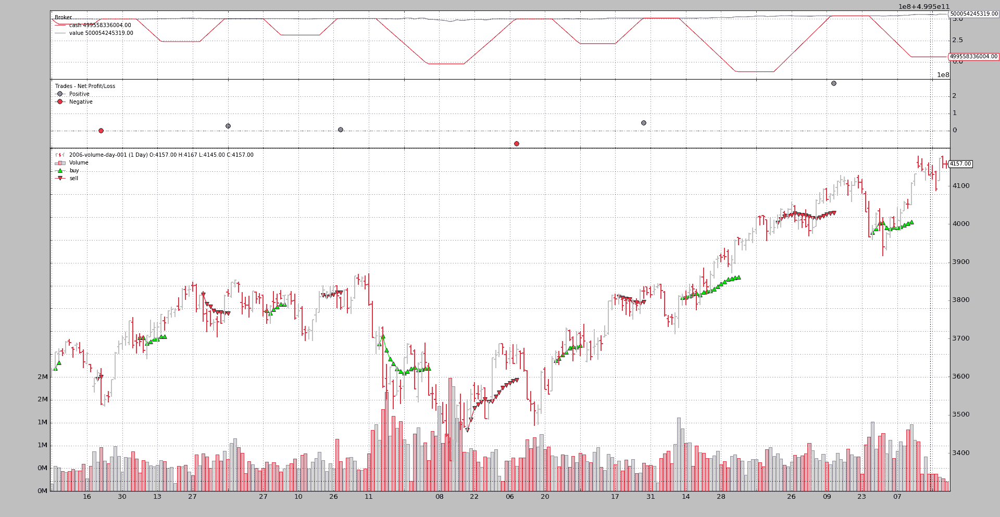

# 体积填充

> 原文：[`www.backtrader.com/blog/posts/2016-07-14-volume-filling/volume-filling/`](https://www.backtrader.com/blog/posts/2016-07-14-volume-filling/volume-filling/)

到目前为止，*backtrader*中的默认体积填充策略一直相当简单和直接：

+   忽略体积

注意

2016 年 7 月 15 日

更正了实现中的一个错误，并更新了样本以`close`该位置并在休息后重复。

下面的最后一个测试运行（以及相应的图表）来自更新样本

这基于两个前提：

+   在足够流动的市场中交易，以完全吸收*buy/sell*订单

+   真实的成交量匹配需要真实的世界

    一个快速的示例是`Fill or Kill`订单。即使是到*tick*分辨率并且具有足够的*fill*体积，*backtrader*经纪人也无法知道市场中有多少额外的参与者来区分订单是否会匹配以坚持`Fill`部分，或者订单是否应该`Kill`

但是随着版本`1.5.2.93`的发布，可以指定*经纪人*采取*Volume*的`filler`以在执行订单时考虑*Volume*。此外，3 个初始填充器已经进入发布：

+   `FixedSize`：每天使用固定的匹配大小（例如：1000 个单位），前提是当前柱状图至少有 1000 个单位

+   `FixedBarPerc`：使用总柱状图体积的百分比尝试匹配订单

+   `BarPointPerc`：在价格范围高低之间进行柱状图体积的均匀分布，并使用相应于单个价格点的体积的百分比

## 创建填充器

*backtrader*生态系统中的*filler*可以是符合以下签名的任何*callable*：

```py
`callable(order, price, ago)` 
```

其中：

+   `order`是即将执行的订单

    此对象提供了对操作目标的`data`对象的访问权限，创建大小/价格、执行价格/大小/剩余大小以及其他详细信息

+   `price`，订单将以其执行

+   `ago`是在其中查找体积和价格元素的*order*中`data`的索引

    在几乎所有情况下，这将是`0`（当前时间点），但在一种特殊情况下，为了涵盖`Close`订单，这可能是`-1`。

    例如，要访问柱状图体积，请执行以下操作：

    ```py
    `barvolume = order.data.volume[ago]` 
    ```

可调用对象可以是一个函数，或者例如支持`__call__`方法的类的实例，如：

```py
`class MyFiller(object):
    def __call__(self, order, price, ago):
        pass` 
```

## 向经纪人添加填充器

最直接的方法是使用`set_filler`：

```py
`import backtrader as bt

cerebro = Cerebro()
cerebro.broker.set_filler(bt.broker.filler.FixedSize())` 
```

第二选择是完全替换`broker`，尽管这可能只适用于已经重写部分功能的`BrokerBack`的子类：

```py
`import backtrader as bt

cerebro = Cerebro()
filler = bt.broker.filler.FixedSize()
newbroker = bt.broker.BrokerBack(filler=filler)
cerebro.broker = newbroker` 
```

## 该样本

*backtrader*源代码包含一个名为`volumefilling`的样本，它允许测试一些集成的`fillers`（最初全部）。

该样本在源文件中使用一个默认数据样本命名为：`datas/2006-volume-day-001.txt`。

例如，不使用填充器运行：

```py
`$ ./volumefilling.py --stakeperc 20.0` 
```

输出：

```py
`Len,Datetime,Open,High,Low,Close,Volume,OpenInterest
0001,2006-01-02,3602.00,3624.00,3596.00,3617.00,164794.00,1511674.00
++ STAKE VOLUME: 32958.0
-- NOTIFY ORDER BEGIN
Ref: 1
...
Alive: False
-- NOTIFY ORDER END
-- ORDER REMSIZE: 0.0
++ ORDER COMPLETED at data.len: 2
0002,2006-01-03,3623.00,3665.00,3614.00,3665.00,554426.00,1501792.00
...` 
```

因为输入相当冗长，所以大部分内容都被跳过了，但总结是：

+   看到第`1`条时，将使用`20%`（*–stakeperc 20.0*）发出*买入*订单

+   如输出所示，并且根据*backtrader*的默认行为，订单已经在一次交易中完全匹配。没有查看成交量

注意

经纪人在示例中分配了大量的现金，以确保可以应对许多测试情况

另一个运行使用`FixedSize`成交量填充器和每个条的最大`1000`单位：

```py
`$ ./volumefilling.py --stakeperc 20.0 --filler FixedSize --filler-args size=1000` 
```

输出：

```py
`Len,Datetime,Open,High,Low,Close,Volume,OpenInterest
0001,2006-01-02,3602.00,3624.00,3596.00,3617.00,164794.00,1511674.00
++ STAKE VOLUME: 32958.0
-- NOTIFY ORDER BEGIN
...
-- NOTIFY ORDER END
-- ORDER REMSIZE: 0.0
++ ORDER COMPLETED at data.len: 34
0034,2006-02-16,3755.00,3774.00,3738.00,3773.00,502043.00,1662302.00
...` 
```

现在：

+   所选的成交量保持不变，为`32958`

+   在第`34`条完成执行，这似乎是合理的，因为从第`2`条到第`34`条...已经看到了`33`个条。每条`1000`单位匹配的情况下，显然需要`33`个条来完成执行

这并不是一个伟大的成就，所以让我们来看看`FixedBarPerc`：

```py
`$ ./volumefilling.py --stakeperc 20.0 --filler FixedBarPerc --filler-args perc=0.75` 
```

输出：

```py
`...
-- NOTIFY ORDER END
-- ORDER REMSIZE: 0.0
++ ORDER COMPLETED at data.len: 11
0011,2006-01-16,3635.00,3664.00,3632.00,3660.00,273296.00,1592611.00
...` 
```

这次：

+   跳过开始，仍然是`32958`单位的订单

+   执行使用了`0.75%`的条成交量来匹配请求。

+   完成需要从第`2`条到第`11`条（`10`条）

这更有趣，但让我们看看现在使用`BarPointPerc`更动态的成交量分配会发生什么：

```py
`$ ./volumefilling.py --stakeperc 20.0 --filler BarPointPerc --filler-args minmov=1.0,perc=10.0` 
```

输出：

```py
`...
-- NOTIFY ORDER END
-- ORDER REMSIZE: 0.0
++ ORDER COMPLETED at data.len: 22
0022,2006-01-31,3697.00,3718.00,3681.00,3704.00,749740.00,1642003.00
...` 
```

发生的事情是：

+   同样的初始分配（跳过）到`32958`的订单大小

+   完全执行需要从`2`到`22`（21 个条）

+   *filler*使用了`1.0`的`minmov`（资产的最小价格变动）来在高低范围内均匀分配成交量

+   `10%`的成交量分配给特定价格点用于订单匹配

对于任何对如何在每个条上部分匹配订单感兴趣的人来说，检查运行的完整输出可能是值得的时间。

注意

在 1.5.3.93 中修正了错误并更新示例以在中断后`close`操作

现金增加到一个更多的数量，以避免保证金调用并启用绘图：

```py
`$ ./volumefilling.py --filler FixedSize --filler-args size=10000 --stakeperc 10.0 --plot --cash 500e9` 
```

而不是查看输出，因为输出非常冗长，让我们看看图表，它已经讲述了整个故事。



使用示例：

```py
`usage: volumefilling.py [-h] [--data DATA] [--cash CASH]
                        [--filler {FixedSize,FixedBarPerc,BarPointPerc}]
                        [--filler-args FILLER_ARGS] [--stakeperc STAKEPERC]
                        [--opbreak OPBREAK] [--fromdate FROMDATE]
                        [--todate TODATE] [--plot]

Volume Filling Sample

optional arguments:
  -h, --help            show this help message and exit
  --data DATA           Data to be read in (default: ../../datas/2006-volume-
                        day-001.txt)
  --cash CASH           Starting cash (default: 500000000.0)
  --filler {FixedSize,FixedBarPerc,BarPointPerc}
                        Apply a volume filler for the execution (default:
                        None)
  --filler-args FILLER_ARGS
                        kwargs for the filler with format:
                        arg1=val1,arg2=val2... (default: None)
  --stakeperc STAKEPERC
                        Percentage of 1st bar to use for stake (default: 10.0)
  --opbreak OPBREAK     Bars to wait for new op after completing another
                        (default: 10)
  --fromdate FROMDATE, -f FROMDATE
                        Starting date in YYYY-MM-DD format (default: None)
  --todate TODATE, -t TODATE
                        Ending date in YYYY-MM-DD format (default: None)
  --plot                Plot the result (default: False)` 
```

### 代码

```py
`from __future__ import (absolute_import, division, print_function,
                        unicode_literals)

import argparse
import datetime
import os.path
import time
import sys

import backtrader as bt

class St(bt.Strategy):
    params = (
        ('stakeperc', 10.0),
        ('opbreak', 10),
    )

    def notify_order(self, order):
        print('-- NOTIFY ORDER BEGIN')
        print(order)
        print('-- NOTIFY ORDER END')
        print('-- ORDER REMSIZE:', order.executed.remsize)

        if order.status == order.Completed:
            print('++ ORDER COMPLETED at data.len:', len(order.data))
            self.doop = -self.p.opbreak

    def __init__(self):
        pass

    def start(self):
        self.callcounter = 0
        txtfields = list()
        txtfields.append('Len')
        txtfields.append('Datetime')
        txtfields.append('Open')
        txtfields.append('High')
        txtfields.append('Low')
        txtfields.append('Close')
        txtfields.append('Volume')
        txtfields.append('OpenInterest')
        print(','.join(txtfields))

        self.doop = 0

    def next(self):
        txtfields = list()
        txtfields.append('%04d' % len(self))
        txtfields.append(self.data0.datetime.date(0).isoformat())
        txtfields.append('%.2f' % self.data0.open[0])
        txtfields.append('%.2f' % self.data0.high[0])
        txtfields.append('%.2f' % self.data0.low[0])
        txtfields.append('%.2f' % self.data0.close[0])
        txtfields.append('%.2f' % self.data0.volume[0])
        txtfields.append('%.2f' % self.data0.openinterest[0])
        print(','.join(txtfields))

        # Single order
        if self.doop == 0:
            if not self.position.size:
                stakevol = (self.data0.volume[0] * self.p.stakeperc) // 100
                print('++ STAKE VOLUME:', stakevol)
                self.buy(size=stakevol)

            else:
                self.close()

        self.doop += 1

FILLERS = {
    'FixedSize': bt.broker.filler.FixedSize,
    'FixedBarPerc': bt.broker.filler.FixedBarPerc,
    'BarPointPerc': bt.broker.filler.BarPointPerc,
}

def runstrat():
    args = parse_args()

    datakwargs = dict()
    if args.fromdate:
        fromdate = datetime.datetime.strptime(args.fromdate, '%Y-%m-%d')
        datakwargs['fromdate'] = fromdate

    if args.todate:
        fromdate = datetime.datetime.strptime(args.todate, '%Y-%m-%d')
        datakwargs['todate'] = todate

    data = bt.feeds.BacktraderCSVData(dataname=args.data, **datakwargs)

    cerebro = bt.Cerebro()
    cerebro.adddata(data)

    cerebro.broker.set_cash(args.cash)
    if args.filler is not None:
        fillerkwargs = dict()
        if args.filler_args is not None:
            fillerkwargs = eval('dict(' + args.filler_args + ')')

        filler = FILLERSargs.filler
        cerebro.broker.set_filler(filler)

    cerebro.addstrategy(St, stakeperc=args.stakeperc, opbreak=args.opbreak)

    cerebro.run()
    if args.plot:
        cerebro.plot(style='bar')

def parse_args():
    parser = argparse.ArgumentParser(
        formatter_class=argparse.ArgumentDefaultsHelpFormatter,
        description='Volume Filling Sample')

    parser.add_argument('--data', required=False,
                        default='../../datas/2006-volume-day-001.txt',
                        help='Data to be read in')

    parser.add_argument('--cash', required=False, action='store',
                        default=500e6, type=float,
                        help=('Starting cash'))

    parser.add_argument('--filler', required=False, action='store',
                        default=None, choices=FILLERS.keys(),
                        help=('Apply a volume filler for the execution'))

    parser.add_argument('--filler-args', required=False, action='store',
                        default=None,
                        help=('kwargs for the filler with format:\n'
                              '\n'
                              'arg1=val1,arg2=val2...'))

    parser.add_argument('--stakeperc', required=False, action='store',
                        type=float, default=10.0,
                        help=('Percentage of 1st bar to use for stake'))

    parser.add_argument('--opbreak', required=False, action='store',
                        type=int, default=10,
                        help=('Bars to wait for new op after completing '
                              'another'))

    parser.add_argument('--fromdate', '-f', required=False, default=None,
                        help='Starting date in YYYY-MM-DD format')

    parser.add_argument('--todate', '-t', required=False, default=None,
                        help='Ending date in YYYY-MM-DD format')

    parser.add_argument('--plot', required=False, action='store_true',
                        help=('Plot the result'))

    return parser.parse_args()

if __name__ == '__main__':
    runstrat()` 
```
