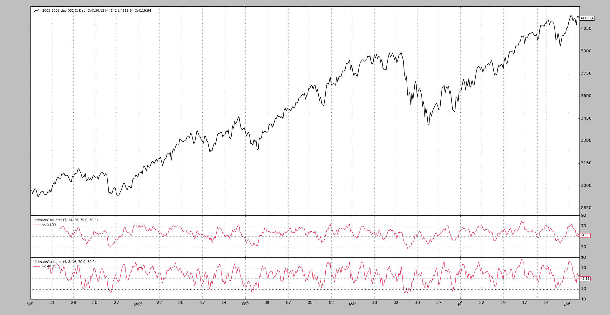

# 终极振荡器

> 原文：[`www.backtrader.com/blog/posts/2016-06-22-ultimate-oscillator/ultimate-oscillator/`](https://www.backtrader.com/blog/posts/2016-06-22-ultimate-oscillator/ultimate-oscillator/)

当启动*backtrader*的开发时，其中一个目标是使其非常容易（至少对于作者本人来说）开发新的*Indicators*以测试数学和视觉上的想法。

[Ticket #102](https://github.com/mementum/backtrader/issues/102)是关于将**UltimateOscillator**添加到*backtrader*的武器库中

注意

它将在下一个版本中添加，同时可以使用下面的代码来使用它。

如票号中所示的参考资料：

+   [`stockcharts.com/school/doku.php?id=chart_school:technical_indicators:ultimate_oscillator`](http://stockcharts.com/school/doku.php?id=chart_school:technical_indicators:ultimate_oscillator)

以及在：

+   [`en.wikipedia.org/wiki/Ultimate_oscillator`](https://en.wikipedia.org/wiki/Ultimate_oscillator)

这里不需要重复。

引用自参考资料：

```py
BP = Close - Minimum(Low or Prior Close)

TR = Maximum(High or Prior Close)  -  Minimum(Low or Prior Close)

Average7 = (7-period BP Sum) / (7-period TR Sum)
Average14 = (14-period BP Sum) / (14-period TR Sum)
Average28 = (28-period BP Sum) / (28-period TR Sum)

UO = 100 x [(4 x Average7)+(2 x Average14)+Average28]/(4+2+1)
```

摘要：

+   首先从`bt.Indicator`中派生子类，以确保整个机制运作正常：

    ```py
    `class UltimateOscillator(bt.Indicator):` 
    ```

+   它有 1 个输出行：我们将命名为`uo`：

    ```py
    `lines = ('uo',)` 
    ```

+   它有 3 个参数，定义了 3 个周期，默认值为`7`、`14`和`28`。将命名为`p1`、`p2`和`p3`：

    ```py
    `params = (('p1', 7),
              ('p2', 14),
              ('p3', 28),
    )` 
    ```

+   计算使用了*backtrader*中已经内置的一些东西

    +   `最小（低价或前收盘价）`：这是由*Welles Wilder*为`RSI`指标定义的`TrueLow`。因此，可以计算出`BP`或*买入压力*：

    ```py
    `bp = self.data.close - TrueLow(self.data)` 
    ```

    +   `最大（低价或前收盘价） - 最小（低价或前收盘价）`：这是由*Welles Wilder*为`RSI`指标定义的`TrueRange`（可以表示为`TrueHigh - TrueLow`）。因此，下一个计算就像这样简单：

    ```py
    `tr = TrueRange(self.data)` 
    ```

    +   其余部分都是纯数学运算，使用`SumN`来加上最新的`p1`、`p2`、`p3`周期的`bp`和`tr`，加上加权计算：

    ```py
    `av7 = SumN(bp, period=self.p.p1) / SumN(tr, period=self.p.p1)
    av14 = SumN(bp, period=self.p.p2) / SumN(tr, period=self.p.p2)
    av28 = SumN(bp, period=self.p.p3) / SumN(tr, period=self.p.p3)

    uo = 100.0 * (4.0 * av7 + 2.0 * av14 + av28) / (4.0 + 2.0 + 1.0)` 
    ```

    +   最后将计算分配给定义的`uo`线：

    ```py
    `self.lines.uo = uo` 
    ```

看起来比实际长度长（包括导入的全部代码）位于底部。

由于我们不仅想要值，还想要一个漂亮的图表，就像*Stockcharts*提供的图表一样，我们将添加两个额外的触摸：

+   2 个参数确定放置水平线的位置，以限定*超买*和*超卖*区域（类似于`RSI`或`Stochastic`）：

    ```py
    `('upperband', 70.0),
    ('lowerband', 30.0),` 
    ```

+   以及绘图初始化代码以使用参数。像*Stockcharts*中的绘图一样，在`10`、`50`和`90`处添加刻度：

    ```py
    `def _plotinit(self):
        baseticks = [10.0, 50.0, 90.0]
        hlines = [self.p.upperband, self.p.lowerband]

        self.plotinfo.plotyhlines = hlines
        self.plotinfo.plotyticks = baseticks + hlines` 
    ```

为了测试和进一步使用*backtrader*提供的现有工具，将使用与*backtrader*一起安装的`btrun`可执行文件。

+   指标存储在名为`ultimateoscillator.py`的文件中

+   使用的数据是*backtrader*源代码中可用的数据样本之一

+   该指标将使用默认参数添加两次，并使用较短期的参数添加两次

执行：

```py
btrun \
  --nostdstats \
  --data 2005-2006-day-001.txt \
  --indicator ultimateoscillator:UltimateOscillator \
  --indicator ultimateoscillator:UltimateOscillator:p1=4,p2=8,p3=16 \
  --plot
```

注意

使用`–nostdstats`来移除图表中的一些观察者。在这种情况下，无需跟踪现金和价值

输出只是显示 `UltimateOscillator` 演变的图表。



`UltimateOscillator` 代码：

```py
from __future__ import (absolute_import, division, print_function,
                        unicode_literals)

import backtrader as bt
from backtrader.indicators import SumN, TrueLow, TrueRange

class UltimateOscillator(bt.Indicator):
    '''
    Formula:
      # Buying Pressure = Close - TrueLow
      BP = Close - Minimum(Low or Prior Close)

      # TrueRange = TrueHigh - TrueLow
      TR = Maximum(High or Prior Close)  -  Minimum(Low or Prior Close)

      Average7 = (7-period BP Sum) / (7-period TR Sum)
      Average14 = (14-period BP Sum) / (14-period TR Sum)
      Average28 = (28-period BP Sum) / (28-period TR Sum)

      UO = 100 x [(4 x Average7)+(2 x Average14)+Average28]/(4+2+1)

    See:

      - https://en.wikipedia.org/wiki/Ultimate_oscillator
      - http://stockcharts.com/school/doku.php?id=chart_school:technical_indicators:ultimate_oscillator
    '''
    lines = ('uo',)

    params = (('p1', 7),
              ('p2', 14),
              ('p3', 28),
              ('upperband', 70.0),
              ('lowerband', 30.0),
    )

    def _plotinit(self):
        baseticks = [10.0, 50.0, 90.0]
        hlines = [self.p.upperband, self.p.lowerband]

        self.plotinfo.plotyhlines = hlines
        self.plotinfo.plotyticks = baseticks + hlines

    def __init__(self):
        bp = self.data.close - TrueLow(self.data)
        tr = TrueRange(self.data)

        av7 = SumN(bp, period=self.p.p1) / SumN(tr, period=self.p.p1)
        av14 = SumN(bp, period=self.p.p2) / SumN(tr, period=self.p.p2)
        av28 = SumN(bp, period=self.p.p3) / SumN(tr, period=self.p.p3)

        uo = 100.0 * (4.0 * av7 + 2.0 * av14 + av28) / (4.0 + 2.0 + 1.0)
        self.lines.uo = uo
```
