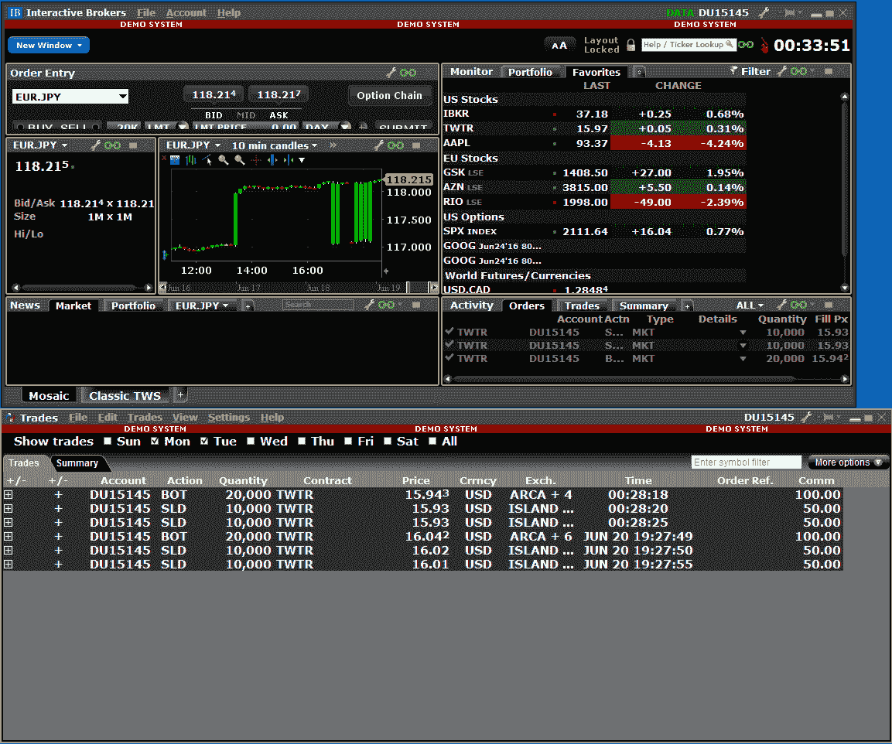

# 实时数据/实时交易

> 原文：[`www.backtrader.com/blog/posts/2016-06-21-livedata-feed/live-data-feed/`](https://www.backtrader.com/blog/posts/2016-06-21-livedata-feed/live-data-feed/)

从版本*1.5.0*开始，backtrader 支持实时数据源和实时交易。第一个集成实体是：

+   *交互经纪人*

这是平台创意最初设定的长期目标。设计理念已被证明足够灵活，以适应所需的变化。同时保持相同的界面，这意味着：*一次回测，多次交易*。相同的代码/api/基本元素/通知用于*回测*和*实时数据提供/交易*。

将平台命名为`back` + `trader`是有意义的，尽管它本来可以保持纯粹的回测。但不再是。

有什么新变化：

+   *存储*概念是为像*交互经纪人*这样一次性提供*数据*和*经纪*设施的实体提供一个集成的概念

+   从*存储*和/或*数据源*向*策略*和/或*大脑*发送新通知

+   时间管理支持...因为一个人可能会从任何地方交易纽约的产品，时间必须保持一致

+   努力在重采样/重播上尽快交付条形图，或者如果市场没有交易，则不要太晚（没有人希望在 30 秒后收到 5 秒重采样的条形图，因为没有中间的 ticks）

+   当然有许多小的内部变化

已经进行了大量的集成测试，并且一个名为`ibtest`的大样本已经集成在源代码中，但由于这是第 1 个版本，仍可能存在一些边缘情况。如果您决定尝试一下，请执行第 1 个针对*交互经纪人*提供的**模拟交易**账户（通常在端口`7497`而不是`7496`上运行）。

注意

请确保对与数据断开连接相关的固有风险感到舒适，软件中存在的错误（*TWS*和*backtrader*），您自己软件中的错误并监控您的活动。

*backtrader*不会对交易者可能遭受的任何损失负责（它也不会分担任何盈利）

*交互经纪人*支持什么：

+   指数（显然不用于交易），股票，期货，期权，期货期权和外汇

+   在连接开始和重新连接后进行回填

+   通知从实时到回填和反之的变化

+   *backtrader*中已经存在的订单类型：`市价`，`限价`，`止损限价`和`收盘`（又称*收盘市价*）

平台的意图不是重新发明轮子，因此需要/可选使用*交互经纪人*设施：

+   必需：`IbPy` 与*交互经纪人的 TWS*进行接口

    *IB*的文档指示如何安装它，如果尚未成为您的武器库的一部分

+   可选：`pytz` 以自动设置产品的时区。

    最终用户可以直接将其他`tzinfo`兼容的实例（来自`pytz`或自制的）作为数据源的参数，而不是依赖于自动确定。请参阅文档中的*时间管理*和文档的*IB*特定部分。

!!! 注意

```py
 `If no `pytz` is detected and no `tzinfo` compatible instance is
  supplied to the *data feed*, the time delivered by the platform will be
  `UTC`
```

尽可能多地进行了文档记录，并且可以在通常的文档链接中找到：

+   [阅读文档](http://backtrader.readthedocs.io/en/latest/)

从示例`ibtest`对*TWS Demo*进行了几次运行。

首先：对`TWTR`进行重新采样为 5 秒：

```py
$ ./ibtest.py --port 7497 --data0 TWTR --resample --timeframe Seconds --compression 5
```

输出：

```py
Server Version: 76
TWS Time at connection:20160620 22:37:37 CET
--------------------------------------------------
Strategy Created
--------------------------------------------------
Timezone from ContractDetails: EST5EDT
Datetime, Open, High, Low, Close, Volume, OpenInterest, SMA
***** STORE NOTIF: <error id=-1, errorCode=2104, errorMsg=Market data farm connection is OK:ibdemo>
***** STORE NOTIF: <error id=-1, errorCode=2106, errorMsg=HMDS data farm connection is OK:demohmds>
***** DATA NOTIF: CONNECTED
0001, 2016-06-20T14:37:35.000000, 15.96, 15.97, 15.96, 15.96, 0.0, 0, nan
***** DATA NOTIF: DELAYED
0002, 2016-06-20T14:37:40.000000, 15.96, 15.97, 15.96, 15.96, 0.0, 0, nan
0003, 2016-06-20T14:37:45.000000, 15.96, 15.97, 15.96, 15.97, 0.0, 0, nan
0004, 2016-06-20T14:37:50.000000, 15.96, 15.98, 15.94, 15.94, 0.0, 0, nan
0005, 2016-06-20T14:37:55.000000, 15.97, 15.97, 15.96, 15.97, 0.0, 0, 15.96
...
1441, 2016-06-20T16:37:35.000000, 16.03, 16.03, 16.02, 16.03, 0.0, 0, 16.026
1442, 2016-06-20T16:37:40.000000, 16.11, 16.11, 16.11, 16.11, 2.0, 0, 16.044
***** DATA NOTIF: LIVE
1443, 2016-06-20T16:37:45.000000, 16.1, 16.11, 16.1, 16.11, 5.0, 0, 16.06
1444, 2016-06-20T16:37:50.000000, 16.11, 16.11, 16.1, 16.1, 14.0, 0, 16.076
...
```

注意

执行环境安装了`pytz`。

以下情况可观察到：

+   第 1 行（来自`IbPy`本身）显示连接到服务器已成功，数据源已经确定了资产的操作时区：`EST5EDT`（又称`EST`又称`US/Eastern`）。

    注意*TWS*在开头报告的本地时间（在时区`CET`又称`Europe/Berlin`），但资产落后`6`小时。

    资产报告在交易场所的时间。如果你认为你真的想要改变这个，并且有关这种行为的理由，请查阅文档。

+   一些来自*Store*的通知，在这种情况下，*TWS*表示与不同数据中心的连接正常。这是通过*Strategy*中重写的方法打印出来的。

+   **数据通知**，比如：

    +   `CONNECTED`：告知策略连接到*TWS*可用。

    +   `DELAYED`：接收到的数据不是实时数据。正在进行回补（历史数据）。

        因为重新采样参数为*秒/5*，所以单个请求中可以下载的 5 秒条的最大数量大约为 1440。

    +   `LIVE`：一旦平台赶上回补，并且队列减少到实时数据，通知会告知策略。

        从条 1443 开始，数据是实时数据。

        注意

        因为正在进行重新采样，这些数据不是 tick 数据，并且会在 5 秒周期结束时传递。请查看`IBData`中`qcheck`参数文档，了解重新采样条会因为平台没有发送新的 tick 而延迟多快（因为没有新的 tick，平台无法确定当前重新采样的条是否已经结束）。

让我们做同样的事情，但强制断开连接（网络接口被禁用了 20 秒）：

```py
$ ./ibtest.py --port 7497 --data0 TWTR --resample --timeframe Seconds --compression 5
```

输出（跳过初始已知部分）：

```py
...
1440, 2016-06-20T18:16:20.000000, 16.05, 16.05, 16.04, 16.04, 0.0, 0, 16.048
1441, 2016-06-20T18:16:25.000000, 16.05, 16.05, 16.05, 16.05, 0.0, 0, 16.05
***** DATA NOTIF: LIVE
1442, 2016-06-20T18:16:30.000000, 15.9, 15.9, 15.89, 15.9, 11.0, 0, 16.02
***** STORE NOTIF: <error id=-1, errorCode=1100, errorMsg=Connectivity between IB and TWS has been lost.>
***** STORE NOTIF: <error id=-1, errorCode=2105, errorMsg=HMDS data farm connection is broken:demohmds>
***** STORE NOTIF: <error id=-1, errorCode=2103, errorMsg=Market data farm connection is broken:ibdemo>
1443, 2016-06-20T18:16:35.000000, 15.9, 15.9, 15.89, 15.9, 28.0, 0, 15.988
***** STORE NOTIF: <error id=-1, errorCode=1102, errorMsg=Connectivity between IB and TWS has been restored - data maintained.>
***** STORE NOTIF: <error id=-1, errorCode=2106, errorMsg=HMDS data farm connection is OK:demohmds>
***** STORE NOTIF: <error id=-1, errorCode=2104, errorMsg=Market data farm connection is OK:ibdemo>
***** DATA NOTIF: DELAYED
1444, 2016-06-20T18:16:40.000000, 16.04, 16.04, 16.03, 16.04, 0.0, 0, 15.986
1445, 2016-06-20T18:16:45.000000, 16.03, 16.04, 16.03, 16.04, 0.0, 0, 15.986
1446, 2016-06-20T18:16:50.000000, 16.04, 16.04, 16.03, 16.03, 0.0, 0, 15.982
1447, 2016-06-20T18:16:55.000000, 16.04, 16.04, 16.03, 16.04, 0.0, 0, 16.01
1448, 2016-06-20T18:17:00.000000, 16.03, 16.04, 16.03, 16.04, 0.0, 0, 16.038
1449, 2016-06-20T18:17:05.000000, 16.03, 16.04, 16.02, 16.03, 0.0, 0, 16.036
1450, 2016-06-20T18:17:10.000000, 15.9, 15.91, 15.9, 15.91, 3.0, 0, 16.01
***** DATA NOTIF: LIVE
1451, 2016-06-20T18:17:15.000000, 15.92, 15.92, 15.9, 15.92, 9.0, 0, 15.988
1452, 2016-06-20T18:17:20.000000, 15.91, 15.91, 15.89, 15.89, 18.0, 0, 15.958
1453, 2016-06-20T18:17:25.000000, 15.89, 15.92, 15.89, 15.89, 24.0, 0, 15.928
...
```

叙述：

+   在条 1442 之后，WLAN 接口已被禁用。

+   TWS 通知到达，指示情况。

+   条 1443 是从重新采样器中提取的，因为平台在`18:16:30.000000`和`18:16:35.000000`之间有一些 tick。

+   连接在大约`18:17:15`恢复，但此数据不是立即传递的。

+   发现情况，并尝试在`18:16:35`和`18:17:15`之间进行回补。

    这可以通过通知`DELAYED`看到。数据不再是`LIVE`。

+   条 1444 至 1450（包括两端）提供了缺失的时间。

+   收到通知`LIVE`，且条 1451 包含实时数据包。

注意

由于**TWS**不强制执行，因此存在一些情况，`backtrader`无法克服。 如果 TCP/IP 数据包某种方式丢失且*IB*服务器反应迟缓，*TWS*将花费很长时间来做出反应并通知连接丢失。

*TWS*甚至会传送清晰接收延迟的数据包，带有当前时间戳（通过突然爆发的数据包识别）

最后一些交易，用单个`Market`订单购买*20K*股的`TWTR`，并将它们分为 2 个*10K*的订单。

执行：

```py
./ibtest.py --port 7497 --data0 TWTR --resample --timeframe Seconds --compression 5 --broker --trade --stake 20000
```

输出相当冗长，显示了订单执行的所有部分。总结一下：

```py
...
***** DATA NOTIF: LIVE
1442, 2016-06-20T18:28:05.000000, 15.92, 15.93, 15.92, 15.93, 1748.0, 0, 16.03
-------------------------------------------------- ORDER BEGIN 2016-06-20 23:28:11.343000
Ref: 1
OrdType: 0
OrdType: Buy
Status: 1
Status: Submitted
Size: 20000
Price: 14.34
Price Limit: None
ExecType: 0
ExecType: Market
CommInfo: <backtrader.brokers.ibbroker.IBCommInfo object at 0x00000000040B9278>
End of Session: 736136.166655
Info: AutoOrderedDict()
Broker: <backtrader.brokers.ibbroker.IBBroker object at 0x0000000003E23470>
Alive: True
Ref: 1
orderId: 1
Action: BUY
Size (ib): 20000
Lmt Price: 0.0
Aux Price: 0.0
OrderType: MKT
Tif (Time in Force): GTC
GoodTillDate:
-------------------------------------------------- ORDER END
...
1443, 2016-06-20T18:28:10.000000, 15.93, 15.93, 15.92, 15.92, 10.0, 0, 16.004
-------------------------------------------------- ORDER BEGIN 2016-06-20 23:28:15.924000
Ref: 1
OrdType: 0
OrdType: Buy
Status: 3
Status: Partial
Size: 20000
Price: 14.34
Price Limit: None
ExecType: 0
ExecType: Market
CommInfo: <backtrader.brokers.ibbroker.IBCommInfo object at 0x00000000040B9278>
End of Session: 736136.166655
Info: AutoOrderedDict()
Broker: <backtrader.brokers.ibbroker.IBBroker object at 0x0000000003E23470>
Alive: True
Ref: 1
orderId: 1
Action: BUY
Size (ib): 20000
Lmt Price: 0.0
Aux Price: 0.0
OrderType: MKT
Tif (Time in Force): GTC
GoodTillDate:
-------------------------------------------------- ORDER END
...
-------------------------------------------------- ORDER BEGIN 2016-06-20 23:28:20.972000
Ref: 1
OrdType: 0
OrdType: Buy
Status: 4
Status: Completed
Size: 20000
Price: 14.34
Price Limit: None
ExecType: 0
ExecType: Market
CommInfo: <backtrader.brokers.ibbroker.IBCommInfo object at 0x00000000040B9278>
End of Session: 736136.166655
Info: AutoOrderedDict()
Broker: <backtrader.brokers.ibbroker.IBBroker object at 0x0000000003E23470>
Alive: False
Ref: 1
orderId: 1
Action: BUY
Size (ib): 20000
Lmt Price: 0.0
Aux Price: 0.0
OrderType: MKT
Tif (Time in Force): GTC
GoodTillDate:
-------------------------------------------------- ORDER END
1445, 2016-06-20T18:28:20.000000, 15.92, 15.93, 15.92, 15.93, 21.0, 0, 15.954
...
```

发生了以下情况：

+   数据正常接收

+   发出了一个执行类型为`Market`的`BUY`20K

    +   收到`Submitted`和`Accepted`通知（仅显示了`Submitted`）

    +   一连串的`Partial`执行（仅显示了 1 个），直到收到`Completed`。

    实际执行未显示，但可在收到的`order`实例下的`order.executed`中找到

+   虽然未显示，但发出了 2 个`Market` `SELL`订单以撤消操作

    屏幕截图显示了在一个晚上进行两次不同运行后*TWS*中的日志



示例可以做更多，并且旨在对设施进行彻底测试，如果可能的话发现任何问题。

用法：

```py
$ ./ibtest.py --help
usage: ibtest.py [-h] [--exactbars EXACTBARS] [--plot] [--stopafter STOPAFTER]
                 [--usestore] [--notifyall] [--debug] [--host HOST]
                 [--qcheck QCHECK] [--port PORT] [--clientId CLIENTID]
                 [--no-timeoffset] [--reconnect RECONNECT] [--timeout TIMEOUT]
                 --data0 DATA0 [--data1 DATA1] [--timezone TIMEZONE]
                 [--what WHAT] [--no-backfill_start] [--latethrough]
                 [--no-backfill] [--rtbar] [--historical]
                 [--fromdate FROMDATE] [--smaperiod SMAPERIOD]
                 [--replay | --resample]
                 [--timeframe {Ticks,MicroSeconds,Seconds,Minutes,Days,Weeks,Months,Years}]
                 [--compression COMPRESSION] [--no-takelate] [--no-bar2edge]
                 [--no-adjbartime] [--no-rightedge] [--broker] [--trade]
                 [--donotsell]
                 [--exectype {Market,Close,Limit,Stop,StopLimit}]
                 [--stake STAKE] [--valid VALID] [--cancel CANCEL]

Test Interactive Brokers integration

optional arguments:
  -h, --help            show this help message and exit
  --exactbars EXACTBARS
                        exactbars level, use 0/-1/-2 to enable plotting
                        (default: 1)
  --plot                Plot if possible (default: False)
  --stopafter STOPAFTER
                        Stop after x lines of LIVE data (default: 0)
  --usestore            Use the store pattern (default: False)
  --notifyall           Notify all messages to strategy as store notifs
                        (default: False)
  --debug               Display all info received form IB (default: False)
  --host HOST           Host for the Interactive Brokers TWS Connection
                        (default: 127.0.0.1)
  --qcheck QCHECK       Timeout for periodic notification/resampling/replaying
                        check (default: 0.5)
  --port PORT           Port for the Interactive Brokers TWS Connection
                        (default: 7496)
  --clientId CLIENTID   Client Id to connect to TWS (default: random)
                        (default: None)
  --no-timeoffset       Do not Use TWS/System time offset for non timestamped
                        prices and to align resampling (default: False)
  --reconnect RECONNECT
                        Number of recconnection attempts to TWS (default: 3)
  --timeout TIMEOUT     Timeout between reconnection attempts to TWS (default:
                        3.0)
  --data0 DATA0         data 0 into the system (default: None)
  --data1 DATA1         data 1 into the system (default: None)
  --timezone TIMEZONE   timezone to get time output into (pytz names)
                        (default: None)
  --what WHAT           specific price type for historical requests (default:
                        None)
  --no-backfill_start   Disable backfilling at the start (default: False)
  --latethrough         if resampling replaying, adjusting time and disabling
                        time offset, let late samples through (default: False)
  --no-backfill         Disable backfilling after a disconnection (default:
                        False)
  --rtbar               Use 5 seconds real time bar updates if possible
                        (default: False)
  --historical          do only historical download (default: False)
  --fromdate FROMDATE   Starting date for historical download with format:
                        YYYY-MM-DD[THH:MM:SS] (default: None)
  --smaperiod SMAPERIOD
                        Period to apply to the Simple Moving Average (default:
                        5)
  --replay              replay to chosen timeframe (default: False)
  --resample            resample to chosen timeframe (default: False)
  --timeframe {Ticks,MicroSeconds,Seconds,Minutes,Days,Weeks,Months,Years}
                        TimeFrame for Resample/Replay (default: Ticks)
  --compression COMPRESSION
                        Compression for Resample/Replay (default: 1)
  --no-takelate         resample/replay, do not accept late samples in new bar
                        if the data source let them through (latethrough)
                        (default: False)
  --no-bar2edge         no bar2edge for resample/replay (default: False)
  --no-adjbartime       no adjbartime for resample/replay (default: False)
  --no-rightedge        no rightedge for resample/replay (default: False)
  --broker              Use IB as broker (default: False)
  --trade               Do Sample Buy/Sell operations (default: False)
  --donotsell           Do not sell after a buy (default: False)
  --exectype {Market,Close,Limit,Stop,StopLimit}
                        Execution to Use when opening position (default:
                        Market)
  --stake STAKE         Stake to use in buy operations (default: 10)
  --valid VALID         Seconds to keep the order alive (0 means DAY)
                        (default: None)
  --cancel CANCEL       Cancel a buy order after n bars in operation, to be
                        combined with orders like Limit (default: 0)
```

代码：

```py
from __future__ import (absolute_import, division, print_function,
                        unicode_literals)

import argparse
import datetime

# The above could be sent to an independent module
import backtrader as bt
from backtrader.utils import flushfile  # win32 quick stdout flushing

class TestStrategy(bt.Strategy):
    params = dict(
        smaperiod=5,
        trade=False,
        stake=10,
        exectype=bt.Order.Market,
        stopafter=0,
        valid=None,
        cancel=0,
        donotsell=False,
    )

    def __init__(self):
        # To control operation entries
        self.orderid = list()
        self.order = None

        self.counttostop = 0
        self.datastatus = 0

        # Create SMA on 2nd data
        self.sma = bt.indicators.MovAv.SMA(self.data, period=self.p.smaperiod)

        print('--------------------------------------------------')
        print('Strategy Created')
        print('--------------------------------------------------')

    def notify_data(self, data, status, *args, **kwargs):
        print('*' * 5, 'DATA NOTIF:', data._getstatusname(status), *args)
        if status == data.LIVE:
            self.counttostop = self.p.stopafter
            self.datastatus = 1

    def notify_store(self, msg, *args, **kwargs):
        print('*' * 5, 'STORE NOTIF:', msg)

    def notify_order(self, order):
        if order.status in [order.Completed, order.Cancelled, order.Rejected]:
            self.order = None

        print('-' * 50, 'ORDER BEGIN', datetime.datetime.now())
        print(order)
        print('-' * 50, 'ORDER END')

    def notify_trade(self, trade):
        print('-' * 50, 'TRADE BEGIN', datetime.datetime.now())
        print(trade)
        print('-' * 50, 'TRADE END')

    def prenext(self):
        self.next(frompre=True)

    def next(self, frompre=False):
        txt = list()
        txt.append('%04d' % len(self))
        dtfmt = '%Y-%m-%dT%H:%M:%S.%f'
        txt.append('%s' % self.data.datetime.datetime(0).strftime(dtfmt))
        txt.append('{}'.format(self.data.open[0]))
        txt.append('{}'.format(self.data.high[0]))
        txt.append('{}'.format(self.data.low[0]))
        txt.append('{}'.format(self.data.close[0]))
        txt.append('{}'.format(self.data.volume[0]))
        txt.append('{}'.format(self.data.openinterest[0]))
        txt.append('{}'.format(self.sma[0]))
        print(', '.join(txt))

        if len(self.datas) > 1:
            txt = list()
            txt.append('%04d' % len(self))
            dtfmt = '%Y-%m-%dT%H:%M:%S.%f'
            txt.append('%s' % self.data1.datetime.datetime(0).strftime(dtfmt))
            txt.append('{}'.format(self.data1.open[0]))
            txt.append('{}'.format(self.data1.high[0]))
            txt.append('{}'.format(self.data1.low[0]))
            txt.append('{}'.format(self.data1.close[0]))
            txt.append('{}'.format(self.data1.volume[0]))
            txt.append('{}'.format(self.data1.openinterest[0]))
            txt.append('{}'.format(float('NaN')))
            print(', '.join(txt))

        if self.counttostop:  # stop after x live lines
            self.counttostop -= 1
            if not self.counttostop:
                self.env.runstop()
                return

        if not self.p.trade:
            return

        if self.datastatus and not self.position and len(self.orderid) < 1:
            self.order = self.buy(size=self.p.stake,
                                  exectype=self.p.exectype,
                                  price=round(self.data0.close[0] * 0.90, 2),
                                  valid=self.p.valid)

            self.orderid.append(self.order)
        elif self.position.size > 0 and not self.p.donotsell:
            if self.order is None:
                self.order = self.sell(size=self.p.stake // 2,
                                       exectype=bt.Order.Market,
                                       price=self.data0.close[0])

        elif self.order is not None and self.p.cancel:
            if self.datastatus > self.p.cancel:
                self.cancel(self.order)

        if self.datastatus:
            self.datastatus += 1

    def start(self):
        if self.data0.contractdetails is not None:
            print('Timezone from ContractDetails: {}'.format(
                  self.data0.contractdetails.m_timeZoneId))

        header = ['Datetime', 'Open', 'High', 'Low', 'Close', 'Volume',
                  'OpenInterest', 'SMA']
        print(', '.join(header))

        self.done = False

def runstrategy():
    args = parse_args()

    # Create a cerebro
    cerebro = bt.Cerebro()

    storekwargs = dict(
        host=args.host, port=args.port,
        clientId=args.clientId, timeoffset=not args.no_timeoffset,
        reconnect=args.reconnect, timeout=args.timeout,
        notifyall=args.notifyall, _debug=args.debug
    )

    if args.usestore:
        ibstore = bt.stores.IBStore(**storekwargs)

    if args.broker:
        if args.usestore:
            broker = ibstore.getbroker()
        else:
            broker = bt.brokers.IBBroker(**storekwargs)

        cerebro.setbroker(broker)

    timeframe = bt.TimeFrame.TFrame(args.timeframe)
    if args.resample or args.replay:
        datatf = bt.TimeFrame.Ticks
        datacomp = 1
    else:
        datatf = timeframe
        datacomp = args.compression

    fromdate = None
    if args.fromdate:
        dtformat = '%Y-%m-%d' + ('T%H:%M:%S' * ('T' in args.fromdate))
        fromdate = datetime.datetime.strptime(args.fromdate, dtformat)

    IBDataFactory = ibstore.getdata if args.usestore else bt.feeds.IBData

    datakwargs = dict(
        timeframe=datatf, compression=datacomp,
        historical=args.historical, fromdate=fromdate,
        rtbar=args.rtbar,
        qcheck=args.qcheck,
        what=args.what,
        backfill_start=not args.no_backfill_start,
        backfill=not args.no_backfill,
        latethrough=args.latethrough,
        tz=args.timezone
    )

    if not args.usestore and not args.broker:   # neither store nor broker
        datakwargs.update(storekwargs)  # pass the store args over the data

    data0 = IBDataFactory(dataname=args.data0, **datakwargs)

    data1 = None
    if args.data1 is not None:
        data1 = IBDataFactory(dataname=args.data1, **datakwargs)

    rekwargs = dict(
        timeframe=timeframe, compression=args.compression,
        bar2edge=not args.no_bar2edge,
        adjbartime=not args.no_adjbartime,
        rightedge=not args.no_rightedge,
        takelate=not args.no_takelate,
    )

    if args.replay:
        cerebro.replaydata(dataname=data0, **rekwargs)

        if data1 is not None:
            cerebro.replaydata(dataname=data1, **rekwargs)

    elif args.resample:
        cerebro.resampledata(dataname=data0, **rekwargs)

        if data1 is not None:
            cerebro.resampledata(dataname=data1, **rekwargs)

    else:
        cerebro.adddata(data0)
        if data1 is not None:
            cerebro.adddata(data1)

    if args.valid is None:
        valid = None
    else:
        datetime.timedelta(seconds=args.valid)
    # Add the strategy
    cerebro.addstrategy(TestStrategy,
                        smaperiod=args.smaperiod,
                        trade=args.trade,
                        exectype=bt.Order.ExecType(args.exectype),
                        stake=args.stake,
                        stopafter=args.stopafter,
                        valid=valid,
                        cancel=args.cancel,
                        donotsell=args.donotsell)

    # Live data ... avoid long data accumulation by switching to "exactbars"
    cerebro.run(exactbars=args.exactbars)

    if args.plot and args.exactbars < 1:  # plot if possible
        cerebro.plot()

def parse_args():
    parser = argparse.ArgumentParser(
        formatter_class=argparse.ArgumentDefaultsHelpFormatter,
        description='Test Interactive Brokers integration')

    parser.add_argument('--exactbars', default=1, type=int,
                        required=False, action='store',
                        help='exactbars level, use 0/-1/-2 to enable plotting')

    parser.add_argument('--plot',
                        required=False, action='store_true',
                        help='Plot if possible')

    parser.add_argument('--stopafter', default=0, type=int,
                        required=False, action='store',
                        help='Stop after x lines of LIVE data')

    parser.add_argument('--usestore',
                        required=False, action='store_true',
                        help='Use the store pattern')

    parser.add_argument('--notifyall',
                        required=False, action='store_true',
                        help='Notify all messages to strategy as store notifs')

    parser.add_argument('--debug',
                        required=False, action='store_true',
                        help='Display all info received form IB')

    parser.add_argument('--host', default='127.0.0.1',
                        required=False, action='store',
                        help='Host for the Interactive Brokers TWS Connection')

    parser.add_argument('--qcheck', default=0.5, type=float,
                        required=False, action='store',
                        help=('Timeout for periodic '
                              'notification/resampling/replaying check'))

    parser.add_argument('--port', default=7496, type=int,
                        required=False, action='store',
                        help='Port for the Interactive Brokers TWS Connection')

    parser.add_argument('--clientId', default=None, type=int,
                        required=False, action='store',
                        help='Client Id to connect to TWS (default: random)')

    parser.add_argument('--no-timeoffset',
                        required=False, action='store_true',
                        help=('Do not Use TWS/System time offset for non '
                              'timestamped prices and to align resampling'))

    parser.add_argument('--reconnect', default=3, type=int,
                        required=False, action='store',
                        help='Number of recconnection attempts to TWS')

    parser.add_argument('--timeout', default=3.0, type=float,
                        required=False, action='store',
                        help='Timeout between reconnection attempts to TWS')

    parser.add_argument('--data0', default=None,
                        required=True, action='store',
                        help='data 0 into the system')

    parser.add_argument('--data1', default=None,
                        required=False, action='store',
                        help='data 1 into the system')

    parser.add_argument('--timezone', default=None,
                        required=False, action='store',
                        help='timezone to get time output into (pytz names)')

    parser.add_argument('--what', default=None,
                        required=False, action='store',
                        help='specific price type for historical requests')

    parser.add_argument('--no-backfill_start',
                        required=False, action='store_true',
                        help='Disable backfilling at the start')

    parser.add_argument('--latethrough',
                        required=False, action='store_true',
                        help=('if resampling replaying, adjusting time '
                              'and disabling time offset, let late samples '
                              'through'))

    parser.add_argument('--no-backfill',
                        required=False, action='store_true',
                        help='Disable backfilling after a disconnection')

    parser.add_argument('--rtbar', default=False,
                        required=False, action='store_true',
                        help='Use 5 seconds real time bar updates if possible')

    parser.add_argument('--historical',
                        required=False, action='store_true',
                        help='do only historical download')

    parser.add_argument('--fromdate',
                        required=False, action='store',
                        help=('Starting date for historical download '
                              'with format: YYYY-MM-DD[THH:MM:SS]'))

    parser.add_argument('--smaperiod', default=5, type=int,
                        required=False, action='store',
                        help='Period to apply to the Simple Moving Average')

    pgroup = parser.add_mutually_exclusive_group(required=False)

    pgroup.add_argument('--replay',
                        required=False, action='store_true',
                        help='replay to chosen timeframe')

    pgroup.add_argument('--resample',
                        required=False, action='store_true',
                        help='resample to chosen timeframe')

    parser.add_argument('--timeframe', default=bt.TimeFrame.Names[0],
                        choices=bt.TimeFrame.Names,
                        required=False, action='store',
                        help='TimeFrame for Resample/Replay')

    parser.add_argument('--compression', default=1, type=int,
                        required=False, action='store',
                        help='Compression for Resample/Replay')

    parser.add_argument('--no-takelate',
                        required=False, action='store_true',
                        help=('resample/replay, do not accept late samples '
                              'in new bar if the data source let them through '
                              '(latethrough)'))

    parser.add_argument('--no-bar2edge',
                        required=False, action='store_true',
                        help='no bar2edge for resample/replay')

    parser.add_argument('--no-adjbartime',
                        required=False, action='store_true',
                        help='no adjbartime for resample/replay')

    parser.add_argument('--no-rightedge',
                        required=False, action='store_true',
                        help='no rightedge for resample/replay')

    parser.add_argument('--broker',
                        required=False, action='store_true',
                        help='Use IB as broker')

    parser.add_argument('--trade',
                        required=False, action='store_true',
                        help='Do Sample Buy/Sell operations')

    parser.add_argument('--donotsell',
                        required=False, action='store_true',
                        help='Do not sell after a buy')

    parser.add_argument('--exectype', default=bt.Order.ExecTypes[0],
                        choices=bt.Order.ExecTypes,
                        required=False, action='store',
                        help='Execution to Use when opening position')

    parser.add_argument('--stake', default=10, type=int,
                        required=False, action='store',
                        help='Stake to use in buy operations')

    parser.add_argument('--valid', default=None, type=int,
                        required=False, action='store',
                        help='Seconds to keep the order alive (0 means DAY)')

    parser.add_argument('--cancel', default=0, type=int,
                        required=False, action='store',
                        help=('Cancel a buy order after n bars in operation,'
                              ' to be combined with orders like Limit'))

    return parser.parse_args()

if __name__ == '__main__':
    runstrategy()
```
