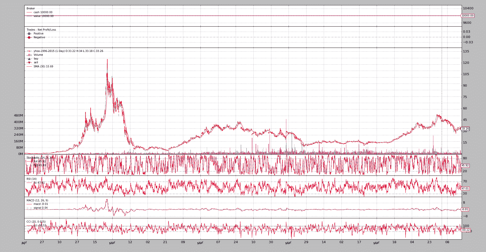

# 节省内存

> 原文：[`www.backtrader.com/blog/posts/2016-05-09-memory-savings/memory-savings/`](https://www.backtrader.com/blog/posts/2016-05-09-memory-savings/memory-savings/)

版本 1.3.1.92 已经重新设计并完全实现了之前的内存节省方案，虽然之前并没有被过多宣传和使用。

发布：[`github.com/mementum/backtrader/releases/tag/1.3.1.92`](https://github.com/mementum/backtrader/releases/tag/1.3.1.92)

`backtrader`在拥有很好内存量的机器上（并将进一步开发）开发，加上通过绘图进行可视化反馈几乎是必需的，这使得设计决策变得容易：将所有内容保存在内存中。

这个决定有一些缺点：

+   `array.array`用于数据存储，当超过一些边界时必须分配和移动数据

+   具有较少内存的机器可能会受到影响。

+   连接到在线数据源，可以在线运行数周/数月，并将数千秒/分钟的分辨率 tick 送入系统

后者比第一个更重要，因为为`backtrader`做出了另一个设计决策：

+   需要是纯 Python，以便在需要时在嵌入式系统中运行。

    将来的一个场景可能是`backtrader`连接到提供实时数据源的第二台机器，而`backtrader`本身运行在一个*树莓派*或者甚至更有限的设备上，比如一个 ADSL 路由器（AVM Frit!Box 7490，配备*Freetz*镜像）。

因此需要`backtrader`支持动态内存方案。现在可以使用以下语义来实例化或运行`Cerebro`：

+   exactbars（默认值：False）

    默认为`False`值时，每个线条中存储的每个值都会保留在内存中。

    可能的值：

    ```py
    `- `True` or `1`: all “lines” objects reduce memory usage to the
      automatically calculated minimum period.

      If a Simple Moving Average has a period of 30, the underlying data
      will have always a running buffer of 30 bars to allow the
      calculation of the Simple Moving Average

      - This setting will deactivate `preload` and `runonce`

      - Using this setting also deactivates **plotting**

    - `-1`: datas and indicators/operations at strategy level will keep
      all data in memory.

      For example: a `RSI` internally uses the indicator `UpDay` to
      make calculations. This subindicator will not keep all data in
      memory

      - This allows to keep `plotting` and `preloading` active.

      - `runonce` will be deactivated

    - `-2`: datas and indicators kept as attributes of the strategy
      will keep all data in memory.

      For example: a `RSI` internally uses the indicator `UpDay` to
      make calculations. This subindicator will not keep all data in
      memory

      If in the `__init__` something like
      `a = self.data.close - self.data.high` is defined, then `a`
      will not keep all data in memory

      - This allows to keep `plotting` and `preloading` active.

      - `runonce` will be deactivated` 
    ```

一如既往，例子胜过千言万语。一个样本脚本显示了差异。它针对 1996 年至 2015 年的*Yahoo*每日数据运行，总计`4965`天。

注意

这只是一个小样本。每天交易 14 小时的 EuroStoxx50 期货品种，在只有 1 个月的交易中将产生约 18000 个 1 分钟 K 线。

执行第一个脚本以查看在不请求内存节省时使用了多少内存位置：

```py
`$ ./memory-savings.py --save 0
Total memory cells used: 506430` 
```

对于级别 1（总节省）：

```py
`$ ./memory-savings.py --save 1
Total memory cells used: 2041` 
```

天啊！！！从*一百万*降至`2041`。确实。系统中的每个*lines*对象都使用`collections.deque`作为缓冲区（而不是`array.array`）并且被长度边界到请求操作的绝对最小值。例如：

+   在数据源上使用周期为`30`的`SimpleMovingAverage`的策略。

在这种情况下，将进行以下调整：

+   *数据源* 将有一个`30`位置的缓冲区，这是由`SimpleMovingAverage`产生下一个值所需的量。

+   `SimpleMovingAverage`将有一个`1`位置的缓冲区，因为除非被其他*指标*（依赖移动平均线）需要，否则没有必要保留更大的缓冲区。

注意

这种模式最吸引人且可能最重要的特点是脚本的整个生命周期内使用的内存量保持恒定。

无论数据源的大小如何。

如果长时间连接到实时数据源，这将非常有用。

但要考虑：

1.  *绘图*不可用

1.  还有其他会随时间累积的内存消耗源，比如策略生成的`orders`。

1.  这种模式只能在`cerebro`中使用`runonce=False`。这对于实时数据源是强制的，但在简单的回测中，这比`runonce=True`慢。

    肯定存在一个权衡点，即内存管理比逐步执行回测更昂贵，但这只能由平台的最终用户根据具体情况来判断。

现在是负级别。这些级别旨在在保存足够的内存的同时保持*绘图*可用。第一级别为`-1`：

```py
`$ ./memory-savings.py --save -1
Total memory cells used: 184623` 
```

在这种情况下，*指标*的第一级（在策略中声明的那些）保持其完整长度的缓冲区。但如果这些指标依赖于其他指标（这是情况），以执行其工作，那么子对象将被限制长度。在这种情况下，我们从：

+   `506430`个内存位置变为`184623`个

超过 50%的节省。

注意

当然，`array.array`对象已被更换为在内存方面更昂贵但在操作方面更快的`collections.deque`。但`collection.deque`对象相当小，节省的内存位置大致相等。

现在是第二级，也旨在节省在策略级别声明为不绘制的指标上的内存：

```py
`$ ./memory-savings.py --save -2
Total memory cells used: 174695` 
```

现在并没有节省太多。这是因为一个单独的指标被标记为不绘制：`TestInd().plotinfo.plot = False`

让我们看看最后一个示例的绘图：

```py
`$ ./memory-savings.py --save -2 --plot
Total memory cells used: 174695` 
```



对于感兴趣的读者，示例脚本可以生成对*指标*层次结构中遍历的每个*lines*对象的详细分析。运行时启用*绘图*（保存在`-1`处）：

```py
`$ ./memory-savings.py --save -1 --lendetails
-- Evaluating Datas
---- Data 0 Total Cells 34755 - Cells per Line 4965
-- Evaluating Indicators
---- Indicator 1.0 Average Total Cells 30 - Cells per line 30
---- SubIndicators Total Cells 1
---- Indicator 1.1 _LineDelay Total Cells 1 - Cells per line 1
---- SubIndicators Total Cells 1
...
---- Indicator 0.5 TestInd Total Cells 9930 - Cells per line 4965
---- SubIndicators Total Cells 0
-- Evaluating Observers
---- Observer 0 Total Cells 9930 - Cells per Line 4965
---- Observer 1 Total Cells 9930 - Cells per Line 4965
---- Observer 2 Total Cells 9930 - Cells per Line 4965
Total memory cells used: 184623` 
```

启用最大节省（`1`）的相同代码：

```py
`$ ./memory-savings.py --save 1 --lendetails
-- Evaluating Datas
---- Data 0 Total Cells 266 - Cells per Line 38
-- Evaluating Indicators
---- Indicator 1.0 Average Total Cells 30 - Cells per line 30
---- SubIndicators Total Cells 1
...
---- Indicator 0.5 TestInd Total Cells 2 - Cells per line 1
---- SubIndicators Total Cells 0
-- Evaluating Observers
---- Observer 0 Total Cells 2 - Cells per Line 1
---- Observer 1 Total Cells 2 - Cells per Line 1
---- Observer 2 Total Cells 2 - Cells per Line 1` 
```

第二个输出立即显示了*数据源*中的行数被限制为`38`个内存位置，而不是完整数据源长度的`4965`个。

并且*指标*和*观察者*在可能的情况下被限制为`1`，如输出的最后几行所示。

## 脚本代码和用法

在`backtrader`源代码中作为示例提供。用法：

```py
`$ ./memory-savings.py --help
usage: memory-savings.py [-h] [--data DATA] [--save SAVE] [--datalines]
                         [--lendetails] [--plot]

Check Memory Savings

optional arguments:
  -h, --help    show this help message and exit
  --data DATA   Data to be read in (default: ../../datas/yhoo-1996-2015.txt)
  --save SAVE   Memory saving level [1, 0, -1, -2] (default: 0)
  --datalines   Print data lines (default: False)
  --lendetails  Print individual items memory usage (default: False)
  --plot        Plot the result (default: False)` 
```

代码：

```py
`from __future__ import (absolute_import, division, print_function,
                        unicode_literals)

import argparse
import sys

import backtrader as bt
import backtrader.feeds as btfeeds
import backtrader.indicators as btind
import backtrader.utils.flushfile

class TestInd(bt.Indicator):
    lines = ('a', 'b')

    def __init__(self):
        self.lines.a = b = self.data.close - self.data.high
        self.lines.b = btind.SMA(b, period=20)

class St(bt.Strategy):
    params = (
        ('datalines', False),
        ('lendetails', False),
    )

    def __init__(self):
        btind.SMA()
        btind.Stochastic()
        btind.RSI()
        btind.MACD()
        btind.CCI()
        TestInd().plotinfo.plot = False

    def next(self):
        if self.p.datalines:
            txt = ','.join(
                ['%04d' % len(self),
                 '%04d' % len(self.data0),
                 self.data.datetime.date(0).isoformat()]
            )

            print(txt)

    def loglendetails(self, msg):
        if self.p.lendetails:
            print(msg)

    def stop(self):
        super(St, self).stop()

        tlen = 0
        self.loglendetails('-- Evaluating Datas')
        for i, data in enumerate(self.datas):
            tdata = 0
            for line in data.lines:
                tdata += len(line.array)
                tline = len(line.array)

            tlen += tdata
            logtxt = '---- Data {} Total Cells {} - Cells per Line {}'
            self.loglendetails(logtxt.format(i, tdata, tline))

        self.loglendetails('-- Evaluating Indicators')
        for i, ind in enumerate(self.getindicators()):
            tlen += self.rindicator(ind, i, 0)

        self.loglendetails('-- Evaluating Observers')
        for i, obs in enumerate(self.getobservers()):
            tobs = 0
            for line in obs.lines:
                tobs += len(line.array)
                tline = len(line.array)

            tlen += tdata
            logtxt = '---- Observer {} Total Cells {} - Cells per Line {}'
            self.loglendetails(logtxt.format(i, tobs, tline))

        print('Total memory cells used: {}'.format(tlen))

    def rindicator(self, ind, i, deep):
        tind = 0
        for line in ind.lines:
            tind += len(line.array)
            tline = len(line.array)

        thisind = tind

        tsub = 0
        for j, sind in enumerate(ind.getindicators()):
            tsub += self.rindicator(sind, j, deep + 1)

        iname = ind.__class__.__name__.split('.')[-1]

        logtxt = '---- Indicator {}.{} {} Total Cells {} - Cells per line {}'
        self.loglendetails(logtxt.format(deep, i, iname, tind, tline))
        logtxt = '---- SubIndicators Total Cells {}'
        self.loglendetails(logtxt.format(deep, i, iname, tsub))

        return tind + tsub

def runstrat():
    args = parse_args()

    cerebro = bt.Cerebro()
    data = btfeeds.YahooFinanceCSVData(dataname=args.data)
    cerebro.adddata(data)
    cerebro.addstrategy(
        St, datalines=args.datalines, lendetails=args.lendetails)

    cerebro.run(runonce=False, exactbars=args.save)
    if args.plot:
        cerebro.plot(style='bar')

def parse_args():
    parser = argparse.ArgumentParser(
        formatter_class=argparse.ArgumentDefaultsHelpFormatter,
        description='Check Memory Savings')

    parser.add_argument('--data', required=False,
                        default='../../datas/yhoo-1996-2015.txt',
                        help='Data to be read in')

    parser.add_argument('--save', required=False, type=int, default=0,
                        help=('Memory saving level [1, 0, -1, -2]'))

    parser.add_argument('--datalines', required=False, action='store_true',
                        help=('Print data lines'))

    parser.add_argument('--lendetails', required=False, action='store_true',
                        help=('Print individual items memory usage'))

    parser.add_argument('--plot', required=False, action='store_true',
                        help=('Plot the result'))

    return parser.parse_args()

if __name__ == '__main__':
    runstrat()` 
```
