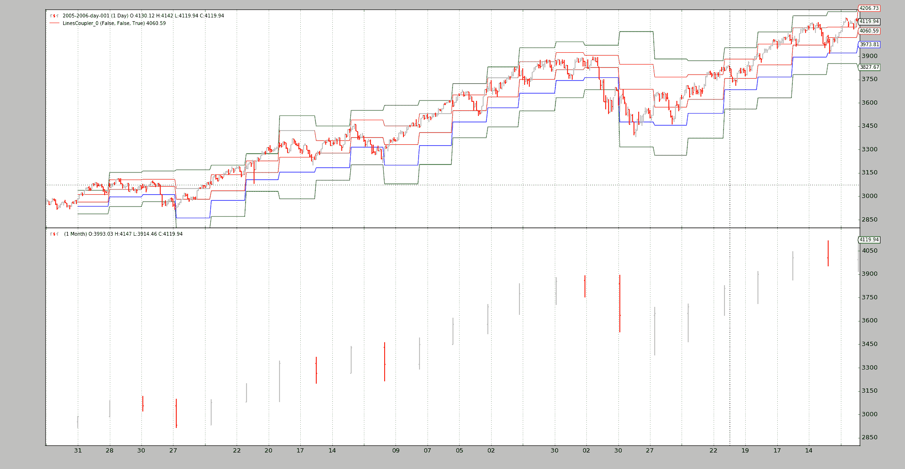

# 在指标中混合时间框架

> 原文：[`www.backtrader.com/blog/posts/2016-05-05-indicators-mixing-timeframes/indicators-mixing-timeframes/`](https://www.backtrader.com/blog/posts/2016-05-05-indicators-mixing-timeframes/indicators-mixing-timeframes/)

发布版本 1.3.0.92 带来了一个新的可能性，可以将来自不同时间框架（数据源和/或指标）的数据混合在一起。

发布版本：[`github.com/mementum/backtrader/releases/tag/1.3.0.92`](https://github.com/mementum/backtrader/releases/tag/1.3.0.92)

背景：*指标是聪明的愚蠢对象。*

+   它们很聪明，因为它们可以进行复杂的计算。

+   它们很笨，因为它们在不知道为计算提供数据的来源的情况下运行

如下所示：

+   如果提供值的数据源具有不同的时间框架，在`Cerebro`引擎中长度不同，那么指标将会破裂。

一个计算的例子，在这个例子中`data0`的时间框架是天，而`data1`的时间框架是`月`：

```py
pivotpoint = btind.PivotPoint(self.data1)
sellsignal = self.data0.close < pivotpoint.s1
```

这里寻找*卖出信号*，当收盘价低于`s1`线（*第一个支撑位*）时

注意

根据定义，`PivotPoint`在较大的时间框架中运行

这将在过去出现以下错误：

```py
return self.array[self.idx + ago]
IndexError: array index out of range
```

出于一个很好的原因：`self.data.close`从第一个瞬间提供值，但`PivotPoint`（因此`s1`线）只有在整个月份过去后才会提供值，这大约相当于`self.data0.close`的 22 个值。在这 22 个*closes*中，还没有`s1`的值，并且从底层数组中获取它的尝试会失败。

*线*对象支持`()`操作符（*Python*中的`__call__`特殊方法）以提供其自身的延迟版本：

```py
close1 = self.data.close(-1)
```

在此示例中，通过`[0]`访问`close1`对象始终包含`close`提供的先前值（`-1`）。语法已经被重用以适应不同的时间框架。让我们重写上述的`pivotpoint`片段：

```py
pivotpoint = btind.PivotPoint(self.data1)
sellsignal = self.data0.close < pivotpoint.s1()
```

见如何在不带参数的情况下执行`()`（在后台提供一个`None`）。以下是发生的情况：

`pivotpoint.s1()`返回一个内部的`LinesCoupler`对象，该对象遵循更大范围的节奏。这个连接器会用来自实际`s1`的最新值填充自身（从`NaN`的默认值开始）

但是还需要一些额外的东西来使魔法生效。`Cerebro`必须使用以下内容创建：

```py
cerebro = bt.Cerebro(runonce=False)
```

或者使用以下内容执行：

```py
cerebro.run(runonce=False)
```

在此模式下，指标和延迟评估的自动*线*对象是逐步执行的，而不是在紧密循环中。这使整个操作变慢，但它使其**可能**

之前破解的底部示例脚本现在可以运行：

```py
$ ./mixing-timeframes.py
```

输出为：

```py
0021,0021,0001,2005-01-31,2984.75,2935.96,0.00
0022,0022,0001,2005-02-01,3008.85,2935.96,0.00
...
0073,0073,0003,2005-04-15,3013.89,3010.76,0.00
0074,0074,0003,2005-04-18,2947.79,3010.76,1.00
...
```

在交易 74 处，第 1 次发生`close < s1`。

该脚本还提供了另一个可能性的见解：*将指标的所有线连接起来*。之前我们有：

```py
self.sellsignal = self.data0.close < pp.s1()
```

作为替代方案：

```py
pp1 = pp()
self.sellsignal = self.data0.close < pp1.s1
```

现在整个`PivotPoint`指标已经耦合，并且可以访问其任何线条（即`p`、`r1`、`r2`、`s1`、`s2`）。脚本只对`s1`感兴趣，访问是直接的。：

```py
$ ./mixing-timeframes.py --multi
```

输出：

```py
0021,0021,0001,2005-01-31,2984.75,2935.96,0.00
0022,0022,0001,2005-02-01,3008.85,2935.96,0.00
...
0073,0073,0003,2005-04-15,3013.89,3010.76,0.00
0074,0074,0003,2005-04-18,2947.79,3010.76,1.00
...
```

这里没有什么意外。与以前相同。甚至可以绘制“耦合”对象：

```py
$ ./mixing-timeframes.py --multi --plot
```



## 完整的耦合语法

对于具有多个线条的*lines*对象（例如*Indicators*如`PivotPoint`）：

+   `obj(clockref=None, line=-1)`

    +   如果`clockref`为`None`，则周围的对象（在示例中为`Strategy`）将是调整较大时间框架（例如：`Months`）到较小/更快时间框架（例如：`Days`）的参考

    如果愿意，可以使用另一个参考。

    `line`

    ```py
    `- If the default `-1` is given, all *lines* are coupled.

    - If another integer (for example, `0` or `1`) a single line will be
      coupled and fetched by index (from `obj.lines[x]`)

    - If a string is passed, the line will be fetched by name.

      In the sample the following could have been done:

      ```

    coupled_s1 = pp(line='s1')

    ```py` 
    ```

对于*lines*对象只有一条线（例如指标`PivotPoint`的线条`s1`）：

+   `obj(clockref=None)`（参见上面的`clockref`）

## 结论

在常规的`()`语法中，不同时间段的数据可以在指标中混合，始终考虑到需要使用`runonce=False`来实例化或创建`cerebro`。

## 脚本代码和用法

在`backtrader`的源代码中可用作示例。用法：

```py
$ ./mixing-timeframes.py --help
usage: mixing-timeframes.py [-h] [--data DATA] [--multi] [--plot]

Sample for pivot point and cross plotting

optional arguments:
  -h, --help   show this help message and exit
  --data DATA  Data to be read in (default: ../../datas/2005-2006-day-001.txt)
  --multi      Couple all lines of the indicator (default: False)
  --plot       Plot the result (default: False)
```

代码：

```py
from __future__ import (absolute_import, division, print_function,
                        unicode_literals)

import argparse

import backtrader as bt
import backtrader.feeds as btfeeds
import backtrader.indicators as btind
import backtrader.utils.flushfile

class St(bt.Strategy):
    params = dict(multi=True)

    def __init__(self):
        self.pp = pp = btind.PivotPoint(self.data1)
        pp.plotinfo.plot = False  # deactivate plotting

        if self.p.multi:
            pp1 = pp()  # couple the entire indicators
            self.sellsignal = self.data0.close < pp1.s1
        else:
            self.sellsignal = self.data0.close < pp.s1()

    def next(self):
        txt = ','.join(
            ['%04d' % len(self),
             '%04d' % len(self.data0),
             '%04d' % len(self.data1),
             self.data.datetime.date(0).isoformat(),
             '%.2f' % self.data0.close[0],
             '%.2f' % self.pp.s1[0],
             '%.2f' % self.sellsignal[0]])

        print(txt)

def runstrat():
    args = parse_args()

    cerebro = bt.Cerebro()
    data = btfeeds.BacktraderCSVData(dataname=args.data)
    cerebro.adddata(data)
    cerebro.resampledata(data, timeframe=bt.TimeFrame.Months)

    cerebro.addstrategy(St, multi=args.multi)

    cerebro.run(stdstats=False, runonce=False)
    if args.plot:
        cerebro.plot(style='bar')

def parse_args():
    parser = argparse.ArgumentParser(
        formatter_class=argparse.ArgumentDefaultsHelpFormatter,
        description='Sample for pivot point and cross plotting')

    parser.add_argument('--data', required=False,
                        default='../../datas/2005-2006-day-001.txt',
                        help='Data to be read in')

    parser.add_argument('--multi', required=False, action='store_true',
                        help='Couple all lines of the indicator')

    parser.add_argument('--plot', required=False, action='store_true',
                        help=('Plot the result'))

    return parser.parse_args()

if __name__ == '__main__':
    runstrat()
```
