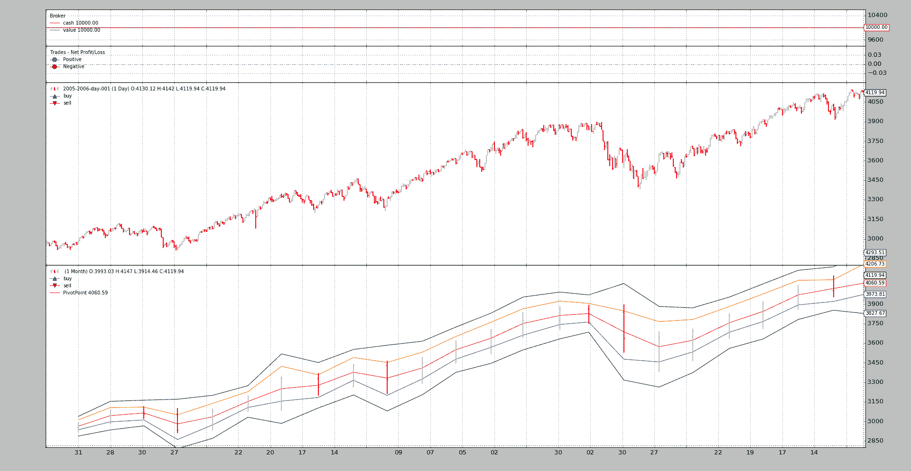
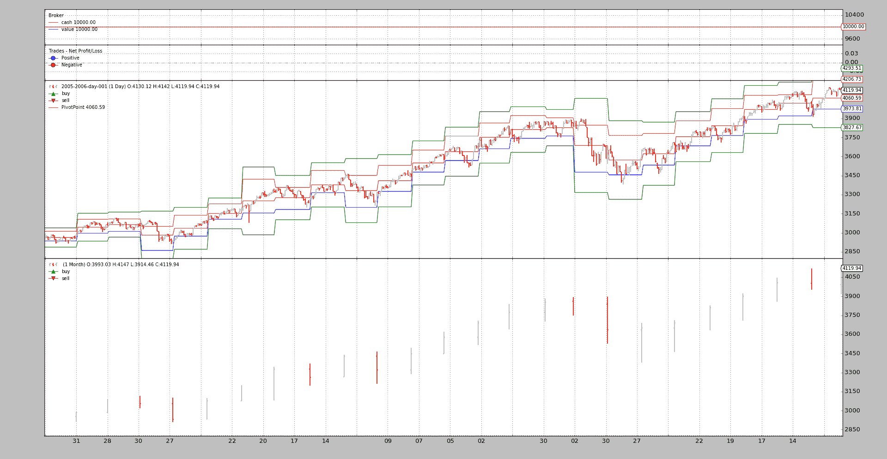

# 枢轴点和交叉绘图

> 原文：[`www.backtrader.com/blog/posts/2016-04-28-pivot-point-cross-plotting/pivotpoint-crossplotting/`](https://www.backtrader.com/blog/posts/2016-04-28-pivot-point-cross-plotting/pivotpoint-crossplotting/)

注意

这篇文章因历史原因而保留。 该指标和示例已在源中进行了更新，`PivotPoint` 现在可以自动连接自身，从而为用户代码删除了样板。

一个新的帖子将引用此帖子。 与此同时，请检查来源中的更新示例。

收到了一个有趣的请求：

+   PivotPoint

它之所以有趣，是因为指标的定义方式。 文献可在 [StockCharts 的 PivotPoint](http://stockcharts.com/school/doku.php?id=chart_school:technical_indicators:pivot_points) 中找到。 PivotPoints 使用过去时间段的 `close`、`high` 和 `low` 价格。 例如，对于每日时间段：

+   *每日图表的枢轴点使用先前月份的数据*

这可能看起来很麻烦，因为对于每个时间框架，都需要定义必须使用的其他时间框架。 查看公式会引起另一个问题：

```py
Pivot Point (P) = (High + Low + Close)/3
Support 1 (S1) = (P x 2) - High
Support 2 (S2) = P  -  (High  -  Low)
Resistance 1 (R1) = (P x 2) - Low
Resistance 2 (R2) = P + (High  -  Low)
```

即使文本充满了对 *先前期间* 和 *过去 …* 的引用，但公式似乎是参考当前时刻。 让我们遵循 *文本* 的建议，在我们首次尝试 PivotPoint 时使用 *previous*。 但首先，让我们通过这样做来解决不同时间框架的问题：

+   该指标不会解决问题

尽管这可能看起来令人困惑，但必须考虑到 *指标* 必须尽可能愚蠢，并由实际公式组成。 问题将按以下方式解决：

```py
data = btfeeds.ADataFeed(..., timeframe=bt.TimeFrame.Days)
cerebro.adddata(data)
cerebro.resampledata(data, timeframe=bt.TimeFrame.Months)
```

而后在 *策略* 中：

```py
class MyStrategy(bt.Strategy):
    def __init__(self):
        self.pp = PivotPoint(self.data1)  # the resampled data
```

现在清楚了。 该系统将具有数据，再加上额外的输入重采样为所需的时间框架。 `PivotPoint` 指标将使用已重采样的数据工作，这些数据已处于所需的 *每月* 时间框架中，以供原始数据时间框架使用，即 *每日*。

指标可以被开发出来。 让我们从跟随文本指示开始，而不是公式，回望 1 期。

```py
class PivotPoint1(bt.Indicator):
    lines = ('p', 's1', 's2', 'r1', 'r2',)

    def __init__(self):
        h = self.data.high(-1)  # previous high
        l = self.data.low(-1)  # previous low
        c = self.data.close(-1)  # previous close

        self.lines.p = p = (h + l + c) / 3.0

        p2 = p * 2.0
        self.lines.s1 = p2 - h  # (p x 2) - high
        self.lines.r1 = p2 - l  # (p x 2) - low

        hilo = h - l
        self.lines.s2 = p - hilo  # p - (high - low)
        self.lines.r2 = p + hilo  # p + (high - low)
```

该策略将查看参数 `usepp1` 来使用此 `PivotPoint1`

```py
 `def __init__(self):
        if self.p.usepp1:
            self.pp = PivotPoint1(self.data1)
        else:
            self.pp = PivotPoint(self.data1)
```

输出由一个简单的 `next` 方法控制

```py
 `def next(self):
        txt = ','.join(
            ['%04d' % len(self),
             '%04d' % len(self.data0),
             '%04d' % len(self.data1),
             self.data.datetime.date(0).isoformat(),
             '%.2f' % self.pp[0]])

        print(txt)
```

让我们执行：

```py
./ppsample --usepp1
```

输出如下：

```py
0041,0041,0002,2005-02-28,2962.79
0042,0042,0002,2005-03-01,2962.79
...
```

立即清楚的是：*索引 41 已经属于第 2 个月*。 这意味着我们已经跳过了 1 个月的指标计算。 现在清楚了为什么 *StockCharts* 中的文本总是提到计算是在前一个 *月* 进行的，但公式似乎是参考当前时刻。

+   开发人员可能面临相同的设计决策，即多个数据具有多个时间框架。

    在当前 *每日* 点上，只能交付上一个 *月* 的 *关闭* 柱。

这就是为什么 `next` 方法看的是索引 `[0]`。 所有这些都有一个非常简单的解决方法，那就是按照 *StockCharts* 记录的方式编写公式。

```py
class PivotPoint(bt.Indicator):
    lines = ('p', 's1', 's2', 'r1', 'r2',)
    plotinfo = dict(subplot=False)

    def __init__(self):
        h = self.data.high  # current high
        l = self.data.low  # current high
        c = self.data.close  # current high

        self.lines.p = p = (h + l + c) / 3.0

        p2 = p * 2.0
        self.lines.s1 = p2 - h  # (p x 2) - high
        self.lines.r1 = p2 - l  # (p x 2) - low

        hilo = h - l
        self.lines.s2 = p - hilo  # p - (high - low)
        self.lines.r2 = p + hilo  # p + (high - low)
```

没有 `usepp1` 的执行：

```py
./ppsample
```

新输出如下：

```py
0021,0021,0001,2005-01-31,2962.79
0022,0022,0001,2005-02-01,2962.79
...
```

啊哈！第 1 个月有`20`个交易日，一旦完成，指标就计算出值并可以传送。唯一打印的行是`p`，如果两行中的值相同，则是因为该值在整个下一个月内保持不变。引用*StockCharts*：

```py
Once Pivot Points are set, they do not change and remain in play throughout ...
```

指标已经可以使用。让我们开始绘图吧。绘图参数已经设置好。

```py
 `plotinfo = dict(subplot=False)
```

计算出的值与数据比例一致，并且就像*移动平均线*一样，可以沿着数据绘制（因此`subplot=False`）

使用`--plot`进行执行：

```py
./ppsample --plot
```



惊人的海蜗牛又开始袭击了。该指标已经绘制在月度数据（其源）上，这在日线图上没有任何视觉指示，而在日线图上，它将非常有帮助。

但`backtrader`支持从一个数据到另一个数据的交叉绘图。虽然需要在`1.2.8.88`中进行小的添加以支持将数据交叉绘制到不同时间框架的数据上。

这是通过让`plotmaster`指定绘图目标来实现的，将其添加到指标的`plotinfo`属性中：

```py
./ppsample --plot --plot-on-daily
```



现在视觉反馈对于理解`PivotPoint`正在提供的内容非常有用。

## 脚本代码和用法

在`backtrader`源码中提供为样例：

```py
$ ./ppsample.py --help
usage: ppsample.py [-h] [--data DATA] [--usepp1] [--plot] [--plot-on-daily]

Sample for pivot point and cross plotting

optional arguments:
  -h, --help       show this help message and exit
  --data DATA      Data to be read in (default:
                   ../../datas/2005-2006-day-001.txt)
  --usepp1         Have PivotPoint look 1 period backwards (default: False)
  --plot           Plot the result (default: False)
  --plot-on-daily  Plot the indicator on the daily data (default: False)
```

`PivotPoint`的代码

```py
from __future__ import (absolute_import, division, print_function,)
#                        unicode_literals)

import backtrader as bt

class PivotPoint1(bt.Indicator):
    lines = ('p', 's1', 's2', 'r1', 'r2',)

    def __init__(self):
        h = self.data.high(-1)  # previous high
        l = self.data.low(-1)  # previous low
        c = self.data.close(-1)  # previous close

        self.lines.p = p = (h + l + c) / 3.0

        p2 = p * 2.0
        self.lines.s1 = p2 - h  # (p x 2) - high
        self.lines.r1 = p2 - l  # (p x 2) - low

        hilo = h - l
        self.lines.s2 = p - hilo  # p - (high - low)
        self.lines.r2 = p + hilo  # p + (high - low)

class PivotPoint(bt.Indicator):
    lines = ('p', 's1', 's2', 'r1', 'r2',)
    plotinfo = dict(subplot=False)

    def __init__(self):
        h = self.data.high  # current high
        l = self.data.low  # current high
        c = self.data.close  # current high

        self.lines.p = p = (h + l + c) / 3.0

        p2 = p * 2.0
        self.lines.s1 = p2 - h  # (p x 2) - high
        self.lines.r1 = p2 - l  # (p x 2) - low

        hilo = h - l
        self.lines.s2 = p - hilo  # p - (high - low)
        self.lines.r2 = p + hilo  # p + (high - low)
```

脚本的代码。

```py
from __future__ import (absolute_import, division, print_function,
                        unicode_literals)

import argparse

import backtrader as bt
import backtrader.feeds as btfeeds
import backtrader.utils.flushfile

from pivotpoint import PivotPoint, PivotPoint1

class St(bt.Strategy):
    params = (('usepp1', False),
              ('plot_on_daily', False))

    def __init__(self):
        if self.p.usepp1:
            self.pp = PivotPoint1(self.data1)
        else:
            self.pp = PivotPoint(self.data1)

        if self.p.plot_on_daily:
            self.pp.plotinfo.plotmaster = self.data0

    def next(self):
        txt = ','.join(
            ['%04d' % len(self),
             '%04d' % len(self.data0),
             '%04d' % len(self.data1),
             self.data.datetime.date(0).isoformat(),
             '%.2f' % self.pp[0]])

        print(txt)

def runstrat():
    args = parse_args()

    cerebro = bt.Cerebro()
    data = btfeeds.BacktraderCSVData(dataname=args.data)
    cerebro.adddata(data)
    cerebro.resampledata(data, timeframe=bt.TimeFrame.Months)

    cerebro.addstrategy(St,
                        usepp1=args.usepp1,
                        plot_on_daily=args.plot_on_daily)
    cerebro.run()
    if args.plot:
        cerebro.plot(style='bar')

def parse_args():
    parser = argparse.ArgumentParser(
        formatter_class=argparse.ArgumentDefaultsHelpFormatter,
        description='Sample for pivot point and cross plotting')

    parser.add_argument('--data', required=False,
                        default='../../datas/2005-2006-day-001.txt',
                        help='Data to be read in')

    parser.add_argument('--usepp1', required=False, action='store_true',
                        help='Have PivotPoint look 1 period backwards')

    parser.add_argument('--plot', required=False, action='store_true',
                        help=('Plot the result'))

    parser.add_argument('--plot-on-daily', required=False, action='store_true',
                        help=('Plot the indicator on the daily data'))

    return parser.parse_args()

if __name__ == '__main__':
    runstrat()
```
