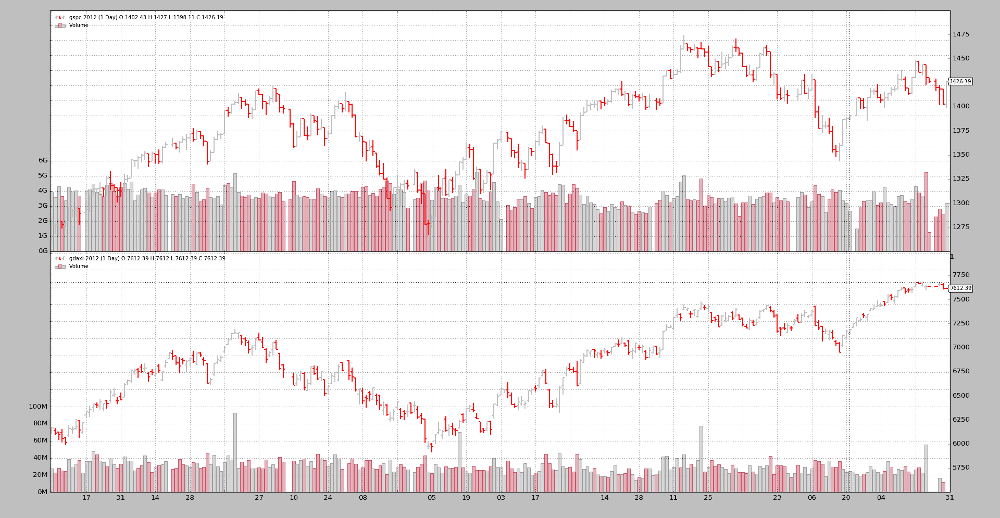

# 同步不同的市场

> 原文：[`www.backtrader.com/blog/posts/2016-04-19-sync-different-markets/sync-different-markets/`](https://www.backtrader.com/blog/posts/2016-04-19-sync-different-markets/sync-different-markets/)

使用越多，backtrader 面对的想法和意外情况就越多。随着每一个新的想法，都是一个挑战，看看平台是否能够实现开发时设定的期望，灵活性和易用性是目标，*Python* 被选择为基石。

[Ticket #76](https://github.com/mementum/backtrader/issues/76) 提出了一个问题，即是否可以同步具有不同交易日历的市场。直接尝试这样做会失败，问题的创建者想知道为什么 `backtrader` 没有查看日期。

在做出任何答复之前，必须考虑一些想法：

+   对于不对齐的日子指标的行为

后者的答案是：

+   该平台尽可能是`日期`和`时间`不可知的，并且不会查看字段的内容来评估这些概念

考虑到股票市场价格是 `datetime` 系列，上述情况在一定程度上是成立的。在多个数据的情况下，以下设计考虑因素适用：

+   添加到 `cerebro` 的第一条数据是 `datamaster`

+   所有其他数据都必须与其进行时间对齐/同步，永远不能超过（在 `datetime` 方面）`datamaster`

将上述的三个要点组合在一起，得到了问题创建者所经历的混合体。情景如下：

+   日历年份：`2012`

+   数据 0: `^GSPC`（或者朋友们称之为标普 500 指数）

+   数据 1: `^GDAXI`（或者朋友们称之为德国 DAX 指数）

运行一个自定义脚本，查看`backtrader`如何同步数据：

```py
`$ ./weekdaysaligner.py --online --data1 '^GSPC' --data0 '^GDAXI'` 
```

输出如下：

```py
`0001,  True, data0, 2012-01-03T23:59:59, 2012-01-03T23:59:59, data1
0002,  True, data0, 2012-01-04T23:59:59, 2012-01-04T23:59:59, data1
0003,  True, data0, 2012-01-05T23:59:59, 2012-01-05T23:59:59, data1
0004,  True, data0, 2012-01-06T23:59:59, 2012-01-06T23:59:59, data1
0005,  True, data0, 2012-01-09T23:59:59, 2012-01-09T23:59:59, data1
0006,  True, data0, 2012-01-10T23:59:59, 2012-01-10T23:59:59, data1
0007,  True, data0, 2012-01-11T23:59:59, 2012-01-11T23:59:59, data1
0008,  True, data0, 2012-01-12T23:59:59, 2012-01-12T23:59:59, data1
0009,  True, data0, 2012-01-13T23:59:59, 2012-01-13T23:59:59, data1
0010, False, data0, 2012-01-17T23:59:59, 2012-01-16T23:59:59, data1
0011, False, data0, 2012-01-18T23:59:59, 2012-01-17T23:59:59, data1
...` 
```

一旦到达 `2012-01-16`，交易日历就开始分歧。`data0` 是 `datamaster`（`^GSPC`），即使 `data1`（`^GDAXI`）在 `2012-01-16` 有一根柱子要交付，**这对于*S&P 500* 来说并不是一个交易日**。

当 `^GSPC` 的下一个交易日到来时，backtrader`在上述设计限制下能做的最好的事情是，提供 `^GDAXI` 的下一个尚未处理的日期，即 `2012-01-16`。

随着每一天的分歧，同步问题逐渐累积。在 `2012` 年末，情况如下：

```py
`...
0249, False, data0, 2012-12-28T23:59:59, 2012-12-19T23:59:59, data1
0250, False, data0, 2012-12-31T23:59:59, 2012-12-20T23:59:59, data1` 
```

原因应该是显而易见的：*欧洲人交易的日子比美国人多*。

在 Ticket #76 [`github.com/mementum/backtrader/issues/76`](https://github.com/mementum/backtrader/issues/76) 中，作者展示了 `zipline` 的操作。让我们来看看 `2012-01-13` - `2012-01-17` 的难题：

```py
`0009 : True : 2012-01-13 : close 1289.09 - 2012-01-13 :  close 6143.08
0010 : False : 2012-01-13 : close 1289.09 - 2012-01-16 :  close 6220.01
0011 : True : 2012-01-17 : close 1293.67 - 2012-01-17 :  close 6332.93` 
```

需要注意！`2012-01-13` 的数据已经被简单地**复制**，似乎没有征求用户的许可。在我看来，这不应该发生，因为平台的最终用户无法撤销这种自发添加。

注意

除了简要查看`zipline`，作者不知道这是否是标准行为，由脚本开发者配置，以及是否可以撤消。

一旦我们已经看到*其他内容*，让我们再次尝试使用累积的智慧，使用`backtrader`：*欧洲人比美国人交易频繁*。让我们颠倒`^GSPC`和`^GDAXI`的角色，看看结果：

```py
`$ ./weekdaysaligner.py --online --data1 '^GSPC' --data0 '^GDAXI'` 
```

输出（直接跳转到`2012-01-13`）：

```py
`...
0009,  True, data0, 2012-01-13T23:59:59, 2012-01-13T23:59:59, data1
0010, False, data0, 2012-01-16T23:59:59, 2012-01-13T23:59:59, data1
0011,  True, data0, 2012-01-17T23:59:59, 2012-01-17T23:59:59, data1
...` 
```

该死的！`backtrader`也*复制了*`2012-01-13`值作为`data0`（现在为`^GDAXI`）的交付，以匹配`data1`（在此情况下为`^GSPC`）的交付，这是`2012-01-16`。

更好的是：

+   同步已经在下一个日期`2012-01-17`中达到

不久之后再次看到相同的重新同步：

```py
`...
0034,  True, data0, 2012-02-17T23:59:59, 2012-02-17T23:59:59, data1
0035, False, data0, 2012-02-20T23:59:59, 2012-02-17T23:59:59, data1
0036,  True, data0, 2012-02-21T23:59:59, 2012-02-21T23:59:59, data1
...` 
```

紧接着是不那么容易的重新同步：

```py
`...
0068,  True, data0, 2012-04-05T23:59:59, 2012-04-05T23:59:59, data1
0069, False, data0, 2012-04-10T23:59:59, 2012-04-09T23:59:59, data1
...
0129, False, data0, 2012-07-04T23:59:59, 2012-07-03T23:59:59, data1
0130,  True, data0, 2012-07-05T23:59:59, 2012-07-05T23:59:59, data1
...` 
```

这种情节会一直重复，直到最后一个`^GDAXI`柱形图被提供：

```py
`...
0256,  True, data0, 2012-12-31T23:59:59, 2012-12-31T23:59:59, data1
...` 
```

这种*同步*问题的原因是`backtrader`不会复制数据。

+   一旦`datamaster`提供了一个新的柱形图，其他`数据`就会被要求提供

+   如果对于`datamaster`当前的`datetime`来说没有柱形图可提供（例如，因为它被超越了），那么就会提供下一个最佳数据，可以说是*重新提供*

    这是一个已经见过的`日期`的柱形图

## 正确的同步

但并非一切希望都已消失。`backtrader` 可以实现。让我们使用**过滤器**。`backtrader` 中的这项技术允许在数据到达平台最深层之前对其进行操作，例如计算*指标*。

注意

“交付”是一个感知问题，因此`backtrader`提供的可能不是接收者所期望的`交付`

实际代码如下

```py
`from __future__ import (absolute_import, division, print_function,
                        unicode_literals)

import datetime

class WeekDaysFiller(object):
    '''Bar Filler to add missing calendar days to trading days'''
    # kickstart value for date comparisons
    lastdt = datetime.datetime.max.toordinal()

    def __init__(self, data, fillclose=False):
        self.fillclose = fillclose
        self.voidbar = [float('Nan')] * data.size()  # init a void bar

    def __call__(self, data):
        '''Empty bars (NaN) or with last close price are added for weekdays with no
        data

        Params:
          - data: the data source to filter/process

        Returns:
          - True (always): bars are removed (even if put back on the stack)

        '''
        dt = data.datetime.dt()  # current date in int format
        lastdt = self.lastdt + 1  # move the last seen data once forward

        while lastdt < dt:  # loop over gap bars
            if datetime.date.fromordinal(lastdt).isoweekday() < 6:  # Mon-Fri
                # Fill in date and add new bar to the stack
                if self.fillclose:
                    self.voidbar = [self.lastclose] * data.size()
                self.voidbar[-1] = float(lastdt) + data.sessionend
                data._add2stack(self.voidbar[:])

            lastdt += 1  # move lastdt forward

        self.lastdt = dt  # keep a record of the last seen date

        self.lastclose = data.close[0]
        data._save2stack(erase=True)  # dt bar to the stack and out of stream
        return True  # bars are on the stack (new and original)` 
```

测试脚本已经具备使用它的能力：

```py
`$ ./weekdaysaligner.py --online --data0 '^GSPC' --data1 '^GDAXI' --filler` 
```

使用`--filler`，`WeekDaysFiller`被添加到`data0`和`data1`。并且输出：

```py
`0001,  True, data0, 2012-01-03T23:59:59, 2012-01-03T23:59:59, data1
...
0009,  True, data0, 2012-01-13T23:59:59, 2012-01-13T23:59:59, data1
0010,  True, data0, 2012-01-16T23:59:59, 2012-01-16T23:59:59, data1
0011,  True, data0, 2012-01-17T23:59:59, 2012-01-17T23:59:59, data1
...` 
```

在`2012-01-13`至`2012-01-17`期间的第 1 个*难题*已经解决。并且整个集合已经*同步*：

```py
`...
0256,  True, data0, 2012-12-25T23:59:59, 2012-12-25T23:59:59, data1
0257,  True, data0, 2012-12-26T23:59:59, 2012-12-26T23:59:59, data1
0258,  True, data0, 2012-12-27T23:59:59, 2012-12-27T23:59:59, data1
0259,  True, data0, 2012-12-28T23:59:59, 2012-12-28T23:59:59, data1
0260,  True, data0, 2012-12-31T23:59:59, 2012-12-31T23:59:59, data1` 
```

值得注意的是：

+   使用`^GSPC`作为`data0`，我们有`250`行（该指数在`2012`年交易了`250`天）

+   使用`^GDAXI`，我们`data0`有`256`行（该指数在`2012`年交易了`256`天）

+   并且通过放置`WeekDaysFiller`，两个*数据集*的长度已经扩展到`260`。

    添加`52` * `2`（周末和周末的天数），我们会得到`364`。一年中剩余的一天肯定是一个*星期六*或一个*星期天*。

*过滤器*正在用`NaN`值进行*填充*，用于给定数据中没有交易发生的日子。让我们来绘制它：

```py
`$ ./weekdaysaligner.py --online --data0 '^GSPC' --data1 '^GDAXI' --filler --plot` 
```



填充的日子相当明显：

+   条之间的间隙还在

+   对于*成交量*图来说，这个间隙更加明显

第 2 个绘图将尝试回答顶部的问题：*指标会发生什么情况？*请记住，新的柱形图已经被赋予了`NaN`的值（这就是它们没有显示的原因）：

```py
`$ ./weekdaysaligner.py --online --data0 '^GSPC' --data1 '^GDAXI' --filler --plot --sma 10` 
```


重新贴上船壳！*简单移动平均* 打破了时空连续体，并跳过一些柱，没有连续解。这当然是 *Not a Number*（`NaN`）填充的效果：*数学运算不再有意义*。

如果使用的不是 `NaN` 而是上次观察到的收盘价：

```py
`$ ./weekdaysaligner.py --online --data0 '^GSPC' --data1 '^GDAXI' --filler --plot --sma 10 --fillclose` 
```

整个 260 天使用正常 *SMA* 绘制的图表看起来更加漂亮。


## 结论

同步两个具有不同交易日历的工具是一个做出决策和妥协的问题。`backtrader` 需要时间对齐的数据来处理多个数据和不同的交易日历并不会有所帮助。

此处描述的 `WeekDaysFiller` 的使用可以缓解这种情况，但这绝不是一种普遍的灵丹妙药，因为用什么值来填充是一个长期而且长时间的考虑问题。

## 脚本代码和用法

在 `backtrader` 源码中可用作示例：

```py
`$ ./weekdaysaligner.py --help
usage: weekdaysaligner.py [-h] [--online] --data0 DATA0 [--data1 DATA1]
                          [--sma SMA] [--fillclose] [--filler] [--filler0]
                          [--filler1] [--fromdate FROMDATE] [--todate TODATE]
                          [--plot]

Sample for aligning with trade

optional arguments:
  -h, --help            show this help message and exit
  --online              Fetch data online from Yahoo (default: False)
  --data0 DATA0         Data 0 to be read in (default: None)
  --data1 DATA1         Data 1 to be read in (default: None)
  --sma SMA             Add a sma to the datas (default: 0)
  --fillclose           Fill with Close price instead of NaN (default: False)
  --filler              Add Filler to Datas 0 and 1 (default: False)
  --filler0             Add Filler to Data 0 (default: False)
  --filler1             Add Filler to Data 1 (default: False)
  --fromdate FROMDATE, -f FROMDATE
                        Starting date in YYYY-MM-DD format (default:
                        2012-01-01)
  --todate TODATE, -t TODATE
                        Ending date in YYYY-MM-DD format (default: 2012-12-31)
  --plot                Do plot (default: False)` 
```

代码：

```py
`from __future__ import (absolute_import, division, print_function,
                        unicode_literals)

import argparse
import datetime

import backtrader as bt
import backtrader.feeds as btfeeds
import backtrader.indicators as btind
import backtrader.utils.flushfile

# from wkdaysfiller import WeekDaysFiller
from weekdaysfiller import WeekDaysFiller

class St(bt.Strategy):
    params = (('sma', 0),)

    def __init__(self):
        if self.p.sma:
            btind.SMA(self.data0, period=self.p.sma)
            btind.SMA(self.data1, period=self.p.sma)

    def next(self):
        dtequal = (self.data0.datetime.datetime() ==
                   self.data1.datetime.datetime())

        txt = ''
        txt += '%04d, %5s' % (len(self), str(dtequal))
        txt += ', data0, %s' % self.data0.datetime.datetime().isoformat()
        txt += ', %s, data1' % self.data1.datetime.datetime().isoformat()
        print(txt)

def runstrat():
    args = parse_args()

    fromdate = datetime.datetime.strptime(args.fromdate, '%Y-%m-%d')
    todate = datetime.datetime.strptime(args.todate, '%Y-%m-%d')

    cerebro = bt.Cerebro(stdstats=False)

    DataFeed = btfeeds.YahooFinanceCSVData
    if args.online:
        DataFeed = btfeeds.YahooFinanceData

    data0 = DataFeed(dataname=args.data0, fromdate=fromdate, todate=todate)

    if args.data1:
        data1 = DataFeed(dataname=args.data1, fromdate=fromdate, todate=todate)
    else:
        data1 = data0.clone()

    if args.filler or args.filler0:
        data0.addfilter(WeekDaysFiller, fillclose=args.fillclose)

    if args.filler or args.filler1:
        data1.addfilter(WeekDaysFiller, fillclose=args.fillclose)

    cerebro.adddata(data0)
    cerebro.adddata(data1)

    cerebro.addstrategy(St, sma=args.sma)
    cerebro.run(runonce=True, preload=True)

    if args.plot:
        cerebro.plot(style='bar')

def parse_args():
    parser = argparse.ArgumentParser(
        formatter_class=argparse.ArgumentDefaultsHelpFormatter,
        description='Sample for aligning with trade ')

    parser.add_argument('--online', required=False, action='store_true',
                        help='Fetch data online from Yahoo')

    parser.add_argument('--data0', required=True, help='Data 0 to be read in')
    parser.add_argument('--data1', required=False, help='Data 1 to be read in')

    parser.add_argument('--sma', required=False, default=0, type=int,
                        help='Add a sma to the datas')

    parser.add_argument('--fillclose', required=False, action='store_true',
                        help='Fill with Close price instead of NaN')

    parser.add_argument('--filler', required=False, action='store_true',
                        help='Add Filler to Datas 0 and 1')

    parser.add_argument('--filler0', required=False, action='store_true',
                        help='Add Filler to Data 0')

    parser.add_argument('--filler1', required=False, action='store_true',
                        help='Add Filler to Data 1')

    parser.add_argument('--fromdate', '-f', default='2012-01-01',
                        help='Starting date in YYYY-MM-DD format')

    parser.add_argument('--todate', '-t', default='2012-12-31',
                        help='Ending date in YYYY-MM-DD format')

    parser.add_argument('--plot', required=False, action='store_true',
                        help='Do plot')

    return parser.parse_args()

if __name__ == '__main__':
    runstrat()` 
```
