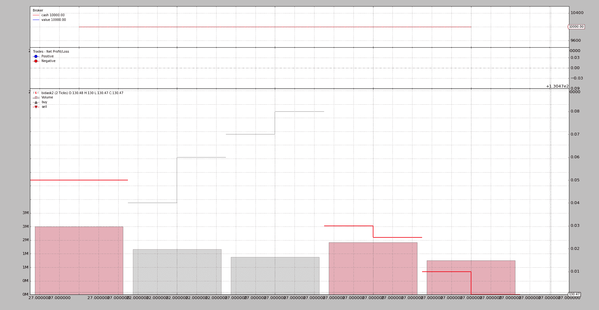

# Bid-Ask 数据到 OHLC

> 原文：[`www.backtrader.com/blog/posts/2016-04-14-bidask-data-to-ohlc/bidask-data-to-ohlc/`](https://www.backtrader.com/blog/posts/2016-04-14-bidask-data-to-ohlc/bidask-data-to-ohlc/)

最近，backtrader 通过实现线覆盖来执行了从 ohlcland 的逃逸，这允许重新定义整个层次结构，例如拥有仅包含 bid、ask 和 datetime 行的数据源。

（这里是原始 Escape from OHLC Land）

这引发了如何可视化此类数据的问题，这在`OHLC`格式中最有效地完成（无论是`bar`还是`candlestick`）

所需步骤：

1.  定义一个可以读取给定`bid/ask`格式的数据源加载器

1.  决定将值分配给哪些字段，即：`open`、`high`、`low`和`close`（也许还有`volume`）

1.  决定一个重新采样方案

源数据（10 行 bid-ask 数据）：

```py
Date,Time,Symbol,Status,Bid,Ask,Bid Vol,Ask Vol
01/03/16,23:43:11,EUR/JPY,D,,130.520,,1000000
01/03/16,23:43:27,EUR/JPY,D,,130.520,,2000000
01/03/16,23:49:19,EUR/JPY,D,,130.510,,500000
01/03/16,23:49:22,EUR/JPY,D,,130.530,,1500000
01/03/16,23:49:25,EUR/JPY,D,,130.540,,750000
01/03/16,23:49:27,EUR/JPY,D,,130.550,,900000
01/03/16,23:51:25,EUR/JPY,D,,130.500,,1200000
01/03/16,23:52:27,EUR/JPY,D,,130.495,,1100000
01/03/16,23:53:25,EUR/JPY,D,,130.480,,600000
01/03/16,23:54:27,EUR/JPY,D,,130.470,,900000
```

之后：

+   阅读数据不会是一个主要问题，因为最终结果必须是 OHLC，这是内置数据源在解析后提供的内容。因为这是另一种*csv*的变体。我们甚至可以重用现有的`GenericCSVData`数据源。感谢上帝，它是*通用的*

+   只有单个*价格*元素和单个*成交量*元素的情况下，价格分配是清晰的：*将价格分配给四个价格元素，将成交量分配给成交量*

+   当涉及到重新采样时，与上采样到更大时间框架不同，关键将是条数，即：*compression*

    而内置的*重采样器*已经可以提供相同的*timeframe*但是压缩了。

使用`GenericCSVData`将数据转换为 OHLC 格式：

```py
 data = btfeeds.GenericCSVData(
        dataname=args.data,
        dtformat='%d/%m/%y',
        # tmformat='%H%M%S',  # already the default value
        # datetime=0,  # position at default
        time=1,  # position of time
        open=5,  # position of open
        high=5,
        low=5,
        close=5,
        volume=7,
        openinterest=-1,  # -1 for not present
        timeframe=bt.TimeFrame.Ticks)
```

一些参数甚至不需要更改，即：

+   `tmformat`：因为数据源中的时间已经与默认格式匹配

+   `datetime`：因为日期在 csv 流中的第一个位置

其他：

+   `time=1`：指示时间不在单个字段中与`date`一起，并指定其位置

+   `open=5`（对于`high`、`low`、`close`也是一样）：流中哪个字段将用作价格的源

+   `volume=7`：与上述相同

+   `openinterest=-1`：负值表示此字段不存在

一旦数据准备就绪，就只需对其进行重新采样：

```py
 cerebro.resampledata(data,
                         timeframe=bt.TimeFrame.Ticks,
                         compression=args.compression)
```

我们提供相同的`timeframe`，数据携带的是`TimeFrame.Ticks`，以确保数据不被*上采样*。而`compression`是从命令行中传递的参数，因此：`compression=args.compression`

一个示例执行：

```py
$ ./bidask-to-ohlc.py --compression 2
2016-03-01 23:43:27,130.52,130.52,130.52,130.52,3000000.0
2016-03-01 23:49:22,130.51,130.53,130.53,130.53,2000000.0
2016-03-01 23:49:27,130.54,130.55,130.55,130.55,1650000.0
2016-03-01 23:52:27,130.5,130.5,130.5,130.495,2300000.0
2016-03-01 23:54:27,130.48,130.48,130.48,130.47,1500000.0
```

不出所料，我们已经从*Bid/Ask*格式转换为*OHLC*格式，并且由于分配给压缩的`2`，数据已经从`10`行减少到`5`行。

也不应该让人惊讶，`backtrader`不能创造奇迹，如果*compression*因子不是原始行数的除数，它将传递`rows / compression + 1`行新行：

```py
$ ./bidask-to-ohlc.py --compression 3
2016-03-01 23:49:19,130.52,130.52,130.52,130.51,3500000.0
2016-03-01 23:49:27,130.53,130.55,130.55,130.55,3150000.0
2016-03-01 23:53:25,130.5,130.5,130.5,130.48,2900000.0
2016-03-01 23:54:27,130.47,130.47,130.47,130.47,900000.0
```

在这种情况下，`10 / 3 = 3.33333`，这就是为什么会传递`4`行的原因。

当然，现在手中有了 `OHLC` 数据，结果可以绘制出来。由于数据量少且数据变化小以及 `matplotlib` 内部处理此情况的方式，图表看起来并不怎么好看。



样例代码（包含在 `backtrader` 的源代码中）

```py
from __future__ import (absolute_import, division, print_function,)
#                        unicode_literals)

import argparse
import datetime

import backtrader as bt
import backtrader.feeds as btfeeds

class St(bt.Strategy):
    def next(self):
        print(','.join(str(x) for x in [
            self.data.datetime.datetime(),
            self.data.open[0], self.data.high[0],
            self.data.high[0], self.data.close[0],
            self.data.volume[0]]))

def runstrat():
    args = parse_args()

    cerebro = bt.Cerebro()

    data = btfeeds.GenericCSVData(
        dataname=args.data,
        dtformat='%d/%m/%y',
        # tmformat='%H%M%S',  # already the default value
        # datetime=0,  # position at default
        time=1,  # position of time
        open=5,  # position of open
        high=5,
        low=5,
        close=5,
        volume=7,
        openinterest=-1,  # -1 for not present
        timeframe=bt.TimeFrame.Ticks)

    cerebro.resampledata(data,
                         timeframe=bt.TimeFrame.Ticks,
                         compression=args.compression)

    cerebro.addstrategy(St)

    cerebro.run()
    if args.plot:
        cerebro.plot(style='bar')

def parse_args():
    parser = argparse.ArgumentParser(
        formatter_class=argparse.ArgumentDefaultsHelpFormatter,
        description='BidAsk to OHLC')

    parser.add_argument('--data', required=False,
                        default='../../datas/bidask2.csv',
                        help='Data file to be read in')

    parser.add_argument('--compression', required=False, default=2, type=int,
                        help='How much to compress the bars')

    parser.add_argument('--plot', required=False, action='store_true',
                        help='Plot the vars')

    return parser.parse_args()

if __name__ == '__main__':
    runstrat()
```
