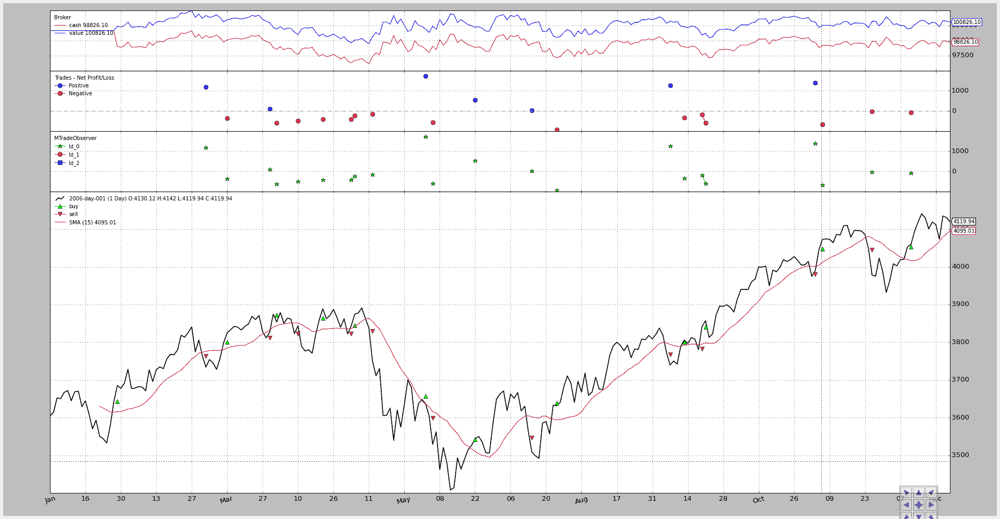
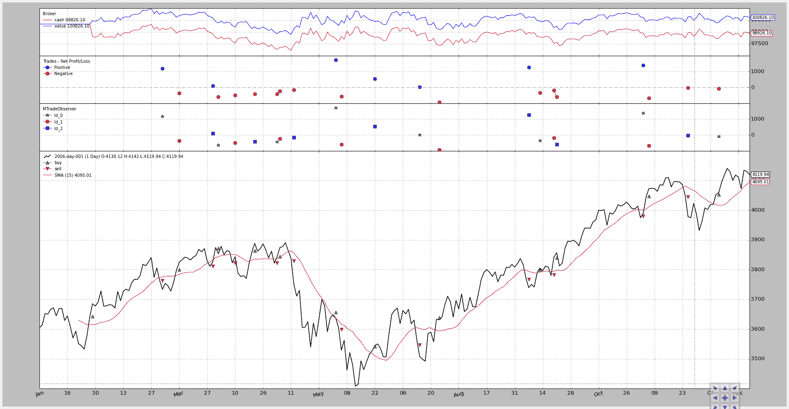

# MultiTrades

> 原文：[`www.backtrader.com/blog/posts/2015-10-05-multitrades/multitrades/`](https://www.backtrader.com/blog/posts/2015-10-05-multitrades/multitrades/)

现在可以为每笔交易添加唯一标识符，即使在相同数据上运行。

根据[Tick Data and Resampling](https://disqus.com/home/discussion/backtrader/tick_data_and_resampling/?utm_source=digest&utm_medium=email&utm_content=replies)的请求，在`backtrader`的 1.1.12.88 版本中支持“MultiTrades”，即：为订单分配`tradeid`的能力。此 id 传递给`Trades`，使得可以拥有不同类别的交易并同时开放。

当：

+   使用带有关键字参数`tradeid`的 Calling Strategy.buy/sell/close

+   使用带有关键字参数`tradeid`的 Calling Broker.buy/sell

+   创建带有关键字参数`tradeid`的订单实例

如果未指定，默认值为：

+   `tradeid = 0`

已实现了一个小脚本进行测试，通过实现自定义的`MTradeObserver`来可视化结果，根据`tradeid`分配不同的标记在图表上（测试值使用 0、1 和 2）

该脚本支持使用三个 id（0、1、2）或仅使用 0（默认值）

未启用多个 id 的执行：

```py
`$ ./multitrades.py --plot` 
```

结果图表显示所有交易都携带 id `0`，因此无法区分。



第二次执行通过在 0、1 和 2 之间循环实现多交易：

```py
`$ ./multitrades.py --plot --mtrade` 
```

现在 3 个不同的标记交替显示，每个交易都可以使用`tradeid`成员进行区分。



注意

`backtrader`尝试使用模拟现实的模型。因此，“交易”不是由仅负责订单的`Broker`实例计算的。

交易由策略计算。

因此，`tradeid`（或类似的内容）可能不会被真实经纪人支持，在这种情况下，需要手动跟踪经纪人分配的唯一订单 id。

现在，自定义观察者的代码

```py
`from __future__ import (absolute_import, division, print_function,
                        unicode_literals)

import math

import backtrader as bt

class MTradeObserver(bt.observer.Observer):
    lines = ('Id_0', 'Id_1', 'Id_2')

    plotinfo = dict(plot=True, subplot=True, plotlinelabels=True)

    plotlines = dict(
        Id_0=dict(marker='*', markersize=8.0, color='lime', fillstyle='full'),
        Id_1=dict(marker='o', markersize=8.0, color='red', fillstyle='full'),
        Id_2=dict(marker='s', markersize=8.0, color='blue', fillstyle='full')
    )

    def next(self):
        for trade in self._owner._tradespending:

            if trade.data is not self.data:
                continue

            if not trade.isclosed:
                continue

            self.lines[trade.tradeid][0] = trade.pnlcomm` 
```

主要脚本用法：

```py
`$ ./multitrades.py --help
usage: multitrades.py [-h] [--data DATA] [--fromdate FROMDATE]
                      [--todate TODATE] [--mtrade] [--period PERIOD]
                      [--onlylong] [--cash CASH] [--comm COMM] [--mult MULT]
                      [--margin MARGIN] [--stake STAKE] [--plot]
                      [--numfigs NUMFIGS]

MultiTrades

optional arguments:
  -h, --help            show this help message and exit
  --data DATA, -d DATA  data to add to the system
  --fromdate FROMDATE, -f FROMDATE
                        Starting date in YYYY-MM-DD format
  --todate TODATE, -t TODATE
                        Starting date in YYYY-MM-DD format
  --mtrade              Activate MultiTrade Ids
  --period PERIOD       Period to apply to the Simple Moving Average
  --onlylong, -ol       Do only long operations
  --cash CASH           Starting Cash
  --comm COMM           Commission for operation
  --mult MULT           Multiplier for futures
  --margin MARGIN       Margin for each future
  --stake STAKE         Stake to apply in each operation
  --plot, -p            Plot the read data
  --numfigs NUMFIGS, -n NUMFIGS
                        Plot using numfigs figures` 
```

脚本的代码。

```py
`from __future__ import (absolute_import, division, print_function,
                        unicode_literals)

import argparse
import datetime
import itertools

# The above could be sent to an independent module
import backtrader as bt
import backtrader.feeds as btfeeds
import backtrader.indicators as btind

import mtradeobserver

class MultiTradeStrategy(bt.Strategy):
    '''This strategy buys/sells upong the close price crossing
    upwards/downwards a Simple Moving Average.

    It can be a long-only strategy by setting the param "onlylong" to True
    '''
    params = dict(
        period=15,
        stake=1,
        printout=False,
        onlylong=False,
        mtrade=False,
    )

    def log(self, txt, dt=None):
        if self.p.printout:
            dt = dt or self.data.datetime[0]
            dt = bt.num2date(dt)
            print('%s, %s' % (dt.isoformat(), txt))

    def __init__(self):
        # To control operation entries
        self.order = None

        # Create SMA on 2nd data
        sma = btind.MovAv.SMA(self.data, period=self.p.period)
        # Create a CrossOver Signal from close an moving average
        self.signal = btind.CrossOver(self.data.close, sma)

        # To alternate amongst different tradeids
        if self.p.mtrade:
            self.tradeid = itertools.cycle([0, 1, 2])
        else:
            self.tradeid = itertools.cycle([0])

    def next(self):
        if self.order:
            return  # if an order is active, no new orders are allowed

        if self.signal > 0.0:  # cross upwards
            if self.position:
                self.log('CLOSE SHORT , %.2f' % self.data.close[0])
                self.close(tradeid=self.curtradeid)

            self.log('BUY CREATE , %.2f' % self.data.close[0])
            self.curtradeid = next(self.tradeid)
            self.buy(size=self.p.stake, tradeid=self.curtradeid)

        elif self.signal < 0.0:
            if self.position:
                self.log('CLOSE LONG , %.2f' % self.data.close[0])
                self.close(tradeid=self.curtradeid)

            if not self.p.onlylong:
                self.log('SELL CREATE , %.2f' % self.data.close[0])
                self.curtradeid = next(self.tradeid)
                self.sell(size=self.p.stake, tradeid=self.curtradeid)

    def notify_order(self, order):
        if order.status in [bt.Order.Submitted, bt.Order.Accepted]:
            return  # Await further notifications

        if order.status == order.Completed:
            if order.isbuy():
                buytxt = 'BUY COMPLETE, %.2f' % order.executed.price
                self.log(buytxt, order.executed.dt)
            else:
                selltxt = 'SELL COMPLETE, %.2f' % order.executed.price
                self.log(selltxt, order.executed.dt)

        elif order.status in [order.Expired, order.Canceled, order.Margin]:
            self.log('%s ,' % order.Status[order.status])
            pass  # Simply log

        # Allow new orders
        self.order = None

    def notify_trade(self, trade):
        if trade.isclosed:
            self.log('TRADE PROFIT, GROSS %.2f, NET %.2f' %
                     (trade.pnl, trade.pnlcomm))

        elif trade.justopened:
            self.log('TRADE OPENED, SIZE %2d' % trade.size)

def runstrategy():
    args = parse_args()

    # Create a cerebro
    cerebro = bt.Cerebro()

    # Get the dates from the args
    fromdate = datetime.datetime.strptime(args.fromdate, '%Y-%m-%d')
    todate = datetime.datetime.strptime(args.todate, '%Y-%m-%d')

    # Create the 1st data
    data = btfeeds.BacktraderCSVData(
        dataname=args.data,
        fromdate=fromdate,
        todate=todate)

    # Add the 1st data to cerebro
    cerebro.adddata(data)

    # Add the strategy
    cerebro.addstrategy(MultiTradeStrategy,
                        period=args.period,
                        onlylong=args.onlylong,
                        stake=args.stake,
                        mtrade=args.mtrade)

    # Add the commission - only stocks like a for each operation
    cerebro.broker.setcash(args.cash)

    # Add the commission - only stocks like a for each operation
    cerebro.broker.setcommission(commission=args.comm,
                                 mult=args.mult,
                                 margin=args.margin)

    # Add the MultiTradeObserver
    cerebro.addobserver(mtradeobserver.MTradeObserver)

    # And run it
    cerebro.run()

    # Plot if requested
    if args.plot:
        cerebro.plot(numfigs=args.numfigs, volume=False, zdown=False)

def parse_args():
    parser = argparse.ArgumentParser(description='MultiTrades')

    parser.add_argument('--data', '-d',
                        default='../../datas/2006-day-001.txt',
                        help='data to add to the system')

    parser.add_argument('--fromdate', '-f',
                        default='2006-01-01',
                        help='Starting date in YYYY-MM-DD format')

    parser.add_argument('--todate', '-t',
                        default='2006-12-31',
                        help='Starting date in YYYY-MM-DD format')

    parser.add_argument('--mtrade', action='store_true',
                        help='Activate MultiTrade Ids')

    parser.add_argument('--period', default=15, type=int,
                        help='Period to apply to the Simple Moving Average')

    parser.add_argument('--onlylong', '-ol', action='store_true',
                        help='Do only long operations')

    parser.add_argument('--cash', default=100000, type=int,
                        help='Starting Cash')

    parser.add_argument('--comm', default=2, type=float,
                        help='Commission for operation')

    parser.add_argument('--mult', default=10, type=int,
                        help='Multiplier for futures')

    parser.add_argument('--margin', default=2000.0, type=float,
                        help='Margin for each future')

    parser.add_argument('--stake', default=1, type=int,
                        help='Stake to apply in each operation')

    parser.add_argument('--plot', '-p', action='store_true',
                        help='Plot the read data')

    parser.add_argument('--numfigs', '-n', default=1,
                        help='Plot using numfigs figures')

    return parser.parse_args()

if __name__ == '__main__':
    runstrategy()` 
```
