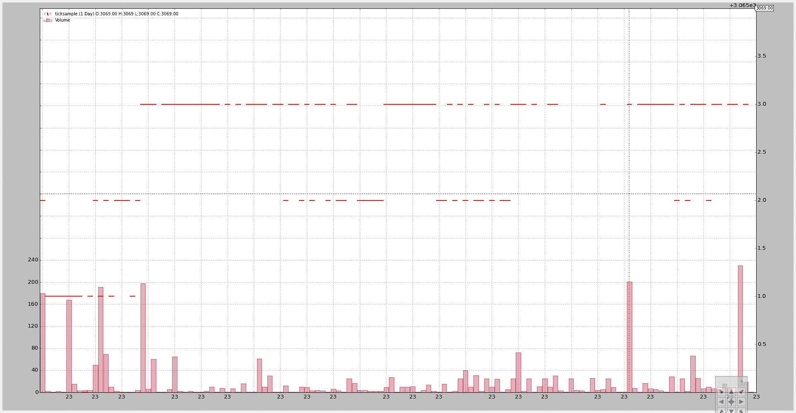
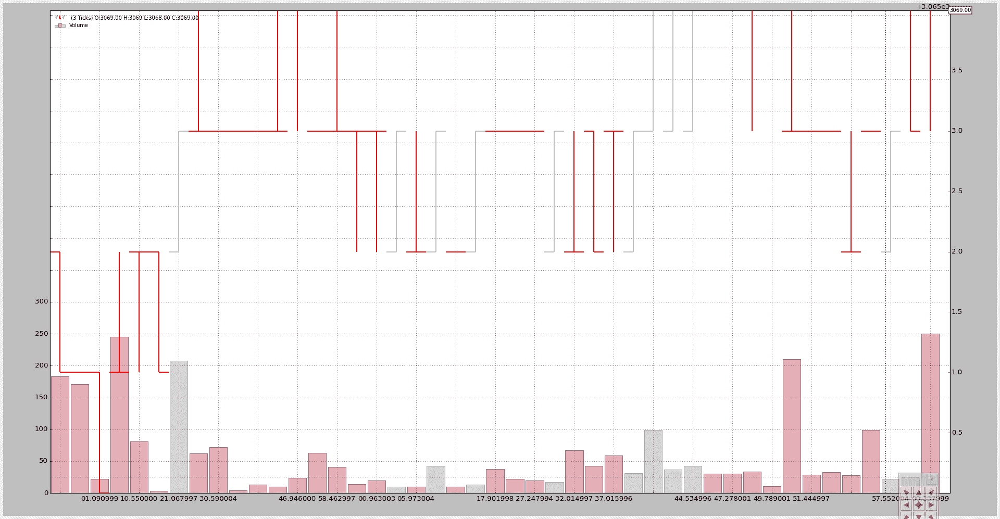
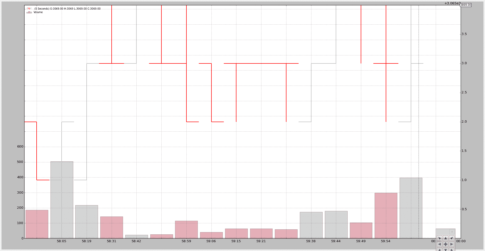
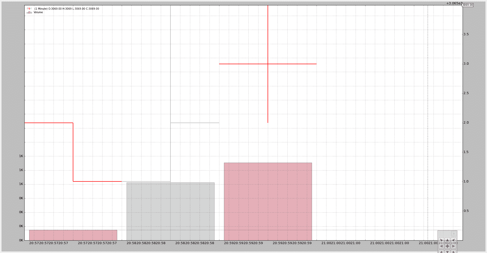

# Tick 数据和重新取样

> 原文：[`www.backtrader.com/blog/posts/2015-09-25-tickdata-resample/resample-tickdata/`](https://www.backtrader.com/blog/posts/2015-09-25-tickdata-resample/resample-tickdata/)

backtrader 已经能够从分钟数据进行重新取样。接受 tick 数据并不是问题，只需将 4 个常用字段（open、high、low、close）设置为 tick 值即可。

但是将要重新取样的 tick 数据传递给产生了相同的数据。从 1.1.11.88 版本开始不再是这样。现在

+   TimeFrame（backtrader.TimeFrame）已经扩展，包含了“Ticks”、“MicroSeconds”和“Seconds”的常量和名称。

+   重新取样可以管理这 3 个前述的时间框架并将其取样。

注意

因为 tick 数据是最低可能的时间框架，它实际上可以被“压缩”（n bars to 1 bar），但不能从最小的时间框架进行取样。

新版本包含了一个小的`tickdata.csv`样本，添加到了源数据中，以及一个新的样本脚本`resample-tickdata.py`来进行测试。

注意

更新了脚本以使用新的`Cerebro.resampledata`方法，避免了手动实例化`backtrader.DataResampler`的需要

默认执行不会触及数据：

```py
`$ ./resample-tickdata.py` 
```

生成这个图表：



将 3 个 tick 压缩为 1 个：

```py
`$ ./resample-tickdata.py --timeframe ticks --compression 3` 
```

生成这个图表：



压缩后，我们不再有单个的“ticks”，而是“bars”。

现在压缩到秒和 5 个 bar 的压缩：

```py
`$ ./resample-tickdata.py --timeframe seconds --compression 5` 
```

通过一个新的图表：



最后转换为分钟。样本数据包含来自 4 个不同分钟的 tick 数据（文件中的最后一个 tick 是第 4 分钟的唯一一个 tick）：

```py
`$ ./resample-tickdata.py --timeframe minutes` 
```

使用 4 个 bar（顶部可以看到最终价格为 3069）。第 4 个 bar 是一个单点，因为这一分钟文件中只有一个 tick。



脚本用法：

```py
`$ ./resample-tickdata.py --help
usage: resample-tickdata.py [-h] [--dataname DATANAME]
                            [--timeframe {ticks,microseconds,seconds,minutes,daily,weekly,monthly}]
                            [--compression COMPRESSION]

Resampling script down to tick data

optional arguments:
  -h, --help            show this help message and exit
  --dataname DATANAME   File Data to Load
  --timeframe {ticks,microseconds,seconds,minutes,daily,weekly,monthly}
                        Timeframe to resample to
  --compression COMPRESSION
                        Compress n bars into 1` 
```

以及代码。

```py
`from __future__ import (absolute_import, division, print_function,
                        unicode_literals)

import argparse

import backtrader as bt
import backtrader.feeds as btfeeds

def runstrat():
    args = parse_args()

    # Create a cerebro entity
    cerebro = bt.Cerebro(stdstats=False)

    # Add a strategy
    cerebro.addstrategy(bt.Strategy)

    # Load the Data
    datapath = args.dataname or '../../datas/ticksample.csv'

    data = btfeeds.GenericCSVData(
        dataname=datapath,
        dtformat='%Y-%m-%dT%H:%M:%S.%f',
        timeframe=bt.TimeFrame.Ticks,
    )

    # Handy dictionary for the argument timeframe conversion
    tframes = dict(
        ticks=bt.TimeFrame.Ticks,
        microseconds=bt.TimeFrame.MicroSeconds,
        seconds=bt.TimeFrame.Seconds,
        minutes=bt.TimeFrame.Minutes,
        daily=bt.TimeFrame.Days,
        weekly=bt.TimeFrame.Weeks,
        monthly=bt.TimeFrame.Months)

    # Resample the data
    data = cerebro.resampledata(data,
                                timeframe=tframes[args.timeframe],
                                compression=args.compression)

    # add a writer
    cerebro.addwriter(bt.WriterFile, csv=True)

    # Run over everything
    cerebro.run()

    # Plot the result
    cerebro.plot(style='bar')

def parse_args():
    parser = argparse.ArgumentParser(
        description='Resampling script down to tick data')

    parser.add_argument('--dataname', default='', required=False,
                        help='File Data to Load')

    parser.add_argument('--timeframe', default='ticks', required=False,
                        choices=['ticks', 'microseconds', 'seconds',
                                 'minutes', 'daily', 'weekly', 'monthly'],
                        help='Timeframe to resample to')

    parser.add_argument('--compression', default=1, required=False, type=int,
                        help=('Compress n bars into 1'))

    return parser.parse_args()

if __name__ == '__main__':
    runstrat()` 
```
