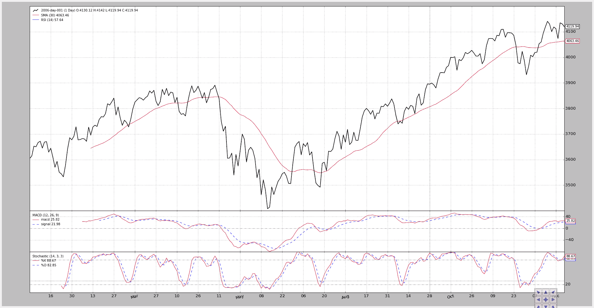
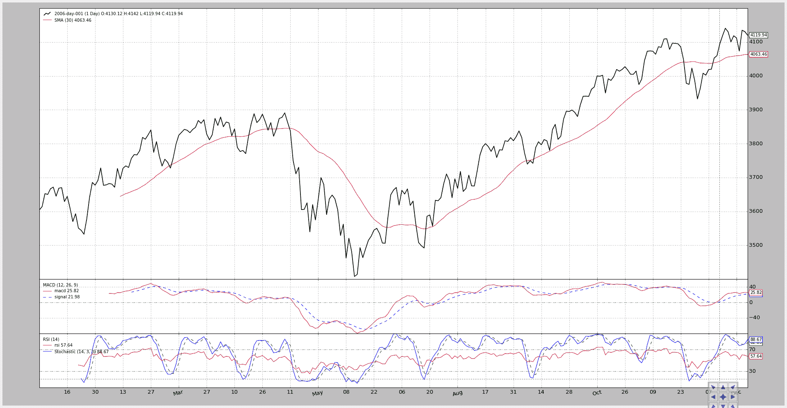

# 在同一轴线上绘图。

> 原文：[`www.backtrader.com/blog/posts/2015-09-21-plotting-same-axis/plotting-same-axis/`](https://www.backtrader.com/blog/posts/2015-09-21-plotting-same-axis/plotting-same-axis/)

根据博客上的评论稍微增加了一点（幸运的是只是几行代码）来进行绘图。

+   能够在任何其他指标上绘制任何指标。

一个潜在的用例：

+   节省宝贵的屏幕空间，将一些指标绘制在一起，有更多的空间来欣赏 OHLC 柱状图。

    示例：将 Stochastic 和 RSI 绘图合并。

当然，有些事情必须考虑进去：

+   如果指标的缩放差异太大，一些指标可能不可见。

    示例：一个围绕 0.0 加/减 0.5 波动的 MACD 绘制在一个横跨 0-100 范围的 Stochastic 上。

第一个实现在提交的开发分支上是 […14252c6](https://github.com/mementum/backtrader/commit/6991c0995ddc5097ccd14bffef91d5c8114252c6)

一个示例脚本（见下面的完整代码）让我们看到了效果。

注意

因为示例策略什么都不做，标准观察者被移除了，除非通过命令行开关激活。

首先，脚本在没有任何开关的情况下运行。

+   简单移动平均线绘制在数据上。

+   MACD、Stochastic 和 RSI 分别绘制在各自的轴线/子图上。

执行：

```py
$ ./plot-same-axis.py
```

和图表。


第二次执行改变了全景：

+   简单移动平均线移动到了一个子图上。

+   MACD 被隐藏了。

+   RSI 绘制在 Stochastic 之上（y 轴范围兼容：0-100）。

    这通过将指标的`plotinfo.plotmaster`值设置为要绘制到的其他指标来实现。

    在这种情况下，由于`__init__`中的局部变量被命名为`stoc`代表 Stochastic 和`rsi`代表 RSI，看起来像是：

    ```py
    `rsi.plotinfo.plotmaster = stoc` 
    ```

执行：

```py
$ ./plot-same-axis.py --smasubplot --nomacdplot --rsioverstoc
```

图表。


为了检查尺度的不兼容性，让我们尝试在 SMA 上绘制 RSI：

```py
$ ./plot-same-axis.py --rsiovermacd
```

图表。



RSI 标签显示出数据和 SMA，但是尺度在 3400-4200 范围内，因此……RSI 没有任何迹象。

进一步的徒劳尝试是将 SMA 放在一个子图上，然后再次在 SMA 上绘制 RSI。

$ ./plot-same-axis.py –rsiovermacd –smasubplot

图表。


标签清晰，但是除了 SMA 图中底部的一条淡蓝线外，RSI 的所有东西都消失了。

注意

添加了在另一个指标上绘制的多行指标。

沿着另一个方向，让我们在另一个指标上绘制多行指标。让我们将 Stochastic 绘制在 RSI 上：

```py
$ ./plot-same-axis.py --stocrsi
```



它有效。`Stochastic`标签显示出来了，`K%`和`D%`这两条线也是如此。但是这些线没有“名称”，因为我们得到了指标的名称。

在代码中，当前的设置将是：

```py
stoc.plotinfo.plotmaster = rsi
```

要显示随机线的名称而不是名称，我们还需要：

```py
stoc.plotinfo.plotlinelabels = True
```

这已经被参数化，新的执行结果显示如下：

```py
$ ./plot-same-axis.py --stocrsi --stocrsilabels
```

现在图表显示了随机线的名称在 RSI 线的名称下方。


脚本用法：

```py
$ ./plot-same-axis.py --help
usage: plot-same-axis.py [-h] [--data DATA] [--fromdate FROMDATE]
                         [--todate TODATE] [--stdstats] [--smasubplot]
                         [--nomacdplot]
                         [--rsioverstoc | --rsioversma | --stocrsi]
                         [--stocrsilabels] [--numfigs NUMFIGS]

Plotting Example

optional arguments:
  -h, --help            show this help message and exit
  --data DATA, -d DATA  data to add to the system
  --fromdate FROMDATE, -f FROMDATE
                        Starting date in YYYY-MM-DD format
  --todate TODATE, -t TODATE
                        Starting date in YYYY-MM-DD format
  --stdstats, -st       Show standard observers
  --smasubplot, -ss     Put SMA on own subplot/axis
  --nomacdplot, -nm     Hide the indicator from the plot
  --rsioverstoc, -ros   Plot the RSI indicator on the Stochastic axis
  --rsioversma, -rom    Plot the RSI indicator on the SMA axis
  --stocrsi, -strsi     Plot the Stochastic indicator on the RSI axis
  --stocrsilabels       Plot line names instead of indicator name
  --numfigs NUMFIGS, -n NUMFIGS
                        Plot using numfigs figures
```

以及代码。

```py
from __future__ import (absolute_import, division, print_function,
                        unicode_literals)

import argparse
import datetime

# The above could be sent to an independent module
import backtrader as bt
import backtrader.feeds as btfeeds
import backtrader.indicators as btind

class PlotStrategy(bt.Strategy):
    '''
    The strategy does nothing but create indicators for plotting purposes
    '''
    params = dict(
        smasubplot=False,  # default for Moving averages
        nomacdplot=False,
        rsioverstoc=False,
        rsioversma=False,
        stocrsi=False,
        stocrsilabels=False,
    )

    def __init__(self):
        sma = btind.SMA(subplot=self.params.smasubplot)

        macd = btind.MACD()
        # In SMA we passed plot directly as kwarg, here the plotinfo.plot
        # attribute is changed - same effect
        macd.plotinfo.plot = not self.params.nomacdplot

        # Let's put rsi on stochastic/sma or the other way round
        stoc = btind.Stochastic()
        rsi = btind.RSI()
        if self.params.stocrsi:
            stoc.plotinfo.plotmaster = rsi
            stoc.plotinfo.plotlinelabels = self.p.stocrsilabels
        elif self.params.rsioverstoc:
            rsi.plotinfo.plotmaster = stoc
        elif self.params.rsioversma:
            rsi.plotinfo.plotmaster = sma

def runstrategy():
    args = parse_args()

    # Create a cerebro
    cerebro = bt.Cerebro()

    # Get the dates from the args
    fromdate = datetime.datetime.strptime(args.fromdate, '%Y-%m-%d')
    todate = datetime.datetime.strptime(args.todate, '%Y-%m-%d')

    # Create the 1st data
    data = btfeeds.BacktraderCSVData(
        dataname=args.data,
        fromdate=fromdate,
        todate=todate)

    # Add the 1st data to cerebro
    cerebro.adddata(data)

    # Add the strategy
    cerebro.addstrategy(PlotStrategy,
                        smasubplot=args.smasubplot,
                        nomacdplot=args.nomacdplot,
                        rsioverstoc=args.rsioverstoc,
                        rsioversma=args.rsioversma,
                        stocrsi=args.stocrsi,
                        stocrsilabels=args.stocrsilabels)

    # And run it
    cerebro.run(stdstats=args.stdstats)

    # Plot
    cerebro.plot(numfigs=args.numfigs, volume=False)

def parse_args():
    parser = argparse.ArgumentParser(description='Plotting Example')

    parser.add_argument('--data', '-d',
                        default='../../datas/2006-day-001.txt',
                        help='data to add to the system')

    parser.add_argument('--fromdate', '-f',
                        default='2006-01-01',
                        help='Starting date in YYYY-MM-DD format')

    parser.add_argument('--todate', '-t',
                        default='2006-12-31',
                        help='Starting date in YYYY-MM-DD format')

    parser.add_argument('--stdstats', '-st', action='store_true',
                        help='Show standard observers')

    parser.add_argument('--smasubplot', '-ss', action='store_true',
                        help='Put SMA on own subplot/axis')

    parser.add_argument('--nomacdplot', '-nm', action='store_true',
                        help='Hide the indicator from the plot')

    group = parser.add_mutually_exclusive_group(required=False)

    group.add_argument('--rsioverstoc', '-ros', action='store_true',
                       help='Plot the RSI indicator on the Stochastic axis')

    group.add_argument('--rsioversma', '-rom', action='store_true',
                       help='Plot the RSI indicator on the SMA axis')

    group.add_argument('--stocrsi', '-strsi', action='store_true',
                       help='Plot the Stochastic indicator on the RSI axis')

    parser.add_argument('--stocrsilabels', action='store_true',
                        help='Plot line names instead of indicator name')

    parser.add_argument('--numfigs', '-n', default=1,
                        help='Plot using numfigs figures')

    return parser.parse_args()

if __name__ == '__main__':
    runstrategy()
```
