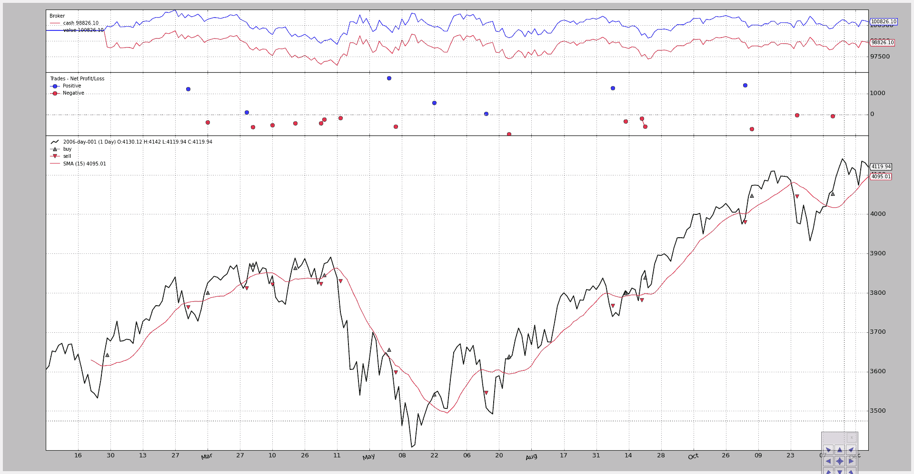
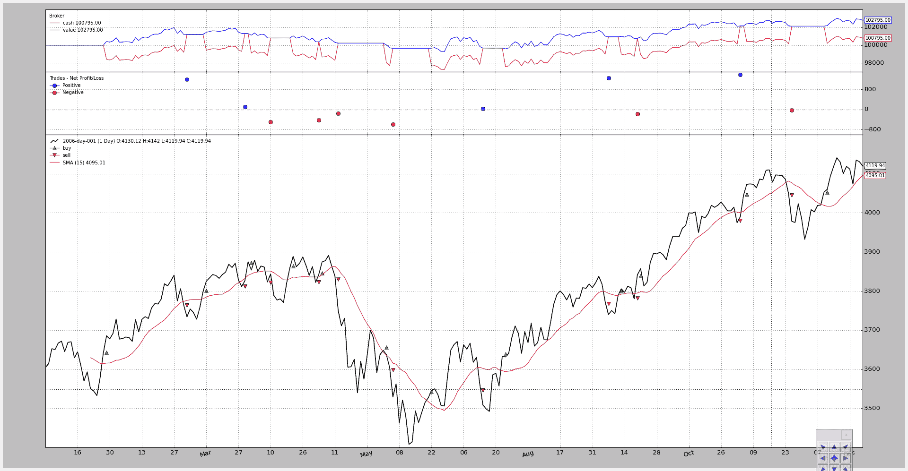

# Writers - 写下来

> 原文：[`www.backtrader.com/blog/posts/2015-09-14-write-it-down/write-it-down/`](https://www.backtrader.com/blog/posts/2015-09-14-write-it-down/write-it-down/)

随着 1.1.7.88 版本的发布，backtrader 增加了一个新的功能：writers

这可能是早该做的事情，应该一直都有，并且在[问题＃14](https://github.com/mementum/backtrader/issues/14)的讨论中也应该促进了发展。

迟做总比不做好。

`Writer`实现试图与`backtrader`环境中的其他对象保持一致

+   添加到 Cerebro

+   提供最合理的默认值

+   不要强迫用户做太多事情

当然，更重要的是理解写手实际上写了什么。 这就是：

+   CSV 输出

    ```py
    `- `datas` added to the system (can be switched off)

    - `strategies` (a Strategy can have named lines)

    - `indicators` inside the strategies (only 1st level)

    - `observers` inside the strategies (only 1st level)

    Which `indicators` and `observers` output data to the CSV stream is
    controlled by the attribute:

      `csv` in each instance

    The defaults are:

      - Observers have `csv = True`

      - Indicators have `csv = False`

    The value can be overriden for any instance created inside a strategy` 
    ```

一旦回测阶段结束，`Writers`为`Cerebro`实例添加一个新的部分，并添加以下子部分：

+   系统中`datas`的属性（名称、压缩、时间框架）

+   系统中`strategies`的属性（行、参数）

    +   策略中`indicators`的属性（行、参数）

    +   策略中`observers`的属性（行、参数）

    +   具有以下特性的分析器

    +   参数

    +   分析

在考虑所有这些的同时，一个例子可能是展示`writers`的功能（或弱点）的最简单方法。

但是在了解如何将它们添加到 cerebro 之前。

1.  使用`writer`参数到`cerebro`：

    ```py
    `cerebro = bt.Cerebro(writer=True)` 
    ```

    这创建了一个默认实例。

1.  具体添加：

    ```py
    `cerebro = bt.Cerebro()

    cerebro.addwriter(bt.WriterFile, csv=False)` 
    ```

    添加（现在是唯一的作者）一个`WriterFile`类到作者列表中，稍后用`csv=False`实例化（输出中不会生成 csv 流。

具有**多空**策略的长期示例（请参阅下面的完整代码），使用 Close-SMA 交叉作为信号进行执行：

```py
$ ./writer-test.py
```

图表：



具有以下输出：

```py
===============================================================================
Cerebro:
  -----------------------------------------------------------------------------
  - Datas:
    +++++++++++++++++++++++++++++++++++++++++++++++++++++++++++++++++++++++++++
    - Data0:
      - Name: 2006-day-001
      - Timeframe: Days
      - Compression: 1
  -----------------------------------------------------------------------------
  - Strategies:
    +++++++++++++++++++++++++++++++++++++++++++++++++++++++++++++++++++++++++++
    - LongShortStrategy:
      *************************************************************************
      - Params:
        - csvcross: False
        - printout: False
        - onlylong: False
        - stake: 1
        - period: 15
      *************************************************************************
      - Indicators:
        .......................................................................
        - SMA:
          - Lines: sma
          ~~~~~~~~~~~~~~~~~~~~~~~~~~~~~~~~~~~~~~~~~~~~~~~~~~~~~~~~~~~~~~~~~~~~~
          - Params:
            - period: 15
        .......................................................................
        - CrossOver:
          - Lines: crossover
          - Params: None
      *************************************************************************
      - Observers:
        .......................................................................
        - Broker:
          - Lines: cash, value
          - Params: None
        .......................................................................
        - BuySell:
          - Lines: buy, sell
          - Params: None
        .......................................................................
        - Trades:
          - Lines: pnlplus, pnlminus
          - Params: None
      *************************************************************************
      - Analyzers:
        .......................................................................
        - Value:
          - Begin: 100000
          - End: 100826.1
        .......................................................................
        - SQN:
          - Params: None
          ~~~~~~~~~~~~~~~~~~~~~~~~~~~~~~~~~~~~~~~~~~~~~~~~~~~~~~~~~~~~~~~~~~~~~
          - Analysis:
            - sqn: 0.05
            - trades: 22
```

运行后，我们有了一个完整的摘要，显示系统的设置以及分析器的意见。 在这种情况下，分析器是

+   `Value`是策略内部的一个虚拟分析器，它收集了组合的起始值和结束值

+   `SQN`（或 SystemQualityNumber）由 Van K. Tharp 定义（增加到`backtrader` 1.1.7.88，告诉我们它已经看到了 22 笔交易，并且计算了`sqn`为 0.05。

    这实际上相当低。 我们本可以通过观察完整一年后的微薄利润来发现这一点（幸运的是，系统不会亏损）

测试脚本允许我们调整策略以变为**仅多头**：

```py
$ ./writer-test.py --onlylong --plot
```

图表：



现在的输出是：

```py
===============================================================================
Cerebro:
  -----------------------------------------------------------------------------
  - Datas:
    +++++++++++++++++++++++++++++++++++++++++++++++++++++++++++++++++++++++++++
    - Data0:
      - Name: 2006-day-001
      - Timeframe: Days
      - Compression: 1
  -----------------------------------------------------------------------------
  - Strategies:
    +++++++++++++++++++++++++++++++++++++++++++++++++++++++++++++++++++++++++++
    - LongShortStrategy:
      *************************************************************************
      - Params:
        - csvcross: False
        - printout: False
        - onlylong: True
        - stake: 1
        - period: 15
      *************************************************************************
      - Indicators:
        .......................................................................
        - SMA:
          - Lines: sma
          ~~~~~~~~~~~~~~~~~~~~~~~~~~~~~~~~~~~~~~~~~~~~~~~~~~~~~~~~~~~~~~~~~~~~~
          - Params:
            - period: 15
        .......................................................................
        - CrossOver:
          - Lines: crossover
          - Params: None
      *************************************************************************
      - Observers:
        .......................................................................
        - Broker:
          - Lines: cash, value
          - Params: None
        .......................................................................
        - BuySell:
          - Lines: buy, sell
          - Params: None
        .......................................................................
        - Trades:
          - Lines: pnlplus, pnlminus
          - Params: None
      *************************************************************************
      - Analyzers:
        .......................................................................
        - Value:
          - Begin: 100000
          - End: 102795.0
        .......................................................................
        - SQN:
          - Params: None
          ~~~~~~~~~~~~~~~~~~~~~~~~~~~~~~~~~~~~~~~~~~~~~~~~~~~~~~~~~~~~~~~~~~~~~
          - Analysis:
            - sqn: 0.91
            - trades: 11
```

“params”对策略的更改可见（onlylong 已转为 True），分析器讲述了一个不同的故事：

+   结束值从 100826.1 提高到 102795.0

+   SQN 看到的交易从 22 减少到 11

+   SQN 分数从 0.05 增长到 0.91，好得多得多

但是仍然看不到 CSV 输出。 让我们运行脚本来打开它：

```py
$ ./writer-test.py --onlylong --writercsv
```

带有更新的输出：

```py
===============================================================================
Id,2006-day-001,len,datetime,open,high,low,close,volume,openinterest,LongShortStrategy,len,Broker,len,cash,value,Buy
Sell,len,buy,sell,Trades,len,pnlplus,pnlminus
1,2006-day-001,1,2006-01-02 23:59:59+00:00,3578.73,3605.95,3578.73,3604.33,0.0,0.0,LongShortStrategy,1,Broker,1,1000
00.0,100000.0,BuySell,1,,,Trades,1,,
2,2006-day-001,2,2006-01-03 23:59:59+00:00,3604.08,3638.42,3601.84,3614.34,0.0,0.0,LongShortStrategy,2,Broker,2,1000
00.0,100000.0,BuySell,2,,,Trades,2,,
...
...
...
255,2006-day-001,255,2006-12-29 23:59:59+00:00,4130.12,4142.01,4119.94,4119.94,0.0,0.0,LongShortStrategy,255,Broker,255,100795.0,102795.0,BuySell,255,,,Trades,255,,
===============================================================================
Cerebro:
  -----------------------------------------------------------------------------
...
...
```

我们可以跳过大部分的 CSV 流和已经看过的摘要。CSV 流已经打印出以下内容

+   一个部分线分隔符在开头

+   一个标题行

+   相应的数据

注意每个对象的“长度”是如何被打印出来的。虽然在这种情况下它并没有提供太多信息，但如果使用了多时间框数据或者数据被重播，它将提供信息。

`writer` 的默认设置如下：

+   没有指标被打印出来（既没有简单移动平均线也没有交叉点）

+   观察者被打印出来

让我们运行脚本并附加一个参数，将 CrossOver 指示器添加到 CSV 流中：

```py
$ ./writer-test.py --onlylong --writercsv --csvcross
```

输出：

```py
===============================================================================
Id,2006-day-001,len,datetime,open,high,low,close,volume,openinterest,LongShortStrategy,len,CrossOver,len,crossover,B
roker,len,cash,value,BuySell,len,buy,sell,Trades,len,pnlplus,pnlminus
1,2006-day-001,1,2006-01-02 23:59:59+00:00,3578.73,3605.95,3578.73,3604.33,0.0,0.0,LongShortStrategy,1,CrossOver,1,,
Broker,1,100000.0,100000.0,BuySell,1,,,Trades,1,,
...
...
```

这展示了写入器的一些功能。该类的进一步文档仍然是一个待办事项。

与此同时是执行可能性和用于示例的代码。

用法：

```py
$ ./writer-test.py --help
usage: writer-test.py [-h] [--data DATA] [--fromdate FROMDATE]
                      [--todate TODATE] [--period PERIOD] [--onlylong]
                      [--writercsv] [--csvcross] [--cash CASH] [--comm COMM]
                      [--mult MULT] [--margin MARGIN] [--stake STAKE] [--plot]
                      [--numfigs NUMFIGS]

MultiData Strategy

optional arguments:
  -h, --help            show this help message and exit
  --data DATA, -d DATA  data to add to the system
  --fromdate FROMDATE, -f FROMDATE
                        Starting date in YYYY-MM-DD format
  --todate TODATE, -t TODATE
                        Starting date in YYYY-MM-DD format
  --period PERIOD       Period to apply to the Simple Moving Average
  --onlylong, -ol       Do only long operations
  --writercsv, -wcsv    Tell the writer to produce a csv stream
  --csvcross            Output the CrossOver signals to CSV
  --cash CASH           Starting Cash
  --comm COMM           Commission for operation
  --mult MULT           Multiplier for futures
  --margin MARGIN       Margin for each future
  --stake STAKE         Stake to apply in each operation
  --plot, -p            Plot the read data
  --numfigs NUMFIGS, -n NUMFIGS
                        Plot using numfigs figures
```

和测试脚本。

```py
from __future__ import (absolute_import, division, print_function,
                        unicode_literals)

import argparse
import datetime

# The above could be sent to an independent module
import backtrader as bt
import backtrader.feeds as btfeeds
import backtrader.indicators as btind
from backtrader.analyzers import SQN

class LongShortStrategy(bt.Strategy):
    '''This strategy buys/sells upong the close price crossing
    upwards/downwards a Simple Moving Average.

    It can be a long-only strategy by setting the param "onlylong" to True
    '''
    params = dict(
        period=15,
        stake=1,
        printout=False,
        onlylong=False,
        csvcross=False,
    )

    def start(self):
        pass

    def stop(self):
        pass

    def log(self, txt, dt=None):
        if self.p.printout:
            dt = dt or self.data.datetime[0]
            dt = bt.num2date(dt)
            print('%s, %s' % (dt.isoformat(), txt))

    def __init__(self):
        # To control operation entries
        self.orderid = None

        # Create SMA on 2nd data
        sma = btind.MovAv.SMA(self.data, period=self.p.period)
        # Create a CrossOver Signal from close an moving average
        self.signal = btind.CrossOver(self.data.close, sma)
        self.signal.csv = self.p.csvcross

    def next(self):
        if self.orderid:
            return  # if an order is active, no new orders are allowed

        if self.signal > 0.0:  # cross upwards
            if self.position:
                self.log('CLOSE SHORT , %.2f' % self.data.close[0])
                self.close()

            self.log('BUY CREATE , %.2f' % self.data.close[0])
            self.buy(size=self.p.stake)

        elif self.signal < 0.0:
            if self.position:
                self.log('CLOSE LONG , %.2f' % self.data.close[0])
                self.close()

            if not self.p.onlylong:
                self.log('SELL CREATE , %.2f' % self.data.close[0])
                self.sell(size=self.p.stake)

    def notify_order(self, order):
        if order.status in [bt.Order.Submitted, bt.Order.Accepted]:
            return  # Await further notifications

        if order.status == order.Completed:
            if order.isbuy():
                buytxt = 'BUY COMPLETE, %.2f' % order.executed.price
                self.log(buytxt, order.executed.dt)
            else:
                selltxt = 'SELL COMPLETE, %.2f' % order.executed.price
                self.log(selltxt, order.executed.dt)

        elif order.status in [order.Expired, order.Canceled, order.Margin]:
            self.log('%s ,' % order.Status[order.status])
            pass  # Simply log

        # Allow new orders
        self.orderid = None

    def notify_trade(self, trade):
        if trade.isclosed:
            self.log('TRADE PROFIT, GROSS %.2f, NET %.2f' %
                     (trade.pnl, trade.pnlcomm))

        elif trade.justopened:
            self.log('TRADE OPENED, SIZE %2d' % trade.size)

def runstrategy():
    args = parse_args()

    # Create a cerebro
    cerebro = bt.Cerebro()

    # Get the dates from the args
    fromdate = datetime.datetime.strptime(args.fromdate, '%Y-%m-%d')
    todate = datetime.datetime.strptime(args.todate, '%Y-%m-%d')

    # Create the 1st data
    data = btfeeds.BacktraderCSVData(
        dataname=args.data,
        fromdate=fromdate,
        todate=todate)

    # Add the 1st data to cerebro
    cerebro.adddata(data)

    # Add the strategy
    cerebro.addstrategy(LongShortStrategy,
                        period=args.period,
                        onlylong=args.onlylong,
                        csvcross=args.csvcross,
                        stake=args.stake)

    # Add the commission - only stocks like a for each operation
    cerebro.broker.setcash(args.cash)

    # Add the commission - only stocks like a for each operation
    cerebro.broker.setcommission(commission=args.comm,
                                 mult=args.mult,
                                 margin=args.margin)

    cerebro.addanalyzer(SQN)

    cerebro.addwriter(bt.WriterFile, csv=args.writercsv, rounding=2)

    # And run it
    cerebro.run()

    # Plot if requested
    if args.plot:
        cerebro.plot(numfigs=args.numfigs, volume=False, zdown=False)

def parse_args():
    parser = argparse.ArgumentParser(description='MultiData Strategy')

    parser.add_argument('--data', '-d',
                        default='../../datas/2006-day-001.txt',
                        help='data to add to the system')

    parser.add_argument('--fromdate', '-f',
                        default='2006-01-01',
                        help='Starting date in YYYY-MM-DD format')

    parser.add_argument('--todate', '-t',
                        default='2006-12-31',
                        help='Starting date in YYYY-MM-DD format')

    parser.add_argument('--period', default=15, type=int,
                        help='Period to apply to the Simple Moving Average')

    parser.add_argument('--onlylong', '-ol', action='store_true',
                        help='Do only long operations')

    parser.add_argument('--writercsv', '-wcsv', action='store_true',
                        help='Tell the writer to produce a csv stream')

    parser.add_argument('--csvcross', action='store_true',
                        help='Output the CrossOver signals to CSV')

    parser.add_argument('--cash', default=100000, type=int,
                        help='Starting Cash')

    parser.add_argument('--comm', default=2, type=float,
                        help='Commission for operation')

    parser.add_argument('--mult', default=10, type=int,
                        help='Multiplier for futures')

    parser.add_argument('--margin', default=2000.0, type=float,
                        help='Margin for each future')

    parser.add_argument('--stake', default=1, type=int,
                        help='Stake to apply in each operation')

    parser.add_argument('--plot', '-p', action='store_true',
                        help='Plot the read data')

    parser.add_argument('--numfigs', '-n', default=1,
                        help='Plot using numfigs figures')

    return parser.parse_args()

if __name__ == '__main__':
    runstrategy()
```
