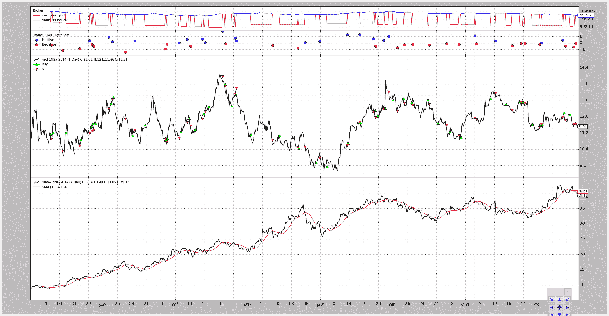

# 多数据策略

> 原文：[`www.backtrader.com/blog/posts/2015-09-03-multidata-strategy/multidata-strategy/`](https://www.backtrader.com/blog/posts/2015-09-03-multidata-strategy/multidata-strategy/)

因为世界上没有任何事物是孤立存在的，很可能购买某项资产的触发因素实际上是另一项资产。

使用不同的分析技术可能会发现两个不同数据之间的相关性。

backtrader 支持同时使用不同数据源，因此在大多数情况下可能会用于此目的。

让我们假设已经发现了以下公司之间的相关性：

+   `Oracle`

+   `Yahoo`

人们可以想象，当雅虎公司运营良好时，该公司会从 Oracle 购买更多服务器、更多数据库和更多专业服务，从而推动股价上涨。

因此，经过深入分析后制定了一项策略：

+   如果`Yahoo`的收盘价超过简单移动平均线（周期 15）

+   买入`Oracle`

退出头寸：

+   使用收盘价的下穿

订单执行类型：

+   市场

总结一下使用`backtrader`设置所需的内容：

+   创建一个`cerebro`

+   加载数据源 1（Oracle）并将其添加到 cerebro

+   加载数据源 2（Yahoo）并将其添加到 cerebro

+   加载我们设计的策略

策略的详细信息：

+   在数据源 2（Yahoo）上创建一个简单移动平均线

+   使用雅虎��收盘价和移动平均��创建一个 CrossOver 指标

然后按照上述描述在数据源 1（Oracle）上执行买入/卖出订单。

下面的脚本使用以下默认值：

+   Oracle（数据源 1）

+   雅虎（数据源 2）

+   现金：10000（系统默认值）

+   股份：10 股

+   佣金：每轮 0.5%（表示为 0.005）

+   周期：15 个交易日

+   周期：2003 年、2004 年和 2005 年

该脚本可以接受参数以修改上述设置，如帮助文本中所示：

```py
`$ ./multidata-strategy.py --help
usage: multidata-strategy.py [-h] [--data0 DATA0] [--data1 DATA1]
                             [--fromdate FROMDATE] [--todate TODATE]
                             [--period PERIOD] [--cash CASH]
                             [--commperc COMMPERC] [--stake STAKE] [--plot]
                             [--numfigs NUMFIGS]

MultiData Strategy

optional arguments:
  -h, --help            show this help message and exit
  --data0 DATA0, -d0 DATA0
                        1st data into the system
  --data1 DATA1, -d1 DATA1
                        2nd data into the system
  --fromdate FROMDATE, -f FROMDATE
                        Starting date in YYYY-MM-DD format
  --todate TODATE, -t TODATE
                        Starting date in YYYY-MM-DD format
  --period PERIOD       Period to apply to the Simple Moving Average
  --cash CASH           Starting Cash
  --commperc COMMPERC   Percentage commission for operation (0.005 is 0.5%
  --stake STAKE         Stake to apply in each operation
  --plot, -p            Plot the read data
  --numfigs NUMFIGS, -n NUMFIGS
                        Plot using numfigs figures` 
```

标准执行结果：

```py
`$ ./multidata-strategy.py
2003-02-11T23:59:59+00:00, BUY CREATE , 9.14
2003-02-12T23:59:59+00:00, BUY COMPLETE, 11.14
2003-02-12T23:59:59+00:00, SELL CREATE , 9.09
2003-02-13T23:59:59+00:00, SELL COMPLETE, 10.90
2003-02-14T23:59:59+00:00, BUY CREATE , 9.45
2003-02-18T23:59:59+00:00, BUY COMPLETE, 11.22
2003-03-06T23:59:59+00:00, SELL CREATE , 9.72
2003-03-07T23:59:59+00:00, SELL COMPLETE, 10.32
...
...
2005-12-22T23:59:59+00:00, BUY CREATE , 40.83
2005-12-23T23:59:59+00:00, BUY COMPLETE, 11.68
2005-12-23T23:59:59+00:00, SELL CREATE , 40.63
2005-12-27T23:59:59+00:00, SELL COMPLETE, 11.63
==================================================
Starting Value - 100000.00
Ending   Value - 99959.26
==================================================` 
```

经过两年的执行后，该策略：

+   损失了 40.74 货币单位

**至于雅虎和 Oracle 之间的相关性**

可视化输出（添加`--plot`以生成图表）



以及脚本（已添加到`backtrader`源分发的`samples/multidata-strategy`目录下。

```py
`from __future__ import (absolute_import, division, print_function,
                        unicode_literals)

import argparse
import datetime

# The above could be sent to an independent module
import backtrader as bt
import backtrader.feeds as btfeeds
import backtrader.indicators as btind

class MultiDataStrategy(bt.Strategy):
    '''
    This strategy operates on 2 datas. The expectation is that the 2 datas are
    correlated and the 2nd data is used to generate signals on the 1st

      - Buy/Sell Operationss will be executed on the 1st data
      - The signals are generated using a Simple Moving Average on the 2nd data
        when the close price crosses upwwards/downwards

    The strategy is a long-only strategy
    '''
    params = dict(
        period=15,
        stake=10,
        printout=True,
    )

    def log(self, txt, dt=None):
        if self.p.printout:
            dt = dt or self.data.datetime[0]
            dt = bt.num2date(dt)
            print('%s, %s' % (dt.isoformat(), txt))

    def notify_order(self, order):
        if order.status in [bt.Order.Submitted, bt.Order.Accepted]:
            return  # Await further notifications

        if order.status == order.Completed:
            if order.isbuy():
                buytxt = 'BUY COMPLETE, %.2f' % order.executed.price
                self.log(buytxt, order.executed.dt)
            else:
                selltxt = 'SELL COMPLETE, %.2f' % order.executed.price
                self.log(selltxt, order.executed.dt)

        elif order.status in [order.Expired, order.Canceled, order.Margin]:
            self.log('%s ,' % order.Status[order.status])
            pass  # Simply log

        # Allow new orders
        self.orderid = None

    def __init__(self):
        # To control operation entries
        self.orderid = None

        # Create SMA on 2nd data
        sma = btind.MovAv.SMA(self.data1, period=self.p.period)
        # Create a CrossOver Signal from close an moving average
        self.signal = btind.CrossOver(self.data1.close, sma)

    def next(self):
        if self.orderid:
            return  # if an order is active, no new orders are allowed

        if not self.position:  # not yet in market
            if self.signal > 0.0:  # cross upwards
                self.log('BUY CREATE , %.2f' % self.data1.close[0])
                self.buy(size=self.p.stake)

        else:  # in the market
            if self.signal < 0.0:  # crosss downwards
                self.log('SELL CREATE , %.2f' % self.data1.close[0])
                self.sell(size=self.p.stake)

    def stop(self):
        print('==================================================')
        print('Starting Value - %.2f' % self.broker.startingcash)
        print('Ending   Value - %.2f' % self.broker.getvalue())
        print('==================================================')

def runstrategy():
    args = parse_args()

    # Create a cerebro
    cerebro = bt.Cerebro()

    # Get the dates from the args
    fromdate = datetime.datetime.strptime(args.fromdate, '%Y-%m-%d')
    todate = datetime.datetime.strptime(args.todate, '%Y-%m-%d')

    # Create the 1st data
    data0 = btfeeds.YahooFinanceCSVData(
        dataname=args.data0,
        fromdate=fromdate,
        todate=todate)

    # Add the 1st data to cerebro
    cerebro.adddata(data0)

    # Create the 2nd data
    data1 = btfeeds.YahooFinanceCSVData(
        dataname=args.data1,
        fromdate=fromdate,
        todate=todate)

    # Add the 2nd data to cerebro
    cerebro.adddata(data1)

    # Add the strategy
    cerebro.addstrategy(MultiDataStrategy,
                        period=args.period,
                        stake=args.stake)

    # Add the commission - only stocks like a for each operation
    cerebro.broker.setcash(args.cash)

    # Add the commission - only stocks like a for each operation
    cerebro.broker.setcommission(commission=args.commperc)

    # And run it
    cerebro.run()

    # Plot if requested
    if args.plot:
        cerebro.plot(numfigs=args.numfigs, volume=False, zdown=False)

def parse_args():
    parser = argparse.ArgumentParser(description='MultiData Strategy')

    parser.add_argument('--data0', '-d0',
                        default='../../datas/orcl-1995-2014.txt',
                        help='1st data into the system')

    parser.add_argument('--data1', '-d1',
                        default='../../datas/yhoo-1996-2014.txt',
                        help='2nd data into the system')

    parser.add_argument('--fromdate', '-f',
                        default='2003-01-01',
                        help='Starting date in YYYY-MM-DD format')

    parser.add_argument('--todate', '-t',
                        default='2005-12-31',
                        help='Starting date in YYYY-MM-DD format')

    parser.add_argument('--period', default=15, type=int,
                        help='Period to apply to the Simple Moving Average')

    parser.add_argument('--cash', default=100000, type=int,
                        help='Starting Cash')

    parser.add_argument('--commperc', default=0.005, type=float,
                        help='Percentage commission for operation (0.005 is 0.5%%')

    parser.add_argument('--stake', default=10, type=int,
                        help='Stake to apply in each operation')

    parser.add_argument('--plot', '-p', action='store_true',
                        help='Plot the read data')

    parser.add_argument('--numfigs', '-n', default=1,
                        help='Plot using numfigs figures')

    return parser.parse_args()

if __name__ == '__main__':
    runstrategy()` 
```
