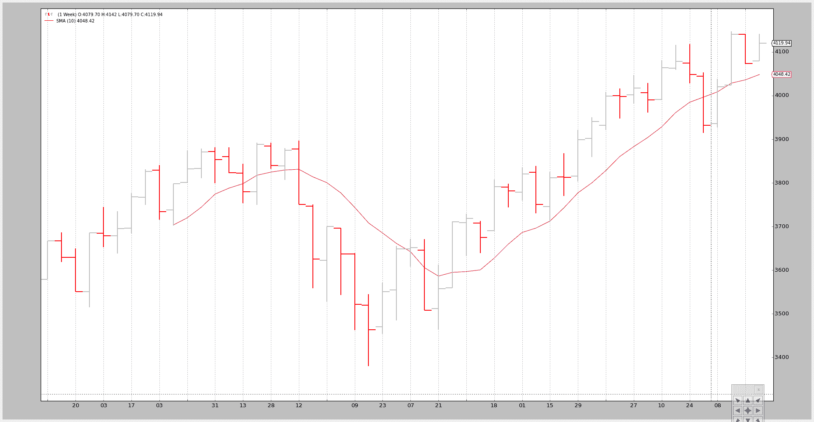
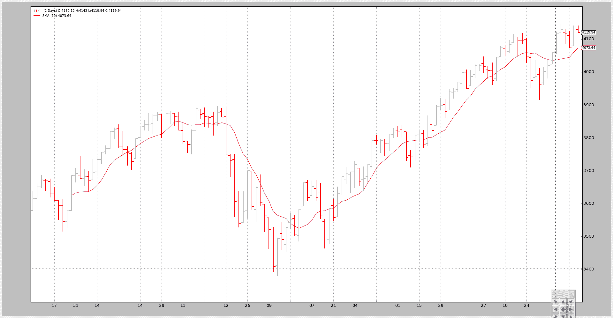

# 数据 - 重放

> 原文：[`www.backtrader.com/blog/posts/2015-08-25-data-replay/data-replay/`](https://www.backtrader.com/blog/posts/2015-08-25-data-replay/data-replay/)

时间已经过去，针对一个完全形成和关闭的柱状图测试策略是好的，但可以更好。

这就是*数据重放*的用武之地。如果：

+   策略在时间框架 X（例如：每日）上运行

和

+   较小时间框架 Y（例如：1 分钟）的数据可用

数据重放正如其名称所示：

```py
Replay a daily bar using the 1 minute data
```

当然，这并不是市场实际发展的方式，但比孤立地查看每日完整和关闭的柱状图要好得多：

```py
If the strategy operates in realtime during the formation of the daily bar,
the approximation of the formation of the bar gives a chance to replicate the
actual behavior of the strategy under real conditions
```

将*数据重放*付诸实践遵循`backtrader`的常规使用模式

+   加载数据源

+   将数据传递给`DataReplayer`，这是另一个将在加载的数据源上工作的数据源

+   将新的数据源传递给 cerebro

+   添加一个策略

+   然后运行... *禁用预加载**

注意

当数据被重放时，无法支持预加载，因为每个柱状图实际上是实时构建的。

为了演示，将在每周基础上重放标准的 2006 年日常数据。这意味着：

+   最终将有 52 个柱状图，每周一个

+   Cerebro 将总共调用`prenext`和`next` 255 次，这是每日柱状图的原始计数

技巧：

+   当每周柱状图形成时，策略的长度（`len(self)`）将保持不变。

+   每个新周，长度将增加一

以下是一些示例，但首先是测试脚本的源代码，其中加载数据并传递给重放器...并且使用`preload=False`来禁用预加载（强制）

```py
 `dataname=datapath)

    tframes = dict(
        daily=bt.TimeFrame.Days,
        weekly=bt.TimeFrame.Weeks,
        monthly=bt.TimeFrame.Months)

    # Handy dictionary for the argument timeframe conversion
    # Resample the data
    data_replayed = bt.DataReplayer(
        dataname=data,
        timeframe=tframes[args.timeframe],
        compression=args.compression)

    # First add the original data - smaller timeframe
    cerebro.adddata(data_replayed)

    # Run over everything
    cerebro.run(preload=False)
```

## 示例 - 将每日重放为每周

脚本的调用：

```py
$ ./data-replay.py --timeframe weekly --compression 1
```

不幸的是，图表无法向我们展示背景中发生的真实情况，因此让我们看看控制台输出：

```py
prenext len 1 - counter 1
prenext len 1 - counter 2
prenext len 1 - counter 3
prenext len 1 - counter 4
prenext len 1 - counter 5
prenext len 2 - counter 6
...
...
prenext len 9 - counter 44
prenext len 9 - counter 45
---next len 10 - counter 46
---next len 10 - counter 47
---next len 10 - counter 48
---next len 10 - counter 49
---next len 10 - counter 50
---next len 11 - counter 51
---next len 11 - counter 52
---next len 11 - counter 53
...
...
---next len 51 - counter 248
---next len 51 - counter 249
---next len 51 - counter 250
---next len 51 - counter 251
---next len 51 - counter 252
---next len 52 - counter 253
---next len 52 - counter 254
---next len 52 - counter 255
```

正如我们所看到的，内部的`self.counter`变量正在跟踪每次调用`prenext`或`next`。前者在应用简单移动平均产生值之前调用。后者在简单移动平均产生值时调用。

关键：

+   策略的长度（len(self)）每 5 个柱状图（每周 5 个交易日）发生变化

该策略实际上看到：

+   每周柱状图是如何在 5 次快照中发展的。

    再次强调，这并不复制市场的实际逐笔（甚至不是分钟、小时）发展，但比实际看到柱状图要好。

可视化输出是周线图表，这是系统正在进行测试的最终结果。



## 示例 2 - 每日到每日带压缩

当然，“重放”也可以应用于相同的时间框架，但具有压缩。

控制台：

```py
$ ./data-replay.py --timeframe daily --compression 2
prenext len 1 - counter 1
prenext len 1 - counter 2
prenext len 2 - counter 3
prenext len 2 - counter 4
prenext len 3 - counter 5
prenext len 3 - counter 6
prenext len 4 - counter 7
...
...
---next len 125 - counter 250
---next len 126 - counter 251
---next len 126 - counter 252
---next len 127 - counter 253
---next len 127 - counter 254
---next len 128 - counter 255
```

这次我们得到了预期的一半柱状图，因为请求的压缩因子为 2。

图表：



## 结论

可以对市场发展进行重建。通常会提供一组较小的时间范围数据，可以用来离散地重播系统运行的时间范围。

测试脚本。

```py
from __future__ import (absolute_import, division, print_function,
                        unicode_literals)

import argparse

import backtrader as bt
import backtrader.feeds as btfeeds
import backtrader.indicators as btind

class SMAStrategy(bt.Strategy):
    params = (
        ('period', 10),
        ('onlydaily', False),
    )

    def __init__(self):
        self.sma = btind.SMA(self.data, period=self.p.period)

    def start(self):
        self.counter = 0

    def prenext(self):
        self.counter += 1
        print('prenext len %d - counter %d' % (len(self), self.counter))

    def next(self):
        self.counter += 1
        print('---next len %d - counter %d' % (len(self), self.counter))

def runstrat():
    args = parse_args()

    # Create a cerebro entity
    cerebro = bt.Cerebro(stdstats=False)

    cerebro.addstrategy(
        SMAStrategy,
        # args for the strategy
        period=args.period,
    )

    # Load the Data
    datapath = args.dataname or '../datas/sample/2006-day-001.txt'
    data = btfeeds.BacktraderCSVData(
        dataname=datapath)

    tframes = dict(
        daily=bt.TimeFrame.Days,
        weekly=bt.TimeFrame.Weeks,
        monthly=bt.TimeFrame.Months)

    # Handy dictionary for the argument timeframe conversion
    # Resample the data
    data_replayed = bt.DataReplayer(
        dataname=data,
        timeframe=tframes[args.timeframe],
        compression=args.compression)

    # First add the original data - smaller timeframe
    cerebro.adddata(data_replayed)

    # Run over everything
    cerebro.run(preload=False)

    # Plot the result
    cerebro.plot(style='bar')

def parse_args():
    parser = argparse.ArgumentParser(
        description='Pandas test script')

    parser.add_argument('--dataname', default='', required=False,
                        help='File Data to Load')

    parser.add_argument('--timeframe', default='weekly', required=False,
                        choices=['daily', 'weekly', 'monhtly'],
                        help='Timeframe to resample to')

    parser.add_argument('--compression', default=1, required=False, type=int,
                        help='Compress n bars into 1')

    parser.add_argument('--period', default=10, required=False, type=int,
                        help='Period to apply to indicator')

    return parser.parse_args()

if __name__ == '__main__':
    runstrat()
```
