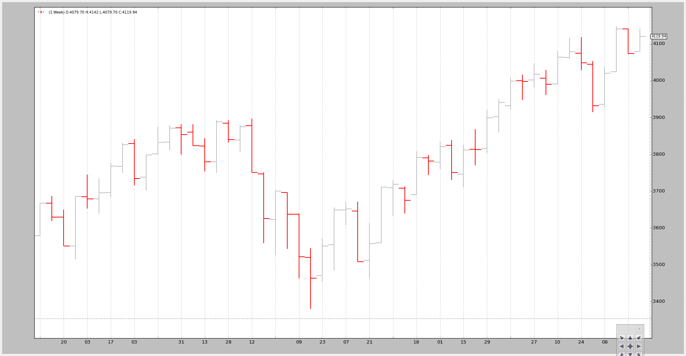
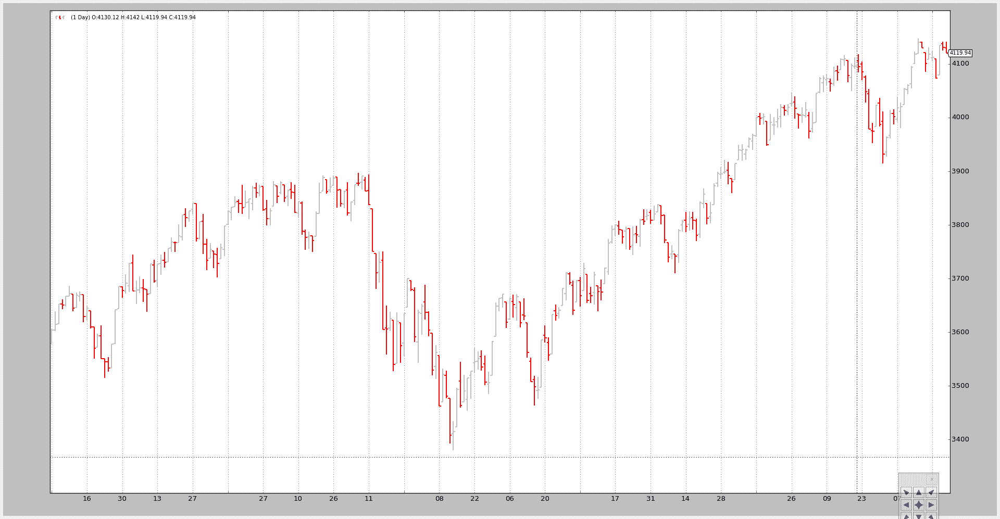
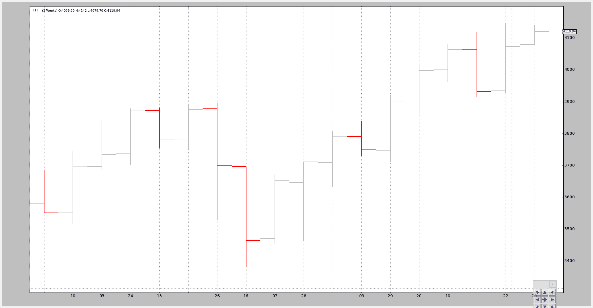

# 数据重新取样

> 原文：[`www.backtrader.com/blog/posts/2015-08-23-data-resampling/data-resampling/`](https://www.backtrader.com/blog/posts/2015-08-23-data-resampling/data-resampling/)

当数据仅在一个时间段可用，而分析必须针对不同的时间段进行时，就是时候进行一些重新取样了。

“重新取样”实际上应该称为“向上取样”，因为要从一个源时间段转换到一个较大的时间段（例如：从天到周）

“向下采样”目前还不可能。

`backtrader` 通过将原始数据传递给一个智能命名为 `DataResampler` 的过滤器对象来支持重新取样。

该类具有两个功能：

+   更改时间框架

+   压缩条柱

为此，`DataResampler` 在构造过程中使用标准的 `feed.DataBase` 参数：

+   `timeframe`（默认：bt.TimeFrame.Days）

    目标时间段必须与源时间段相等或更大才能有用

+   `compression`（默认：1）

    将所选值 “n” 压缩到 1 条柱

让我们看一个从每日到每周的手工脚本示例：

```py
$ ./data-resampling.py --timeframe weekly --compression 1
```

输出结果：



我们可以将其与原始每日数据进行比较：

```py
$ ./data-resampling.py --timeframe daily --compression 1
```

输出结果：



这是通过执行以下步骤来完成的魔术：

+   像往常一样加载数据

+   将数据馈送到具有所需的 `DataResampler` 中

    +   时间框架

    +   压缩

示例代码（底部的整个脚本）。

```py
 # Load the Data
    datapath = args.dataname or '../datas/sample/2006-day-001.txt'
    data = btfeeds.BacktraderCSVData(
        dataname=datapath)

    # Handy dictionary for the argument timeframe conversion
    tframes = dict(
        daily=bt.TimeFrame.Days,
        weekly=bt.TimeFrame.Weeks,
        monthly=bt.TimeFrame.Months)

    # Resample the data
    data_resampled = bt.DataResampler(
        dataname=data,
        timeframe=tframes[args.timeframe],
        compression=args.compression)

    # Add the resample data instead of the original
    cerebro.adddata(data_resampled)
```

最后一个例子中，我们首先将时间框架从每日更改为每周，然后应用 3 到 1 的压缩：

```py
$ ./data-resampling.py --timeframe weekly --compression 3
```

输出结果：



从原始的 256 个每日条柱变为 18 个 3 周条柱。具体情况如下：

+   52 周

+   52 / 3 = 17.33 因此为 18 条柱

这不需要太多。当然，分钟数据也可以进行重新取样。

重新取样测试脚本的示例代码。

```py
from __future__ import (absolute_import, division, print_function,
                        unicode_literals)

import argparse

import backtrader as bt
import backtrader.feeds as btfeeds

def runstrat():
    args = parse_args()

    # Create a cerebro entity
    cerebro = bt.Cerebro(stdstats=False)

    # Add a strategy
    cerebro.addstrategy(bt.Strategy)

    # Load the Data
    datapath = args.dataname or '../datas/sample/2006-day-001.txt'
    data = btfeeds.BacktraderCSVData(
        dataname=datapath)

    # Handy dictionary for the argument timeframe conversion
    tframes = dict(
        daily=bt.TimeFrame.Days,
        weekly=bt.TimeFrame.Weeks,
        monthly=bt.TimeFrame.Months)

    # Resample the data
    data_resampled = bt.DataResampler(
        dataname=data,
        timeframe=tframes[args.timeframe],
        compression=args.compression)

    # Add the resample data instead of the original
    cerebro.adddata(data_resampled)

    # Run over everything
    cerebro.run()

    # Plot the result
    cerebro.plot(style='bar')

def parse_args():
    parser = argparse.ArgumentParser(
        description='Pandas test script')

    parser.add_argument('--dataname', default='', required=False,
                        help='File Data to Load')

    parser.add_argument('--timeframe', default='weekly', required=False,
                        choices=['daily', 'weekly', 'monhtly'],
                        help='Timeframe to resample to')

    parser.add_argument('--compression', default=1, required=False, type=int,
                        help='Compress n bars into 1')

    return parser.parse_args()

if __name__ == '__main__':
    runstrat()
```
