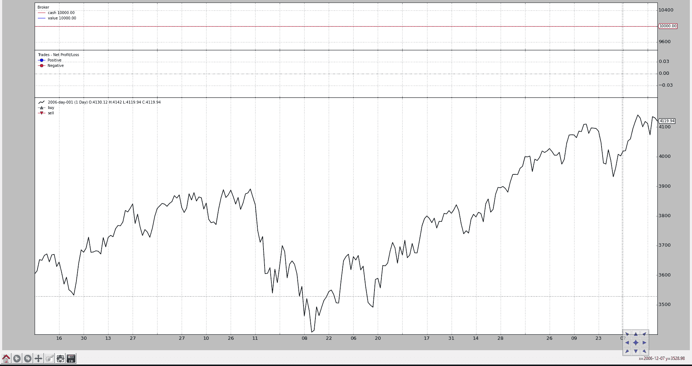
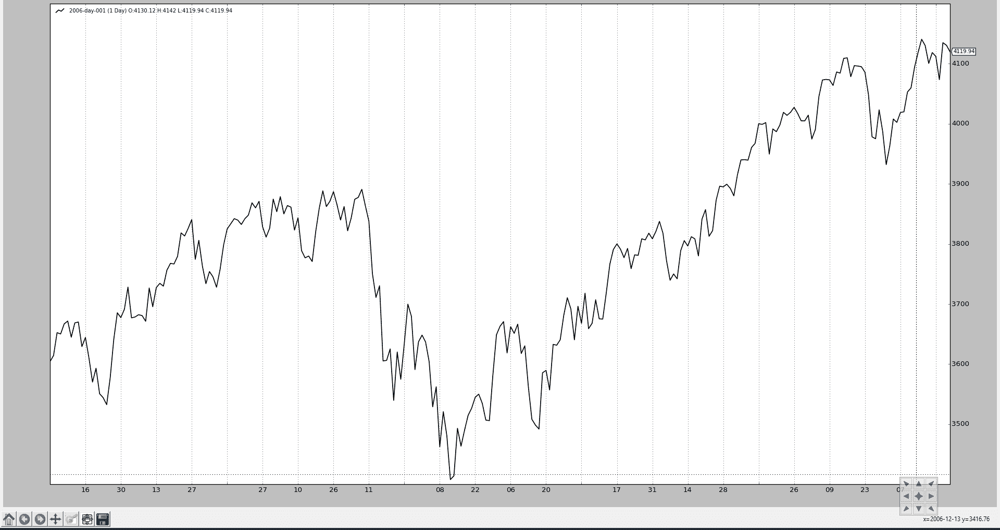
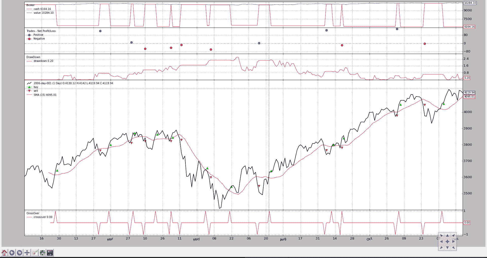
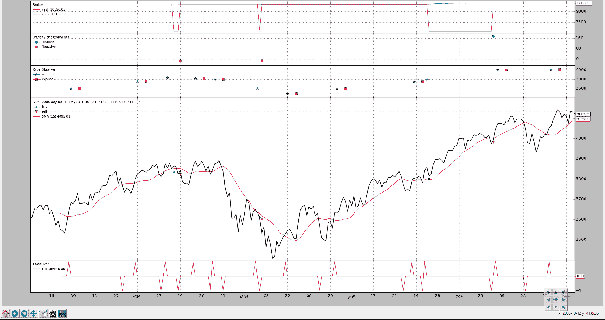

# 观察者和统计

> 原文：[`www.backtrader.com/blog/posts/2015-08-12-observers-and-statistics/observers-and-statistics/`](https://www.backtrader.com/blog/posts/2015-08-12-observers-and-statistics/observers-and-statistics/)

运行在 backtrader 内部的策略主要处理**数据**和**指标**。

数据被添加到**Cerebro**实例中，并最终成为策略的输入的一部分（被解析并作为实例的属性提供），而指标是由策略本身声明和管理的。

到目前为止，backtrader 的所有示例图表都有 3 个似乎被视为理所当然的东西，因为它们没有在任何地方声明：

+   现金和价值（经纪人的资金情况）

+   交易（也称为操作）

+   买入/卖出订单

它们是`观察者`，存在于子模块`backtrader.observers`中。它们在那里是因为**Cerebro**支持一个参数，可以自动将它们添加（或不添加）到策略中：

+   `stdstats`（默认值：True）

如果默认值被遵守，**Cerebro**执行以下等效用户代码：

```py
`import backtrader as bt

...

cerebro = bt.Cerebro()  # default kwarg: stdstats=True

cerebro.addobserver(backtrader.observers.Broker)
cerebro.addobserver(backtrader.observers.Trades)
cerebro.addobserver(backtrader.observers.BuySell)` 
```

让我们看看具有这 3 个默认观察者的通常图表（即使没有发出订单，因此没有交易发生，也没有现金和投资组合价值的变化）

```py
`from __future__ import (absolute_import, division, print_function,
                        unicode_literals)

import backtrader as bt
import backtrader.feeds as btfeeds

if __name__ == '__main__':
    cerebro = bt.Cerebro(stdstats=False)
    cerebro.addstrategy(bt.Strategy)

    data = bt.feeds.BacktraderCSVData(dataname='../datas/2006-day-001.txt')
    cerebro.adddata(data)

    cerebro.run()
    cerebro.plot()` 
```



现在让我们在创建**Cerebro**实例时将`stdstats`的值更改为`False`（也可以在调用`run`时完成）：

```py
`cerebro = bt.Cerebro(stdstats=False)` 
```

现在图表不同了。



## 访问观察者

如上所述，观察者已经存在于默认情况下，并收集可用于统计目的的信息，这就是为什么可以通过策略的一个属性来访问观察者的原因：

+   `stats`

它只是一个占位符。如果我们回想一下如何添加默认**观察者**之一，就像上面描述的那样：

```py
`...
cerebro.addobserver(backtrader.observers.Broker)
...` 
```

显而易见的问题是如何访问`Broker`观察者。以下是一个示例，展示了如何从策略的`next`方法中完成这个操作：

```py
`class MyStrategy(bt.Strategy):

    def next(self):

        if self.stats.broker.value[0] < 1000.0:
           print('WHITE FLAG ... I LOST TOO MUCH')
        elif self.stats.broker.value[0] > 10000000.0:
           print('TIME FOR THE VIRGIN ISLANDS ....!!!')` 
```

`Broker`观察者就像一个数据、一个指标和策略本身一样，也是一个`Lines`对象。在这种情况下，`Broker`有 2 条线：

+   `cash`

+   `value`

## 观察者实现

实现非常类似于指标的实现：

```py
`class Broker(Observer):
    alias = ('CashValue',)
    lines = ('cash', 'value')

    plotinfo = dict(plot=True, subplot=True)

    def next(self):
        self.lines.cash[0] = self._owner.broker.getcash()
        self.lines.value[0] = value = self._owner.broker.getvalue()` 
```

步骤：

+   从`Observer`派生（而不是从`Indicator`派生）

+   根据需要声明线和参数（`Broker`有 2 条线但没有参数）

+   将会有一个自动属性`_owner`，它是持有观察者的策略。

观察者开始行动：

+   所有指标计算完成后

+   策略的`next`方法执行完成后

+   这意味着：在周期结束时...他们**观察**发生了什么

在`Broker`情况下，它只是盲目地记录了每个时间点的经纪人现金和投资组合价值。

## 将观察者添加到策略中

如上所指出，**Cerebro** 使用`stdstats`参数来决定是否添加 3 个默认的**观察者**，减轻了最终用户的工作量。

将其他观察者添加到混合中是可能的，无论是沿着`stdstats`还是移除那些。

让我们继续使用通常的策略，当`close`价格高于`SimpleMovingAverage`时购买，反之亦然时卖出。

有一个“添加”：

+   **DrawDown**，这是`backtrader`生态系统中已经存在的观察者

```py
`from __future__ import (absolute_import, division, print_function,
                        unicode_literals)

import argparse
import datetime
import os.path
import time
import sys

import backtrader as bt
import backtrader.feeds as btfeeds
import backtrader.indicators as btind

class MyStrategy(bt.Strategy):
    params = (('smaperiod', 15),)

    def log(self, txt, dt=None):
        ''' Logging function fot this strategy'''
        dt = dt or self.data.datetime[0]
        if isinstance(dt, float):
            dt = bt.num2date(dt)
        print('%s, %s' % (dt.isoformat(), txt))

    def __init__(self):` 
```

视觉输出显示了回撤的演变



以及部分文本输出：

```py
`...
2006-12-14T23:59:59+00:00, MaxDrawDown: 2.62
2006-12-15T23:59:59+00:00, DrawDown: 0.22
2006-12-15T23:59:59+00:00, MaxDrawDown: 2.62
2006-12-18T23:59:59+00:00, DrawDown: 0.00
2006-12-18T23:59:59+00:00, MaxDrawDown: 2.62
2006-12-19T23:59:59+00:00, DrawDown: 0.00
2006-12-19T23:59:59+00:00, MaxDrawDown: 2.62
2006-12-20T23:59:59+00:00, DrawDown: 0.10
2006-12-20T23:59:59+00:00, MaxDrawDown: 2.62
2006-12-21T23:59:59+00:00, DrawDown: 0.39
2006-12-21T23:59:59+00:00, MaxDrawDown: 2.62
2006-12-22T23:59:59+00:00, DrawDown: 0.21
2006-12-22T23:59:59+00:00, MaxDrawDown: 2.62
2006-12-27T23:59:59+00:00, DrawDown: 0.28
2006-12-27T23:59:59+00:00, MaxDrawDown: 2.62
2006-12-28T23:59:59+00:00, DrawDown: 0.65
2006-12-28T23:59:59+00:00, MaxDrawDown: 2.62
2006-12-29T23:59:59+00:00, DrawDown: 0.06
2006-12-29T23:59:59+00:00, MaxDrawDown: 2.62` 
```

注意

如文本输出和代码中所见，`DrawDown`观察者实际上有 2 行：

+   `drawdown`

+   `maxdrawdown`

选择不绘制`maxdrawdown`线，但仍然使其对用户可用。

实际上，`maxdrawdown`的最后一个值也可以通过名为`maxdd`的直接属性（而不是一行）获得

## 开发观察者

上面展示了`Broker`观察者的实现。为了生成有意义的观察者，实现可以使用以下信息：

+   `self._owner`是当前执行的策略

    因此，观察者可以访问策略中的任何内容

+   策略中可用的默认内部内容可能会有用：

    +   `broker` -> 属性，提供对策略创建订单的经纪人实例的访问

    如在`Broker`中所见，通过调用`getcash`和`getvalue`方法收集现金和投资组合价值

    +   `_orderspending` -> 列出由策略创建并经纪人已通知策略的事件的订单。

    `BuySell`观察者遍历列表，寻找已执行（完全或部分）的订单，以创建给定时间点（索引 0）的平均执行价格

    +   `_tradespending` -> 交易列表（一组已完成的买入/卖出或卖出/买入对），从买入/卖出订单编译而成

**Observer**显然可以通过`self._owner.stats`路径访问其他观察者。

### 自定义*OrderObserver*

标准的`BuySell`观察者只关心已执行的操作。我们可以创建一个观察者，显示订单何时创建以及是否已过期。

为了*可见性*，显示将不沿价格绘制，而是在单独的轴上。

```py
`from __future__ import (absolute_import, division, print_function,
                        unicode_literals)

import math

import backtrader as bt

class OrderObserver(bt.observer.Observer):
    lines = ('created', 'expired',)

    plotinfo = dict(plot=True, subplot=True, plotlinelabels=True)

    plotlines = dict(
        created=dict(marker='*', markersize=8.0, color='lime', fillstyle='full'),
        expired=dict(marker='s', markersize=8.0, color='red', fillstyle='full')
    )

    def next(self):
        for order in self._owner._orderspending:
            if order.data is not self.data:
                continue

            if not order.isbuy():
                continue

            # Only interested in "buy" orders, because the sell orders
            # in the strategy are Market orders and will be immediately
            # executed

            if order.status in [bt.Order.Accepted, bt.Order.Submitted]:
                self.lines.created[0] = order.created.price

            elif order.status in [bt.Order.Expired]:
                self.lines.expired[0] = order.created.price` 
```

自定义观察者只关心**买入**订单，因为这是一个只购买以试图获利的策略。卖出订单是市价订单，将立即执行。

Close-SMA CrossOver 策略已更改为：

+   创建一个限价订单，价格低于信号时的收盘价的 1.0%

+   订单有效期为 7（日历）天

结果图表。



如新子图中所见，有几个订单已过期（红色方块），我们还可以看到在“创建”和“执行”之间有几天的时间。

注意

从提交 [1560fa8802](https://github.com/mementum/backtrader/commit/1560fa88021811c85ba94d4b6497d15322cbc1ed) 开始，在 `development` 分支中，如果在订单创建时价格未设置，则会使用收盘价格作为参考价格。

这不会影响市场订单，但始终保持 `order.create.price` 可用，并简化了 `buy` 的使用。

最后，应用新的**观察者**的策略代码。

```py
`from __future__ import (absolute_import, division, print_function,
                        unicode_literals)

import datetime

import backtrader as bt
import backtrader.feeds as btfeeds
import backtrader.indicators as btind

from orderobserver import OrderObserver

class MyStrategy(bt.Strategy):
    params = (
        ('smaperiod', 15),
        ('limitperc', 1.0),
        ('valid', 7),
    )

    def log(self, txt, dt=None):
        ''' Logging function fot this strategy'''
        dt = dt or self.data.datetime[0]
        if isinstance(dt, float):
            dt = bt.num2date(dt)
        print('%s, %s' % (dt.isoformat(), txt))

    def notify_order(self, order):
        if order.status in [order.Submitted, order.Accepted]:
            # Buy/Sell order submitted/accepted to/by broker - Nothing to do
            self.log('ORDER ACCEPTED/SUBMITTED', dt=order.created.dt)
            self.order = order
            return

        if order.status in [order.Expired]:
            self.log('BUY EXPIRED')

        elif order.status in [order.Completed]:
            if order.isbuy():
                self.log(
                    'BUY EXECUTED, Price: %.2f, Cost: %.2f, Comm %.2f' %
                    (order.executed.price,
                     order.executed.value,
                     order.executed.comm))

            else:  # Sell
                self.log('SELL EXECUTED, Price: %.2f, Cost: %.2f, Comm %.2f' %
                         (order.executed.price,
                          order.executed.value,
                          order.executed.comm))

        # Sentinel to None: new orders allowed
        self.order = None

    def __init__(self):
        # SimpleMovingAverage on main data
        # Equivalent to -> sma = btind.SMA(self.data, period=self.p.smaperiod)
        sma = btind.SMA(period=self.p.smaperiod)

        # CrossOver (1: up, -1: down) close / sma
        self.buysell = btind.CrossOver(self.data.close, sma, plot=True)

        # Sentinel to None: new ordersa allowed
        self.order = None

    def next(self):
        if self.order:
            # pending order ... do nothing
            return

        # Check if we are in the market
        if self.position:
            if self.buysell < 0:
                self.log('SELL CREATE, %.2f' % self.data.close[0])
                self.sell()

        elif self.buysell > 0:
            plimit = self.data.close[0] * (1.0 - self.p.limitperc / 100.0)
            valid = self.data.datetime.date(0) + \
                datetime.timedelta(days=self.p.valid)
            self.log('BUY CREATE, %.2f' % plimit)
            self.buy(exectype=bt.Order.Limit, price=plimit, valid=valid)

def runstrat():
    cerebro = bt.Cerebro()

    data = bt.feeds.BacktraderCSVData(dataname='../datas/2006-day-001.txt')
    cerebro.adddata(data)

    cerebro.addobserver(OrderObserver)

    cerebro.addstrategy(MyStrategy)
    cerebro.run()

    cerebro.plot()

if __name__ == '__main__':
    runstrat()` 
```

## 保存/保持统计信息。

目前为止，`backtrader` 还没有实现任何跟踪观察者值并将它们存储到文件中的机制。最好的方法是：

+   在策略的 `start` 方法中打开一个文件。

+   在策略的 `next` 方法中写入值。

考虑到 `DrawDown` 观察者，可以这样做：

```py
`class MyStrategy(bt.Strategy):

    def start(self):

        self.mystats = open('mystats.csv', 'wb')
        self.mystats.write('datetime,drawdown, maxdrawdown\n')

    def next(self):
        self.mystats.write(self.data.datetime.date(0).strftime('%Y-%m-%d'))
        self.mystats.write(',%.2f' % self.stats.drawdown.drawdown[-1])
        self.mystats.write(',%.2f' % self.stats.drawdown.maxdrawdown-1])
        self.mystats.write('\n')` 
```

要保存索引 0 的值，在所有观察者都被处理后，可以将一个自定义观察者添加到系统中作为最后一个观察者，将值保存到一个 csv 文件中。
