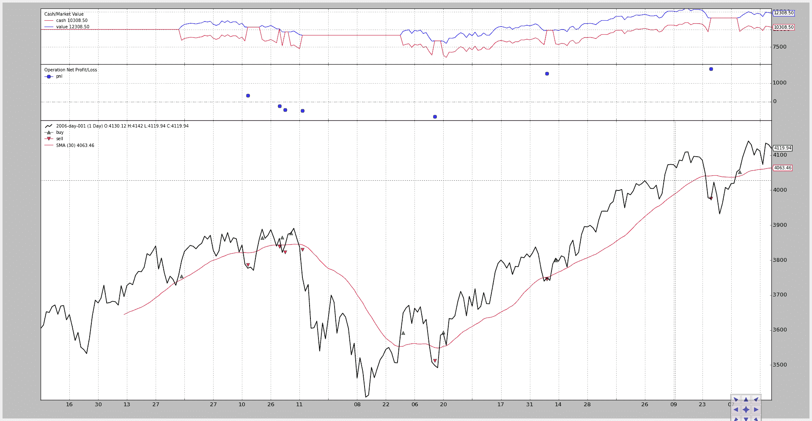
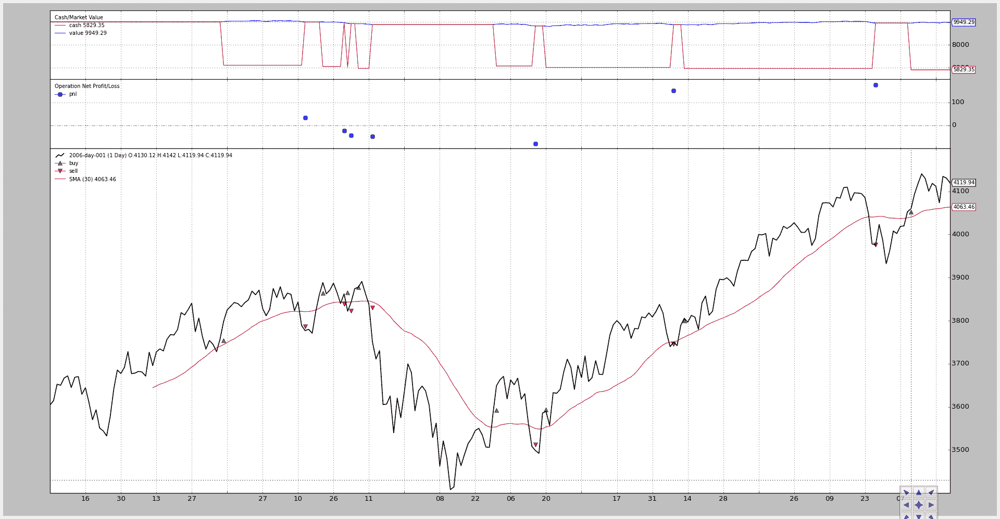

# 改进佣金：股票与期货

> 原文：[`www.backtrader.com/blog/posts/2015-07-31-commission-schemes-updated/commission-schemes-updated/`](https://www.backtrader.com/blog/posts/2015-07-31-commission-schemes-updated/commission-schemes-updated/)

发布 backtrader 使用示例让我对一些缺失的东西有了了解。首先：

+   多核优化

+   佣金：股票与期货

后者告诉了我：

+   经纪人在利润和损失的计算方面做得很对，向调用策略提供了正确的订单通知

+   策略无法访问`operations`（又称`trades`），这是订单已经开仓并关闭头寸的结果（后者显示出盈亏数字）

+   绘制的`Operation`盈亏数字由一个`Observer`收集，并且无法访问实际的`commission scheme`，因此对于类似于期货的操作和类似于股票的操作，将显示相同的盈亏数字。

显然，需要进行一些小的内部重组才能实现：

+   向策略发送`Operation`通知

+   `Operations`显示正确的盈亏数字

`broker`已经拥有了所有需要的信息，并且已经将大部分信息填入了被通知到`strategy`的`order`中，而`broker`需要做出的唯一决定是是否将额外的信息位放入订单中，或者它可以自己计算`operations`。 

由于策略已经获得了`orders`，并且将`operations`保留在列表中似乎很自然，`broker`只是在订单部分/完全关闭头寸时添加实际的盈亏，将计算责任留给了`strategy`。

这进一步简化了`Operations Observer`的实际角色，即观察新关闭的`Operation`并记录下来。这是它一直应该有的角色。

下面的代码已经被重新设计，不再计算盈亏数字，而只是注意到`notify_operation`中通知的数字。

现在图表反映出了真实的盈亏数字（`cash`和`value`已经是真实的）

旧的期货记录：

```py
`2006-03-09, BUY CREATE, 3757.59
2006-03-10, BUY EXECUTED, Price: 3754.13, Cost: 2000.00, Comm 2.00
2006-04-11, SELL CREATE, 3788.81
2006-04-12, SELL EXECUTED, Price: 3786.93, Cost: 2000.00, Comm 2.00
2006-04-12, OPERATION PROFIT, GROSS 328.00, NET 324.00
2006-04-20, BUY CREATE, 3860.00
2006-04-21, BUY EXECUTED, Price: 3863.57, Cost: 2000.00, Comm 2.00
2006-04-28, SELL CREATE, 3839.90
2006-05-02, SELL EXECUTED, Price: 3839.24, Cost: 2000.00, Comm 2.00
2006-05-02, OPERATION PROFIT, GROSS -243.30, NET -247.30` 
```

新的期货记录：

```py
`2006-03-09, BUY CREATE, 3757.59
2006-03-10, BUY EXECUTED, Price: 3754.13, Cost: 2000.00, Comm 2.00
2006-04-11, SELL CREATE, 3788.81
2006-04-12, SELL EXECUTED, Price: 3786.93, Cost: 2000.00, Comm 2.00
2006-04-12, OPERATION PROFIT, GROSS 328.00, NET 324.00
2006-04-20, BUY CREATE, 3860.00
2006-04-21, BUY EXECUTED, Price: 3863.57, Cost: 2000.00, Comm 2.00
2006-04-28, SELL CREATE, 3839.90
2006-05-02, SELL EXECUTED, Price: 3839.24, Cost: 2000.00, Comm 2.00
2006-05-02, OPERATION PROFIT, GROSS -243.30, NET -247.30
2006-05-02, BUY CREATE, 3862.24` 
```

旧的股票记录：

```py
`2006-03-09, BUY CREATE, 3757.59
2006-03-10, BUY EXECUTED, Price: 3754.13, Cost: 3754.13, Comm 18.77
2006-04-11, SELL CREATE, 3788.81
2006-04-12, SELL EXECUTED, Price: 3786.93, Cost: 3786.93, Comm 18.93
2006-04-12, OPERATION PROFIT, GROSS 32.80, NET -4.91
2006-04-20, BUY CREATE, 3860.00
2006-04-21, BUY EXECUTED, Price: 3863.57, Cost: 3863.57, Comm 19.32
2006-04-28, SELL CREATE, 3839.90
2006-05-02, SELL EXECUTED, Price: 3839.24, Cost: 3839.24, Comm 19.20
2006-05-02, OPERATION PROFIT, GROSS -24.33, NET -62.84` 
```

新的股票记录：

```py
`2006-03-09, BUY CREATE, 3757.59
2006-03-10, BUY EXECUTED, Price: 3754.13, Cost: 3754.13, Comm 18.77
2006-04-11, SELL CREATE, 3788.81
2006-04-12, SELL EXECUTED, Price: 3786.93, Cost: 3786.93, Comm 18.93
2006-04-12, OPERATION PROFIT, GROSS 32.80, NET -4.91
2006-04-20, BUY CREATE, 3860.00
2006-04-21, BUY EXECUTED, Price: 3863.57, Cost: 3863.57, Comm 19.32
2006-04-28, SELL CREATE, 3839.90
2006-05-02, SELL EXECUTED, Price: 3839.24, Cost: 3839.24, Comm 19.20
2006-05-02, OPERATION PROFIT, GROSS -24.33, NET -62.84
2006-05-02, BUY CREATE, 3862.24` 
```

图表（仅新的图表）。现在可以清楚地看到`futures-like`操作和`stock-like`操作之间的差异，不仅在`cash`和`value`的变化中。

## 期货佣金



## 股票佣金



## 代码

```py
`from __future__ import (absolute_import, division, print_function,
                        unicode_literals)

import backtrader as bt
import backtrader.feeds as btfeeds
import backtrader.indicators as btind

futures_like = True

if futures_like:
    commission, margin, mult = 2.0, 2000.0, 10.0
else:
    commission, margin, mult = 0.005, None, 1

class SMACrossOver(bt.Strategy):
    def log(self, txt, dt=None):
        ''' Logging function fot this strategy'''
        dt = dt or self.datas[0].datetime.date(0)
        print('%s, %s' % (dt.isoformat(), txt))

    def notify(self, order):
        if order.status in [order.Submitted, order.Accepted]:
            # Buy/Sell order submitted/accepted to/by broker - Nothing to do
            return

        # Check if an order has been completed
        # Attention: broker could reject order if not enougth cash
        if order.status in [order.Completed, order.Canceled, order.Margin]:
            if order.isbuy():
                self.log(
                    'BUY EXECUTED, Price: %.2f, Cost: %.2f, Comm %.2f' %
                    (order.executed.price,
                     order.executed.value,
                     order.executed.comm))
            else:  # Sell
                self.log('SELL EXECUTED, Price: %.2f, Cost: %.2f, Comm %.2f' %
                         (order.executed.price,
                          order.executed.value,
                          order.executed.comm))

    def notify_trade(self, trade):
        if trade.isclosed:
            self.log('TRADE PROFIT, GROSS %.2f, NET %.2f' %
                     (trade.pnl, trade.pnlcomm))

    def __init__(self):
        sma = btind.SMA(self.data)
        # > 0 crossing up / < 0 crossing down
        self.buysell_sig = btind.CrossOver(self.data, sma)

    def next(self):
        if self.buysell_sig > 0:
            self.log('BUY CREATE, %.2f' % self.data.close[0])
            self.buy()  # keep order ref to avoid 2nd orders

        elif self.position and self.buysell_sig < 0:
            self.log('SELL CREATE, %.2f' % self.data.close[0])
            self.sell()

if __name__ == '__main__':
    # Create a cerebro entity
    cerebro = bt.Cerebro()

    # Add a strategy
    cerebro.addstrategy(SMACrossOver)

    # Create a Data Feed
    datapath = ('../../datas/2006-day-001.txt')
    data = bt.feeds.BacktraderCSVData(dataname=datapath)

    # Add the Data Feed to Cerebro
    cerebro.adddata(data)

    # set commission scheme -- CHANGE HERE TO PLAY
    cerebro.broker.setcommission(
        commission=commission, margin=margin, mult=mult)

    # Run over everything
    cerebro.run()

    # Plot the result
    cerebro.plot()` 
```
