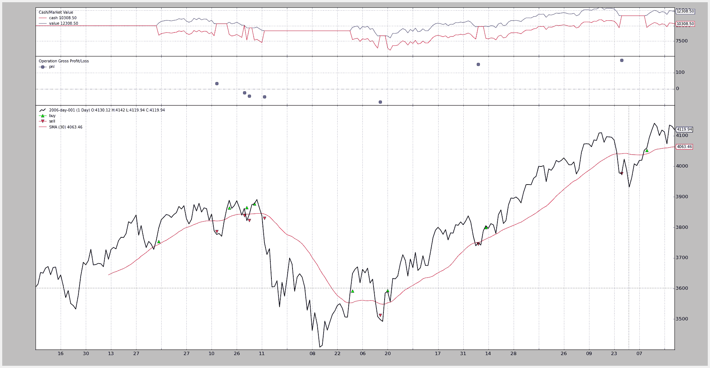
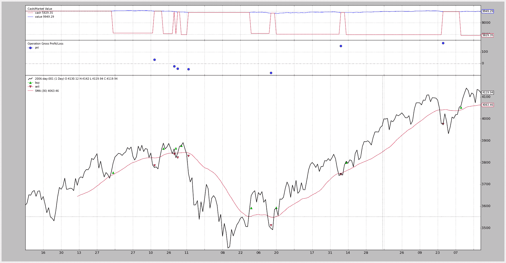

# 佣金：股票 vs 期货

> 原文：[`www.backtrader.com/blog/posts/2015-07-26-commission-schemes/commission-schemes/`](https://www.backtrader.com/blog/posts/2015-07-26-commission-schemes/commission-schemes/)

backtrader 的诞生是出于必要性。我自己...希望有一种感觉，我可以控制自己的回测平台并尝试新的想法。但是在这样做并从一开始就完全开源化之后，很明显它必须有一种方式来满足其他人的需求和愿望。

作为交易者未来，我本可以选择编写基于点数的计算和每轮固定价格的佣金，但那将是一个错误。

注意

2015 年 7 月 31 日

跟进帖子，附带新添加的操作/交易通知，修复交易 P&L 图表的绘制，并避免像下面示例中那样的手动计算。

改善佣金：股票 vs 期货

相反，`backtrader`提供了使用常规%大小/价格基础方案和固定价格/点方案的可能性。选择权在你手上。

## 不可知论

在继续之前，让我们记住`backtrader`试图保持对数据表示的不可知。可以将不同的佣金方案应用于相同的数据集。

让我们看看如何做到这一点。

## 使用经纪人快捷方式

这样可以使最终用户远离`CommissionInfo`对象，因为可以通过单个函数调用创建/设置佣金方案。在常规的`cerebro`创建/设置过程中，只需将调用添加到`broker`成员变量上即可。以下调用在使用*InteractiveBrokers*时为**Eurostoxx50**期货设置了一种常规佣金方案：

```py
`cerebro.broker.setcommission(commission=2.0, margin=2000.0, mult=10.0)` 
```

由于大多数用户通常只测试单个工具，因此这就是问题的全部。如果您已经为数据源指定了`name`，因为图表上同时考虑了多个工具，因此此调用可以略微扩展为如下所示：

```py
`cerebro.broker.setcommission(commission=2.0, margin=2000.0, mult=10.0,
name='Eurostoxxx50')` 
```

在这种情况下，这种即时佣金方案将仅应用于名称与`Eurostoxx50`匹配的工具。

## 设置佣金参数的含义

+   `commission`（默认值：0.0）

    每个**操作**的货币单位以绝对值或百分比形式的成本。

    在上面的示例中，每个`buy`合约需要 2.0 欧元，每个`sell`合约也是如此。

    这里的重要问题是何时使用绝对值或百分比值。

    +   如果`margin`评估为`False`（例如为 False、0 或 None），则将认为`commission`表示`price`乘以`size`操作值的百分比。

    +   如果`margin`是其他内容，则认为操作发生在类似`期货`的工具上，并且`commission`是每个`size`合约的固定价格

+   `margin`（默认值：None）

    使用`期货`等工具时需要的保证金。如上所述

    +   如果设置了**no** `margin`，则`commission`将被理解为以百分比表示，并应用于`buy`或`sell`操作的`price * size`组件

    +   如果设置了`margin`，则`commission`将被理解为与`buy`或`sell`操作的`size`分量相乘的固定值

+   `mult`（默认：1.0）

    对于`类似期货`的工具，这决定了要应用于利润和损失计算的乘数。

    这就是期货同时具有吸引力和风险的原因。

+   `name`（默认：无）

    限制佣金方案的应用于与`name`匹配的工具。

    这可以在创建数据源时设置。

    如果不设置，方案将应用于系统中存在的任何数据。 

## 现在有两个例子：股票 vs 期货

来自上述的期货示例：

```py
`cerebro.broker.setcommission(commission=2.0, margin=2000.0, mult=10.0)` 
```

股票的一个例子：

```py
`cerebro.broker.setcommission(commission=0.005)  # 0.5% of the operation value` 
```

## 创建永久佣金方案

更持久的佣金方案可以通过直接使用`CommissionInfo`类来创建。用户可以选择将此定义放在某处：

```py
`from bt import CommissionInfo

commEurostoxx50 = CommissionInfo(commission=2.0, margin=2000.0, mult=10.0)` 
```

然后在另一个 Python 模块中应用它与`addcommissioninfo`：

```py
`from mycomm import commEurostoxx50

...

cerebro.broker.addcomissioninfo(commEuroStoxx50, name='Eurostoxxx50')` 
```

`CommissionInfo`是一个对象，它使用与`backtrader`环境中的其他对象一样的`params`声明。因此，上述内容也可以表示为：

```py
`from bt import CommissionInfo

class CommEurostoxx50(CommissionInfo):
    params = dict(commission=2.0, margin=2000.0, mult=10.0)` 
```

后来：

```py
`from mycomm import CommEurostoxx50

...

cerebro.broker.addcomissioninfoCommEuroStoxx50(), name='Eurostoxxx50')` 
```

## 现在是与 SMA 交叉的“真实”比较

使用 SimpleMovingAverage 交叉作为入场/出场信号，将使用类似`期货`的佣金方案对同一数据集进行测试，然后再使用类似`股票`的方案。

注意

期货头寸不仅可以在每次发生时赋予进入/退出行为，还可以在每次发生时赋予反转行为。但是，此示例是关于比较佣金方案的。

代码（请参阅底部获取完整策略）是相同的，可以在定义策略之前选择方案。

```py
`futures_like = True

if futures_like:
    commission, margin, mult = 2.0, 2000.0, 10.0
else:
    commission, margin, mult = 0.005, None, 1` 
```

只需将`futures_like`设置为 false 即可使用类似`股票`的方案运行。

已添加一些记录代码以评估不同佣金方案的影响。让我们只关注前两个操作。

对于期货：

```py
`2006-03-09, BUY CREATE, 3757.59
2006-03-10, BUY EXECUTED, Price: 3754.13, Cost: 2000.00, Comm 2.00
2006-04-11, SELL CREATE, 3788.81
2006-04-12, SELL EXECUTED, Price: 3786.93, Cost: 2000.00, Comm 2.00
2006-04-12, OPERATION PROFIT, GROSS 328.00, NET 324.00
2006-04-20, BUY CREATE, 3860.00
2006-04-21, BUY EXECUTED, Price: 3863.57, Cost: 2000.00, Comm 2.00
2006-04-28, SELL CREATE, 3839.90
2006-05-02, SELL EXECUTED, Price: 3839.24, Cost: 2000.00, Comm 2.00
2006-05-02, OPERATION PROFIT, GROSS -243.30, NET -247.30` 
```

对于股票：

```py
`2006-03-09, BUY CREATE, 3757.59
2006-03-10, BUY EXECUTED, Price: 3754.13, Cost: 3754.13, Comm 18.77
2006-04-11, SELL CREATE, 3788.81
2006-04-12, SELL EXECUTED, Price: 3786.93, Cost: 3786.93, Comm 18.93
2006-04-12, OPERATION PROFIT, GROSS 32.80, NET -4.91
2006-04-20, BUY CREATE, 3860.00
2006-04-21, BUY EXECUTED, Price: 3863.57, Cost: 3863.57, Comm 19.32
2006-04-28, SELL CREATE, 3839.90
2006-05-02, SELL EXECUTED, Price: 3839.24, Cost: 3839.24, Comm 19.20
2006-05-02, OPERATION PROFIT, GROSS -24.33, NET -62.84` 
```

第一次操作具有以下价格：

+   买入（执行）-> 3754.13 / 卖出（执行）-> 3786.93

    +   期货利润和损失（含佣金）：324.0

    +   股票利润和损失（含佣金）：-4.91

    嘿！！ 佣金完全吞噬了`股票`操作的任何利润，但对`期货`操作只是造成了小小的凹痕。

第二次操作：

+   买入（执行）-> 3863.57 / 卖出（执行）-> 3389.24

    +   期货利润和损失（含佣金）：-247.30

    +   股票利润和损失（含佣金）：-62.84

    这次负面操作对于`期货`的咬度明显更大

但：

+   期货累计净利润和损失：324.00 + (-247.30) = 76.70

+   股票累计净利润和损失：(-4.91) + (-62.84) = -67.75

累计效果可以在下面的图表中看到，在完整年份结束时，期货产生了更大的利润，但也遭受了更大的回撤（深入水中更深）

但重要的是：无论是`期货`还是`股票`… **都可以进行回测。**

## 期货佣金



## 股票佣金



## 代码

```py
`from __future__ import (absolute_import, division, print_function,
                        unicode_literals)

import backtrader as bt
import backtrader.feeds as btfeeds
import backtrader.indicators as btind

futures_like = True

if futures_like:
    commission, margin, mult = 2.0, 2000.0, 10.0
else:
    commission, margin, mult = 0.005, None, 1

class SMACrossOver(bt.Strategy):
    def log(self, txt, dt=None):
        ''' Logging function fot this strategy'''
        dt = dt or self.datas[0].datetime.date(0)
        print('%s, %s' % (dt.isoformat(), txt))

    def notify(self, order):
        if order.status in [order.Submitted, order.Accepted]:
            # Buy/Sell order submitted/accepted to/by broker - Nothing to do
            return

        # Check if an order has been completed
        # Attention: broker could reject order if not enougth cash
        if order.status in [order.Completed, order.Canceled, order.Margin]:
            if order.isbuy():
                self.log(
                    'BUY EXECUTED, Price: %.2f, Cost: %.2f, Comm %.2f' %
                    (order.executed.price,
                     order.executed.value,
                     order.executed.comm))

                self.buyprice = order.executed.price
                self.buycomm = order.executed.comm
                self.opsize = order.executed.size
            else:  # Sell
                self.log('SELL EXECUTED, Price: %.2f, Cost: %.2f, Comm %.2f' %
                         (order.executed.price,
                          order.executed.value,
                          order.executed.comm))

                gross_pnl = (order.executed.price - self.buyprice) * \
                    self.opsize

                if margin:
                    gross_pnl *= mult

                net_pnl = gross_pnl - self.buycomm - order.executed.comm
                self.log('OPERATION PROFIT, GROSS %.2f, NET %.2f' %
                         (gross_pnl, net_pnl))

    def __init__(self):
        sma = btind.SMA(self.data)
        # > 0 crossing up / < 0 crossing down
        self.buysell_sig = btind.CrossOver(self.data, sma)

    def next(self):
        if self.buysell_sig > 0:
            self.log('BUY CREATE, %.2f' % self.data.close[0])
            self.buy()  # keep order ref to avoid 2nd orders

        elif self.position and self.buysell_sig < 0:
            self.log('SELL CREATE, %.2f' % self.data.close[0])
            self.sell()

if __name__ == '__main__':
    # Create a cerebro entity
    cerebro = bt.Cerebro()

    # Add a strategy
    cerebro.addstrategy(SMACrossOver)

    # Create a Data Feed
    datapath = ('../datas/2006-day-001.txt')
    data = bt.feeds.BacktraderCSVData(dataname=datapath)

    # Add the Data Feed to Cerebro
    cerebro.adddata(data)

    # set commission scheme -- CHANGE HERE TO PLAY
    cerebro.broker.setcommission(
        commission=commission, margin=margin, mult=mult)

    # Run over everything
    cerebro.run()

    # Plot the result
    cerebro.plot()` 
```
