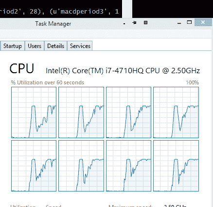

# 多核优化

> [`www.backtrader.com/blog/posts/2015-07-23-multicore-optimization/multicore-optimization/`](https://www.backtrader.com/blog/posts/2015-07-23-multicore-optimization/multicore-optimization/)

利用所有可用核心是我对 backtrader 有的想法，但从未实现。支持自然操作，移除数组表示法，包含新的指标等等。

实际上，我并不是**优化**的忠实粉丝，因此对于为此利用所有核心也不是忠实粉丝。在我看来，一个好主意值得百万次优化。

注意

初始的多核支持已经存在，并且对于*众所周知*的一组测试用例有效。鉴于`pickle`所展示的行为，预计还需要进行一些其他调整，以确保在进行多核优化时可以在进程之间传递所有指标和函数。

注意

针对多核的一些额外校正已经发布为 1.0.10.88 版本，以使更多的“不可序列化”项变得可序列化。到目前为止，指标测试没有出现任何问题。

但是 BigMikeTrading 论坛上有人询问这个平台相比其他平台有什么优势，我提到了一些功能，包括[PyAlgoTrade](http://gbeced.github.io/pyalgotrade/)，例如，已经有了（甚至是多机器的）。

这需要做一点小而正确的推动。根据过去的经验以及因为互联网上充满了参考资料，我已经知道：**多线程**即使是最简单的（无论 GIL 律师们可能说什么），在 Python 中也是行不通的，无论版本如何。在 Python 中，多线程是假的，因为你有多个线程，但没有代码的并行执行。在 Python 中使用多线程可能会创建抽象，并用 IO 绑定的线程分开代码路径的执行，但这确实是一个致命问题。

那么我只剩下一个选择：模块`multiprocessing`或类似的模块。

展望光明的未来，我决定选择现代版本：`concurrent.futures`（后来证明是一个错误的选择）。即使这意味着为 Python 2.6/2.7 支持添加外部依赖。

历史：

+   Python 的一些动态特性与在进程之间发送数据不兼容

+   当**序列化**一些像类不在模块级别定义、lambda 表达式、对实例方法的引用以及没有唯一名称的动态类（即使类本身是唯一的）时，所涉及的模块（`pickle`）会出错。

我把这些东西散落在代码中。然后我发现了[dill](https://pypi.python.org/pypi/dill)和 pathos 多进程的兄弟姐妹[`pypi.python.org/pypi/multiprocess`](https://pypi.python.org/pypi/multiprocess)。显然它们可以解决序列化问题，但是添加更多的外部依赖……不行不行。

回到起点，看看那些不可序列化的项是否可以被序列化，即使`pickle`模块产生了一些错误，这将使一些旧的 GCC 开发人员非常高兴。

它完成了吗……还是没有？

+   将不可选的项目改造为可选项目

+   用 Python 2.7.9 进行测试，并像风一样轻松地运行……我的机器的 8 个核心顺畅且令人耳目一新

+   使用 Python 3.4.3 进行测试，8 个核心开始运作，但在进行一些优化后，每个后续策略的执行时间会越来越长……直到不堪忍受为止。

    显然，将结果（完整的执行策略）反向 *pickling* 到主进程中触及了一些与内存分配相关的限制（我的机器有大量空闲 RAM……足够多以进行几小时的并行优化）

阅读了一些额外的内容后，我考虑简化我的情景：

+   使用 `concurrent.futures` 看起来更具未来性

+   但标准的 `multiprocessing` 模块已经具备了 `backtrader` 所需的功能

闻起来好像有点过度，一些行被迅速改写成：

+   测试用 Python 2.7 运行正常（甚至比以前更快）

+   测试用 Python 3.4 同样快速运行

进行清理，运行完整的一系列测试并执行推送，发布 1.0.9.88。没有新的指标……只是**多核优化**的普通旧方式

读完这些……是时候写一个关于如何控制优化以使用多个核心的清爽脚本了

+   好消息……不需要做任何事情……它在用户不介入的情况下完成了

当用户希望优化 `strategy` 时，`Strategy` 子类将被添加到 `Cerebro` 实例中，如下所示：

```py
cerebro.optstrategy(StrategyClass, *args, **kwargs)
```

与向 `Cerebro` 传递策略的常规方式相反：

```py
cerebro.addstrategy(StrategyClass, *args, **kwargs)
```

这一直都是这样，没有改变。背景是：

+   `Cerebro` 需要了解是否要优化策略，以正确处理可能已经是常规策略的策略的参数

现在……通过 `optstrategy` 传递给 `cerebro` 的**策略**将获得使用机器上所有可用核心的额外好处。

当然，如果最终用户希望对使用的核心进行精细控制……是可能的。创建 `Cerebro` 的标准方式：

cerebro = bt.Cerebro() # runonce 为 True，preload 为 True，且 “new” maxcpus 为 None

`maxcpus`（此版本中的新参数）是控制键：

+   maxcpus = None -> 使用所有可用的 CPU

+   maxcpus = 1 -> 不要运行多核

+   maxcpues = 2 … -> 使用指定数量的核心

这是一种选择退出策略，因为多核已经存在。

在拥有 16 GBytes RAM 的 4 核（每核 2 个线程 - 总共 8 个逻辑处理器）机器上进行比较，运行 Windows 8.1 和 Python 64 位 2.7.9

+   使用 1 个核心执行：326 秒

+   使用 8 个核心执行：127 秒

不同的测试运行显示，平均比例约为 2.75:1。

不幸的是，进程的创建/销毁和对象的反复 *pickling* 带来了潜在的好处，但加速效果仍然显著。

图像显示了正在使用的 8 个核心。



代码如下。只需将`maxcpus`参数的`1`更改为限制测试为 1 个核心。

```py
from __future__ import (absolute_import, division, print_function,
                        unicode_literals)

import time

from six.moves import xrange

import backtrader as bt
import backtrader.indicators as btind
import backtrader.feeds as btfeeds

class OptimizeStrategy(bt.Strategy):
    params = (('smaperiod', 15),
              ('macdperiod1', 12),
              ('macdperiod2', 26),
              ('macdperiod3', 9),
              )

    def __init__(self):
        # Add indicators to add load

        btind.SMA(period=self.p.smaperiod)
        btind.MACD(period_me1=self.p.macdperiod1,
                   period_me2=self.p.macdperiod2,
                   period_signal=self.p.macdperiod3)

if __name__ == '__main__':
    # Create a cerebro entity
    cerebro = bt.Cerebro(maxcpus=None)

    # Add a strategy
    cerebro.optstrategy(
        OptimizeStrategy,
        smaperiod=xrange(5, 40),
        macdperiod1=xrange(12, 20),
        macdperiod2=xrange(26, 30),
        macdperiod3=xrange(9, 15),
    )

    # Create a Data Feed
    datapath = ('../datas/2006-day-001.txt')
    data = bt.feeds.BacktraderCSVData(dataname=datapath)

    # Add the Data Feed to Cerebro
    cerebro.adddata(data)

    # clock the start of the process
    tstart = time.clock()

    # Run over everything
    stratruns = cerebro.run()

    # clock the end of the process
    tend = time.clock()

    print('==================================================')
    for stratrun in stratruns:
        print('**************************************************')
        for strat in stratrun:
            print('--------------------------------------------------')
            print(strat.p._getkwargs())
    print('==================================================')

    # print out the result
    print('Time used:', str(tend - tstart))
```
