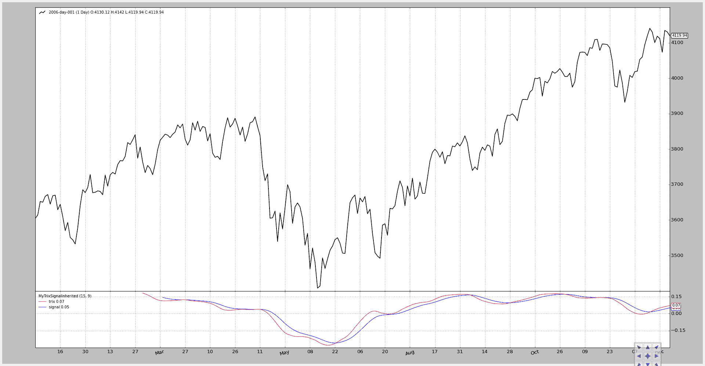

# 扩展一个指标

> 原文：[`www.backtrader.com/blog/posts/2015-07-20-extending-an-indicator/extending-an-indicator/`](https://www.backtrader.com/blog/posts/2015-07-20-extending-an-indicator/extending-an-indicator/)

在面向对象编程中，当然也包括 Python 本身，对现有类的扩展可以通过两种方式实现。

+   继承（或子类化）

+   组合（或嵌入）

在开发一个指标时，指标`Trix`只需几行代码就可以开发完成。[ChartSchool - Trix](http://stockcharts.com/school/doku.php?id=chart_school:technical_indicators:trix) 参考文献中有一个带有信号线的`Trix`，显示了与 MACD 的相似之处。

让我们使用已经开发的`Trix`“组合”`MyTrixSignal`

```py
class MyTrixSignalComposed(bt.Indicator):

    lines = ('trix', 'signal')
    params = (('period', 15), ('sigperiod', 9))

    def __init__(self):
        self.lines.trix = MyTrix(self.data, period=self.p.period)
        self.lines.signal = btind.EMA(self.lines.trix, period=self.p.sigperiod)
```

在定义中有一些必须重复的内容，比如`trix`线的名称和用于计算的`period`。定义了一个新的`signal`线和相应的`sigperiod`参数。

这个两行的结果很好。

现在让我们来看看*继承*，但首先回顾一下`Trix`的样子：

```py
class MyTrix(bt.Indicator):

    lines = ('trix',)
    params = (('period', 15),)

    def __init__(self):
        ema1 = btind.EMA(self.data, period=self.p.period)
        ema2 = btind.EMA(ema1, period=self.p.period)
        ema3 = btind.EMA(ema2, period=self.p.period)

        self.lines.trix = 100.0 * (ema3 - ema3(-1)) / ema3(-1)
```

使用`Trix`作为基类，这是`TrixSignal`的外观

```py
class MyTrixSignalInherited(MyTrix):

    lines = ('signal',)
    params = (('sigperiod', 9),)

    def __init__(self):
        super(MyTrixSignalInherited, self).__init__()
        self.lines.signal = btind.EMA(self.lines.trix, period=self.p.sigperiod)
```

继承的指标最终也是一个两行代码，但是：

+   不需要重新定义`trix`线

+   不需要重新定义`period`参数

两者都是从基类`Trix`继承而来。`trix`线的计算是在基类`__init__`方法中完成的：

+   super(MyTrixSignalInherited, self).**init**()

**组合**与**继承**的选择是一个经典问题。这个例子并不是为了澄清哪种更好，而更多是为了展示：

注意

即使存在**lines**和**params**的元定义，它们也继承自基类的元定义

最后是代码和图表，展示两个版本的运行情况。

1.  第一个展示了**继承**版本

```py
from __future__ import (absolute_import, division, print_function,
                        unicode_literals)

import backtrader as bt
import backtrader.feeds as btfeeds

from mytrix import MyTrixSignalInherited

class NoStrategy(bt.Strategy):
    params = (('trixperiod', 15),
              ('analyzer', False),)

    def __init__(self):
        MyTrixSignalInherited(self.data, period=self.p.trixperiod)

if __name__ == '__main__':
    # Create a cerebro entity
    cerebro = bt.Cerebro()

    # Add a strategy
    cerebro.addstrategy(NoStrategy, trixperiod=15)

    # Create a Data Feed
    datapath = ('../datas/2006-day-001.txt')
    data = bt.feeds.BacktraderCSVData(dataname=datapath)

    # Add the Data Feed to Cerebro
    cerebro.adddata(data)

    # Run over everything
    cerebro.run()

    # Plot the result
    cerebro.plot()
```



1.  第一个展示了**组合**版本

```py
from __future__ import (absolute_import, division, print_function,
                        unicode_literals)

import backtrader as bt
import backtrader.feeds as btfeeds

from mytrix import MyTrixSignalComposed

class NoStrategy(bt.Strategy):
    params = (('trixperiod', 15),
              ('analyzer', False),)

    def __init__(self):
        MyTrixSignalComposed(self.data, period=self.p.trixperiod)

if __name__ == '__main__':
    # Create a cerebro entity
    cerebro = bt.Cerebro()

    # Add a strategy
    cerebro.addstrategy(NoStrategy, trixperiod=15)

    # Create a Data Feed
    datapath = ('../datas/2006-day-001.txt')
    data = bt.feeds.BacktraderCSVData(dataname=datapath)

    # Add the Data Feed to Cerebro
    cerebro.adddata(data)

    # Run over everything
    cerebro.run()

    # Plot the result
    cerebro.plot()
```


