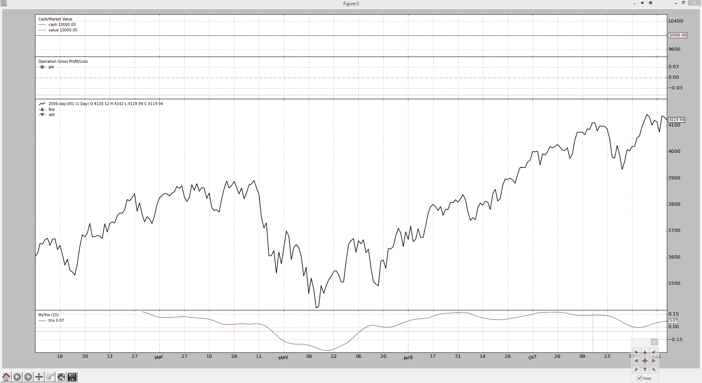

# 开发一个指标

> 原文：[`www.backtrader.com/blog/posts/2015-07-18-developing-an-indicator/developing-an-indicator/`](https://www.backtrader.com/blog/posts/2015-07-18-developing-an-indicator/developing-an-indicator/)

在对 backtrader 进行了大量的微调之后（因为它已经运行了一段时间），我决定不仅通过 GitHub 分享它，还要告诉世界它的存在，并在"Reddit"上发布了关于其存在的帖子。

在关于为什么交易/算法交易平台会突然出现的评论和关于平台是否支持多个同时交易的实时交易的私人问题之后，我得出了结论，我的孩子应该有自己的博客。

这就是我们所在的地方。但让我们专注于业务。

`backtrader`旨在让我快速尝试想法，并检查我的眼睛可能告诉我的是否可能存在机会。

`backtrader`（目前）完全是关于回测的，尚未连接到任何实时交易平台，甚至可能不会（尽管我确实相信技术实现是允许的）

当我使用表达式"尝试想法"时，我的意思是两件事：

1.  能够快速起草一个指标，并能够直观评估其行为

1.  无论如何，都要参与开发围绕该指标或与其他指标组合的潜在策略

我个人的交易是 100%判断性的，没有一个决定是由自动化系统做出的。但我会看看指标所说的内容。无论"指标"是否真的是一个信号，都留给了我有缺陷的人类思维。

但让我们来尝试一下。在第一次发布到 Reddit 后，我添加了一个著名的指标：

+   Trix

Stockcharts 在这里有关于 Trix 的很好的讨论：[ChartSchool - Trix](http://stockcharts.com/school/doku.php?id=chart_school:technical_indicators:trix)

让我们尝试如何做到，用尽可能少的行：

```py
`from __future__ import (absolute_import, division, print_function,
                        unicode_literals)

import backtrader as bt
import backtrader.indicators as btind

class MyTrix(bt.Indicator):

    lines = ('trix',)
    params = (('period', 15),)

    def __init__(self):
        ema1 = btind.EMA(self.data, period=self.p.period)
        ema2 = btind.EMA(ema1, period=self.p.period)
        ema3 = btind.EMA(ema2, period=self.p.period)

        self.lines.trix = 100.0 * (ema3 - ema3(-1)) / ema3(-1)` 
```

Trix 指标已经投入使用。看着这一切，作为该平台的作者，我真的相信我的目标是能够快速地轻松尝试新的想法……已经实现了。

开发的详细过程：

+   **lines = (‘trix’,)**

    这个元组定义了指标的输出线（在本例中只有一个）。类声明开始时的这个语句在类创建和对象实例化过程中产生了大量的背景操作。

    可以说，该对象具有一个名为"lines"的属性，其中包含"trix"。

    作为额外的奖励，如果指标本身没有使用名为"trix"的名称，则可以通过"self.trix"来获得"line"。但为了清晰起见，我更喜欢"self.lines.trix"

    附加访问方法：

    +   self.l.trix

    +   self.lines[0] … 作为索引对应于元组中的位置

+   **params = ((‘period’, 15),)**

    这个元组的元组（也可以是 dict 或 OrderedDict）定义了指标接受的参数并声明了默认值。

    解析 kwargs 的负担从用户的肩上卸下来了。

    参数可以通过“self.params.xxxxx”表示法或通过速记“self.p.xxxxx”访问。

+   **计算（其中 EMA 代表指数移动平均）**

    +   **ema1 = btind.EMA(self.data, period=self.p.period)**

        新的奖金显示出来了…“self.data”。这似乎突然冒出来，但这又是指标背后进行的预处理。

        传递给指标进行计算的任何“数据”都会被拦截并放置在一个`self.datas`数组中，通常可以使用`self.datas[0]`来访问第一个数据。

        缩写确实存在，看起来像：self.data 和 self.data0 用于数组中的第一个数据。从那时起，self.data1，self.data2。

        Trix 只需要一个数据

    +   **ema2 = btind.EMA(ema1, period=self.p.period)**

        没有太多可说的。EMA 使用 ema1 作为输入数据。

    +   **ema3 = btind.EMA(ema2, period=self.p.period)**

        更少的话可说

    +   **self.lines.trix = 100.0 * (ema3 - ema3(-1)) / ema3(-1)**

        首先，首先进行了简单的 1 周期百分比差值计算。

        魔术 ema3(-1)是一种表示：ema 的上一个值的记法。

        计算的结果被分配给了在类创建过程中定义的输出“line”“trix”。

轻而易举。但是如果我没有得到 Trix 正在做什么的视觉反馈（即使 Stockcharts 上有一篇很好的文章），我就不会进行“实验”。

注意

实际的 Trix 实现具有一些额外的花哨功能，主要用于美化绘图，对于本帖子没有相关性。

假设我们已经将`MyTrix`指标放在了一个 mytrix.py 文件中。

```py
`from __future__ import (absolute_import, division, print_function,
                        unicode_literals)

import backtrader as bt
import backtrader.feeds as btfeeds

from mytrix import MyTrix

class NoStrategy(bt.Strategy):
    params = (('trixperiod', 15),)

    def __init__(self):
        MyTrix(self.data, period=self.p.trixperiod)

if __name__ == '__main__':
    # Create a cerebro entity
    cerebro = bt.Cerebro()

    # Add a strategy
    cerebro.addstrategy(NoStrategy, trixperiod=15)

    # Create a Data Feed
    datapath = ('../datas/2006-day-001.txt')
    data = bt.feeds.BacktraderCSVData(dataname=datapath)

    # Add the Data Feed to Cerebro
    cerebro.adddata(data)

    # Run over everything
    cerebro.run()

    # Plot the result
    cerebro.plot()` 
```

并且视觉输出如下（在新窗口/标签中打开图表以获取全尺寸图像），希望显示出指标可以多快地创建和通过`backtrader`进行视觉评估的简单性。


