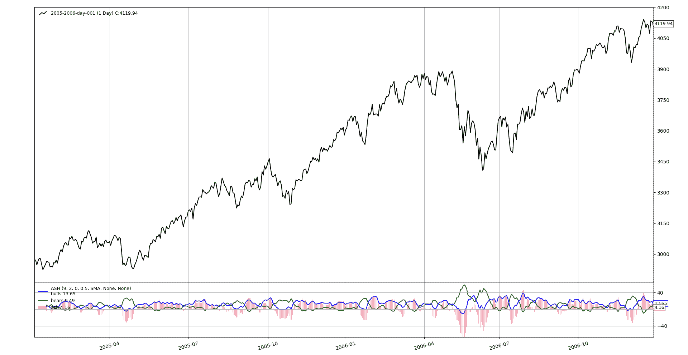

# 绝对强度直方图

> 原文：[`www.backtrader.com/recipes/indicators/ash/ash/`](https://www.backtrader.com/recipes/indicators/ash/ash/)

这是一个看起来起源于外汇世界的指标，可能在 *[`fxcodebase.com`](http://fxcodebase.com)*，但似乎很难追踪实际起源是什么。

潜在地首先在 *LUA* 中实现：

+   [`fxcodebase.com/code/viewtopic.php?f=17&t=3836`](http://fxcodebase.com/code/viewtopic.php?f=17&t=3836)

同样还提到，更新和修订的 *LUA* 版本可在以下位置找到：

+   [`fxcodebase.com/code/viewtopic.php?f=17&t=2987&p=6869&hilit=Absolute+Strength#p6869`](http://fxcodebase.com/code/viewtopic.php?f=17&t=2987&p=6869&hilit=Absolute+Strength#p6869)

同一站点托管了一个 `MQL4` 版本：

+   [`fxcodebase.com/code/viewtopic.php?f=38&t=61541`](http://fxcodebase.com/code/viewtopic.php?f=38&t=61541)

另一个 `MQL5` 版本可以在这里找到：

+   [`www.mql5.com/en/code/21429`](https://www.mql5.com/en/code/21429)

所有版本都似乎很复杂，由于语言和平台实现的原因，`MQL5` 版本有 227 行代码（当然包括一些注释），并且有轻微的差异，因此有必要确定一个合适的定义。在查看不同版本后的伪代码定义：

```py
 # p0 is the current price and p1 is the previous price
  if mode is RSI:
    bulls = 0.5 * abs(p0 - p1) + p0 - p1
    bears = 0.5 * abs(p0 - p1) - p0 + p1
  elif mode is STOCH:
    bulls = p0 - lowest(period)
    bears = highest(period - p1

  avgbulls = moving_average(bulls, period)
  avgbears = moving_average(bears, period)

  smoothedbulls = moving_average(bulls, smoothing_period) / pointsize
  smoothedbears = moving_average(bears, smoothing_period) / pointsize

  ash = smoothedbulls - smoothedbears
```

`RSI` / `STOCH` 命名是原始实现者选择的，`pointsize` 也被称为 `pipsize`，反映了其 *外汇* 起源。目前尚不清楚 *平滑平均值* 是否必须与以前的移动平均值相同，一些版本似乎使用已经平均化的价格而不是标准价格。移动平均线是使用 *整数* 选择的。

一些决定

+   该指标将使用数据提供的原始价格进行计算。如果用户希望在平均价格上运行指标，可以传递它，而不是传递原始价格。

+   `RSI` 模式中的 0.5 倍乘数将作为参数

+   移动平均线不会被任何类型的 *整数* 选择。在 *backtrader* 中，可以将实际所需的移动平均线作为参数传递。

+   平滑移动平均线，除非作为参数指定，否则将与指标中已使用的移动平均线相同

+   除非用户将值指定为参数，否则将不使用 `pointsize`。

这里是实现

```py
class ASH(bt.Indicator):
    alias = ('AbsoluteStrengthOscilator',)

    lines = ('ash', 'bulls', 'bears',)  # output lines

    # customize the plotting of the *ash* line
    plotlines = dict(ash=dict(_method='bar', alpha=0.33, width=0.66))

    RSI, STOCH = range(0, 2)  # enum values for the parameter mode

    params = dict(
        period=9,
        smoothing=2,
        mode=RSI,
        rsifactor=0.5,
        movav=bt.ind.WMA,  # WeightedMovingAverage
        smoothav=None,  # use movav if not specified
        pointsize=None,  # use only if specified
    )

    def __init__(self):
        # Start calcs according to selected mode
        if self.p.mode == self.RSI:
            p0p1 = self.data - self.data(-1)  # used twice below
            half_abs_p0p1 = self.p.rsifactor * abs(p0p1)  # used twice below

            bulls = half_abs_p0p1 + p0p1
            bears = half_abs_p0p1 - p0p1
        else:
            bulls = self.data - bt.ind.Lowest(self.data, period=self.p.period)
            bears = bt.ind.Highest(self.data, period=self.p.period) - self.data

        avbulls = self.p.movav(bulls, period=self.p.period)
        avbears = self.p.movav(bears, period=self.p.period)

        # choose smoothing average and smooth the already averaged values
        smoothav = self.p.smoothav or self.p.movav  # choose smoothav
        smoothbulls = smoothav(avbulls, period=self.p.smoothing)
        smoothbears = smoothav(avbears, period=self.p.smoothing)

        if self.p.pointsize:  # apply only if it makes sense
            smoothbulls /= self.p.pointsize
            smoothbears /= self.p.pointsize

        # Assign the final values to the output lines
        self.l.bulls = smoothbulls
        self.l.bears = smoothbears
        self.l.ash = smoothbulls - smoothbears
```

这里展示了指标的工作方式


