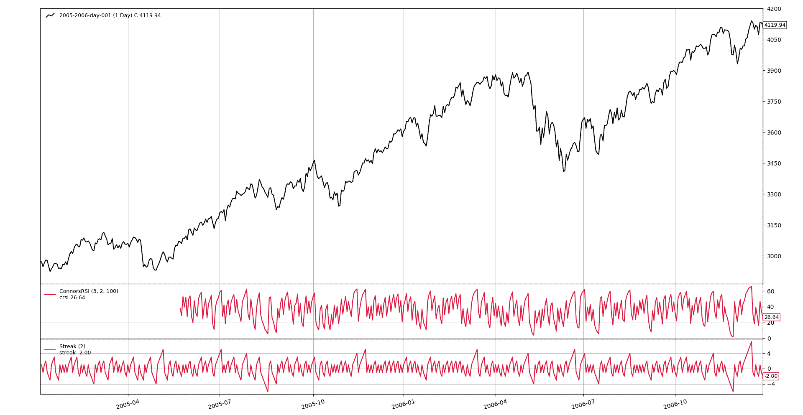

# 康纳斯 RSI

> 原文：[`www.backtrader.com/recipes/indicators/crsi/crsi/`](https://www.backtrader.com/recipes/indicators/crsi/crsi/)

Google 提供的此指标参考文献：

+   [Nirvana Systems - 创建“终极”指标 - 康纳斯 RSI](https://www.nirvanasystems.com/ultimate-indicator-connors-rsi/)

+   [TradingView - 康纳斯 RSI](https://www.tradingview.com/wiki/Connors_RSI_(CRSI))

两个来源对公式都表示同意，尽管术语不同（见下文）。 应按以下方式计算 *Connors RSI*：

```py
 `CRSI(3, 2, 100) = [RSI(3) + RSI(Streak, 2) + PercentRank(100)] / 3
```

注意

*TradingView* 表示 `ROC`（*"变动率"*）必须用于 `PctRank`（*"百分比排名"*）的位置，但从 *TradingView* 自身提供的定义来看，显然是错误的。

`Streak` 是一个非标准术语，需要定义，让我们从源（在 *TradingView* 行话中称为 *"UpDown"*) 中参考它。

+   每日价格收盘比前一日高/低的连续天数

+   如果某日收盘价与前一日相同，则连续数重置为`0`

+   向上连续产生正值，向下连续产生负值

手头有公式，理解需要使用 `PercentRank` 以及对 `Streak`（或 `UpDown`）有清晰定义，创建 `ConnorsRSI` 指标应该轻而易举。

```py
class Streak(bt.ind.PeriodN):
  '''
 Keeps a counter of the current upwards/downwards/neutral streak
 '''
    lines = ('streak',)
    params = dict(period=2)  # need prev/cur days (2) for comparisons

    curstreak = 0

    def next(self):
        d0, d1 = self.data[0], self.data[-1]

        if d0 > d1:
            self.l.streak[0] = self.curstreak = max(1, self.curstreak + 1)
        elif d0 < d1:
            self.l.streak[0] = self.curstreak = min(-1, self.curstreak - 1)
        else:
            self.l.streak[0] = self.curstreak = 0

class ConnorsRSI(bt.Indicator):
  '''
 Calculates the ConnorsRSI as:
 - (RSI(per_rsi) + RSI(Streak, per_streak) + PctRank(per_rank)) / 3
 '''
    lines = ('crsi',)
    params = dict(prsi=3, pstreak=2, prank=100)

    def __init__(self):
        # Calculate the components
        rsi = bt.ind.RSI(self.data, period=self.p.prsi)

        streak = Streak(self.data)
        rsi_streak = bt.ind.RSI(streak, period=self.p.pstreak)

        prank = bt.ind.PercentRank(self.data, period=self.p.prank)

        # Apply the formula
        self.l.crsi = (rsi + rsi_streak + prank) / 3.0
```

这里展示了指标的工作原理，还包括`Streak`辅助指标，以便视觉上验证实际连续数的输出。


