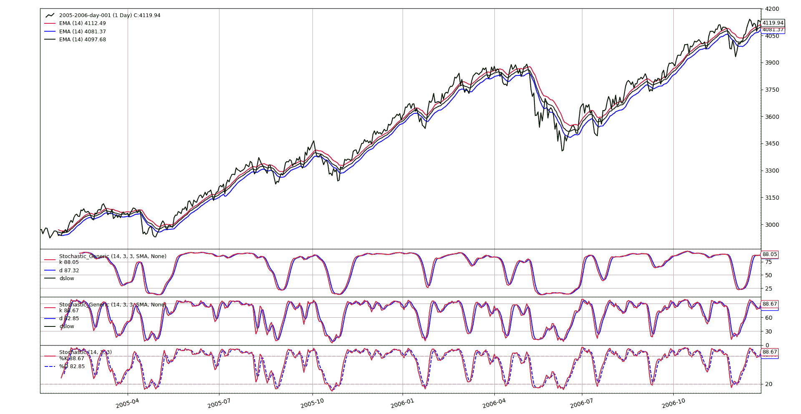

# 随机指标（通用）

> 原文：[`www.backtrader.com/recipes/indicators/stochastic/stochastic/`](https://www.backtrader.com/recipes/indicators/stochastic/stochastic/)

*backtrader*已经包含了一个`Stochastic`指标（包括一种显示三条计算线而不仅仅是通常的两条`%k`和`%d`线的变体）

但这种指标假设用于计算的数据源具有`high`、`low`和`close`组件。这是因为原始定义使用了这些组件。

如果想要使用不同的组件，一个首要的方法可能是创建一个数据源，将不同的组件存储在数据源的`high`、`low`和`close`行中。

但一个更直接的方法是拥有一个*通用*`Stochastic`指标，它接受三（3）个数据组件，并将它们用作如果它们是`high`、`low`和`close`组件。

下面的代码执行此操作，并通过允许自定义第二次平滑的移动平均值添加了一个不错的功能。

```py
`class Stochastic_Generic(bt.Indicator):
  '''
 This generic indicator doesn't assume the data feed has the components
 ``high``, ``low`` and ``close``. It needs three data sources passed to it,
 which whill considered in that order. (following the OHLC standard naming)
 '''
    lines = ('k', 'd', 'dslow',)
    params = dict(
        pk=14,
        pd=3,
        pdslow=3,
        movav=bt.ind.SMA,
        slowav=None,
    )

    def __init__(self):
        # Get highest from period k from 1st data
        highest = bt.ind.Highest(self.data0, period=self.p.pk)
        # Get lowest from period k from 2nd data
        lowest = bt.ind.Lowest(self.data1, period=self.p.pk)

        # Apply the formula to get raw K
        kraw = 100.0 * (self.data2 - lowest) / (highest - lowest)

        # The standard k in the indicator is a smoothed versin of K
        self.l.k = k = self.p.movav(kraw, period=self.p.pd)

        # Smooth k => d
        slowav = self.p.slowav or self.p.movav  # chose slowav
        self.l.d = slowav(k, period=self.p.pdslow)` 
```

当然，需要验证当给定相同的输入集时，该指标是否确实产生与标准指标相同的结果。下面的图表是使用这组指令创建的。

```py
 `# Generate 3 data feeds
        d0 = bt.ind.EMA(self.data.high, period=14)
        d1 = bt.ind.EMA(self.data.low, period=14)
        d2 = bt.ind.EMA(self.data.close, period=14)

        Stochastic_Generic(d0, d1, d2)  # customized stochastic

        # These two have generate the same results
        Stochastic_Generic(self.data.high, self.data.low, self.data.close)
        bt.ind.Stochastic(self.data)` 
```

这里是指标如何工作的视图


