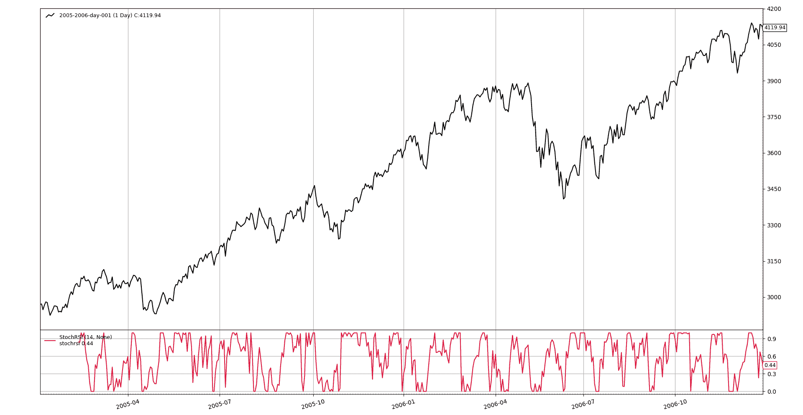

# 绝对强度柱

> 原文：[`www.backtrader.com/recipes/indicators/stochrsi/stochrsi/`](https://www.backtrader.com/recipes/indicators/stochrsi/stochrsi/)

*Stockcharts* 和 *Investopedia* 关于此指标有文献。

+   [StockCharts - StochRSI (ChartSchool)](https://stockcharts.com/school/doku.php?id=chart_school:technical_indicators:stochrsi)

+   [Investopedia - Stochastic RSI - StochRSI 定义](https://www.investopedia.com/terms/s/stochrsi.asp)

公式如下：

+   `StochRSI = (RSI - min(RSI, period)) / (max(RSI, period) - min(RSI, period))`

理论上，用于计算`RSI`的周期与随后用于查找`RSI`的最小值和最大值的周期相同。这意味着如果选择的周期是`14`（事实上的标准）用于`RSI`，则指标的总回溯期将为`28`

注意

实际回溯期将稍长，因为 `14` 期`RSI` 的有效回溯期为 `15`，因为需要比较前两个周期的收盘价格来启动计算

在任何情况下，*backtrader* 会自动计算所有必需的回溯期和预热期。

考虑到以下是 *backtrader* 中的内置指标：

+   `RSI`

+   `Lowest`（又称`MaxN`）

+   `Highest`（又称`MinN`）

根据上述公式开发`StochRSI`是直接的。

```py
`class StochRSI(bt.Indicator):
    lines = ('stochrsi',)
    params = dict(
        period=14,  # to apply to RSI
        pperiod=None,  # if passed apply to HighestN/LowestN, else "period"
    )

    def __init__(self):
        rsi = bt.ind.RSI(self.data, period=self.p.period)

        pperiod = self.p.pperiod or self.p.period
        maxrsi = bt.ind.Highest(rsi, period=pperiod)
        minrsi = bt.ind.Lowest(rsi, period=pperiod)

        self.l.stochrsi = (rsi - minrsi) / (maxrsi - minrsi)` 
```

这里是指标工作原理的一瞥


