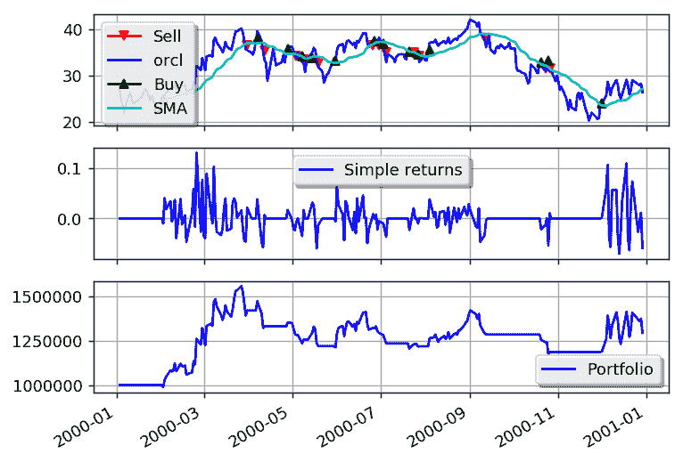

# 教程

> 原文：[`gbeced.github.io/pyalgotrade/docs/v0.20/html/tutorial.html`](https://gbeced.github.io/pyalgotrade/docs/v0.20/html/tutorial.html)

本教程的目标是为您快速介绍 PyAlgoTrade。如介绍所述，PyAlgoTrade 的目标是帮助您回测股票交易策略。假设你有一个交易策略的想法，并且想用历史数据评估它的表现，PyAlgoTrade 应该能够让你以最少的努力实现这一点。

在我继续之前，我想感谢 Pablo Jorge，他帮助审查了最初的设计和文档。

**本教程是在 UNIX 环境下开发的，但是将其调整到 Windows 环境应该很简单。**

PyAlgoTrade 有 6 个主要组件：

> +   策略
> +   
> +   数据源
> +   
> +   经纪人
> +   
> +   数据系列
> +   
> +   技术指标
> +   
> +   优化器

策略

这些是你定义的类，实现了交易逻辑。什么时候买，什么时候卖，等等。

数据源

这些是提供数据的抽象。例如，你将使用一个 CSV 数据源，从 CSV（逗号分隔值）格式的文件中加载柱状图，以向策略提供数据。数据源不限于柱状图。例如，有一个 Twitter 数据源，允许将 Twitter 事件纳入交易决策中。

经纪人

经纪人负责执行订单。

数据系列

数据系列是用于管理时间序列数据的抽象。

技术指标

这些是一组过滤器，你用它们对 DataSeries 进行计算。例如 SMA（简单移动平均）、RSI（相对强弱指标）等。这些过滤器被建模为 DataSeries 装饰器。

优化器

这些是一组允许您在不同计算机之间分发回测的类，或者在同一计算机上运行的不同进程之间分发回测的类，或者两者兼而有之。它们使水平扩展变得容易。

说了这么多，我们测试策略所需的第一件事是一些数据。让我们使用 2000 年 Oracle 的股价，我们将使用以下命令下载：

```py
python -m "pyalgotrade.tools.quandl" --source-code="WIKI" --table-code="ORCL" --from-year=2000 --to-year=2000 --storage=. --force-download --frequency=daily
```

pyalgotrade.tools.quandl 工具从[Quandl](https://www.quandl.com/)下载 CSV 格式的数据。`WIKI-ORCL-2000-quandl.csv`的前几行应该是这样的：

```py
Date,Open,High,Low,Close,Volume,Ex-Dividend,Split Ratio,Adj. Open,Adj. High,Adj. Low,Adj. Close,Adj. Volume
2000-12-29,30.88,31.31,28.69,29.06,31702200.0,0.0,1.0,28.121945213877797,28.513539658242028,26.127545601883227,26.46449896098733,31702200.0
2000-12-28,30.56,31.63,30.38,31.06,25053600.0,0.0,1.0,27.830526092490462,28.804958779629363,27.666602836710087,28.285868469658173,25053600.0
2000-12-27,30.38,31.06,29.38,30.69,26437500.0,0.0,1.0,27.666602836710087,28.285868469658173,26.755918082374667,27.94891511055407,26437500.0
2000-12-26,31.5,32.19,30.0,30.94,20589500.0,0.0,1.0,28.68656976156576,29.3149422420572,27.32054263006263,28.176586299137927,20589500.0
2000-12-22,30.38,31.98,30.0,31.88,35568200.0,0.0,1.0,27.666602836710087,29.123698443646763,27.32054263006263,29.032629968213218,35568200.0
2000-12-21,27.81,30.25,27.31,29.5,46719700.0,0.0,1.0,25.326143018068056,27.548213818646484,24.870800640900345,26.86520025289492,46719700.0
2000-12-20,28.06,29.81,27.5,28.5,54440500.0,0.0,1.0,25.55381420665191,27.147512526738897,25.043830744224078,25.9545154985595,54440500.0
2000-12-19,31.81,33.13,30.13,30.63,58653700.0,0.0,1.0,28.968882035409738,30.170985911132497,27.438931648126232,27.894274025293942,58653700.0
2000-12-18,30.0,32.44,29.94,32.0,61640100.0,0.0,1.0,27.32054263006263,29.542613430641055,27.265901544802503,29.14191213873347,61640100.0
```

让我们从一个简单的策略开始，即一个只是打印处理的收盘价的策略：

```py
from pyalgotrade import strategy
from pyalgotrade.barfeed import quandlfeed

class MyStrategy(strategy.BacktestingStrategy):
    def __init__(self, feed, instrument):
        super(MyStrategy, self).__init__(feed)
        self.__instrument = instrument

    def onBars(self, bars):
        bar = bars[self.__instrument]
        self.info(bar.getClose())

# Load the bar feed from the CSV file
feed = quandlfeed.Feed()
feed.addBarsFromCSV("orcl", "WIKI-ORCL-2000-quandl.csv")

# Evaluate the strategy with the feed's bars.
myStrategy = MyStrategy(feed, "orcl")
myStrategy.run() 
```

代码正在做三件主要的事情：

1.  声明一个新策略。只需定义一个方法，*onBars*，它会在每个数据源的柱状图上调用。

1.  从 CSV 文件加载数据源。

1.  用数据源提供的柱状图运行策略。

如果你运行这个脚本，你应该按顺序看到收盘价：

```py
2000-01-03 00:00:00 strategy [INFO] 118.1
2000-01-04 00:00:00 strategy [INFO] 107.7
2000-01-05 00:00:00 strategy [INFO] 103.5
.
.
.
2000-12-27 00:00:00 strategy [INFO] 30.69
2000-12-28 00:00:00 strategy [INFO] 31.06
2000-12-29 00:00:00 strategy [INFO] 29.06

```

让我们继续使用一个打印收盘 SMA 价格的策略，以说明技术指标的使用方法：

```py
from pyalgotrade import strategy
from pyalgotrade.barfeed import quandlfeed
from pyalgotrade.technical import ma

def safe_round(value, digits):
    if value is not None:
        value = round(value, digits)
    return value

class MyStrategy(strategy.BacktestingStrategy):
    def __init__(self, feed, instrument):
        super(MyStrategy, self).__init__(feed)
        # We want a 15 period SMA over the closing prices.
        self.__sma = ma.SMA(feed[instrument].getCloseDataSeries(), 15)
        self.__instrument = instrument

    def onBars(self, bars):
        bar = bars[self.__instrument]
        self.info("%s  %s" % (bar.getClose(), safe_round(self.__sma[-1], 2)))

# Load the bar feed from the CSV file
feed = quandlfeed.Feed()
feed.addBarsFromCSV("orcl", "WIKI-ORCL-2000-quandl.csv")

# Evaluate the strategy with the feed's bars.
myStrategy = MyStrategy(feed, "orcl")
myStrategy.run() 
```

这与前面的示例非常相似，只是：

> 1.  我们正在对收盘价数据系列初始化 SMA 过滤器。
> 1.  
> 1.  我们打印当前 SMA 值以及收盘价。

如果你运行脚本，你应该会看到收盘价和相应的 SMA 值，但在这种情况下，前 14 个 SMA 值为 None。这是因为我们需要至少 15 个值才能从 SMA 中得到结果：

```py
2000-01-03 00:00:00 strategy [INFO] 118.1 None
2000-01-04 00:00:00 strategy [INFO] 107.7 None
2000-01-05 00:00:00 strategy [INFO] 103.5 None
2000-01-06 00:00:00 strategy [INFO] 96.0 None
2000-01-07 00:00:00 strategy [INFO] 103.4 None
2000-01-10 00:00:00 strategy [INFO] 115.8 None
2000-01-11 00:00:00 strategy [INFO] 112.4 None
2000-01-12 00:00:00 strategy [INFO] 105.6 None
2000-01-13 00:00:00 strategy [INFO] 105.1 None
2000-01-14 00:00:00 strategy [INFO] 106.8 None
2000-01-18 00:00:00 strategy [INFO] 111.3 None
2000-01-19 00:00:00 strategy [INFO] 57.13 None
2000-01-20 00:00:00 strategy [INFO] 59.25 None
2000-01-21 00:00:00 strategy [INFO] 59.69 None
2000-01-24 00:00:00 strategy [INFO] 54.19 94.4
2000-01-25 00:00:00 strategy [INFO] 56.44 90.29
.
.
.
2000-12-27 00:00:00 strategy [INFO] 30.69 29.99
2000-12-28 00:00:00 strategy [INFO] 31.06 30.05
2000-12-29 00:00:00 strategy [INFO] 29.06 30.1

```

当值无法在给定时间计算时，所有的技术指标都将返回 None。

有关技术指标的一个重要事项是它们可以组合使用。这是因为它们也被建模为 DataSeries。例如，获取收盘价上的 RSI 上的 SMA 就像这样简单：

```py
from pyalgotrade import strategy
from pyalgotrade.barfeed import quandlfeed
from pyalgotrade.technical import ma
from pyalgotrade.technical import rsi

def safe_round(value, digits):
    if value is not None:
        value = round(value, digits)
    return value

class MyStrategy(strategy.BacktestingStrategy):
    def __init__(self, feed, instrument):
        super(MyStrategy, self).__init__(feed)
        self.__rsi = rsi.RSI(feed[instrument].getCloseDataSeries(), 14)
        self.__sma = ma.SMA(self.__rsi, 15)
        self.__instrument = instrument

    def onBars(self, bars):
        bar = bars[self.__instrument]
        self.info("%s  %s  %s" % (
            bar.getClose(), safe_round(self.__rsi[-1], 2), safe_round(self.__sma[-1], 2)
        ))

# Load the bar feed from the CSV file
feed = quandlfeed.Feed()
feed.addBarsFromCSV("orcl", "WIKI-ORCL-2000-quandl.csv")

# Evaluate the strategy with the feed's bars.
myStrategy = MyStrategy(feed, "orcl")
myStrategy.run() 
```

如果你运行脚本，你应该会在屏幕上看到一堆值，其中：

> +   前 14 个 RSI 值为 None。这是因为我们需要至少 15 个值才能得到一个 RSI 值。
> +   
> +   前 28 个 SMA 值为 None。这是因为前 14 个 RSI 值为 None，而第 15 个是 SMA 过滤器收到的第一个非 None 值。只有当我们有 15 个非 None 值时，才能计算 SMA（15）。

```py
2000-01-03 00:00:00 strategy [INFO] 118.1 None None
2000-01-04 00:00:00 strategy [INFO] 107.7 None None
2000-01-05 00:00:00 strategy [INFO] 103.5 None None
2000-01-06 00:00:00 strategy [INFO] 96.0 None None
2000-01-07 00:00:00 strategy [INFO] 103.4 None None
2000-01-10 00:00:00 strategy [INFO] 115.8 None None
2000-01-11 00:00:00 strategy [INFO] 112.4 None None
2000-01-12 00:00:00 strategy [INFO] 105.6 None None
2000-01-13 00:00:00 strategy [INFO] 105.1 None None
2000-01-14 00:00:00 strategy [INFO] 106.8 None None
2000-01-18 00:00:00 strategy [INFO] 111.3 None None
2000-01-19 00:00:00 strategy [INFO] 57.13 None None
2000-01-20 00:00:00 strategy [INFO] 59.25 None None
2000-01-21 00:00:00 strategy [INFO] 59.69 None None
2000-01-24 00:00:00 strategy [INFO] 54.19 23.6 None
2000-01-25 00:00:00 strategy [INFO] 56.44 25.1 None
2000-01-26 00:00:00 strategy [INFO] 55.06 24.78 None
2000-01-27 00:00:00 strategy [INFO] 51.81 24.0 None
2000-01-28 00:00:00 strategy [INFO] 47.38 22.94 None
2000-01-31 00:00:00 strategy [INFO] 49.95 25.01 None
2000-02-01 00:00:00 strategy [INFO] 54.0 28.27 None
2000-02-02 00:00:00 strategy [INFO] 54.31 28.53 None
2000-02-03 00:00:00 strategy [INFO] 56.69 30.58 None
2000-02-04 00:00:00 strategy [INFO] 57.81 31.58 None
2000-02-07 00:00:00 strategy [INFO] 59.94 33.53 None
2000-02-08 00:00:00 strategy [INFO] 59.56 33.35 None
2000-02-09 00:00:00 strategy [INFO] 59.94 33.73 None
2000-02-10 00:00:00 strategy [INFO] 62.31 36.23 None
2000-02-11 00:00:00 strategy [INFO] 59.69 34.68 29.06
2000-02-14 00:00:00 strategy [INFO] 62.19 37.44 29.98
.
.
.
2000-12-27 00:00:00 strategy [INFO] 30.69 51.31 49.85
2000-12-28 00:00:00 strategy [INFO] 31.06 52.16 50.0
2000-12-29 00:00:00 strategy [INFO] 29.06 47.37 50.08

```

## 交易

让我们用一个简单的策略继续，这次模拟实际交易。这个想法非常简单：

> +   如果调整后的收盘价高于 SMA（15），我们就进入多头头寸（我们放置一个市价买单）。
> +   
> +   如果已经存在多头头寸，并且调整后的收盘价低于 SMA（15），我们就退出多头头寸（我们放置一个卖市价单）。

```py
from __future__ import print_function

from pyalgotrade import strategy
from pyalgotrade.barfeed import quandlfeed
from pyalgotrade.technical import ma

class MyStrategy(strategy.BacktestingStrategy):
    def __init__(self, feed, instrument, smaPeriod):
        super(MyStrategy, self).__init__(feed, 1000)
        self.__position = None
        self.__instrument = instrument
        # We'll use adjusted close values instead of regular close values.
        self.setUseAdjustedValues(True)
        self.__sma = ma.SMA(feed[instrument].getPriceDataSeries(), smaPeriod)

    def onEnterOk(self, position):
        execInfo = position.getEntryOrder().getExecutionInfo()
        self.info("BUY at $%.2f" % (execInfo.getPrice()))

    def onEnterCanceled(self, position):
        self.__position = None

    def onExitOk(self, position):
        execInfo = position.getExitOrder().getExecutionInfo()
        self.info("SELL at $%.2f" % (execInfo.getPrice()))
        self.__position = None

    def onExitCanceled(self, position):
        # If the exit was canceled, re-submit it.
        self.__position.exitMarket()

    def onBars(self, bars):
        # Wait for enough bars to be available to calculate a SMA.
        if self.__sma[-1] is None:
            return

        bar = bars[self.__instrument]
        # If a position was not opened, check if we should enter a long position.
        if self.__position is None:
            if bar.getPrice() > self.__sma[-1]:
                # Enter a buy market order for 10 shares. The order is good till canceled.
                self.__position = self.enterLong(self.__instrument, 10, True)
        # Check if we have to exit the position.
        elif bar.getPrice() < self.__sma[-1] and not self.__position.exitActive():
            self.__position.exitMarket()

def run_strategy(smaPeriod):
    # Load the bar feed from the CSV file
    feed = quandlfeed.Feed()
    feed.addBarsFromCSV("orcl", "WIKI-ORCL-2000-quandl.csv")

    # Evaluate the strategy with the feed.
    myStrategy = MyStrategy(feed, "orcl", smaPeriod)
    myStrategy.run()
    print("Final portfolio value: $%.2f" % myStrategy.getBroker().getEquity())

run_strategy(15) 
```

如果你运行脚本，你应该会看到类似于这样的东西：

```py
2000-01-26 00:00:00 strategy [INFO] BUY at $25.84
2000-01-28 00:00:00 strategy [INFO] SELL at $23.45
2000-02-03 00:00:00 strategy [INFO] BUY at $25.22
2000-02-22 00:00:00 strategy [INFO] SELL at $26.92
2000-02-23 00:00:00 strategy [INFO] BUY at $27.41
2000-03-31 00:00:00 strategy [INFO] SELL at $36.51
2000-04-07 00:00:00 strategy [INFO] BUY at $38.11
2000-04-12 00:00:00 strategy [INFO] SELL at $35.49
2000-04-19 00:00:00 strategy [INFO] BUY at $35.80
2000-04-20 00:00:00 strategy [INFO] SELL at $33.61
2000-04-28 00:00:00 strategy [INFO] BUY at $35.74
2000-05-05 00:00:00 strategy [INFO] SELL at $33.70
2000-05-08 00:00:00 strategy [INFO] BUY at $34.29
2000-05-09 00:00:00 strategy [INFO] SELL at $33.55
2000-05-16 00:00:00 strategy [INFO] BUY at $35.35
2000-05-19 00:00:00 strategy [INFO] SELL at $32.78
2000-05-31 00:00:00 strategy [INFO] BUY at $33.35
2000-06-23 00:00:00 strategy [INFO] SELL at $36.80
2000-06-27 00:00:00 strategy [INFO] BUY at $37.51
2000-06-28 00:00:00 strategy [INFO] SELL at $37.37
2000-06-29 00:00:00 strategy [INFO] BUY at $37.37
2000-06-30 00:00:00 strategy [INFO] SELL at $36.60
2000-07-03 00:00:00 strategy [INFO] BUY at $36.94
2000-07-05 00:00:00 strategy [INFO] SELL at $34.97
2000-07-21 00:00:00 strategy [INFO] BUY at $35.26
2000-07-24 00:00:00 strategy [INFO] SELL at $35.12
2000-07-26 00:00:00 strategy [INFO] BUY at $34.06
2000-07-28 00:00:00 strategy [INFO] SELL at $34.21
2000-08-01 00:00:00 strategy [INFO] BUY at $34.24
2000-08-02 00:00:00 strategy [INFO] SELL at $33.24
2000-08-04 00:00:00 strategy [INFO] BUY at $35.66
2000-09-11 00:00:00 strategy [INFO] SELL at $39.19
2000-09-29 00:00:00 strategy [INFO] BUY at $37.05
2000-10-02 00:00:00 strategy [INFO] SELL at $36.31
2000-10-20 00:00:00 strategy [INFO] BUY at $32.90
2000-10-31 00:00:00 strategy [INFO] SELL at $29.72
2000-11-20 00:00:00 strategy [INFO] BUY at $22.14
2000-11-21 00:00:00 strategy [INFO] SELL at $22.59
2000-12-01 00:00:00 strategy [INFO] BUY at $24.02
2000-12-15 00:00:00 strategy [INFO] SELL at $26.81
2000-12-18 00:00:00 strategy [INFO] BUY at $27.32
2000-12-21 00:00:00 strategy [INFO] SELL at $25.33
2000-12-22 00:00:00 strategy [INFO] BUY at $27.67
Final portfolio value: $974.87

```

但是，如果我们使用 30 作为 SMA 周期，而不是 15？那会产生更好的结果还是更差的结果？我们当然可以做这样的事情：

```py
for i in range(10, 30):
    run_strategy(i) 
```

我们会发现，使用 SMA（20）可以获得更好的结果：

```py
Final portfolio value: $1071.03
```

如果我们只需要尝试有限的参数值集合，那么这是可以的。但是如果我们必须测试一个具有多个参数的策略，那么串行方法肯定不会随着策略变得更加复杂而扩展。

## 优化

满足优化器组件。这个想法非常简单：

> +   有一个负责的服务器：
> +   
>     +   提供运行策略的条形图。
>     +   
>     +   提供运行策略的参数。
>     +   
>     +   记录每个工作人员的策略结果。
>     +   
> +   有多个负责的工作人员：
> +   
>     +   使用服务器提供的条形图和参数运行策略。

为了说明这一点，我们将使用一个称为[RSI2](http://stockcharts.com/school/doku.php?id=chart_school:trading_strategies:rsi2)的策略，它需要以下参数：

> +   用于趋势识别的 SMA 周期。我们将其称为 entrySMA，范围在 150 到 250 之间。
> +   
> +   退出点使用较小的 SMA 周期。我们将其称为 exitSMA，范围在 5 到 15 之间。
> +   
> +   用于进入短头寸/多头头寸的 RSI 周期。我们将其称为 rsiPeriod，范围在 2 到 10 之间。
> +   
> +   用于多头头寸进入的 RSI 超卖阈值。我们将其称为 overSoldThreshold，范围在 5 到 25 之间。
> +   
> +   用于短头寸进入的 RSI 超买阈值。我们将其称为 overBoughtThreshold，范围在 75 到 95 之间。

如果我的数学没错的话，这些是 4409559 个不同的组合。

对于一个参数集测试该策略大约需要 0.16 秒。如果我串行执行所有组合，那么评估它们并找到最佳参数组合将需要大约 8.5 天的时间。那是一个很长的时间，但如果我可以让十台 8 核计算机来做这个工作，那么总时间将缩短到约 2.5 小时。

长话短说，**我们需要并行化**。

让我们从下载“IBM”的 3 年每日柱开始：

```py
python -m "pyalgotrade.tools.quandl" --source-code="WIKI" --table-code="IBM" --from-year=2009 --to-year=2011 --storage=. --force-download --frequency=daily
```

将此代码保存为 rsi2.py：

```py
from pyalgotrade import strategy
from pyalgotrade.technical import ma
from pyalgotrade.technical import rsi
from pyalgotrade.technical import cross

class RSI2(strategy.BacktestingStrategy):
    def __init__(self, feed, instrument, entrySMA, exitSMA, rsiPeriod, overBoughtThreshold, overSoldThreshold):
        super(RSI2, self).__init__(feed)
        self.__instrument = instrument
        # We'll use adjusted close values, if available, instead of regular close values.
        if feed.barsHaveAdjClose():
            self.setUseAdjustedValues(True)
        self.__priceDS = feed[instrument].getPriceDataSeries()
        self.__entrySMA = ma.SMA(self.__priceDS, entrySMA)
        self.__exitSMA = ma.SMA(self.__priceDS, exitSMA)
        self.__rsi = rsi.RSI(self.__priceDS, rsiPeriod)
        self.__overBoughtThreshold = overBoughtThreshold
        self.__overSoldThreshold = overSoldThreshold
        self.__longPos = None
        self.__shortPos = None

    def getEntrySMA(self):
        return self.__entrySMA

    def getExitSMA(self):
        return self.__exitSMA

    def getRSI(self):
        return self.__rsi

    def onEnterCanceled(self, position):
        if self.__longPos == position:
            self.__longPos = None
        elif self.__shortPos == position:
            self.__shortPos = None
        else:
            assert(False)

    def onExitOk(self, position):
        if self.__longPos == position:
            self.__longPos = None
        elif self.__shortPos == position:
            self.__shortPos = None
        else:
            assert(False)

    def onExitCanceled(self, position):
        # If the exit was canceled, re-submit it.
        position.exitMarket()

    def onBars(self, bars):
        # Wait for enough bars to be available to calculate SMA and RSI.
        if self.__exitSMA[-1] is None or self.__entrySMA[-1] is None or self.__rsi[-1] is None:
            return

        bar = bars[self.__instrument]
        if self.__longPos is not None:
            if self.exitLongSignal():
                self.__longPos.exitMarket()
        elif self.__shortPos is not None:
            if self.exitShortSignal():
                self.__shortPos.exitMarket()
        else:
            if self.enterLongSignal(bar):
                shares = int(self.getBroker().getCash() * 0.9 / bars[self.__instrument].getPrice())
                self.__longPos = self.enterLong(self.__instrument, shares, True)
            elif self.enterShortSignal(bar):
                shares = int(self.getBroker().getCash() * 0.9 / bars[self.__instrument].getPrice())
                self.__shortPos = self.enterShort(self.__instrument, shares, True)

    def enterLongSignal(self, bar):
        return bar.getPrice() > self.__entrySMA[-1] and self.__rsi[-1] <= self.__overSoldThreshold

    def exitLongSignal(self):
        return cross.cross_above(self.__priceDS, self.__exitSMA) and not self.__longPos.exitActive()

    def enterShortSignal(self, bar):
        return bar.getPrice() < self.__entrySMA[-1] and self.__rsi[-1] >= self.__overBoughtThreshold

    def exitShortSignal(self):
        return cross.cross_below(self.__priceDS, self.__exitSMA) and not self.__shortPos.exitActive() 
```

这是服务器脚本：

```py
import itertools
from pyalgotrade.optimizer import server
from pyalgotrade.barfeed import quandlfeed

def parameters_generator():
    instrument = ["ibm"]
    entrySMA = range(150, 251)
    exitSMA = range(5, 16)
    rsiPeriod = range(2, 11)
    overBoughtThreshold = range(75, 96)
    overSoldThreshold = range(5, 26)
    return itertools.product(instrument, entrySMA, exitSMA, rsiPeriod, overBoughtThreshold, overSoldThreshold)

# The if __name__ == '__main__' part is necessary if running on Windows.
if __name__ == '__main__':
    # Load the bar feed from the CSV files.
    feed = quandlfeed.Feed()
    feed.addBarsFromCSV("ibm", "WIKI-IBM-2009-quandl.csv")
    feed.addBarsFromCSV("ibm", "WIKI-IBM-2010-quandl.csv")
    feed.addBarsFromCSV("ibm", "WIKI-IBM-2011-quandl.csv")

    # Run the server.
    server.serve(feed, parameters_generator(), "localhost", 5000) 
```

服务器代码正在做 3 件事：

> 1.  声明一个生成器函数，产生策略的不同参数组合。
> 1.  
> 1.  使用我们下载的 CSV 文件加载源数据。
> 1.  
> 1.  运行服务器，它将在端口 5000 上等待传入连接。

这是工作脚本，使用 **pyalgotrade.optimizer.worker** 模块并行运行由服务器提供数据的策略：

```py
from pyalgotrade.optimizer import worker
import rsi2

# The if __name__ == '__main__' part is necessary if running on Windows.
if __name__ == '__main__':
    worker.run(rsi2.RSI2, "localhost", 5000, workerName="localworker") 
```

当你运行服务器和客户端时，你会在服务器控制台上看到类似这样的东西：

```py
2017-07-21 22:56:51,944 pyalgotrade.optimizer.server [INFO] Starting server
2017-07-21 22:56:51,944 pyalgotrade.optimizer.xmlrpcserver [INFO] Loading bars
2017-07-21 22:56:52,609 pyalgotrade.optimizer.xmlrpcserver [INFO] Started serving
2017-07-21 22:58:50,073 pyalgotrade.optimizer.xmlrpcserver [INFO] Best result so far 1261295.07089 with parameters ('ibm', 150, 5, 2, 83, 24)
.
.
```

以及在工作节点控制台上看到类似这样的东西：

```py
2017-07-21 22:56:57,884 localworker [INFO] Started running
2017-07-21 22:56:57,884 localworker [INFO] Started running
2017-07-21 22:56:58,439 localworker [INFO] Running strategy with parameters ('ibm', 150, 5, 2, 84, 15)
2017-07-21 22:56:58,498 localworker [INFO] Running strategy with parameters ('ibm', 150, 5, 2, 94, 5)
2017-07-21 22:56:58,918 localworker [INFO] Result 1137855.88871
2017-07-21 22:56:58,918 localworker [INFO] Running strategy with parameters ('ibm', 150, 5, 2, 84, 14)
2017-07-21 22:56:58,996 localworker [INFO] Result 1027761.85581
2017-07-21 22:56:58,997 localworker [INFO] Running strategy with parameters ('ibm', 150, 5, 2, 93, 25)
2017-07-21 22:56:59,427 localworker [INFO] Result 1092194.67448
2017-07-21 22:57:00,016 localworker [INFO] Result 1260766.64479
.
.
```

请注意，你应该运行 **只有一个服务器和一个或多个工作节点**。

如果你只想在自己的桌面上并行运行策略，你可以像这样利用 **pyalgotrade.optimizer.local** 模块：

```py
import itertools
from pyalgotrade.optimizer import local
from pyalgotrade.barfeed import quandlfeed
import rsi2

def parameters_generator():
    instrument = ["ibm"]
    entrySMA = range(150, 251)
    exitSMA = range(5, 16)
    rsiPeriod = range(2, 11)
    overBoughtThreshold = range(75, 96)
    overSoldThreshold = range(5, 26)
    return itertools.product(instrument, entrySMA, exitSMA, rsiPeriod, overBoughtThreshold, overSoldThreshold)

# The if __name__ == '__main__' part is necessary if running on Windows.
if __name__ == '__main__':
    # Load the bar feed from the CSV files.
    feed = quandlfeed.Feed()
    feed.addBarsFromCSV("ibm", "WIKI-IBM-2009-quandl.csv")
    feed.addBarsFromCSV("ibm", "WIKI-IBM-2010-quandl.csv")
    feed.addBarsFromCSV("ibm", "WIKI-IBM-2011-quandl.csv")

    local.run(rsi2.RSI2, feed, parameters_generator()) 
```

该代码正在做 3 件事：

> 1.  声明一个生成器函数，产生不同的参数组合。
> 1.  
> 1.  使用我们下载的 CSV 文件加载源数据。
> 1.  
> 1.  使用 **pyalgotrade.optimizer.local** 模块并行运行策略，找到最佳结果。

当你运行此代码时，你应该看到类似这样的东西：

```py
2017-07-21 22:59:26,921 pyalgotrade.optimizer.local [INFO] Starting server
2017-07-21 22:59:26,922 pyalgotrade.optimizer.xmlrpcserver [INFO] Loading bars
2017-07-21 22:59:26,922 pyalgotrade.optimizer.local [INFO] Starting workers
2017-07-21 22:59:27,642 pyalgotrade.optimizer.xmlrpcserver [INFO] Started serving
2017-07-21 23:01:14,306 pyalgotrade.optimizer.xmlrpcserver [INFO] Best result so far 1261295.07089 with parameters ('ibm', 150, 5, 2, 83, 24)
.
.
```

## 绘图

PyAlgoTrade 可以很容易地绘制策略执行。

将此保存为 sma_crossover.py：

```py
from pyalgotrade import strategy
from pyalgotrade.technical import ma
from pyalgotrade.technical import cross

class SMACrossOver(strategy.BacktestingStrategy):
    def __init__(self, feed, instrument, smaPeriod):
        super(SMACrossOver, self).__init__(feed)
        self.__instrument = instrument
        self.__position = None
        # We'll use adjusted close values instead of regular close values.
        self.setUseAdjustedValues(True)
        self.__prices = feed[instrument].getPriceDataSeries()
        self.__sma = ma.SMA(self.__prices, smaPeriod)

    def getSMA(self):
        return self.__sma

    def onEnterCanceled(self, position):
        self.__position = None

    def onExitOk(self, position):
        self.__position = None

    def onExitCanceled(self, position):
        # If the exit was canceled, re-submit it.
        self.__position.exitMarket()

    def onBars(self, bars):
        # If a position was not opened, check if we should enter a long position.
        if self.__position is None:
            if cross.cross_above(self.__prices, self.__sma) > 0:
                shares = int(self.getBroker().getCash() * 0.9 / bars[self.__instrument].getPrice())
                # Enter a buy market order. The order is good till canceled.
                self.__position = self.enterLong(self.__instrument, shares, True)
        # Check if we have to exit the position.
        elif not self.__position.exitActive() and cross.cross_below(self.__prices, self.__sma) > 0:
            self.__position.exitMarket() 
```

并将此代码保存到不同的文件中：

```py
from pyalgotrade import plotter
from pyalgotrade.barfeed import quandlfeed
from pyalgotrade.stratanalyzer import returns
import sma_crossover

# Load the bar feed from the CSV file
feed = quandlfeed.Feed()
feed.addBarsFromCSV("orcl", "WIKI-ORCL-2000-quandl.csv")

# Evaluate the strategy with the feed's bars.
myStrategy = sma_crossover.SMACrossOver(feed, "orcl", 20)

# Attach a returns analyzers to the strategy.
returnsAnalyzer = returns.Returns()
myStrategy.attachAnalyzer(returnsAnalyzer)

# Attach the plotter to the strategy.
plt = plotter.StrategyPlotter(myStrategy)
# Include the SMA in the instrument's subplot to get it displayed along with the closing prices.
plt.getInstrumentSubplot("orcl").addDataSeries("SMA", myStrategy.getSMA())
# Plot the simple returns on each bar.
plt.getOrCreateSubplot("returns").addDataSeries("Simple returns", returnsAnalyzer.getReturns())

# Run the strategy.
myStrategy.run()
myStrategy.info("Final portfolio value: $%.2f" % myStrategy.getResult())

# Plot the strategy.
plt.plot() 
```

该代码正在做 3 件事：

> 1.  从 CSV 文件加载源数据。
> 1.  
> 1.  使用由 feed 提供的柱和附加了 StrategyPlotter 的策略运行。
> 1.  
> 1.  绘制策略。

这就是绘图的样子：



希望您喜欢这个快速介绍。我建议您在这里下载 PyAlgoTrade：[`gbeced.github.io/pyalgotrade/downloads/index.html`](http://gbeced.github.io/pyalgotrade/downloads/index.html)，并开始编写您自己的策略。

您也可以在*示例策略* 部分找到更多示例。

### 目录

+   教程

    +   交易

    +   优化

    +   绘图

