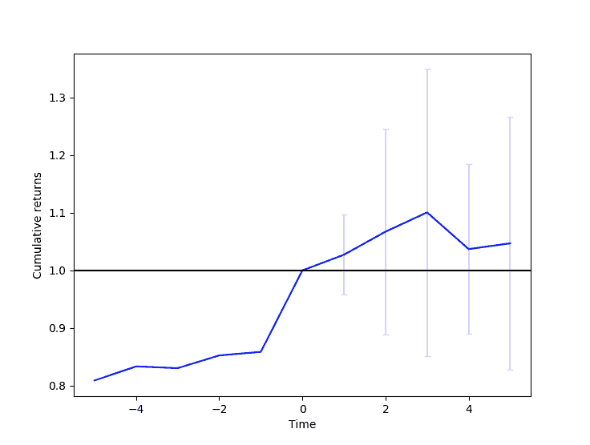

# 事件分析器

> 原文：[`gbeced.github.io/pyalgotrade/docs/v0.20/html/eventprofiler.html`](https://gbeced.github.io/pyalgotrade/docs/v0.20/html/eventprofiler.html)

灵感来源于[QSTK](http://wiki.quantsoftware.org/index.php?title=QSTK_Tutorial_9)，**eventprofiler**模块是一个工具，用于统计分析事件如何影响未来的股票价格。事件分析器扫描历史数据以寻找指定事件，然后计算该事件对过去和未来一定回溯期内的股票价格的影响。

**该工具的目标是在继续回测流程之前帮助您快速验证一个想法。**

*类* `pyalgotrade.eventprofiler.``Results`（*eventsDict*，*lookBack*，*lookForward*）

基类：`object`

分析器的结果。

`getEventCount`()

返回发生的事件数量。跳过边界上的事件。

*类* `pyalgotrade.eventprofiler.``Predicate`

基类：`object`

事件识别的基类。您应该子类化此类以实现事件识别逻辑。

`eventOccurred`（*instrument*，*bards*）

覆盖（**必需**）以确定上一个数据条中是否发生了事件（bards[-1]）。

| 参数： |
| --- |

+   **instrument**（*字符串*） – 仪器标识符。

+   **bards**（`pyalgotrade.dataseries.bards.BarDataSeries`.） – 给定仪器的 BarDataSeries。

|

| 返回类型： | 布尔值。 |
| --- | --- |

*类* `pyalgotrade.eventprofiler.``Profiler`（*predicate*，*lookBack*，*lookForward*）

基类：`object`

该类负责扫描历史数据并分析事件之前和之后的回报。

| 参数： |
| --- |

+   **predicate**（`Predicate`.） – 负责识别事件的`Predicate`子类。

+   **lookBack**（*整数*） – 事件前要分析的数据条数。必须 > 0。

+   **lookForward**（*整数*） – 事件后要分析的数据条数。必须 > 0。

|

`getResults`()

返回分析结果。

| 返回类型： | `Results`. |
| --- | --- |

`run`（*feed*，*useAdjustedCloseForReturns=True*）

使用提供的数据条运行分析。

| 参数： |
| --- |

+   **barFeed**（`pyalgotrade.barfeed.BarFeed`。） – 用于运行分析的数据条。

+   **useAdjustedCloseForReturns**（*布尔值*） – 如果应使用调整后的收盘价计算回报，则为 True。

|

`pyalgotrade.eventprofiler.``plot`（*profilerResults*）

绘制分析结果。

| 参数： | **profilerResults**（`Results`.） – 分析结果 |
| --- | --- |

## 示例

以下示例受到 Ernie Chan 的书籍《Algorithmic Trading: Winning Strategies and Their Rationale》中的“买入跳空模型”的启发：

> +   思路是选择在市场开盘附近的一只股票，其从前一日最低点到今日开盘的收益低于一个标准偏差。标准偏差是使用过去 90 天的每日收盘至收盘收益率计算的。这些是“跳空下跌”的股票。
> +   
> +   这是通过要求开盘价高于收盘价的 20 日移动平均线来缩小范围的。

```py
from __future__ import print_function

from pyalgotrade import eventprofiler
from pyalgotrade.technical import stats
from pyalgotrade.technical import roc
from pyalgotrade.technical import ma
from pyalgotrade.tools import quandl

# Event inspired on an example from Ernie Chan's book:
# 'Algorithmic Trading: Winning Strategies and Their Rationale'

class BuyOnGap(eventprofiler.Predicate):
    def __init__(self, feed):
        super(BuyOnGap, self).__init__()

        stdDevPeriod = 90
        smaPeriod = 20
        self.__returns = {}
        self.__stdDev = {}
        self.__ma = {}
        for instrument in feed.getRegisteredInstruments():
            priceDS = feed[instrument].getAdjCloseDataSeries()
            # Returns over the adjusted close values.
            self.__returns[instrument] = roc.RateOfChange(priceDS, 1)
            # StdDev over those returns.
            self.__stdDev[instrument] = stats.StdDev(self.__returns[instrument], stdDevPeriod)
            # MA over the adjusted close values.
            self.__ma[instrument] = ma.SMA(priceDS, smaPeriod)

    def __gappedDown(self, instrument, bards):
        ret = False
        if self.__stdDev[instrument][-1] is not None:
            prevBar = bards[-2]
            currBar = bards[-1]
            low2OpenRet = (currBar.getOpen(True) - prevBar.getLow(True)) / float(prevBar.getLow(True))
            if low2OpenRet < (self.__returns[instrument][-1] - self.__stdDev[instrument][-1]):
                ret = True
        return ret

    def __aboveSMA(self, instrument, bards):
        ret = False
        if self.__ma[instrument][-1] is not None and bards[-1].getOpen(True) > self.__ma[instrument][-1]:
            ret = True
        return ret

    def eventOccurred(self, instrument, bards):
        ret = False
        if self.__gappedDown(instrument, bards) and self.__aboveSMA(instrument, bards):
            ret = True
        return ret

def main(plot):
    instruments = ["IBM", "AES", "AIG"]
    feed = quandl.build_feed("WIKI", instruments, 2008, 2009, ".")

    predicate = BuyOnGap(feed)
    eventProfiler = eventprofiler.Profiler(predicate, 5, 5)
    eventProfiler.run(feed, True)

    results = eventProfiler.getResults()
    print("%d events found" % (results.getEventCount()))
    if plot:
        eventprofiler.plot(results)

if __name__ == "__main__":
    main(True) 
```

代码正在做 4 件事情：

> 1.  声明一个`Predicate`，实现“买入跳空模型”事件识别。
> 1.  
> 1.  为某些股票加载进度条。
> 1.  
> 1.  运行分析。
> 1.  
> 1.  绘制结果。

输出应如下所示：



```py
2017-07-22 00:26:06,574 quandl [INFO] Downloading IBM 2008 to ./WIKI-IBM-2008-quandl.csv
2017-07-22 00:26:08,299 quandl [INFO] Downloading AES 2008 to ./WIKI-AES-2008-quandl.csv
2017-07-22 00:26:09,849 quandl [INFO] Downloading AIG 2008 to ./WIKI-AIG-2008-quandl.csv
2017-07-22 00:26:11,513 quandl [INFO] Downloading IBM 2009 to ./WIKI-IBM-2009-quandl.csv
2017-07-22 00:26:13,128 quandl [INFO] Downloading AES 2009 to ./WIKI-AES-2009-quandl.csv
2017-07-22 00:26:14,626 quandl [INFO] Downloading AIG 2009 to ./WIKI-AIG-2009-quandl.csv
15 events found

```

请注意**累积收益已归一化至事件发生时间**。

### 目录

+   事件分析器

    +   示例

#### 上一个主题

工具

#### 下一个主题

比特币

### 本页

+   显示源代码

### 快速搜索

输入搜索词或模块、类或函数名称。

### 导航

+   索引

+   模块 |

+   下一个 |

+   上一个 |

+   PyAlgoTrade 0.20 文档 »
