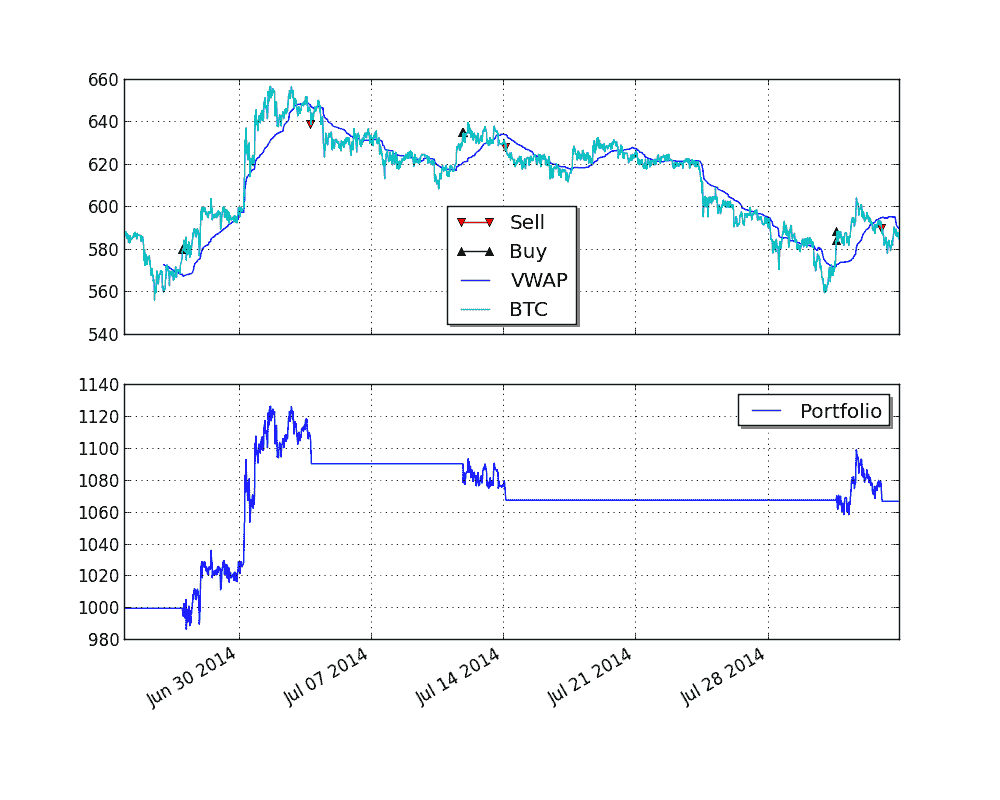

# 比特币图表示例

> 原文：[`gbeced.github.io/pyalgotrade/docs/v0.20/html/bitcoincharts_example.html`](https://gbeced.github.io/pyalgotrade/docs/v0.20/html/bitcoincharts_example.html)

尽管使用[`www.bitcoincharts.com/about/markets-api/`](http://www.bitcoincharts.com/about/markets-api/)提供的刻度数据可以完全进行策略回测，使用`pyalgotrade.bitcoincharts.barfeed.CSVTradeFeed`，但您可能希望使用不同频率的汇总柱状图进行回测，以加快回测速度。

截至 2014 年 8 月 12 日，[`api.bitcoincharts.com/v1/csv/bitstampUSD.csv.gz`](http://api.bitcoincharts.com/v1/csv/bitstampUSD.csv.gz) 有 4588830 个事件，因此我们将使用以下脚本将其中的一部分转换为 30 分钟的柱状图，用于回测目的：

```py
from pyalgotrade.bitcoincharts import barfeed
from pyalgotrade.tools import resample
from pyalgotrade import bar

import datetime

def main():
    barFeed = barfeed.CSVTradeFeed()
    barFeed.addBarsFromCSV("bitstampUSD.csv", fromDateTime=datetime.datetime(2014, 1, 1))
    resample.resample_to_csv(barFeed, bar.Frequency.MINUTE*30, "30min-bitstampUSD.csv")

if __name__ == "__main__":
    main() 
```

执行需要一些时间，所以请耐心等待。重新采样后的文件应该是这样的：

```py
Date Time,Open,High,Low,Close,Volume,Adj Close
2014-01-01 00:00:00,732.0,738.25,729.01,734.81,266.17955488,
2014-01-01 00:30:00,734.81,739.9,734.47,739.02,308.96802502,
2014-01-01 01:00:00,739.02,739.97,737.65,738.11,65.66924473,
2014-01-01 01:30:00,738.0,742.0,737.65,741.89,710.27165024,
2014-01-01 02:00:00,741.89,757.99,741.89,752.23,1085.13335011,
2014-01-01 02:30:00,752.23,755.0,747.0,747.2,272.03949342,
2014-01-01 04:00:00,744.98,748.02,744.98,747.19,104.65989075,
.
.
```

现在我们可以利用`pyalgotrade.barfeed.csvfeed.GenericBarFeed`来加载重新采样后的文件，并回测比特币策略。我们将使用 VWAP 动量策略进行说明：

```py
from pyalgotrade import bar
from pyalgotrade import strategy
from pyalgotrade import plotter
from pyalgotrade.technical import vwap
from pyalgotrade.barfeed import csvfeed
from pyalgotrade.bitstamp import broker
from pyalgotrade import broker as basebroker

class VWAPMomentum(strategy.BacktestingStrategy):
    MIN_TRADE = 5

    def __init__(self, feed, brk, instrument, vwapWindowSize, buyThreshold, sellThreshold):
        super(VWAPMomentum, self).__init__(feed, brk)
        self.__instrument = instrument
        self.__vwap = vwap.VWAP(feed[instrument], vwapWindowSize)
        self.__buyThreshold = buyThreshold
        self.__sellThreshold = sellThreshold

    def _getActiveOrders(self):
        orders = self.getBroker().getActiveOrders()
        buy = [o for o in orders if o.isBuy()]
        sell = [o for o in orders if o.isSell()]
        return buy, sell

    def _cancelOrders(self, orders):
        brk = self.getBroker()
        for o in orders:
            self.info("Canceling order %s" % (o.getId()))
            brk.cancelOrder(o)

    def _buySignal(self, price):
        buyOrders, sellOrders = self._getActiveOrders()
        self._cancelOrders(sellOrders)

        brk = self.getBroker()
        cashAvail = brk.getCash() * 0.98
        size = round(cashAvail / price, 3)
        if len(buyOrders) == 0 and price*size > VWAPMomentum.MIN_TRADE:
            self.info("Buy %s at %s" % (size, price))
            try:
                self.limitOrder(self.__instrument, price, size)
            except Exception as e:
                self.error("Failed to buy: %s" % (e))

    def _sellSignal(self, price):
        buyOrders, sellOrders = self._getActiveOrders()
        self._cancelOrders(buyOrders)

        brk = self.getBroker()
        shares = brk.getShares(self.__instrument)
        if len(sellOrders) == 0 and shares > 0:
            self.info("Sell %s at %s" % (shares, price))
            self.limitOrder(self.__instrument, price, shares*-1)

    def getVWAP(self):
        return self.__vwap

    def onBars(self, bars):
        vwap = self.__vwap[-1]
        if vwap is None:
            return

        price = bars[self.__instrument].getClose()
        if price > vwap * (1 + self.__buyThreshold):
            self._buySignal(price)
        elif price < vwap * (1 - self.__sellThreshold):
            self._sellSignal(price)

    def onOrderUpdated(self, order):
        if order.isBuy():
            orderType = "Buy"
        else:
            orderType = "Sell"

        exec_info_str = ""
        if order.getExecutionInfo():
            exec_info_str = " - Price: %s - Amount: %s - Fee: %s" % (
                order.getExecutionInfo().getPrice(), order.getExecutionInfo().getQuantity(),
                round(order.getExecutionInfo().getCommission(), 2)
            )

        self.info("%s order %d updated - Status: %s%s" % (
            orderType,
            order.getId(),
            basebroker.Order.State.toString(order.getState()),
            exec_info_str
        ))

def main(plot):
    instrument = "BTC"
    initialCash = 1000
    vwapWindowSize = 100
    buyThreshold = 0.02
    sellThreshold = 0.01

    barFeed = csvfeed.GenericBarFeed(bar.Frequency.MINUTE*30)
    barFeed.addBarsFromCSV(instrument, "30min-bitstampUSD.csv")
    brk = broker.BacktestingBroker(initialCash, barFeed)
    strat = VWAPMomentum(barFeed, brk, instrument, vwapWindowSize, buyThreshold, sellThreshold)

    if plot:
        plt = plotter.StrategyPlotter(strat)
        plt.getInstrumentSubplot(instrument).addDataSeries("VWAP", strat.getVWAP())

    strat.run()

    if plot:
        plt.plot()

if __name__ == "__main__":
    main(True) 
```

这是绘图的样子：



#### 上一个主题

bitcoincharts – 比特币图表参考

#### 下一个主题

Twitter 支持

### 本页

+   显示源码

### 快速搜索

输入搜索词或模块、类或函数名称。

### 导航

+   索引

+   模块 |

+   下一页 |

+   上一页 |

+   PyAlgoTrade 0.20 文档 »

+   比特币 »

+   比特币图表支持 »
