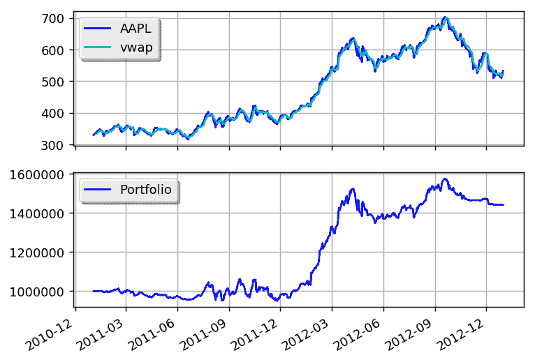

# VWAP 动量交易

> 原文：[`gbeced.github.io/pyalgotrade/docs/v0.20/html/sample_vwap_momentum.html`](https://gbeced.github.io/pyalgotrade/docs/v0.20/html/sample_vwap_momentum.html)

此示例基于[动量交易](https://www.quantopian.com/posts/momentum-trade)

```py
from __future__ import print_function

from pyalgotrade import strategy
from pyalgotrade import plotter
from pyalgotrade.tools import quandl
from pyalgotrade.technical import vwap
from pyalgotrade.stratanalyzer import sharpe

class VWAPMomentum(strategy.BacktestingStrategy):
    def __init__(self, feed, instrument, vwapWindowSize, threshold):
        super(VWAPMomentum, self).__init__(feed)
        self.__instrument = instrument
        self.__vwap = vwap.VWAP(feed[instrument], vwapWindowSize)
        self.__threshold = threshold

    def getVWAP(self):
        return self.__vwap

    def onBars(self, bars):
        vwap = self.__vwap[-1]
        if vwap is None:
            return

        shares = self.getBroker().getShares(self.__instrument)
        price = bars[self.__instrument].getClose()
        notional = shares * price

        if price > vwap * (1 + self.__threshold) and notional < 1000000:
            self.marketOrder(self.__instrument, 100)
        elif price < vwap * (1 - self.__threshold) and notional > 0:
            self.marketOrder(self.__instrument, -100)

def main(plot):
    instrument = "AAPL"
    vwapWindowSize = 5
    threshold = 0.01

    # Download the bars.
    feed = quandl.build_feed("WIKI", [instrument], 2011, 2012, ".")

    strat = VWAPMomentum(feed, instrument, vwapWindowSize, threshold)
    sharpeRatioAnalyzer = sharpe.SharpeRatio()
    strat.attachAnalyzer(sharpeRatioAnalyzer)

    if plot:
        plt = plotter.StrategyPlotter(strat, True, False, True)
        plt.getInstrumentSubplot(instrument).addDataSeries("vwap", strat.getVWAP())

    strat.run()
    print("Sharpe ratio: %.2f" % sharpeRatioAnalyzer.getSharpeRatio(0.05))

    if plot:
        plt.plot()

if __name__ == "__main__":
    main(True) 
```

这是输出应该呈现的样子：

```py
2017-07-24 22:43:34,182 quandl [INFO] Downloading AAPL 2011 to ./WIKI-AAPL-2011-quandl.csv
2017-07-24 22:43:36,415 quandl [INFO] Downloading AAPL 2012 to ./WIKI-AAPL-2012-quandl.csv
Sharpe ratio: 0.89

```

这是图表应该呈现的样子：



通过调整 VWAP 和阈值参数，您可以获得更好的回报。

#### 上一个主题

示例策略

#### 下一个主题

SMA 交叉

### 此页面

+   显示源码

### 快速搜索

输入搜索词或模块、类或函数名称。

### 导航

+   索引

+   模块 |

+   下一章节 |

+   上一章节 |

+   PyAlgoTrade 0.20 文档 »

+   示例策略 »
