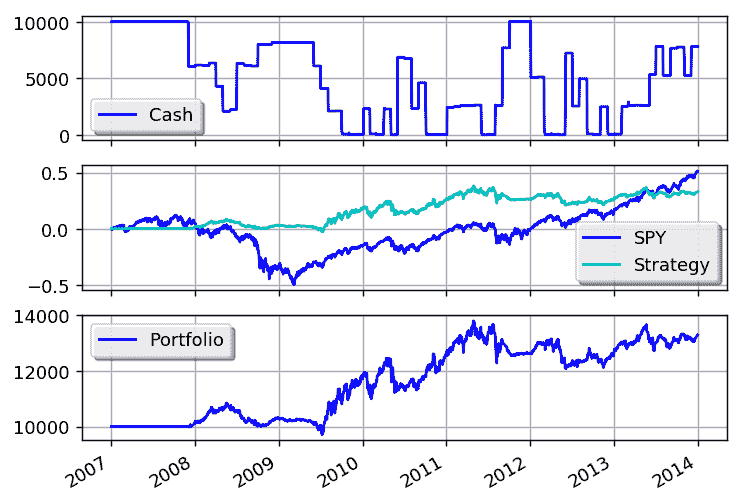

# 使用移动平均线交叉的市场定时

> 原文：[`gbeced.github.io/pyalgotrade/docs/v0.20/html/sample_market_timing.html`](https://gbeced.github.io/pyalgotrade/docs/v0.20/html/sample_market_timing.html)

这个示例是基于市场定时/GTAA 模型的描述：

+   [`mebfaber.com/timing-model/`](http://mebfaber.com/timing-model/)

+   [`papers.ssrn.com/sol3/papers.cfm?abstract_id=962461`](http://papers.ssrn.com/sol3/papers.cfm?abstract_id=962461)

该策略支持分析每个资产类别中的多个工具，并选择过去一个月收益最高的那个。

```py
from __future__ import print_function

from pyalgotrade import strategy
from pyalgotrade import plotter
from pyalgotrade.barfeed import yahoofeed
from pyalgotrade.technical import ma
from pyalgotrade.technical import cumret
from pyalgotrade.stratanalyzer import sharpe
from pyalgotrade.stratanalyzer import returns

class MarketTiming(strategy.BacktestingStrategy):
    def __init__(self, feed, instrumentsByClass, initialCash):
        super(MarketTiming, self).__init__(feed, initialCash)
        self.setUseAdjustedValues(True)
        self.__instrumentsByClass = instrumentsByClass
        self.__rebalanceMonth = None
        self.__sharesToBuy = {}
        # Initialize indicators for each instrument.
        self.__sma = {}
        for assetClass in instrumentsByClass:
            for instrument in instrumentsByClass[assetClass]:
                priceDS = feed[instrument].getPriceDataSeries()
                self.__sma[instrument] = ma.SMA(priceDS, 200)

    def _shouldRebalance(self, dateTime):
        return dateTime.month != self.__rebalanceMonth

    def _getRank(self, instrument):
        # If the price is below the SMA, then this instrument doesn't rank at
        # all.
        smas = self.__sma[instrument]
        price = self.getLastPrice(instrument)
        if len(smas) == 0 or smas[-1] is None or price < smas[-1]:
            return None

        # Rank based on 20 day returns.
        ret = None
        lookBack = 20
        priceDS = self.getFeed()[instrument].getPriceDataSeries()
        if len(priceDS) >= lookBack and smas[-1] is not None and smas[-1*lookBack] is not None:
            ret = (priceDS[-1] - priceDS[-1*lookBack]) / float(priceDS[-1*lookBack])
        return ret

    def _getTopByClass(self, assetClass):
        # Find the instrument with the highest rank.
        ret = None
        highestRank = None
        for instrument in self.__instrumentsByClass[assetClass]:
            rank = self._getRank(instrument)
            if rank is not None and (highestRank is None or rank > highestRank):
                highestRank = rank
                ret = instrument
        return ret

    def _getTop(self):
        ret = {}
        for assetClass in self.__instrumentsByClass:
            ret[assetClass] = self._getTopByClass(assetClass)
        return ret

    def _placePendingOrders(self):
        # Use less chash just in case price changes too much.
        remainingCash = round(self.getBroker().getCash() * 0.9, 2)

        for instrument in self.__sharesToBuy:
            orderSize = self.__sharesToBuy[instrument]
            if orderSize > 0:
                # Adjust the order size based on available cash.
                lastPrice = self.getLastPrice(instrument)
                cost = orderSize * lastPrice
                while cost > remainingCash and orderSize > 0:
                    orderSize -= 1
                    cost = orderSize * lastPrice
                if orderSize > 0:
                    remainingCash -= cost
                    assert(remainingCash >= 0)

            if orderSize != 0:
                self.info("Placing market order for %d  %s shares" % (orderSize, instrument))
                self.marketOrder(instrument, orderSize, goodTillCanceled=True)
                self.__sharesToBuy[instrument] -= orderSize

    def _logPosSize(self):
        totalEquity = self.getBroker().getEquity()
        positions = self.getBroker().getPositions()
        for instrument in self.getBroker().getPositions():
            posSize = positions[instrument] * self.getLastPrice(instrument) / totalEquity * 100
            self.info("%s - %0.2f  %%" % (instrument, posSize))

    def _rebalance(self):
        self.info("Rebalancing")

        # Cancel all active/pending orders.
        for order in self.getBroker().getActiveOrders():
            self.getBroker().cancelOrder(order)

        cashPerAssetClass = round(self.getBroker().getEquity() / float(len(self.__instrumentsByClass)), 2)
        self.__sharesToBuy = {}

        # Calculate which positions should be open during the next period.
        topByClass = self._getTop()
        for assetClass in topByClass:
            instrument = topByClass[assetClass]
            self.info("Best for class %s: %s" % (assetClass, instrument))
            if instrument is not None:
                lastPrice = self.getLastPrice(instrument)
                cashForInstrument = round(cashPerAssetClass - self.getBroker().getShares(instrument) * lastPrice, 2)
                # This may yield a negative value and we have to reduce this
                # position.
                self.__sharesToBuy[instrument] = int(cashForInstrument / lastPrice)

        # Calculate which positions should be closed.
        for instrument in self.getBroker().getPositions():
            if instrument not in topByClass.values():
                currentShares = self.getBroker().getShares(instrument)
                assert(instrument not in self.__sharesToBuy)
                self.__sharesToBuy[instrument] = currentShares * -1

    def getSMA(self, instrument):
        return self.__sma[instrument]

    def onBars(self, bars):
        currentDateTime = bars.getDateTime()

        if self._shouldRebalance(currentDateTime):
            self.__rebalanceMonth = currentDateTime.month
            self._rebalance()

        self._placePendingOrders()

def main(plot):
    initialCash = 10000
    instrumentsByClass = {
        "US Stocks": ["VTI"],
        "Foreign Stocks": ["VEU"],
        "US 10 Year Government Bonds": ["IEF"],
        "Real Estate": ["VNQ"],
        "Commodities": ["DBC"],
    }

    # Load the bars. These files were manually downloaded from Yahoo Finance.
    feed = yahoofeed.Feed()
    instruments = ["SPY"]
    for assetClass in instrumentsByClass:
        instruments.extend(instrumentsByClass[assetClass])

    for year in range(2007, 2013+1):
        for instrument in instruments:
            fileName = "%s-%d-yahoofinance.csv" % (instrument, year)
            print("Loading bars from %s" % fileName)
            feed.addBarsFromCSV(instrument, fileName)

    # Build the strategy and attach some metrics.
    strat = MarketTiming(feed, instrumentsByClass, initialCash)
    sharpeRatioAnalyzer = sharpe.SharpeRatio()
    strat.attachAnalyzer(sharpeRatioAnalyzer)
    returnsAnalyzer = returns.Returns()
    strat.attachAnalyzer(returnsAnalyzer)

    if plot:
        plt = plotter.StrategyPlotter(strat, False, False, True)
        plt.getOrCreateSubplot("cash").addCallback("Cash", lambda x: strat.getBroker().getCash())
        # Plot strategy vs. SPY cumulative returns.
        plt.getOrCreateSubplot("returns").addDataSeries("SPY", cumret.CumulativeReturn(feed["SPY"].getPriceDataSeries()))
        plt.getOrCreateSubplot("returns").addDataSeries("Strategy", returnsAnalyzer.getCumulativeReturns())

    strat.run()
    print("Sharpe ratio: %.2f" % sharpeRatioAnalyzer.getSharpeRatio(0.05))
    print("Returns: %.2f  %%" % (returnsAnalyzer.getCumulativeReturns()[-1] * 100))

    if plot:
        plt.plot()

if __name__ == "__main__":
    main(True) 
```

输出应该是这样的：

```py
Loading bars from SPY-2007-yahoofinance.csv
Loading bars from VTI-2007-yahoofinance.csv
Loading bars from DBC-2007-yahoofinance.csv
Loading bars from IEF-2007-yahoofinance.csv
Loading bars from VEU-2007-yahoofinance.csv
Loading bars from VNQ-2007-yahoofinance.csv
Loading bars from SPY-2008-yahoofinance.csv
Loading bars from VTI-2008-yahoofinance.csv
Loading bars from DBC-2008-yahoofinance.csv
Loading bars from IEF-2008-yahoofinance.csv
.
.
.
2013-10-01 00:00:00 strategy [INFO] Best for class US Stocks: VTI
2013-10-01 00:00:00 strategy [INFO] Best for class Commodities: None
2013-10-01 00:00:00 strategy [INFO] Best for class US 10 Year Government Bonds: None
2013-10-01 00:00:00 strategy [INFO] Best for class Foreign Stocks: VEU
2013-10-01 00:00:00 strategy [INFO] Best for class Real Estate: None
2013-10-01 00:00:00 strategy [INFO] Placing market order for -2 VEU shares
2013-11-01 00:00:00 strategy [INFO] Rebalancing
2013-11-01 00:00:00 strategy [INFO] Best for class US Stocks: VTI
2013-11-01 00:00:00 strategy [INFO] Best for class Commodities: None
2013-11-01 00:00:00 strategy [INFO] Best for class US 10 Year Government Bonds: None
2013-11-01 00:00:00 strategy [INFO] Best for class Foreign Stocks: VEU
2013-11-01 00:00:00 strategy [INFO] Best for class Real Estate: VNQ
2013-11-01 00:00:00 strategy [INFO] Placing market order for -1 VTI shares
2013-11-01 00:00:00 strategy [INFO] Placing market order for -1 VEU shares
2013-11-01 00:00:00 strategy [INFO] Placing market order for 39 VNQ shares
2013-12-02 00:00:00 strategy [INFO] Rebalancing
2013-12-02 00:00:00 strategy [INFO] Best for class US Stocks: VTI
2013-12-02 00:00:00 strategy [INFO] Best for class Commodities: None
2013-12-02 00:00:00 strategy [INFO] Best for class US 10 Year Government Bonds: None
2013-12-02 00:00:00 strategy [INFO] Best for class Foreign Stocks: VEU
2013-12-02 00:00:00 strategy [INFO] Best for class Real Estate: None
2013-12-02 00:00:00 strategy [INFO] Placing market order for -1 VTI shares
2013-12-02 00:00:00 strategy [INFO] Placing market order for -39 VNQ shares
Sharpe ratio: -0.06
Returns: 32.97 %

```

图表应该是这样的：



#### 上一个主题

SMA Crossover

#### 下一个主题

欧尼·陈的黄金与黄金矿工

### 本页

+   显示源代码

### 快速搜索

输入搜索词或模块、类或函数名称。

### 导航

+   索引

+   模块 |

+   下一章 |

+   上一章 |

+   PyAlgoTrade 0.20 文档 »

+   示例策略 »
