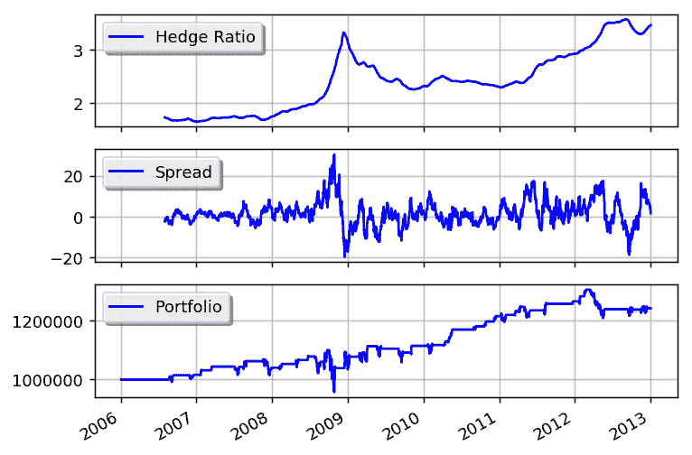

# Ernie Chan 的黄金与黄金矿业公司

> 原文：[`gbeced.github.io/pyalgotrade/docs/v0.20/html/sample_statarb_erniechan.html`](https://gbeced.github.io/pyalgotrade/docs/v0.20/html/sample_statarb_erniechan.html)

此示例基于：

+   [`epchan.blogspot.com.ar/2006/11/gold-vs-gold-miners-another-arbitrage.html`](http://epchan.blogspot.com.ar/2006/11/gold-vs-gold-miners-another-arbitrage.html)

+   [`www.quantopian.com/posts/ernie-chans-gold-vs-gold-miners-stat-arb`](https://www.quantopian.com/posts/ernie-chans-gold-vs-gold-miners-stat-arb)

```py
from __future__ import print_function

from pyalgotrade import strategy
from pyalgotrade import dataseries
from pyalgotrade.dataseries import aligned
from pyalgotrade import plotter
from pyalgotrade.barfeed import yahoofeed
from pyalgotrade.stratanalyzer import sharpe

import numpy as np
import statsmodels.api as sm

def get_beta(values1, values2):
    # http://statsmodels.sourceforge.net/stable/regression.html
    model = sm.OLS(values1, values2)
    results = model.fit()
    return results.params[0]

class StatArbHelper:
    def __init__(self, ds1, ds2, windowSize):
        # We're going to use datetime aligned versions of the dataseries.
        self.__ds1, self.__ds2 = aligned.datetime_aligned(ds1, ds2)
        self.__windowSize = windowSize
        self.__hedgeRatio = None
        self.__spread = None
        self.__spreadMean = None
        self.__spreadStd = None
        self.__zScore = None

    def getSpread(self):
        return self.__spread

    def getSpreadMean(self):
        return self.__spreadMean

    def getSpreadStd(self):
        return self.__spreadStd

    def getZScore(self):
        return self.__zScore

    def getHedgeRatio(self):
        return self.__hedgeRatio

    def __updateHedgeRatio(self, values1, values2):
        self.__hedgeRatio = get_beta(values1, values2)

    def __updateSpreadMeanAndStd(self, values1, values2):
        if self.__hedgeRatio is not None:
            spread = values1 - values2 * self.__hedgeRatio
            self.__spreadMean = spread.mean()
            self.__spreadStd = spread.std(ddof=1)

    def __updateSpread(self):
        if self.__hedgeRatio is not None:
            self.__spread = self.__ds1[-1] - self.__hedgeRatio * self.__ds2[-1]

    def __updateZScore(self):
        if self.__spread is not None and self.__spreadMean is not None and self.__spreadStd is not None:
            self.__zScore = (self.__spread - self.__spreadMean) / float(self.__spreadStd)

    def update(self):
        if len(self.__ds1) >= self.__windowSize:
            values1 = np.asarray(self.__ds1[-1*self.__windowSize:])
            values2 = np.asarray(self.__ds2[-1*self.__windowSize:])
            self.__updateHedgeRatio(values1, values2)
            self.__updateSpread()
            self.__updateSpreadMeanAndStd(values1, values2)
            self.__updateZScore()

class StatArb(strategy.BacktestingStrategy):
    def __init__(self, feed, instrument1, instrument2, windowSize):
        super(StatArb, self).__init__(feed)
        self.setUseAdjustedValues(True)
        self.__statArbHelper = StatArbHelper(feed[instrument1].getAdjCloseDataSeries(), feed[instrument2].getAdjCloseDataSeries(), windowSize)
        self.__i1 = instrument1
        self.__i2 = instrument2

        # These are used only for plotting purposes.
        self.__spread = dataseries.SequenceDataSeries()
        self.__hedgeRatio = dataseries.SequenceDataSeries()

    def getSpreadDS(self):
        return self.__spread

    def getHedgeRatioDS(self):
        return self.__hedgeRatio

    def __getOrderSize(self, bars, hedgeRatio):
        cash = self.getBroker().getCash(False)
        price1 = bars[self.__i1].getAdjClose()
        price2 = bars[self.__i2].getAdjClose()
        size1 = int(cash / (price1 + hedgeRatio * price2))
        size2 = int(size1 * hedgeRatio)
        return (size1, size2)

    def buySpread(self, bars, hedgeRatio):
        amount1, amount2 = self.__getOrderSize(bars, hedgeRatio)
        self.marketOrder(self.__i1, amount1)
        self.marketOrder(self.__i2, amount2 * -1)

    def sellSpread(self, bars, hedgeRatio):
        amount1, amount2 = self.__getOrderSize(bars, hedgeRatio)
        self.marketOrder(self.__i1, amount1 * -1)
        self.marketOrder(self.__i2, amount2)

    def reducePosition(self, instrument):
        currentPos = self.getBroker().getShares(instrument)
        if currentPos > 0:
            self.marketOrder(instrument, currentPos * -1)
        elif currentPos < 0:
            self.marketOrder(instrument, currentPos * -1)

    def onBars(self, bars):
        self.__statArbHelper.update()

        # These is used only for plotting purposes.
        self.__spread.appendWithDateTime(bars.getDateTime(), self.__statArbHelper.getSpread())
        self.__hedgeRatio.appendWithDateTime(bars.getDateTime(), self.__statArbHelper.getHedgeRatio())

        if bars.getBar(self.__i1) and bars.getBar(self.__i2):
            hedgeRatio = self.__statArbHelper.getHedgeRatio()
            zScore = self.__statArbHelper.getZScore()
            if zScore is not None:
                currentPos = abs(self.getBroker().getShares(self.__i1)) + abs(self.getBroker().getShares(self.__i2))
                if abs(zScore) <= 1 and currentPos != 0:
                    self.reducePosition(self.__i1)
                    self.reducePosition(self.__i2)
                elif zScore <= -2 and currentPos == 0:  # Buy spread when its value drops below 2 standard deviations.
                    self.buySpread(bars, hedgeRatio)
                elif zScore >= 2 and currentPos == 0:  # Short spread when its value rises above 2 standard deviations.
                    self.sellSpread(bars, hedgeRatio)

def main(plot):
    instruments = ["gld", "gdx"]
    windowSize = 50

    # Load the bars. These files were manually downloaded from Yahoo Finance.
    feed = yahoofeed.Feed()
    for year in range(2006, 2012+1):
        for instrument in instruments:
            fileName = "%s-%d-yahoofinance.csv" % (instrument, year)
            print("Loading bars from %s" % fileName)
            feed.addBarsFromCSV(instrument, fileName)

    strat = StatArb(feed, instruments[0], instruments[1], windowSize)
    sharpeRatioAnalyzer = sharpe.SharpeRatio()
    strat.attachAnalyzer(sharpeRatioAnalyzer)

    if plot:
        plt = plotter.StrategyPlotter(strat, False, False, True)
        plt.getOrCreateSubplot("hedge").addDataSeries("Hedge Ratio", strat.getHedgeRatioDS())
        plt.getOrCreateSubplot("spread").addDataSeries("Spread", strat.getSpreadDS())

    strat.run()
    print("Sharpe ratio: %.2f" % sharpeRatioAnalyzer.getSharpeRatio(0.05))

    if plot:
        plt.plot()

if __name__ == "__main__":
    main(True) 
```

这是输出应该的样子：

```py
Loading bars from gld-2006-yahoofinance.csv
Loading bars from gdx-2006-yahoofinance.csv
Loading bars from gld-2007-yahoofinance.csv
Loading bars from gdx-2007-yahoofinance.csv
Loading bars from gld-2008-yahoofinance.csv
Loading bars from gdx-2008-yahoofinance.csv
Loading bars from gld-2009-yahoofinance.csv
Loading bars from gdx-2009-yahoofinance.csv
Loading bars from gld-2010-yahoofinance.csv
Loading bars from gdx-2010-yahoofinance.csv
Loading bars from gld-2011-yahoofinance.csv
Loading bars from gdx-2011-yahoofinance.csv
Loading bars from gld-2012-yahoofinance.csv
Loading bars from gdx-2012-yahoofinance.csv
Sharpe ratio: -0.20

```

这是图表应该的样子：



通过调整窗口大小以及 z-score 的入口和出口值，您可以获得更好的回报。

