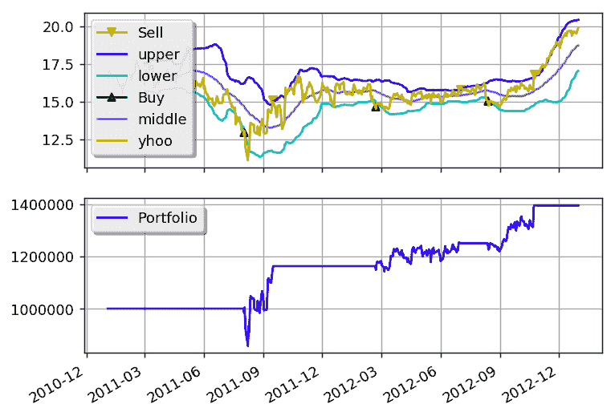

# 布林带

> 原文：[`gbeced.github.io/pyalgotrade/docs/v0.20/html/sample_bbands.html`](https://gbeced.github.io/pyalgotrade/docs/v0.20/html/sample_bbands.html)

此示例基于：

+   [`www.investopedia.com/articles/trading/07/bollinger.asp`](http://www.investopedia.com/articles/trading/07/bollinger.asp)

```py
from __future__ import print_function

from pyalgotrade import strategy
from pyalgotrade import plotter
from pyalgotrade.tools import quandl
from pyalgotrade.technical import bollinger
from pyalgotrade.stratanalyzer import sharpe
from pyalgotrade import broker as basebroker

class BBands(strategy.BacktestingStrategy):
    def __init__(self, feed, instrument, bBandsPeriod):
        super(BBands, self).__init__(feed)
        self.__instrument = instrument
        self.__bbands = bollinger.BollingerBands(feed[instrument].getCloseDataSeries(), bBandsPeriod, 2)

    def getBollingerBands(self):
        return self.__bbands

    def onOrderUpdated(self, order):
        if order.isBuy():
            orderType = "Buy"
        else:
            orderType = "Sell"
        self.info("%s order %d updated - Status: %s" % (
            orderType, order.getId(), basebroker.Order.State.toString(order.getState())
        ))

    def onBars(self, bars):
        lower = self.__bbands.getLowerBand()[-1]
        upper = self.__bbands.getUpperBand()[-1]
        if lower is None:
            return

        shares = self.getBroker().getShares(self.__instrument)
        bar = bars[self.__instrument]
        if shares == 0 and bar.getClose() < lower:
            sharesToBuy = int(self.getBroker().getCash(False) / bar.getClose())
            self.info("Placing buy market order for %s shares" % sharesToBuy)
            self.marketOrder(self.__instrument, sharesToBuy)
        elif shares > 0 and bar.getClose() > upper:
            self.info("Placing sell market order for %s shares" % shares)
            self.marketOrder(self.__instrument, -1*shares)

def main(plot):
    instrument = "yhoo"
    bBandsPeriod = 40

    # Download the bars.
    feed = quandl.build_feed("WIKI", [instrument], 2011, 2012, ".")

    strat = BBands(feed, instrument, bBandsPeriod)
    sharpeRatioAnalyzer = sharpe.SharpeRatio()
    strat.attachAnalyzer(sharpeRatioAnalyzer)

    if plot:
        plt = plotter.StrategyPlotter(strat, True, True, True)
        plt.getInstrumentSubplot(instrument).addDataSeries("upper", strat.getBollingerBands().getUpperBand())
        plt.getInstrumentSubplot(instrument).addDataSeries("middle", strat.getBollingerBands().getMiddleBand())
        plt.getInstrumentSubplot(instrument).addDataSeries("lower", strat.getBollingerBands().getLowerBand())

    strat.run()
    print("Sharpe ratio: %.2f" % sharpeRatioAnalyzer.getSharpeRatio(0.05))

    if plot:
        plt.plot()

if __name__ == "__main__":
    main(True) 
```

这就是输出的样子：

```py
2011-07-20 00:00:00 strategy [INFO] Placing buy market order for 74183 shares
2011-07-20 00:00:00 strategy [INFO] Buy order 1 updated - Status: SUBMITTED
2011-07-21 00:00:00 strategy [INFO] Buy order 1 updated - Status: ACCEPTED
2011-07-21 00:00:00 broker.backtesting [DEBUG] Not enough cash to fill yhoo order [1] for 74183 share/s
2011-07-21 00:00:00 strategy [INFO] Buy order 1 updated - Status: CANCELED
2011-07-21 00:00:00 strategy [INFO] Placing buy market order for 73583 shares
2011-07-21 00:00:00 strategy [INFO] Buy order 2 updated - Status: SUBMITTED
2011-07-22 00:00:00 strategy [INFO] Buy order 2 updated - Status: ACCEPTED
2011-07-22 00:00:00 broker.backtesting [DEBUG] Not enough cash to fill yhoo order [2] for 73583 share/s
2011-07-22 00:00:00 strategy [INFO] Buy order 2 updated - Status: CANCELED
2011-07-25 00:00:00 strategy [INFO] Placing buy market order for 73046 shares
2011-07-25 00:00:00 strategy [INFO] Buy order 3 updated - Status: SUBMITTED
2011-07-26 00:00:00 strategy [INFO] Buy order 3 updated - Status: ACCEPTED
2011-07-26 00:00:00 broker.backtesting [DEBUG] Not enough cash to fill yhoo order [3] for 73046 share/s
2011-07-26 00:00:00 strategy [INFO] Buy order 3 updated - Status: CANCELED
2011-07-27 00:00:00 strategy [INFO] Placing buy market order for 73610 shares
2011-07-27 00:00:00 strategy [INFO] Buy order 4 updated - Status: SUBMITTED
2011-07-28 00:00:00 strategy [INFO] Buy order 4 updated - Status: ACCEPTED
2011-07-28 00:00:00 broker.backtesting [DEBUG] Not enough cash to fill yhoo order [4] for 73610 share/s
2011-07-28 00:00:00 strategy [INFO] Buy order 4 updated - Status: CANCELED
2011-07-28 00:00:00 strategy [INFO] Placing buy market order for 74074 shares
2011-07-28 00:00:00 strategy [INFO] Buy order 5 updated - Status: SUBMITTED
2011-07-29 00:00:00 strategy [INFO] Buy order 5 updated - Status: ACCEPTED
2011-07-29 00:00:00 broker.backtesting [DEBUG] Not enough cash to fill yhoo order [5] for 74074 share/s
2011-07-29 00:00:00 strategy [INFO] Buy order 5 updated - Status: CANCELED
2011-07-29 00:00:00 strategy [INFO] Placing buy market order for 76335 shares
2011-07-29 00:00:00 strategy [INFO] Buy order 6 updated - Status: SUBMITTED
2011-08-01 00:00:00 strategy [INFO] Buy order 6 updated - Status: ACCEPTED
2011-08-01 00:00:00 broker.backtesting [DEBUG] Not enough cash to fill yhoo order [6] for 76335 share/s
2011-08-01 00:00:00 strategy [INFO] Buy order 6 updated - Status: CANCELED
2011-08-01 00:00:00 strategy [INFO] Placing buy market order for 76335 shares
2011-08-01 00:00:00 strategy [INFO] Buy order 7 updated - Status: SUBMITTED
2011-08-02 00:00:00 strategy [INFO] Buy order 7 updated - Status: ACCEPTED
2011-08-02 00:00:00 strategy [INFO] Buy order 7 updated - Status: FILLED
2011-09-15 00:00:00 strategy [INFO] Placing sell market order for 76335 shares
2011-09-15 00:00:00 strategy [INFO] Sell order 8 updated - Status: SUBMITTED
2011-09-16 00:00:00 strategy [INFO] Sell order 8 updated - Status: ACCEPTED
2011-09-16 00:00:00 strategy [INFO] Sell order 8 updated - Status: FILLED
2012-02-17 00:00:00 strategy [INFO] Placing buy market order for 77454 shares
2012-02-17 00:00:00 strategy [INFO] Buy order 9 updated - Status: SUBMITTED
2012-02-21 00:00:00 strategy [INFO] Buy order 9 updated - Status: ACCEPTED
2012-02-21 00:00:00 broker.backtesting [DEBUG] Not enough cash to fill yhoo order [9] for 77454 share/s
2012-02-21 00:00:00 strategy [INFO] Buy order 9 updated - Status: CANCELED
2012-02-21 00:00:00 strategy [INFO] Placing buy market order for 78819 shares
2012-02-21 00:00:00 strategy [INFO] Buy order 10 updated - Status: SUBMITTED
2012-02-22 00:00:00 strategy [INFO] Buy order 10 updated - Status: ACCEPTED
2012-02-22 00:00:00 strategy [INFO] Buy order 10 updated - Status: FILLED
2012-06-29 00:00:00 strategy [INFO] Placing sell market order for 78819 shares
2012-06-29 00:00:00 strategy [INFO] Sell order 11 updated - Status: SUBMITTED
2012-07-02 00:00:00 strategy [INFO] Sell order 11 updated - Status: ACCEPTED
2012-07-02 00:00:00 strategy [INFO] Sell order 11 updated - Status: FILLED
2012-08-10 00:00:00 strategy [INFO] Placing buy market order for 82565 shares
2012-08-10 00:00:00 strategy [INFO] Buy order 12 updated - Status: SUBMITTED
2012-08-13 00:00:00 strategy [INFO] Buy order 12 updated - Status: ACCEPTED
2012-08-13 00:00:00 strategy [INFO] Buy order 12 updated - Status: FILLED
2012-10-23 00:00:00 strategy [INFO] Placing sell market order for 82565 shares
2012-10-23 00:00:00 strategy [INFO] Sell order 13 updated - Status: SUBMITTED
2012-10-24 00:00:00 strategy [INFO] Sell order 13 updated - Status: ACCEPTED
2012-10-24 00:00:00 strategy [INFO] Sell order 13 updated - Status: FILLED
Sharpe ratio: 0.71

```

这就是图表的样子：



通过调整布林带的周期以及进出点，您可以获得更好的回报。

