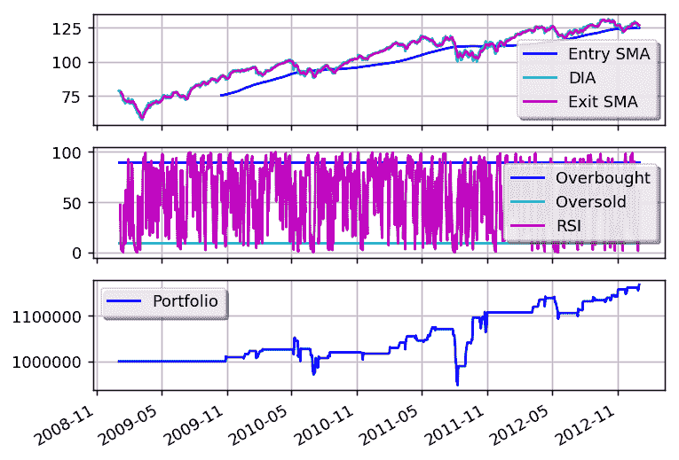

# RSI2

> 原文链接：[`gbeced.github.io/pyalgotrade/docs/v0.20/html/sample_rsi2.html`](https://gbeced.github.io/pyalgotrade/docs/v0.20/html/sample_rsi2.html)

此示例基于一种称为 RSI2 的策略([`stockcharts.com/school/doku.php?id=chart_school:trading_strategies:rsi2`](http://stockcharts.com/school/doku.php?id=chart_school:trading_strategies:rsi2))，需要以下参数：

> +   用于趋势识别的 SMA 周期。我们将其称为 entrySMA。
> +   
> +   用于退出点的较小 SMA 周期。我们将其称为 exitSMA。
> +   
> +   一个用于进入多空仓位的 RSI 期间。我们将其称为 rsiPeriod。
> +   
> +   一个用于多仓位进入的 RSI 超卖阈值。我们将其称为 overSoldThreshold。
> +   
> +   用于空仓位进入的 RSI 超买阈值。我们将其称为 overBoughtThreshold。

将此代码保存为 rsi2.py：

```py
from pyalgotrade import strategy
from pyalgotrade.technical import ma
from pyalgotrade.technical import rsi
from pyalgotrade.technical import cross

class RSI2(strategy.BacktestingStrategy):
    def __init__(self, feed, instrument, entrySMA, exitSMA, rsiPeriod, overBoughtThreshold, overSoldThreshold):
        super(RSI2, self).__init__(feed)
        self.__instrument = instrument
        # We'll use adjusted close values, if available, instead of regular close values.
        if feed.barsHaveAdjClose():
            self.setUseAdjustedValues(True)
        self.__priceDS = feed[instrument].getPriceDataSeries()
        self.__entrySMA = ma.SMA(self.__priceDS, entrySMA)
        self.__exitSMA = ma.SMA(self.__priceDS, exitSMA)
        self.__rsi = rsi.RSI(self.__priceDS, rsiPeriod)
        self.__overBoughtThreshold = overBoughtThreshold
        self.__overSoldThreshold = overSoldThreshold
        self.__longPos = None
        self.__shortPos = None

    def getEntrySMA(self):
        return self.__entrySMA

    def getExitSMA(self):
        return self.__exitSMA

    def getRSI(self):
        return self.__rsi

    def onEnterCanceled(self, position):
        if self.__longPos == position:
            self.__longPos = None
        elif self.__shortPos == position:
            self.__shortPos = None
        else:
            assert(False)

    def onExitOk(self, position):
        if self.__longPos == position:
            self.__longPos = None
        elif self.__shortPos == position:
            self.__shortPos = None
        else:
            assert(False)

    def onExitCanceled(self, position):
        # If the exit was canceled, re-submit it.
        position.exitMarket()

    def onBars(self, bars):
        # Wait for enough bars to be available to calculate SMA and RSI.
        if self.__exitSMA[-1] is None or self.__entrySMA[-1] is None or self.__rsi[-1] is None:
            return

        bar = bars[self.__instrument]
        if self.__longPos is not None:
            if self.exitLongSignal():
                self.__longPos.exitMarket()
        elif self.__shortPos is not None:
            if self.exitShortSignal():
                self.__shortPos.exitMarket()
        else:
            if self.enterLongSignal(bar):
                shares = int(self.getBroker().getCash() * 0.9 / bars[self.__instrument].getPrice())
                self.__longPos = self.enterLong(self.__instrument, shares, True)
            elif self.enterShortSignal(bar):
                shares = int(self.getBroker().getCash() * 0.9 / bars[self.__instrument].getPrice())
                self.__shortPos = self.enterShort(self.__instrument, shares, True)

    def enterLongSignal(self, bar):
        return bar.getPrice() > self.__entrySMA[-1] and self.__rsi[-1] <= self.__overSoldThreshold

    def exitLongSignal(self):
        return cross.cross_above(self.__priceDS, self.__exitSMA) and not self.__longPos.exitActive()

    def enterShortSignal(self, bar):
        return bar.getPrice() < self.__entrySMA[-1] and self.__rsi[-1] >= self.__overBoughtThreshold

    def exitShortSignal(self):
        return cross.cross_below(self.__priceDS, self.__exitSMA) and not self.__shortPos.exitActive() 
```

并使用以下代码执行策略：

```py
from __future__ import print_function

import rsi2
from pyalgotrade import plotter
from pyalgotrade.barfeed import yahoofeed
from pyalgotrade.stratanalyzer import sharpe

def main(plot):
    instrument = "DIA"
    entrySMA = 200
    exitSMA = 5
    rsiPeriod = 2
    overBoughtThreshold = 90
    overSoldThreshold = 10

    # Load the bars. These files were manually downloaded from Yahoo Finance.
    feed = yahoofeed.Feed()
    for year in range(2009, 2013):
        fileName = "%s-%d-yahoofinance.csv" % (instrument, year)
        print("Loading bars from %s" % fileName)
        feed.addBarsFromCSV(instrument, fileName)

    strat = rsi2.RSI2(feed, instrument, entrySMA, exitSMA, rsiPeriod, overBoughtThreshold, overSoldThreshold)
    sharpeRatioAnalyzer = sharpe.SharpeRatio()
    strat.attachAnalyzer(sharpeRatioAnalyzer)

    if plot:
        plt = plotter.StrategyPlotter(strat, True, False, True)
        plt.getInstrumentSubplot(instrument).addDataSeries("Entry SMA", strat.getEntrySMA())
        plt.getInstrumentSubplot(instrument).addDataSeries("Exit SMA", strat.getExitSMA())
        plt.getOrCreateSubplot("rsi").addDataSeries("RSI", strat.getRSI())
        plt.getOrCreateSubplot("rsi").addLine("Overbought", overBoughtThreshold)
        plt.getOrCreateSubplot("rsi").addLine("Oversold", overSoldThreshold)

    strat.run()
    print("Sharpe ratio: %.2f" % sharpeRatioAnalyzer.getSharpeRatio(0.05))

    if plot:
        plt.plot()

if __name__ == "__main__":
    main(True) 
```

输出应该如下所示：

```py
Loading bars from DIA-2009-yahoofinance.csv
Loading bars from DIA-2010-yahoofinance.csv
Loading bars from DIA-2011-yahoofinance.csv
Loading bars from DIA-2012-yahoofinance.csv
Sharpe ratio: -0.11

```

并且图表应该如下所示：



通过调整不同参数，您可以获得更好的回报。

