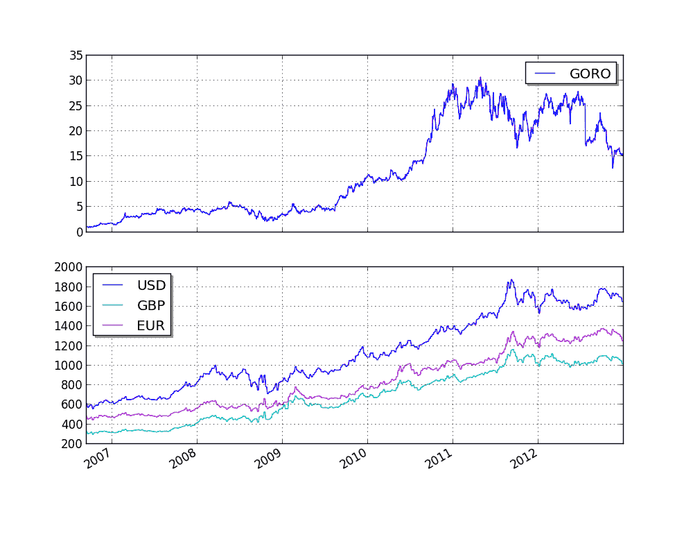

# Quandl 整合

> 原文：[`gbeced.github.io/pyalgotrade/docs/v0.20/html/sample_quandl.html`](https://gbeced.github.io/pyalgotrade/docs/v0.20/html/sample_quandl.html)

这个示例的目的是展示如何将来自 Quandl 的价格数据以及任何时间序列数据以 CSV 格式整合到策略中。

我们将使用来自 Quandl 的以下 CSV 数据：[`www.quandl.com/OFDP-Open-Financial-Data-Project/GOLD_2-LBMA-Gold-Price-London-Fixings-P-M`](http://www.quandl.com/OFDP-Open-Financial-Data-Project/GOLD_2-LBMA-Gold-Price-London-Fixings-P-M)

```py
from pyalgotrade import strategy
from pyalgotrade import plotter
from pyalgotrade.tools import quandl
from pyalgotrade.feed import csvfeed
import datetime

class MyStrategy(strategy.BacktestingStrategy):
    def __init__(self, feed, quandlFeed, instrument):
        super(MyStrategy, self).__init__(feed)
        self.setUseAdjustedValues(True)
        self.__instrument = instrument

        # It is VERY important to add the the extra feed to the event dispatch loop before
        # running the strategy.
        self.getDispatcher().addSubject(quandlFeed)

        # Subscribe to events from the Quandl feed.
        quandlFeed.getNewValuesEvent().subscribe(self.onQuandlData)

    def onQuandlData(self, dateTime, values):
        self.info(values)

    def onBars(self, bars):
        self.info(bars[self.__instrument].getAdjClose())

def main(plot):
    instruments = ["GORO"]

    # Download GORO bars using WIKI source code.
    feed = quandl.build_feed("WIKI", instruments, 2006, 2012, ".")

    # Load Quandl CSV downloaded from http://www.quandl.com/OFDP-Open-Financial-Data-Project/GOLD_2-LBMA-Gold-Price-London-Fixings-P-M
    quandlFeed = csvfeed.Feed("Date", "%Y-%m-%d")
    quandlFeed.setDateRange(datetime.datetime(2006, 1, 1), datetime.datetime(2012, 12, 31))
    quandlFeed.addValuesFromCSV("quandl_gold_2.csv")

    myStrategy = MyStrategy(feed, quandlFeed, instruments[0])

    if plot:
        plt = plotter.StrategyPlotter(myStrategy, True, False, False)
        plt.getOrCreateSubplot("quandl").addDataSeries("USD", quandlFeed["USD"])
        plt.getOrCreateSubplot("quandl").addDataSeries("EUR", quandlFeed["EUR"])
        plt.getOrCreateSubplot("quandl").addDataSeries("GBP", quandlFeed["GBP"])

    myStrategy.run()

    if plot:
        plt.plot()

if __name__ == "__main__":
    main(True) 
```

输出应该如下所示：

```py
2006-01-01 00:00:00 strategy [INFO] {'USD': 513.0, 'GBP': 298.204, 'EUR': 433.533}
2006-01-08 00:00:00 strategy [INFO] {'USD': 535.25, 'GBP': 302.572, 'EUR': 440.173}
2006-01-15 00:00:00 strategy [INFO] {'USD': 548.25, 'GBP': 309.781, 'EUR': 454.489}
2006-01-22 00:00:00 strategy [INFO] {'USD': 567.25, 'GBP': 321.152, 'EUR': 468.802}
2006-01-29 00:00:00 strategy [INFO] {'USD': 561.75, 'GBP': 315.147, 'EUR': 460.526}
2006-02-05 00:00:00 strategy [INFO] {'USD': 569.0, 'GBP': 322.562, 'EUR': 474.167}
2006-02-12 00:00:00 strategy [INFO] {'USD': 557.0, 'GBP': 317.198, 'EUR': 463.78}
2006-02-19 00:00:00 strategy [INFO] {'USD': 551.7, 'GBP': 317.251, 'EUR': 463.224}
2006-02-26 00:00:00 strategy [INFO] {'USD': 554.15, 'GBP': 316.838, 'EUR': 465.555}
2006-03-05 00:00:00 strategy [INFO] {'USD': 565.0, 'GBP': 322.029, 'EUR': 469.854}
.
.
.
2012-12-19 00:00:00 strategy [INFO] 15.43
2012-12-20 00:00:00 strategy [INFO] 15.39
2012-12-21 00:00:00 strategy [INFO] 15.35
2012-12-23 00:00:00 strategy [INFO] {'USD': 1651.5, 'GBP': 1019.256, 'EUR': 1253.701}
2012-12-24 00:00:00 strategy [INFO] 15.2
2012-12-26 00:00:00 strategy [INFO] 15.56
2012-12-27 00:00:00 strategy [INFO] 15.24
2012-12-28 00:00:00 strategy [INFO] 15.09
2012-12-30 00:00:00 strategy [INFO] {'USD': 1657.5, 'GBP': 1027.206, 'EUR': 1253.024}
2012-12-31 00:00:00 strategy [INFO] 15.41

```

而这个图表应该是这样的：



#### 上一个主题

RSI2

### 本页

+   显示源码

### 快速搜索

输入搜索项或模块、类或函数名称。

### 导航

+   索引

+   模块 |

+   前一页 |

+   PyAlgoTrade 0.20 文档 »

+   示例策略 »
