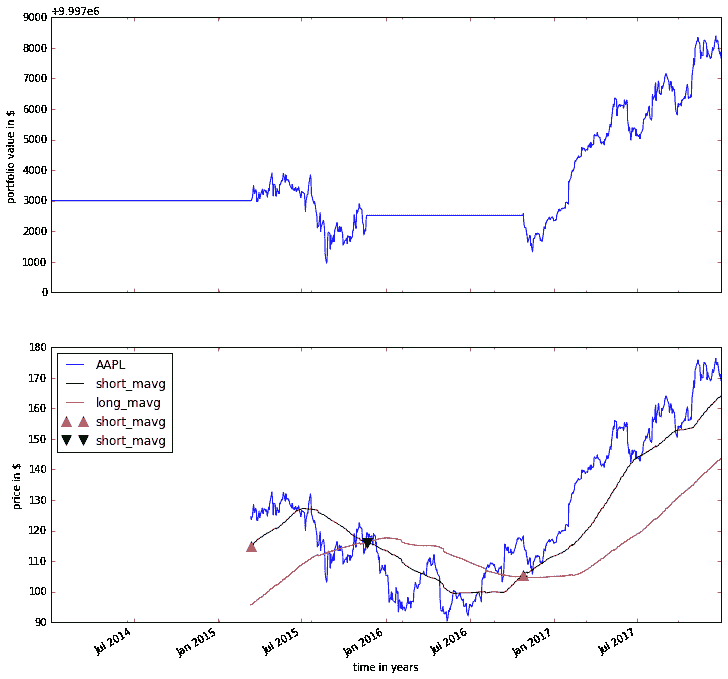

# 教程

> 原文：[`zipline.ml4trading.io/beginner-tutorial.html`](https://zipline.ml4trading.io/beginner-tutorial.html)

Zipline 是一个用 Python 编写的 [开源](https://github.com/stefan-jansen/zipline-reloaded) 算法交易模拟器。

一些好处包括：

+   **真实**：滑点、交易成本、订单延迟。

+   **基于流**：逐个处理每个事件，避免前瞻性偏差。

+   **包含电池**：常见的转换（移动平均线）以及常见的风险计算（夏普比率）可以在执行回测时高效计算。

本教程假设您已正确安装 Zipline，如果您尚未完成，请参阅 安装 说明。

## 如何构建算法

每个 Zipline 算法都由您必须定义的两个函数组成：

+   `initialize(context)`

+   `handle_data(context, data)`

在算法开始之前，Zipline 调用 `initialize()` 函数并传入一个 `context` 变量。`context` 是一个持久的命名空间，用于存储您需要从一个算法迭代到下一个迭代访问的变量。

算法初始化后，Zipline 为每个事件调用 `handle_data()` 函数一次。在每次调用时，它传递相同的 `context` 变量和一个名为 `data` 的事件帧，其中包含当前交易栏的开盘、最高、最低和收盘（OHLC）价格以及您投资组合中每只股票的成交量。

### 一个简单的例子

让我们来看一个来自 [zipline/examples](https://github.com/stefan-jansen/zipline-reloaded/tree/main/src/zipline/examples) 目录的非常简单的算法，`buyapple.py`。每个周期，即一个交易日，它订购 10 股苹果股票并记录价格。

```py
from zipline.examples import buyapple 
```

```py
from zipline.api import order, record, symbol

def initialize(context):
    pass

def handle_data(context, data):
    order(symbol('AAPL'), 10)
    record(AAPL=data.current(symbol('AAPL'), 'price')) 
```

如您所见，我们首先必须导入一些我们想要使用的函数。所有在您的算法中常用的函数都可以在 `zipline.api` 中找到。这里我们使用 `order()`，它接受两个参数：一个证券对象和一个指定您想要订购多少股票的数字（如果是负数，`order()` 将卖出/做空股票）。在这种情况下，我们希望在每次迭代中订购 10 股苹果股票。

最后，`record()` 函数允许您在每次迭代时保存变量的值。您向其提供变量的名称以及变量本身：`varname=var`。算法运行完成后，您将能够访问您使用 `record()` 跟踪的每个变量值，并使用您提供的名称（我们将在下面进一步看到）。您还可以看到我们如何访问 AAPL 股票在 `data` 事件帧中的当前价格数据。

## 如何运行算法

现在，要在金融数据上测试此算法，Zipline 提供了三种接口：1. 通过 `zipline` 命令的命令行，2. 通过 `zipline` 魔法在 `Jupyter Notebook` 中，3. 通过 `run_algorithm()` 执行你的算法，就像任何 Python 脚本一样，例如在你的 IDE 中。

在我们运行任何算法之前，我们需要一些数据。

### 数据摄取

如果你还没有摄取数据，那么运行：

```py
$  zipline  ingest  -b  <bundle> 
```

其中 `<bundle>` 是你要摄取的 bundle 的名称。目前你可以使用默认的 quandl 来处理 [Quandl WIKI 价格数据](https://www.quandl.com/databases/WIKIP/documentation?anchor=companies)。有关如何获取其他新数据的更多详细信息，请查看 数据摄取 部分。

### 命令行界面

安装 Zipline 后，你应该能够从命令行执行以下操作（例如在 Windows 上的 `cmd.exe`，在 OSX 上的终端应用程序，或在 Linux 上的 bash shell）：

```py
$  zipline  run  --help 
```

```py
Usage: zipline run [OPTIONS]

Run a backtest for the given algorithm.

Options:
 -f, --algofile FILENAME         The file that contains the algorithm to run.
 -t, --algotext TEXT             The algorithm script to run.
 -D, --define TEXT               Define a name to be bound in the namespace
                                 before executing the algotext. For example
                                 '-Dname=value'. The value may be any python
                                 expression. These are evaluated in order so
                                 they may refer to previously defined names.
 --data-frequency [daily|minute]
                                 The data frequency of the simulation.
                                 [default: daily]
 --capital-base FLOAT            The starting capital for the simulation.
                                 [default: 10000000.0]
 -b, --bundle BUNDLE-NAME        The data bundle to use for the simulation.
                                 [default: quandl]
 --bundle-timestamp TIMESTAMP    The date to lookup data on or before.
                                 [default: <current-time>]
 -s, --start DATE                The start date of the simulation.
 -e, --end DATE                  The end date of the simulation.
 -o, --output FILENAME           The location to write the perf data. If this
                                 is '-' the perf will be written to stdout.
                                 [default: -]
 --trading-calendar TRADING-CALENDAR
                                 The calendar you want to use e.g. LSE. NYSE
                                 is the default.
 --print-algo / --no-print-algo  Print the algorithm to stdout.
 --benchmark-file                The csv file that contains the benchmark
                                 returns (date, returns columns)
 --benchmark-symbol              The instrument's symbol to be used as
                                 a benchmark.
                                 (should exist in the ingested bundle)
 --benchmark-sid                 The sid of the instrument to be used as a
                                 benchmark.
                                 (should exist in the ingested bundle)
 --no-benchmark                  This flag is used to set the benchmark to
                                 zero. Alpha, beta and benchmark metrics
                                 are not calculated
 --help                          Show this message and exit. 
```

如你所见，有一些标志指定了算法的位置（`-f`），以及指定使用哪些数据的参数，默认为 `quandl`。

对于运行算法的日期范围（`--start` 和 `--end`）也存在一些争议。要使用基准测试，你需要在前面列出的基准选项中选择一个。你始终可以使用不使用基准的选项（`--no-benchmark`），在这种情况下，将零回报作为基准（此时不计算 alpha、beta 和基准指标）。

最后，你会想要保存算法的性能指标，以便你可以分析它的表现。这是通过 `--output` 标志完成的，它将导致它将性能 `DataFrame` 写入 pickle Python 文件格式。请注意，你还可以定义一个配置文件，其中包含这些参数，然后你可以方便地将其传递给 `-c` 选项，这样你就不必每次都提供命令行参数了（请参见示例目录中的 .conf 文件）。

因此，要执行上述算法并将结果保存到 `buyapple_out.pickle`，我们按如下方式调用 `zipline run`：

```py
zipline  run  -f  ../zipline/examples/buyapple.py  --start  2016-1-1  --end  2018-1-1  -o  buyapple_out.pickle  --no-benchmark 
```

```py
AAPL
[2018-01-03 04:30:51.843465] INFO: Performance: Simulated 503 trading days out of 503.
[2018-01-03 04:30:51.843598] INFO: Performance: first open: 2016-01-04 14:31:00+00:00
[2018-01-03 04:30:51.843672] INFO: Performance: last close: 2017-12-29 21:00:00+00:00 
```

`run` 首先调用 `initialize()` 函数，然后逐日流式传输历史股票价格通过 `handle_data()`。在每次调用 `handle_data()` 后，我们指示 `zipline` 订购 10 股 AAPL。在调用 `order()` 函数后，`zipline` 将订购的股票和数量输入订单簿。在 `handle_data()` 函数完成后，`zipline` 查找任何未完成的订单并尝试填充它们。如果该股票的交易量足够大，订单将在添加佣金并应用滑点模型后执行，该模型模拟了你的订单对股票价格的影响，因此你的算法将被收取比股票价格 * 10 更多的费用。（注意，你也可以更改 `zipline` 使用的佣金和滑点模型，请参见。

让我们快速查看一下性能`DataFrame`。为此，我们在 IPython Notebook 中使用`pandas`并打印前 10 行。请注意，`zipline`大量使用`pandas`，尤其是在数据输入和输出方面，因此值得花时间学习它。

```py
import pandas as pd
perf = pd.read_pickle('buyapple_out.pickle') # read in perf DataFrame
perf.head() 
```

|  | AAPL | algo_volatility | algorithm_period_return | alpha | benchmark_period_return | benchmark_volatility | beta | capital_used | ending_cash | ending_exposure | ending_value | excess_return | gross_leverage | long_exposure | long_value | longs_count | max_drawdown | max_leverage | net_leverage | orders | period_close | period_label | period_open | pnl | portfolio_value | positions | returns | sharpe | short_exposure | short_value | shorts_count | sortino | starting_cash | starting_exposure | starting_value | trading_days | transactions | treasury_period_return |
| --- | --- | --- | --- | --- | --- | --- | --- | --- | --- | --- | --- | --- | --- | --- | --- | --- | --- | --- | --- | --- | --- | --- | --- | --- | --- | --- | --- | --- | --- | --- | --- | --- | --- | --- | --- | --- | --- | --- |
| 2016-01-04 21:00:00+00:00 | 105.35 | NaN | 0.000000e+00 | NaN | -0.013983 | NaN | NaN | 0.0 | 10000000.0 | 0.0 | 0.0 | 0.0 | 0.000000 | 0.0 | 0.0 | 0 | 0.000000e+00 | 0.0 | 0.000000 | [{\'dt\': 2016-01-04 21:00:00+00:00, \'reason\': N... | 2016-01-04 21:00:00+00:00 | 2016-01 | 2016-01-04 14:31:00+00:00 | 0.0 | 10000000.0 | [] | 0.000000e+00 | NaN | 0 | 0 | 0 | NaN | 10000000.0 | 0.0 | 0.0 | 1 | [] | 0.0 |
| 2016-01-05 21:00:00+00:00 | 102.71 | 0.000001 | -1.000000e-07 | -0.000022 | -0.012312 | 0.175994 | -0.000006 | -1028.1 | 9998971.9 | 1027.1 | 1027.1 | 0.0 | 0.000103 | 1027.1 | 1027.1 | 1 | -1.000000e-07 | 0.0 | 0.000103 | [{\'dt\': 2016-01-05 21:00:00+00:00, \'reason\': N... | 2016-01-05 21:00:00+00:00 | 2016-01 | 2016-01-05 14:31:00+00:00 | -1.0 | 9999999.0 | [{\'sid\': Equity(8 [AAPL]), \'last_sale_price\': ... | -1.000000e-07 | -11.224972 | 0 | 0 | 0 | -11.224972 | 10000000.0 | 0.0 | 0.0 | 2 | [{\'order_id\': \'4011063b5c094e82a5391527044098b... | 0.0 |
| 2016-01-06 21:00:00+00:00 | 100.70 | 0.000019 | -2.210000e-06 | -0.000073 | -0.024771 | 0.137853 | 0.000054 | -1008.0 | 9997963.9 | 2014.0 | 2014.0 | 0.0 | 0.000201 | 2014.0 | 2014.0 | 1 | -2.210000e-06 | 0.0 | 0.000201 | [{\'dt\': 2016-01-06 21:00:00+00:00, \'reason\': N... | 2016-01-06 21:00:00+00:00 | 2016-01 | 2016-01-06 14:31:00+00:00 | -21.1 | 9999977.9 | [{\'sid\': Equity(8 [AAPL]), \'last_sale_price\': ... | -2.110000e-06 | -9.823839 | 0 | 0 | 0 | -9.588756 | 9998971.9 | 1027.1 | 1027.1 | 3 | [{\'order_id\': \'3bf9fe20cc46468d99f741474226c03... | 0.0 |
| 2016-01-07 21:00:00+00:00 | 96.45 | 0.000064 | -1.081000e-05 | 0.000243 | -0.048168 | 0.167868 | 0.000300 | -965.5 | 9996998.4 | 2893.5 | 2893.5 | 0.0 | 0.000289 | 2893.5 | 2893.5 | 1 | -1.081000e-05 | 0.0 | 0.000289 | [{\'dt\': 2016-01-07 21:00:00+00:00, \'reason\': N... | 2016-01-07 21:00:00+00:00 | 2016-01 | 2016-01-07 14:31:00+00:00 | -86.0 | 9999891.9 | [{\'sid\': Equity(8 [AAPL]), \'last_sale_price\': ... | -8.600019e-06 | -10.592737 | 0 | 0 | 0 | -9.688947 | 9997963.9 | 2014.0 | 2014.0 | 4 | [{\'order_id\': \'6af6aed9fbb44a6bba17e802051b94d... | 0.0 |
| 2016-01-08 21:00:00+00:00 | 96.96 | 0.000063 | -9.380000e-06 | 0.000466 | -0.058601 | 0.145654 | 0.000311 | -970.6 | 9996027.8 | 3878.4 | 3878.4 | 0.0 | 0.000388 | 3878.4 | 3878.4 | 1 | -1.081000e-05 | 0.0 | 0.000388 | [{\'dt\': 2016-01-08 21:00:00+00:00, \'reason\': N... | 2016-01-08 21:00:00+00:00 | 2016-01 | 2016-01-08 14:31:00+00:00 | 14.3 | 9999906.2 | [{\'sid\': Equity(8 [AAPL]), \'last_sale_price\': ... | 1.430015e-06 | -7.511729 | 0 | 0 | 0 | -7.519659 | 9996998.4 | 2893.5 | 2893.5 | 5 | {\'order_id\': \'18f64975732449a18fca06e9c69bf5c... | 0.0 |

如你所见，每个交易日都有一行，从 2016 年的第一个工作日开始。在列中，你可以找到有关你的算法状态的各种信息。第一列`AAPL`是由前面提到的`record()`函数放置在那里的，它允许我们绘制苹果的价格。例如，我们现在可以很容易地检查我们的投资组合价值如何随时间变化，与 AAPL 股票价格相比。

```py
%pylab inline
figsize(12, 12)
import matplotlib.pyplot as plt

ax1 = plt.subplot(211)
perf.portfolio_value.plot(ax=ax1)
ax1.set_ylabel('Portfolio Value')
ax2 = plt.subplot(212, sharex=ax1)
perf.AAPL.plot(ax=ax2)
ax2.set_ylabel('AAPL Stock Price') 
```

```py
Populating the interactive namespace from numpy and matplotlib 
```

```py
<matplotlib.text.Text at 0x10c48c198> 
```

是一个非常强大的基于浏览器的 Python 解释器界面（本教程就是在其中编写的）。由于它是许多量化研究人员非常流行的界面，Zipline 提供了一种简单的方法，可以在不要求你使用 CLI 的情况下在 Notebook 内运行你的算法。

要使用它，你需要在一个单元格中编写你的算法，并让 Zipline 知道它应该运行这个算法。这是通过`%%zipline` IPython 魔术命令完成的，该命令在你从 IPython Notebook 中`import zipline`后可用。这个魔术命令接受与上述命令行界面相同的参数。因此，要使用相同的参数运行上述算法，我们只需在导入`zipline`后执行以下单元格来注册魔术命令。

```py
%load_ext zipline 
```

```py
%%zipline --start 2016-1-1 --end 2018-1-1
from zipline.api import symbol, order, record

def initialize(context):
    pass

def handle_data(context, data):
    order(symbol('AAPL'), 10)
    record(AAPL=data.current(symbol('AAPL'), "price") 
```

注意，我们不需要像上面那样指定输入文件，因为魔术将使用单元格的内容并在那里查找您的算法函数。此外，我们没有定义输出文件，而是使用`-o`指定了一个变量名，该变量名将在名称空间中创建，并包含我们在上面查看的性能`DataFrame`。

```py
_.head() 
```

|  | AAPL | algo_volatility | algorithm_period_return | alpha | benchmark_period_return | benchmark_volatility | beta | capital_used | ending_cash | ending_exposure | ending_value | excess_return | gross_leverage | long_exposure | long_value | longs_count | max_drawdown | max_leverage | net_leverage | orders | period_close | period_label | period_open | pnl | portfolio_value | positions | returns | sharpe | short_exposure | short_value | shorts_count | sortino | starting_cash | starting_exposure | starting_value | trading_days | transactions | treasury_period_return |
| --- | --- | --- | --- | --- | --- | --- | --- | --- | --- | --- | --- | --- | --- | --- | --- | --- | --- | --- | --- | --- | --- | --- | --- | --- | --- | --- | --- | --- | --- | --- | --- | --- | --- | --- | --- | --- | --- | --- |
| 2016-01-04 21:00:00+00:00 | 105.35 | NaN | 0.000000e+00 | NaN | -0.013983 | NaN | NaN | 0.00 | 10000000.00 | 0.0 | 0.0 | 0.0 | 0.000000 | 0.0 | 0.0 | 0 | 0.000000e+00 | 0.0 | 0.000000 | [{\'created\': 2016-01-04 21:00:00+00:00, \'reaso... | 2016-01-04 21:00:00+00:00 | 2016-01 | 2016-01-04 14:31:00+00:00 | 0.00 | 10000000.00 | [] | 0.000000e+00 | NaN | 0 | 0 | 0 | NaN | 10000000.00 | 0.0 | 0.0 | 1 | [] | 0.0 |
| 2016-01-05 21:00:00+00:00 | 102.71 | 1.122497e-08 | -1.000000e-09 | -2.247510e-07 | -0.012312 | 0.175994 | -6.378047e-08 | -1027.11 | 9998972.89 | 1027.1 | 1027.1 | 0.0 | 0.000103 | 1027.1 | 1027.1 | 1 | -9.999999e-10 | 0.0 | 0.000103 | {\'created\': 2016-01-04 21:00:00+00:00, \'reaso... | 2016-01-05 21:00:00+00:00 | 2016-01 | 2016-01-05 14:31:00+00:00 | -0.01 | 9999999.99 | [{\'amount\': 10, \'cost_basis\': 102.711000000000... | -1.000000e-09 | -11.224972 | 0 | 0 | 0 | -11.224972 | 10000000.00 | 0.0 | 0.0 | 2 | [{\'dt\': 2016-01-05 21:00:00+00:00, \'order_id\':... | 0.0 |
| 2016-01-06 21:00:00+00:00 | 100.70 | 1.842654e-05 | -2.012000e-06 | -4.883861e-05 | -0.024771 | 0.137853 | 5.744807e-05 | -1007.01 | 9997965.88 | 2014.0 | 2014.0 | 0.0 | 0.000201 | 2014.0 | 2014.0 | 1 | -2.012000e-06 | 0.0 | 0.000201 | [{\'created\': 2016-01-05 21:00:00+00:00, \'reaso... | 2016-01-06 21:00:00+00:00 | 2016-01 | 2016-01-06 14:31:00+00:00 | -20.11 | 9999979.88 | [{\'amount\': 20, \'cost_basis\': 101.706000000000... | -2.011000e-06 | -9.171989 | 0 | 0 | 0 | -9.169708 | 9998972.89 | 1027.1 | 1027.1 | 3 | [{\'dt\': 2016-01-06 21:00:00+00:00, \'order_id\':... | 0.0 |
| 2016-01-07 21:00:00+00:00 | 96.45 | 6.394658e-05 | -1.051300e-05 | 2.633450e-04 | -0.048168 | 0.167868 | 3.005102e-04 | -964.51 | 9997001.37 | 2893.5 | 2893.5 | 0.0 | 0.000289 | 2893.5 | 2893.5 | 1 | -1.051300e-05 | 0.0 | 0.000289 | [{\'created\': 2016-01-06 21:00:00+00:00, \'reaso... | 2016-01-07 21:00:00+00:00 | 2016-01 | 2016-01-07 14:31:00+00:00 | -85.01 | 9999894.87 | [{\'amount\': 30, \'cost_basis\': 99.9543333333335... | -8.501017e-06 | -10.357397 | 0 | 0 | 0 | -9.552189 | 9997965.88 | 2014.0 | 2014.0 | 4 | [{\'dt\': 2016-01-07 21:00:00+00:00, \'order_id\':... | 0.0 |
| 2016-01-08 21:00:00+00:00 | 96.96 | 6.275294e-05 | -8.984000e-06 | 4.879306e-04 | -0.058601 | 0.145654 | 3.118401e-04 | -969.61 | 9996031.76 | 3878.4 | 3878.4 | 0.0 | 0.000388 | 3878.4 | 3878.4 | 1 | -1.051300e-05 | 0.0 | 0.000388 | [{\'created\': 2016-01-07 21:00:00+00:00, \'reaso... | 2016-01-08 21:00:00+00:00 | 2016-01 | 2016-01-08 14:31:00+00:00 | 15.29 | 9999910.16 | [{\'amount\': 40, \'cost_basis\': 99.2060000000002... | 1.529016e-06 | -7.215497 | 0 | 0 | 0 | -7.301134 | 9997001.37 | 2893.5 | 2893.5 | 5 | [{\'dt\': 2016-01-08 21:00:00+00:00, \'order_id\':... | 0.0 |

### IDE 通过[`run_algorithm()`

要在您喜欢的 IDE 中执行类似于 Python 脚本的算法，请使用`run_algorithm()`（参见 API 参考）。

要调整上述`buyapple.py`示例（参见同一目录中的`buyapple_ide.py`），只需添加以下内容：

```py
from zipline import run_algorithm
import pandas as pd
import pandas_datareader.data as web

def initialize(context):
    ...

def handle_data(context, data):
    ...

start = pd.Timestamp('2014')
end = pd.Timestamp('2018')

sp500 = web.DataReader('SP500', 'fred', start, end).SP500
benchmark_returns = sp500.pct_change()

result = run_algorithm(start=start.tz_localize('UTC'),
                       end=end.tz_localize('UTC'),
                       initialize=initialize,
                       handle_data=handle_data,
                       capital_base=100000,
                       benchmark_returns=benchmark_returns,
                       bundle='quandl',
                       data_frequency='daily') 
```

我们将关键算法参数传递给`run_algorithm()`，包括我们从[联邦储备经济数据服务](https://fred.stlouisfed.org/series/SP500)（过去 10 年可用）下载的 S&P 500 的一些基准数据。

返回的`result`值包含与前一个示例相同的`DataFrame`。您可以对`DataFrame`应用您喜欢的逻辑，而不是将`analyze()`函数定义为算法的一部分。

## 如何使用历史价格：双移动平均线交叉示例

双移动平均线（DMA）是一种经典的动量策略。它可能不再被任何严肃的交易者使用，但仍然非常有教育意义。基本思想是我们计算两个滚动或移动平均线（mavg）——一个具有较长窗口，旨在捕捉长期趋势，另一个具有较短窗口，旨在捕捉短期趋势。一旦短期 mavg 从下方穿过长期 mavg，我们就假设股票价格具有上升趋势，并买入股票。如果短期 mavg 从上方穿过，我们退出头寸，因为我们假设股票会进一步下跌。

由于我们需要访问先前的价格来实施此策略，因此我们需要一个新概念：历史

`data.history()`是一个方便的函数，它为您保留了一个数据滚动窗口。第一个参数是您想要收集的条形图数量，第二个参数是单位（`'1d'`或`'1m'`，但请注意，您需要有分钟级别的数据才能使用`1m`）。有关`history()`功能的更详细描述，请参阅 API 参考。让我们来看一个策略，这将使这一点变得清晰：

```py
%%zipline --start 2014-1-1 --end 2018-1-1 -o dma.pickle

from zipline.api import order_target, record, symbol
import matplotlib.pyplot as plt

def initialize(context):
    context.i = 0
    context.asset = symbol('AAPL')

def handle_data(context, data):
    # Skip first 300 days to get full windows
    context.i += 1
    if context.i < 300:
        return

    # Compute averages
    # data.history() has to be called with the same params
    # from above and returns a pandas dataframe.
    short_mavg = data.history(context.asset, 'price', bar_count=100, frequency="1d").mean()
    long_mavg = data.history(context.asset, 'price', bar_count=300, frequency="1d").mean()

    # Trading logic
    if short_mavg > long_mavg:
        # order_target orders as many shares as needed to
        # achieve the desired number of shares.
        order_target(context.asset, 100)
    elif short_mavg < long_mavg:
        order_target(context.asset, 0)

    # Save values for later inspection
    record(AAPL=data.current(context.asset, 'price'),
           short_mavg=short_mavg,
           long_mavg=long_mavg)

def analyze(context, perf):
    fig = plt.figure()
    ax1 = fig.add_subplot(211)
    perf.portfolio_value.plot(ax=ax1)
    ax1.set_ylabel('portfolio value in $')

    ax2 = fig.add_subplot(212)
    perf['AAPL'].plot(ax=ax2)
    perf[['short_mavg', 'long_mavg']].plot(ax=ax2)

    perf_trans = perf.loc[[t != [] for t in perf.transactions]]
    buys = perf_trans.loc[[t[0]['amount'] > 0 for t in perf_trans.transactions]]
    sells = perf_trans.loc[
        [t[0]['amount'] < 0 for t in perf_trans.transactions]]
    ax2.plot(buys.index, perf.short_mavg.loc[buys.index],
             '^', markersize=10, color='m')
    ax2.plot(sells.index, perf.short_mavg.loc[sells.index],
             'v', markersize=10, color='k')
    ax2.set_ylabel('price in $')
    plt.legend(loc=0)
    plt.show() 
```



在这里，我们明确地定义了一个`analyze()`函数，该函数会在回测完成后自动被调用。

尽管可能不那么直接明显，但`history()`（双关语）的强大功能不容小觑，因为大多数算法都会以某种形式利用过去的市场发展。您可以轻松设计一个策略，使用[scikit-learn](https://scikit-learn.org/stable/)训练一个分类器，该分类器试图根据过去的价格预测未来的市场走势，（注意，大多数`scikit-learn`函数需要`numpy.ndarray`而不是`pandas.DataFrame`，因此您可以通过`.to_numpy()`简单地传递`DataFrame`的底层`ndarray`）。

我们还使用了上面的`order_target()`函数。像这样的其他函数可以使订单管理和投资组合再平衡变得更加容易。有关更多详细信息，请参阅 API 参考。

### 结论

我们希望本教程能为您提供一些关于`zipline`架构、API 和功能的初步了解。下一步，可以查看一些[示例](https://github.com/stefan-jansen/zipline-reloaded/tree/main/src/zipline/examples)。

欢迎在[我们的邮件列表](https://groups.google.com/forum/#!forum/zipline)上提问，在我们的[GitHub 问题跟踪器](https://github.com/stefan-jansen/zipline-reloaded/issues?state=open)上报问题，或[参与进来](https://exchange.ml4trading.io)。

## 如何构建算法

每个 Zipline 算法都由您必须定义的两个函数组成：

+   `initialize(context)`

+   `handle_data(context, data)`

在算法开始之前，Zipline 会调用`initialize()`函数并传递一个`context`变量。`context`是一个持久的命名空间，用于存储您需要从一个算法迭代访问到下一个算法的变量。

算法初始化后，Zipline 会为每个事件调用一次`handle_data()`函数。每次调用时，它都会传递相同的`context`变量和一个名为`data`的事件框架，其中包含当前交易时段的开盘、最高、最低和收盘（OHLC）价格以及您投资组合中每只股票的成交量。

### 一个简单的例子

让我们来看一个非常简单的算法，来自[zipline/examples](https://github.com/stefan-jansen/zipline-reloaded/tree/main/src/zipline/examples)目录，`buyapple.py`。每个周期，即交易日，它都会订购 10 股苹果股票并记录价格。

```py
from zipline.examples import buyapple 
```

```py
from zipline.api import order, record, symbol

def initialize(context):
    pass

def handle_data(context, data):
    order(symbol('AAPL'), 10)
    record(AAPL=data.current(symbol('AAPL'), 'price')) 
```

如您所见，我们首先需要导入一些我们想要使用的函数。所有在您的算法中常用的函数都可以在`zipline.api`中找到。这里我们使用的是`order()`，它接受两个参数：一个证券对象和一个指定您想要订购多少股票的数字（如果是负数，`order()`将卖出/做空股票）。在这种情况下，我们希望在每次迭代中订购 10 股苹果股票。

最后，`record()`函数允许您在每次迭代中保存变量的值。您向它提供变量的名称以及变量本身：`varname=var`。算法运行完成后，您将能够访问您使用`record()`跟踪的每个变量值，并使用您提供的名称（我们将在下面进一步看到）。您还可以看到我们如何访问`data`事件帧中 AAPL 股票的当前价格数据。

### 一个简单的例子

让我们来看一下[zipline/examples](https://github.com/stefan-jansen/zipline-reloaded/tree/main/src/zipline/examples)目录中的一个非常简单的算法，`buyapple.py`。每个周期，即交易日，它都会下单购买 10 股苹果股票并记录价格。

```py
from zipline.examples import buyapple 
```

```py
from zipline.api import order, record, symbol

def initialize(context):
    pass

def handle_data(context, data):
    order(symbol('AAPL'), 10)
    record(AAPL=data.current(symbol('AAPL'), 'price')) 
```

如您所见，我们首先需要导入一些我们想要使用的函数。所有在您的算法中常用的函数都可以在`zipline.api`中找到。这里我们使用的是`order()`，它接受两个参数：一个证券对象和一个指定您想要订购多少股票的数字（如果是负数，`order()`将卖出/做空股票）。在这种情况下，我们希望在每次迭代中订购 10 股苹果股票。

最后，`record()`函数允许您在每次迭代中保存变量的值。您向它提供变量的名称以及变量本身：`varname=var`。算法运行完成后，您将能够访问您使用`record()`跟踪的每个变量值，并使用您提供的名称（我们将在下面进一步看到）。您还可以看到我们如何访问`data`事件帧中 AAPL 股票的当前价格数据。

## 如何运行算法

现在要在金融数据上测试这个算法，Zipline 提供了三个接口：1. 通过`zipline`命令的命令行，2. 通过`zipline`魔法的`Jupyter Notebook`，以及 3. `run_algorithm()`来像任何 Python 脚本一样执行您的算法，例如在您的 IDE 中。

在我们能够运行任何算法之前，我们需要一些数据。

### 数据摄取

如果您还没有摄取数据，请运行：

```py
$  zipline  ingest  -b  <bundle> 
```

其中`<bundle>`是要摄取的 bundle 的名称。您现在可以使用默认的 quandl 来处理[Quandl WIKI 价格数据](https://www.quandl.com/databases/WIKIP/documentation?anchor=companies)。有关如何获取其他新数据的更多详细信息，请查看摄取数据部分。

### 命令行界面

安装 Zipline 后，您应该能够从命令行执行以下操作（例如在 Windows 上的`cmd.exe`，在 OSX 上的 Terminal 应用程序，或在 Linux 上的 bash shell）：

```py
$  zipline  run  --help 
```

```py
Usage: zipline run [OPTIONS]

Run a backtest for the given algorithm.

Options:
 -f, --algofile FILENAME         The file that contains the algorithm to run.
 -t, --algotext TEXT             The algorithm script to run.
 -D, --define TEXT               Define a name to be bound in the namespace
                                 before executing the algotext. For example
                                 '-Dname=value'. The value may be any python
                                 expression. These are evaluated in order so
                                 they may refer to previously defined names.
 --data-frequency [daily|minute]
                                 The data frequency of the simulation.
                                 [default: daily]
 --capital-base FLOAT            The starting capital for the simulation.
                                 [default: 10000000.0]
 -b, --bundle BUNDLE-NAME        The data bundle to use for the simulation.
                                 [default: quandl]
 --bundle-timestamp TIMESTAMP    The date to lookup data on or before.
                                 [default: <current-time>]
 -s, --start DATE                The start date of the simulation.
 -e, --end DATE                  The end date of the simulation.
 -o, --output FILENAME           The location to write the perf data. If this
                                 is '-' the perf will be written to stdout.
                                 [default: -]
 --trading-calendar TRADING-CALENDAR
                                 The calendar you want to use e.g. LSE. NYSE
                                 is the default.
 --print-algo / --no-print-algo  Print the algorithm to stdout.
 --benchmark-file                The csv file that contains the benchmark
                                 returns (date, returns columns)
 --benchmark-symbol              The instrument's symbol to be used as
                                 a benchmark.
                                 (should exist in the ingested bundle)
 --benchmark-sid                 The sid of the instrument to be used as a
                                 benchmark.
                                 (should exist in the ingested bundle)
 --no-benchmark                  This flag is used to set the benchmark to
                                 zero. Alpha, beta and benchmark metrics
                                 are not calculated
 --help                          Show this message and exit. 
```

如您所见，有几个标志指定了算法的位置（`-f`）以及指定使用哪些数据的参数，默认为`quandl`。

还有用于指定算法运行时间范围的参数（`--start`和`--end`）。要使用基准，您需要选择列出的基准选项之一。您始终可以使用使用零回报作为基准的选项（`--no-benchmark`）（在这种情况下，不计算 alpha，beta 和基准指标）。

最后，您将希望保存算法的性能指标，以便您可以分析其表现。这是通过`--output`标志完成的，这将导致它以 pickle Python 文件格式编写性能`DataFrame`。请注意，您还可以使用这些参数定义一个配置文件，然后方便地将其传递给`-c`选项，这样您就不必一直提供命令行参数（请参见示例目录中的.conf 文件）。

因此，要执行上述算法并将结果保存到`buyapple_out.pickle`，我们按如下方式调用`zipline run`：

```py
zipline  run  -f  ../zipline/examples/buyapple.py  --start  2016-1-1  --end  2018-1-1  -o  buyapple_out.pickle  --no-benchmark 
```

```py
AAPL
[2018-01-03 04:30:51.843465] INFO: Performance: Simulated 503 trading days out of 503.
[2018-01-03 04:30:51.843598] INFO: Performance: first open: 2016-01-04 14:31:00+00:00
[2018-01-03 04:30:51.843672] INFO: Performance: last close: 2017-12-29 21:00:00+00:00 
```

`run`首先调用`initialize()`函数，然后通过`handle_data()`逐日流式传输历史股票价格。在每次调用`handle_data()`之后，我们指示`zipline`订购 10 股 AAPL。在调用`order()`函数之后，`zipline`将订购的股票和数量输入订单簿。在`handle_data()`函数完成后，`zipline`查找任何未完成的订单并尝试填充它们。如果该股票的交易量足够高，订单将在添加佣金并应用滑点模型后执行，该模型模拟了您的订单对股票价格的影响，因此您的算法将被收取的费用不仅仅是股票价格* 10。（请注意，您也可以更改`zipline`使用的佣金和滑点模型，请参见。

让我们快速浏览一下性能`DataFrame`。为此，我们在 IPython Notebook 中使用`pandas`并打印前 10 行。请注意，`zipline`大量使用`pandas`，特别是在数据输入和输出方面，因此值得花时间学习它。

```py
import pandas as pd
perf = pd.read_pickle('buyapple_out.pickle') # read in perf DataFrame
perf.head() 
```

|  | AAPL | algo_volatility | algorithm_period_return | alpha | benchmark_period_return | benchmark_volatility | beta | capital_used | ending_cash | ending_exposure | ending_value | excess_return | gross_leverage | long_exposure | long_value | longs_count | max_drawdown | max_leverage | net_leverage | orders | period_close | period_label | period_open | pnl | portfolio_value | positions | returns | sharpe | short_exposure | short_value | shorts_count | sortino | starting_cash | starting_exposure | starting_value | trading_days | transactions | treasury_period_return |
| --- | --- | --- | --- | --- | --- | --- | --- | --- | --- | --- | --- | --- | --- | --- | --- | --- | --- | --- | --- | --- | --- | --- | --- | --- | --- | --- | --- | --- | --- | --- | --- | --- | --- | --- | --- | --- | --- | --- |
| 2016-01-04 21:00:00+00:00 | 105.35 | NaN | 0.000000e+00 | NaN | -0.013983 | NaN | NaN | 0.0 | 10000000.0 | 0.0 | 0.0 | 0.0 | 0.000000 | 0.0 | 0.0 | 0 | 0.000000e+00 | 0.0 | 0.000000 | [{\'dt\': 2016-01-04 21:00:00+00:00, \'reason\': N... | 2016-01-04 21:00:00+00:00 | 2016-01 | 2016-01-04 14:31:00+00:00 | 0.0 | 10000000.0 | [] | 0.000000e+00 | NaN | 0 | 0 | 0 | NaN | 10000000.0 | 0.0 | 0.0 | 1 | [] | 0.0 |
| 2016-01-05 21:00:00+00:00 | 102.71 | 0.000001 | -1.000000e-07 | -0.000022 | -0.012312 | 0.175994 | -0.000006 | -1028.1 | 9998971.9 | 1027.1 | 1027.1 | 0.0 | 0.000103 | 1027.1 | 1027.1 | 1 | -1.000000e-07 | 0.0 | 0.000103 | [{\'dt\': 2016-01-05 21:00:00+00:00, \'reason\': N... | 2016-01-05 21:00:00+00:00 | 2016-01 | 2016-01-05 14:31:00+00:00 | -1.0 | 9999999.0 | [{\'sid\': Equity(8 [AAPL]), \'last_sale_price\': ... | -1.000000e-07 | -11.224972 | 0 | 0 | 0 | -11.224972 | 10000000.0 | 0.0 | 0.0 | 2 | [{\'order_id\': \'4011063b5c094e82a5391527044098b... | 0.0 |
| 2016-01-06 21:00:00+00:00 | 100.70 | 0.000019 | -2.210000e-06 | -0.000073 | -0.024771 | 0.137853 | 0.000054 | -1008.0 | 9997963.9 | 2014.0 | 2014.0 | 0.0 | 0.000201 | 2014.0 | 2014.0 | 1 | -2.210000e-06 | 0.0 | 0.000201 | [{\'dt\': 2016-01-06 21:00:00+00:00, \'reason\': N... | 2016-01-06 21:00:00+00:00 | 2016-01 | 2016-01-06 14:31:00+00:00 | -21.1 | 9999977.9 | [{\'sid\': Equity(8 [AAPL]), \'last_sale_price\': ... | -2.110000e-06 | -9.823839 | 0 | 0 | 0 | -9.588756 | 9998971.9 | 1027.1 | 1027.1 | 3 | [{\'order_id\': \'3bf9fe20cc46468d99f741474226c03... | 0.0 |
| 2016-01-07 21:00:00+00:00 | 96.45 | 0.000064 | -1.081000e-05 | 0.000243 | -0.048168 | 0.167868 | 0.000300 | -965.5 | 9996998.4 | 2893.5 | 2893.5 | 0.0 | 0.000289 | 2893.5 | 2893.5 | 1 | -1.081000e-05 | 0.0 | 0.000289 | [{\'dt\': 2016-01-07 21:00:00+00:00, \'reason\': N... | 2016-01-07 21:00:00+00:00 | 2016-01 | 2016-01-07 14:31:00+00:00 | -86.0 | 9999891.9 | [{\'sid\': Equity(8 [AAPL]), \'last_sale_price\': ... | -8.600019e-06 | -10.592737 | 0 | 0 | 0 | -9.688947 | 9997963.9 | 2014.0 | 2014.0 | 4 | [{\'order_id\': \'6af6aed9fbb44a6bba17e802051b94d... | 0.0 |
| 2016-01-08 21:00:00+00:00 | 96.96 | 0.000063 | -9.380000e-06 | 0.000466 | -0.058601 | 0.145654 | 0.000311 | -970.6 | 9996027.8 | 3878.4 | 3878.4 | 0.0 | 0.000388 | 3878.4 | 3878.4 | 1 | -1.081000e-05 | 0.0 | 0.000388 | [{\'dt\': 2016-01-08 21:00:00+00:00, \'reason\': N... | 2016-01-08 21:00:00+00:00 | 2016-01 | 2016-01-08 14:31:00+00:00 | 14.3 | 9999906.2 | [{\'sid\': Equity(8 [AAPL]), \'last_sale_price\': ... | 1.430015e-06 | -7.511729 | 0 | 0 | 0 | -7.519659 | 9996998.4 | 2893.5 | 2893.5 | 5 | {\'order_id\': \'18f64975732449a18fca06e9c69bf5c... | 0.0 |

正如您所见，每行代表一个交易日，从 2016 年的第一个工作日开始。在列中，您可以找到有关您的算法状态的各种信息。第一列`AAPL`是由前面提到的`record()`函数放置在那里的，它允许我们绘制苹果的价格。例如，我们现在可以很容易地检查我们的投资组合价值随时间的变化与 AAPL 股票价格相比。

```py
%pylab inline
figsize(12, 12)
import matplotlib.pyplot as plt

ax1 = plt.subplot(211)
perf.portfolio_value.plot(ax=ax1)
ax1.set_ylabel('Portfolio Value')
ax2 = plt.subplot(212, sharex=ax1)
perf.AAPL.plot(ax=ax2)
ax2.set_ylabel('AAPL Stock Price') 
```

```py
Populating the interactive namespace from numpy and matplotlib 
```

```py
<matplotlib.text.Text at 0x10c48c198> 
```

是一个非常强大的基于浏览器的 Python 解释器界面（本教程就是在其中编写的）。由于它是许多定量研究人员非常流行的界面，Zipline 提供了一种简单的方法，可以在不要求您使用 CLI 的情况下在 Notebook 中运行您的算法。

要使用它，您必须在单元格中编写您的算法，并让 Zipline 知道它应该运行此算法。这是通过`%%zipline` IPython 魔法命令完成的，该命令在您从 IPython Notebook 中`import zipline`后可用。此魔法接受与上面描述的命令行界面相同的参数。因此，要使用相同的参数运行上面的算法，我们只需在导入`zipline`以注册魔法后执行以下单元格。

```py
%load_ext zipline 
```

```py
%%zipline --start 2016-1-1 --end 2018-1-1
from zipline.api import symbol, order, record

def initialize(context):
    pass

def handle_data(context, data):
    order(symbol('AAPL'), 10)
    record(AAPL=data.current(symbol('AAPL'), "price") 
```

请注意，我们不需要像上面那样指定输入文件，因为魔法将使用单元格的内容并在那里查找您的算法函数。此外，我们没有定义输出文件，而是使用`-o`指定了一个变量名，该变量名将在名称空间中创建，并包含我们上面查看的性能`DataFrame`。

```py
_.head() 
```

|  | AAPL | algo_volatility | algorithm_period_return | alpha | benchmark_period_return | benchmark_volatility | beta | capital_used | ending_cash | ending_exposure | ending_value | excess_return | gross_leverage | long_exposure | long_value | longs_count | max_drawdown | max_leverage | net_leverage | orders | period_close | period_label | period_open | pnl | portfolio_value | positions | returns | sharpe | short_exposure | short_value | shorts_count | sortino | starting_cash | starting_exposure | starting_value | trading_days | transactions | treasury_period_return |
| --- | --- | --- | --- | --- | --- | --- | --- | --- | --- | --- | --- | --- | --- | --- | --- | --- | --- | --- | --- | --- | --- | --- | --- | --- | --- | --- | --- | --- | --- | --- | --- | --- | --- | --- | --- | --- | --- | --- |
| 2016-01-04 21:00:00+00:00 | 105.35 | NaN | 0.000000e+00 | NaN | -0.013983 | NaN | NaN | 0.00 | 10000000.00 | 0.0 | 0.0 | 0.0 | 0.000000 | 0.0 | 0.0 | 0 | 0.000000e+00 | 0.0 | 0.000000 | [{\'created\': 2016-01-04 21:00:00+00:00, \'reaso... | 2016-01-04 21:00:00+00:00 | 2016-01 | 2016-01-04 14:31:00+00:00 | 0.00 | 10000000.00 | [] | 0.000000e+00 | NaN | 0 | 0 | 0 | NaN | 10000000.00 | 0.0 | 0.0 | 1 | [] | 0.0 |
| 2016-01-05 21:00:00+00:00 | 102.71 | 1.122497e-08 | -1.000000e-09 | -2.247510e-07 | -0.012312 | 0.175994 | -6.378047e-08 | -1027.11 | 9998972.89 | 1027.1 | 1027.1 | 0.0 | 0.000103 | 1027.1 | 1027.1 | 1 | -9.999999e-10 | 0.0 | 0.000103 | {\'created\': 2016-01-04 21:00:00+00:00, \'reaso... | 2016-01-05 21:00:00+00:00 | 2016-01 | 2016-01-05 14:31:00+00:00 | -0.01 | 9999999.99 | [{\'amount\': 10, \'cost_basis\': 102.711000000000... | -1.000000e-09 | -11.224972 | 0 | 0 | 0 | -11.224972 | 10000000.00 | 0.0 | 0.0 | 2 | [{\'dt\': 2016-01-05 21:00:00+00:00, \'order_id\':... | 0.0 |
| 2016-01-06 21:00:00+00:00 | 100.70 | 1.842654e-05 | -2.012000e-06 | -4.883861e-05 | -0.024771 | 0.137853 | 5.744807e-05 | -1007.01 | 9997965.88 | 2014.0 | 2014.0 | 0.0 | 0.000201 | 2014.0 | 2014.0 | 1 | -2.012000e-06 | 0.0 | 0.000201 | [{\'created\': 2016-01-05 21:00:00+00:00, \'reaso... | 2016-01-06 21:00:00+00:00 | 2016-01 | 2016-01-06 14:31:00+00:00 | -20.11 | 9999979.88 | [{\'amount\': 20, \'cost_basis\': 101.706000000000... | -2.011000e-06 | -9.171989 | 0 | 0 | 0 | -9.169708 | 9998972.89 | 1027.1 | 1027.1 | 3 | [{\'dt\': 2016-01-06 21:00:00+00:00, \'order_id\':... | 0.0 |
| 2016-01-07 21:00:00+00:00 | 96.45 | 6.394658e-05 | -1.051300e-05 | 2.633450e-04 | -0.048168 | 0.167868 | 3.005102e-04 | -964.51 | 9997001.37 | 2893.5 | 2893.5 | 0.0 | 0.000289 | 2893.5 | 2893.5 | 1 | -1.051300e-05 | 0.0 | 0.000289 | [{\'created\': 2016-01-06 21:00:00+00:00, \'reaso... | 2016-01-07 21:00:00+00:00 | 2016-01 | 2016-01-07 14:31:00+00:00 | -85.01 | 9999894.87 | [{\'amount\': 30, \'cost_basis\': 99.9543333333335... | -8.501017e-06 | -10.357397 | 0 | 0 | 0 | -9.552189 | 9997965.88 | 2014.0 | 2014.0 | 4 | [{\'dt\': 2016-01-07 21:00:00+00:00, \'order_id\':... | 0.0 |
| 2016-01-08 21:00:00+00:00 | 96.96 | 6.275294e-05 | -8.984000e-06 | 4.879306e-04 | -0.058601 | 0.145654 | 3.118401e-04 | -969.61 | 9996031.76 | 3878.4 | 3878.4 | 0.0 | 0.000388 | 3878.4 | 3878.4 | 1 | -1.051300e-05 | 0.0 | 0.000388 | [{\'created\': 2016-01-07 21:00:00+00:00, \'reaso... | 2016-01-08 21:00:00+00:00 | 2016-01 | 2016-01-08 14:31:00+00:00 | 15.29 | 9999910.16 | [{\'amount\': 40, \'cost_basis\': 99.2060000000002... | 1.529016e-06 | -7.215497 | 0 | 0 | 0 | -7.301134 | 9997001.37 | 2893.5 | 2893.5 | 5 | [{\'dt\': 2016-01-08 21:00:00+00:00, \'order_id\':... | 0.0 |

### IDE 通过[`run_algorithm()`

要在您喜欢的 IDE 中像 Python 脚本一样执行算法，请使用`run_algorithm()`（参见 API 参考）。

要根据上述的`buyapple.py`示例进行调整（参见同一目录中的`buyapple_ide.py`），只需添加以下内容：

```py
from zipline import run_algorithm
import pandas as pd
import pandas_datareader.data as web

def initialize(context):
    ...

def handle_data(context, data):
    ...

start = pd.Timestamp('2014')
end = pd.Timestamp('2018')

sp500 = web.DataReader('SP500', 'fred', start, end).SP500
benchmark_returns = sp500.pct_change()

result = run_algorithm(start=start.tz_localize('UTC'),
                       end=end.tz_localize('UTC'),
                       initialize=initialize,
                       handle_data=handle_data,
                       capital_base=100000,
                       benchmark_returns=benchmark_returns,
                       bundle='quandl',
                       data_frequency='daily') 
```

我们将关键算法参数传递给`run_algorithm()`，包括我们从[联邦储备经济数据服务](https://fred.stlouisfed.org/series/SP500)下载的 S&P 500 的一些基准数据（过去 10 年内的数据）。

`result`返回值包含与前一个示例相同的`DataFrame`。您可以对`DataFrame`应用您喜欢的逻辑，而不是将`analyze()`函数定义为算法的一部分。

### 数据摄取

如果您尚未摄取数据，请运行：

```py
$  zipline  ingest  -b  <bundle> 
```

其中`<bundle>`是将要摄取的 bundle 的名称。您现在可以使用默认的 quandl 来处理[Quandl WIKI 价格数据](https://www.quandl.com/databases/WIKIP/documentation?anchor=companies)。有关如何获取其他新数据的更多详细信息，请查看数据摄取部分。

### 命令行界面

安装 Zipline 后，您应该能够从命令行执行以下操作（例如，在 Windows 上的`cmd.exe`，在 OSX 上的 Terminal 应用程序，或在 Linux 上的 bash shell）：

```py
$  zipline  run  --help 
```

```py
Usage: zipline run [OPTIONS]

Run a backtest for the given algorithm.

Options:
 -f, --algofile FILENAME         The file that contains the algorithm to run.
 -t, --algotext TEXT             The algorithm script to run.
 -D, --define TEXT               Define a name to be bound in the namespace
                                 before executing the algotext. For example
                                 '-Dname=value'. The value may be any python
                                 expression. These are evaluated in order so
                                 they may refer to previously defined names.
 --data-frequency [daily|minute]
                                 The data frequency of the simulation.
                                 [default: daily]
 --capital-base FLOAT            The starting capital for the simulation.
                                 [default: 10000000.0]
 -b, --bundle BUNDLE-NAME        The data bundle to use for the simulation.
                                 [default: quandl]
 --bundle-timestamp TIMESTAMP    The date to lookup data on or before.
                                 [default: <current-time>]
 -s, --start DATE                The start date of the simulation.
 -e, --end DATE                  The end date of the simulation.
 -o, --output FILENAME           The location to write the perf data. If this
                                 is '-' the perf will be written to stdout.
                                 [default: -]
 --trading-calendar TRADING-CALENDAR
                                 The calendar you want to use e.g. LSE. NYSE
                                 is the default.
 --print-algo / --no-print-algo  Print the algorithm to stdout.
 --benchmark-file                The csv file that contains the benchmark
                                 returns (date, returns columns)
 --benchmark-symbol              The instrument's symbol to be used as
                                 a benchmark.
                                 (should exist in the ingested bundle)
 --benchmark-sid                 The sid of the instrument to be used as a
                                 benchmark.
                                 (should exist in the ingested bundle)
 --no-benchmark                  This flag is used to set the benchmark to
                                 zero. Alpha, beta and benchmark metrics
                                 are not calculated
 --help                          Show this message and exit. 
```

如您所见，有几个标志指定了算法的位置（`-f`）以及指定使用哪些数据的参数，默认为`quandl`。

还有用于指定算法运行时间范围的参数（`--start`和`--end`）。要使用基准，您需要选择前面列出的基准选项之一。您始终可以使用将零回报作为基准的选项（`--no-benchmark`）（在这种情况下，不计算 alpha、beta 和基准指标）。

最后，您会希望保存算法的性能指标，以便分析其表现。这是通过`--output`标志完成的，它将导致它以 pickle Python 文件格式编写性能`DataFrame`。请注意，您还可以使用这些参数定义一个配置文件，然后方便地将其传递给`-c`选项，这样您就不必每次都提供命令行参数（请参阅示例目录中的.conf 文件）。

因此，要执行上述算法并将结果保存到`buyapple_out.pickle`，我们按如下方式调用`zipline run`：

```py
zipline  run  -f  ../zipline/examples/buyapple.py  --start  2016-1-1  --end  2018-1-1  -o  buyapple_out.pickle  --no-benchmark 
```

```py
AAPL
[2018-01-03 04:30:51.843465] INFO: Performance: Simulated 503 trading days out of 503.
[2018-01-03 04:30:51.843598] INFO: Performance: first open: 2016-01-04 14:31:00+00:00
[2018-01-03 04:30:51.843672] INFO: Performance: last close: 2017-12-29 21:00:00+00:00 
```

`run`首先调用`initialize()`函数，然后通过`handle_data()`逐日流式传输历史股票价格。在每次调用`handle_data()`之后，我们指示`zipline`订购 10 股 AAPL。在调用`order()`函数之后，`zipline`将订购的股票和数量输入订单簿。在`handle_data()`函数完成后，`zipline`查找任何未完成的订单并尝试填充它们。如果该股票的交易量足够大，订单在添加佣金并应用滑点模型（该模型模拟您的订单对股票价格的影响）后执行，因此您的算法将被收取的费用不仅仅是股票价格 * 10。（请注意，您也可以更改`zipline`使用的佣金和滑点模型，请参阅。

让我们快速查看一下`DataFrame`的表现。为此，我们在 IPython Notebook 中使用`pandas`并打印前 10 行。请注意，`zipline`大量使用`pandas`，尤其是在数据输入和输出方面，因此值得花时间学习它。

```py
import pandas as pd
perf = pd.read_pickle('buyapple_out.pickle') # read in perf DataFrame
perf.head() 
```

|  | AAPL | algo_volatility | algorithm_period_return | alpha | benchmark_period_return | benchmark_volatility | beta | capital_used | ending_cash | ending_exposure | ending_value | excess_return | gross_leverage | long_exposure | long_value | longs_count | max_drawdown | max_leverage | net_leverage | orders | period_close | period_label | period_open | pnl | portfolio_value | positions | returns | sharpe | short_exposure | short_value | shorts_count | sortino | starting_cash | starting_exposure | starting_value | trading_days | transactions | treasury_period_return |
| --- | --- | --- | --- | --- | --- | --- | --- | --- | --- | --- | --- | --- | --- | --- | --- | --- | --- | --- | --- | --- | --- | --- | --- | --- | --- | --- | --- | --- | --- | --- | --- | --- | --- | --- | --- | --- | --- | --- |
| 2016-01-04 21:00:00+00:00 | 105.35 | NaN | 0.000000e+00 | NaN | -0.013983 | NaN | NaN | 0.0 | 10000000.0 | 0.0 | 0.0 | 0.0 | 0.000000 | 0.0 | 0.0 | 0 | 0.000000e+00 | 0.0 | 0.000000 | [{'dt': 2016-01-04 21:00:00+00:00, 'reason': N... | 2016-01-04 21:00:00+00:00 | 2016-01 | 2016-01-04 14:31:00+00:00 | 0.0 | 10000000.0 | [] | 0.000000e+00 | NaN | 0 | 0 | 0 | NaN | 10000000.0 | 0.0 | 0.0 | 1 | [] | 0.0 |
| 2016-01-05 21:00:00+00:00 | 102.71 | 0.000001 | -1.000000e-07 | -0.000022 | -0.012312 | 0.175994 | -0.000006 | -1028.1 | 9998971.9 | 1027.1 | 1027.1 | 0.0 | 0.000103 | 1027.1 | 1027.1 | 1 | -1.000000e-07 | 0.0 | 0.000103 | [{\'dt\': 2016-01-05 21:00:00+00:00, \'reason\': N... | 2016-01-05 21:00:00+00:00 | 2016-01 | 2016-01-05 14:31:00+00:00 | -1.0 | 9999999.0 | [{\'sid\': Equity(8 [AAPL]), \'last_sale_price\': ... | -1.000000e-07 | -11.224972 | 0 | 0 | 0 | -11.224972 | 10000000.0 | 0.0 | 0.0 | 2 | [{\'order_id\': \'4011063b5c094e82a5391527044098b... | 0.0 |
| 2016-01-06 21:00:00+00:00 | 100.70 | 0.000019 | -2.210000e-06 | -0.000073 | -0.024771 | 0.137853 | 0.000054 | -1008.0 | 9997963.9 | 2014.0 | 2014.0 | 0.0 | 0.000201 | 2014.0 | 2014.0 | 1 | -2.210000e-06 | 0.0 | 0.000201 | [{\'dt\': 2016-01-06 21:00:00+00:00, \'reason\': N... | 2016-01-06 21:00:00+00:00 | 2016-01 | 2016-01-06 14:31:00+00:00 | -21.1 | 9999977.9 | [{\'sid\': Equity(8 [AAPL]), \'last_sale_price\': ... | -2.110000e-06 | -9.823839 | 0 | 0 | 0 | -9.588756 | 9998971.9 | 1027.1 | 1027.1 | 3 | [{\'order_id\': \'3bf9fe20cc46468d99f741474226c03... | 0.0 |
| 2016-01-07 21:00:00+00:00 | 96.45 | 0.000064 | -1.081000e-05 | 0.000243 | -0.048168 | 0.167868 | 0.000300 | -965.5 | 9996998.4 | 2893.5 | 2893.5 | 0.0 | 0.000289 | 2893.5 | 2893.5 | 1 | -1.081000e-05 | 0.0 | 0.000289 | [{\'dt\': 2016-01-07 21:00:00+00:00, \'reason\': N... | 2016-01-07 21:00:00+00:00 | 2016-01 | 2016-01-07 14:31:00+00:00 | -86.0 | 9999891.9 | [{\'sid\': Equity(8 [AAPL]), \'last_sale_price\': ... | -8.600019e-06 | -10.592737 | 0 | 0 | 0 | -9.688947 | 9997963.9 | 2014.0 | 2014.0 | 4 | [{\'order_id\': \'6af6aed9fbb44a6bba17e802051b94d... | 0.0 |
| 2016-01-08 21:00:00+00:00 | 96.96 | 0.000063 | -9.380000e-06 | 0.000466 | -0.058601 | 0.145654 | 0.000311 | -970.6 | 9996027.8 | 3878.4 | 3878.4 | 0.0 | 0.000388 | 3878.4 | 3878.4 | 1 | -1.081000e-05 | 0.0 | 0.000388 | [{\'dt\': 2016-01-08 21:00:00+00:00, \'reason\': N... | 2016-01-08 21:00:00+00:00 | 2016-01 | 2016-01-08 14:31:00+00:00 | 14.3 | 9999906.2 | [{\'sid\': Equity(8 [AAPL]), \'last_sale_price\': ... | 1.430015e-06 | -7.511729 | 0 | 0 | 0 | -7.519659 | 9996998.4 | 2893.5 | 2893.5 | 5 | {\'order_id\': \'18f64975732449a18fca06e9c69bf5c... | 0.0 |

如您所见，每行代表一个交易日，从 2016 年的第一个工作日开始。在列中，您可以找到有关算法状态的各种信息。最左边的列`AAPL`是由前面提到的`record()`函数放置的，它允许我们绘制苹果的价格。例如，我们现在可以很容易地检查我们的投资组合价值随时间的变化与 AAPL 股票价格相比如何。

```py
%pylab inline
figsize(12, 12)
import matplotlib.pyplot as plt

ax1 = plt.subplot(211)
perf.portfolio_value.plot(ax=ax1)
ax1.set_ylabel('Portfolio Value')
ax2 = plt.subplot(212, sharex=ax1)
perf.AAPL.plot(ax=ax2)
ax2.set_ylabel('AAPL Stock Price') 
```

```py
Populating the interactive namespace from numpy and matplotlib 
```

```py
<matplotlib.text.Text at 0x10c48c198> 
```

是一个非常强大的基于浏览器的 Python 解释器界面（本教程就是在其中编写的）。由于它是许多定量研究人员非常流行的界面，Zipline 提供了一种简单的方法，可以在不要求你使用 CLI 的情况下在 Notebook 内部运行你的算法。

要使用它，你需要在一个单元格中编写你的算法，并让 Zipline 知道它应该运行这个算法。这是通过`%%zipline` IPython 魔术命令完成的，该命令在你从 IPython Notebook 中`import zipline`之后可用。这个魔术接受与上面描述的命令行界面相同的参数。因此，要使用相同的参数运行上面的算法，我们只需要在导入`zipline`以注册魔术之后执行以下单元格。

```py
%load_ext zipline 
```

```py
%%zipline --start 2016-1-1 --end 2018-1-1
from zipline.api import symbol, order, record

def initialize(context):
    pass

def handle_data(context, data):
    order(symbol('AAPL'), 10)
    record(AAPL=data.current(symbol('AAPL'), "price") 
```

请注意，我们不需要像上面那样指定输入文件，因为魔术将使用单元格的内容并在那里查找你的算法函数。此外，我们不是定义输出文件，而是使用`-o`指定一个变量名，该变量名将在名称空间中创建，并包含我们在上面查看的性能`DataFrame`。

```py
_.head() 
```

|  | AAPL | algo_volatility | algorithm_period_return | alpha | benchmark_period_return | benchmark_volatility | beta | capital_used | ending_cash | ending_exposure | ending_value | excess_return | gross_leverage | long_exposure | long_value | longs_count | max_drawdown | max_leverage | net_leverage | orders | period_close | period_label | period_open | pnl | portfolio_value | positions | returns | sharpe | short_exposure | short_value | shorts_count | sortino | starting_cash | starting_exposure | starting_value | trading_days | transactions | treasury_period_return |
| --- | --- | --- | --- | --- | --- | --- | --- | --- | --- | --- | --- | --- | --- | --- | --- | --- | --- | --- | --- | --- | --- | --- | --- | --- | --- | --- | --- | --- | --- | --- | --- | --- | --- | --- | --- | --- | --- | --- |
| 2016-01-04 21:00:00+00:00 | 105.35 | NaN | 0.000000e+00 | NaN | -0.013983 | NaN | NaN | 0.00 | 10000000.00 | 0.0 | 0.0 | 0.0 | 0.000000 | 0.0 | 0.0 | 0 | 0.000000e+00 | 0.0 | 0.000000 | [{\'created\': 2016-01-04 21:00:00+00:00, \'reaso... | 2016-01-04 21:00:00+00:00 | 2016-01 | 2016-01-04 14:31:00+00:00 | 0.00 | 10000000.00 | [] | 0.000000e+00 | NaN | 0 | 0 | 0 | NaN | 10000000.00 | 0.0 | 0.0 | 1 | [] | 0.0 |
| 2016-01-05 21:00:00+00:00 | 102.71 | 1.122497e-08 | -1.000000e-09 | -2.247510e-07 | -0.012312 | 0.175994 | -6.378047e-08 | -1027.11 | 9998972.89 | 1027.1 | 1027.1 | 0.0 | 0.000103 | 1027.1 | 1027.1 | 1 | -9.999999e-10 | 0.0 | 0.000103 | {\'created\': 2016-01-04 21:00:00+00:00, \'reaso... | 2016-01-05 21:00:00+00:00 | 2016-01 | 2016-01-05 14:31:00+00:00 | -0.01 | 9999999.99 | [{\'amount\': 10, \'cost_basis\': 102.711000000000... | -1.000000e-09 | -11.224972 | 0 | 0 | 0 | -11.224972 | 10000000.00 | 0.0 | 0.0 | 2 | [{\'dt\': 2016-01-05 21:00:00+00:00, \'order_id\':... | 0.0 |
| 2016-01-06 21:00:00+00:00 | 100.70 | 1.842654e-05 | -2.012000e-06 | -4.883861e-05 | -0.024771 | 0.137853 | 5.744807e-05 | -1007.01 | 9997965.88 | 2014.0 | 2014.0 | 0.0 | 0.000201 | 2014.0 | 2014.0 | 1 | -2.012000e-06 | 0.0 | 0.000201 | [{\'created\': 2016-01-05 21:00:00+00:00, \'reaso... | 2016-01-06 21:00:00+00:00 | 2016-01 | 2016-01-06 14:31:00+00:00 | -20.11 | 9999979.88 | [{\'amount\': 20, \'cost_basis\': 101.706000000000... | -2.011000e-06 | -9.171989 | 0 | 0 | 0 | -9.169708 | 9998972.89 | 1027.1 | 1027.1 | 3 | [{\'dt\': 2016-01-06 21:00:00+00:00, \'order_id\':... | 0.0 |
| 2016-01-07 21:00:00+00:00 | 96.45 | 6.394658e-05 | -1.051300e-05 | 2.633450e-04 | -0.048168 | 0.167868 | 3.005102e-04 | -964.51 | 9997001.37 | 2893.5 | 2893.5 | 0.0 | 0.000289 | 2893.5 | 2893.5 | 1 | -1.051300e-05 | 0.0 | 0.000289 | [{\'created\': 2016-01-06 21:00:00+00:00, \'reaso... | 2016-01-07 21:00:00+00:00 | 2016-01 | 2016-01-07 14:31:00+00:00 | -85.01 | 9999894.87 | [{\'amount\': 30, \'cost_basis\': 99.9543333333335... | -8.501017e-06 | -10.357397 | 0 | 0 | 0 | -9.552189 | 9997965.88 | 2014.0 | 2014.0 | 4 | [{\'dt\': 2016-01-07 21:00:00+00:00, \'order_id\':... | 0.0 |
| 2016-01-08 21:00:00+00:00 | 96.96 | 6.275294e-05 | -8.984000e-06 | 4.879306e-04 | -0.058601 | 0.145654 | 3.118401e-04 | -969.61 | 9996031.76 | 3878.4 | 3878.4 | 0.0 | 0.000388 | 3878.4 | 3878.4 | 1 | -1.051300e-05 | 0.0 | 0.000388 | [{\'created\': 2016-01-07 21:00:00+00:00, \'reaso... | 2016-01-08 21:00:00+00:00 | 2016-01 | 2016-01-08 14:31:00+00:00 | 15.29 | 9999910.16 | [{\'amount\': 40, \'cost_basis\': 99.2060000000002... | 1.529016e-06 | -7.215497 | 0 | 0 | 0 | -7.301134 | 9997001.37 | 2893.5 | 2893.5 | 5 | [{\'dt\': 2016-01-08 21:00:00+00:00, \'order_id\':... | 0.0 |

### IDE 通过 [`run_algorithm()`

要在您喜欢的 IDE 中像执行 Python 脚本一样执行算法，请使用 `run_algorithm()`（参见 API 参考）。

要调整上述`buyapple.py`示例（参见同一目录中的`buyapple_ide.py`），只需添加以下内容：

```py
from zipline import run_algorithm
import pandas as pd
import pandas_datareader.data as web

def initialize(context):
    ...

def handle_data(context, data):
    ...

start = pd.Timestamp('2014')
end = pd.Timestamp('2018')

sp500 = web.DataReader('SP500', 'fred', start, end).SP500
benchmark_returns = sp500.pct_change()

result = run_algorithm(start=start.tz_localize('UTC'),
                       end=end.tz_localize('UTC'),
                       initialize=initialize,
                       handle_data=handle_data,
                       capital_base=100000,
                       benchmark_returns=benchmark_returns,
                       bundle='quandl',
                       data_frequency='daily') 
```

我们将关键算法参数传递给 `run_algorithm()`，包括我们从[联邦储备经济数据服务](https://fred.stlouisfed.org/series/SP500)下载的 S&P 500 的一些基准数据（过去 10 年可用）。

返回值`result`包含与前一个示例相同的`DataFrame`。您可以对这个`DataFrame`应用您喜欢的逻辑，而不是在算法中定义一个`analyze()`函数。

## 如何使用历史价格：双移动平均线交叉示例

双移动平均线（DMA）是一种经典的动量策略。虽然现在可能没有哪个严肃的交易者会使用它，但它仍然非常有教育意义。基本思想是我们计算两个滚动或移动平均线（mavg）——一个较长窗口的平均线，用于捕捉长期趋势，另一个较短窗口的平均线，用于捕捉短期趋势。一旦短期 mavg 从下方穿过长期 mavg，我们就认为股价具有上升动量，并买入股票。如果短期 mavg 从上方穿过，我们就退出仓位，因为我们认为股价会进一步下跌。

由于我们需要访问先前的价格来实现这个策略，我们需要一个新的概念：历史。

`data.history()`是一个便捷函数，它为您保留了一个数据滚动窗口。第一个参数是您想要收集的条形图数量，第二个参数是单位（`'1d'`或`'1m'`，但请注意，使用`1m`需要有分钟级别的数据）。如需更详细地了解`history()`的功能，请参阅 API 参考。让我们来看一下这个策略，它应该能让你更清楚：

```py
%%zipline --start 2014-1-1 --end 2018-1-1 -o dma.pickle

from zipline.api import order_target, record, symbol
import matplotlib.pyplot as plt

def initialize(context):
    context.i = 0
    context.asset = symbol('AAPL')

def handle_data(context, data):
    # Skip first 300 days to get full windows
    context.i += 1
    if context.i < 300:
        return

    # Compute averages
    # data.history() has to be called with the same params
    # from above and returns a pandas dataframe.
    short_mavg = data.history(context.asset, 'price', bar_count=100, frequency="1d").mean()
    long_mavg = data.history(context.asset, 'price', bar_count=300, frequency="1d").mean()

    # Trading logic
    if short_mavg > long_mavg:
        # order_target orders as many shares as needed to
        # achieve the desired number of shares.
        order_target(context.asset, 100)
    elif short_mavg < long_mavg:
        order_target(context.asset, 0)

    # Save values for later inspection
    record(AAPL=data.current(context.asset, 'price'),
           short_mavg=short_mavg,
           long_mavg=long_mavg)

def analyze(context, perf):
    fig = plt.figure()
    ax1 = fig.add_subplot(211)
    perf.portfolio_value.plot(ax=ax1)
    ax1.set_ylabel('portfolio value in $')

    ax2 = fig.add_subplot(212)
    perf['AAPL'].plot(ax=ax2)
    perf[['short_mavg', 'long_mavg']].plot(ax=ax2)

    perf_trans = perf.loc[[t != [] for t in perf.transactions]]
    buys = perf_trans.loc[[t[0]['amount'] > 0 for t in perf_trans.transactions]]
    sells = perf_trans.loc[
        [t[0]['amount'] < 0 for t in perf_trans.transactions]]
    ax2.plot(buys.index, perf.short_mavg.loc[buys.index],
             '^', markersize=10, color='m')
    ax2.plot(sells.index, perf.short_mavg.loc[sells.index],
             'v', markersize=10, color='k')
    ax2.set_ylabel('price in $')
    plt.legend(loc=0)
    plt.show() 
```


在这里，我们明确地定义了一个`analyze()`函数，该函数在回测完成后会自动调用。

尽管这可能不是直接显而易见的，但`history()`（双关语）的力量不容小觑，因为大多数算法都会以某种形式利用先前的市场发展。你可以轻松地设计一个策略，使用[scikit-learn](https://scikit-learn.org/stable/)训练一个分类器，试图根据过去的价格预测未来的市场走势，（注意，大多数`scikit-learn`函数需要`numpy.ndarray`而不是`pandas.DataFrame`，所以你可以简单地通过`.to_numpy()`传递`DataFrame`的底层`ndarray`）。

我们还使用了上面的`order_target()`函数。这类函数可以使订单管理和投资组合再平衡变得更加容易。更多详情请参阅 API 参考。

### 结论

我们希望本教程能为您提供一些关于`zipline`架构、API 和功能的初步了解。下一步，可以查看一些[示例](https://github.com/stefan-jansen/zipline-reloaded/tree/main/src/zipline/examples)。

如有疑问，请随时在我们的[邮件列表](https://groups.google.com/forum/#!forum/zipline)上提问，在我们的[GitHub 问题跟踪器](https://github.com/stefan-jansen/zipline-reloaded/issues?state=open)上报告问题，或[参与进来](https://exchange.ml4trading.io)。

### 结论

我们希望本教程能为您提供一些关于`zipline`架构、API 和功能的初步了解。下一步，可以查看一些[示例](https://github.com/stefan-jansen/zipline-reloaded/tree/main/src/zipline/examples)。

欢迎在[我们的邮件列表](https://groups.google.com/forum/#!forum/zipline)上提问，在我们的[GitHub 问题跟踪器](https://github.com/stefan-jansen/zipline-reloaded/issues?state=open)上报问题，或[参与进来](https://exchange.ml4trading.io)。
